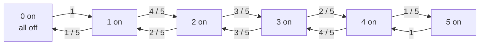

# Quant 2 · Markov Chains：状态压缩与期望时间

Markov 题的核心是把随机过程压成有限个状态。只要下一步的分布只依赖当前状态，而不依赖更早的历史，就可以用 Markov chain 建模。

这类题常见于 quant / probability interview：

```text
当前状态是什么？
从当前状态到下一个状态的概率是多少？
要求的是 hitting time、return time，还是长期占比？
能不能用 first-step analysis 写方程？
有没有 stationary distribution 的捷径？
```

这篇的代表题是五个灯泡随机翻转后，第一次回到全灭状态的期望时间。它同时展示两种解法：

```text
first-step equations:
  按状态写期望方程。

stationary return time:
  先找长期分布，再用 return time = 1 / pi_i。
```

## 目录

1. [Markov Chain 基本概念](#markov-chain-基本概念)
2. [Chapman-Kolmogorov 方程](#chapman-kolmogorov-方程)
3. [状态增广：从非马尔可夫过程构造马尔可夫链](#状态增广从非马尔可夫过程构造马尔可夫链)
4. [First-Step Analysis](#first-step-analysis)
5. [吸收状态：吸收概率与期望吸收时间](#吸收状态吸收概率与期望吸收时间)
6. [Stationary Distribution：稳态行为、首次到达与返回时间](#stationary-distribution稳态行为首次到达与返回时间)
7. [例题一：Two-State Weather](#例题一two-state-weather)
8. [例题二：Gambler's Ruin](#例题二gamblers-ruin)
9. [随机游走：常见性质与简单例题](#随机游走常见性质与简单例题)
10. [例题三：五灯泡翻转问题](#例题三五灯泡翻转问题)
11. [五灯泡解法一：状态压缩 + 方程](#五灯泡解法一状态压缩--方程)
12. [五灯泡解法二：Stationary Return Time](#五灯泡解法二stationary-return-time)
13. [常见坑](#常见坑)
14. [一句话记忆](#一句话记忆)

---

## Markov Chain 基本概念

一个离散时间 Markov chain 由两部分组成：

```text
state space: 所有可能状态
transition probability: 每一步从状态 i 到状态 j 的概率
```

Markov property 是：

$$
P(X_{t+1}=j \mid X_t=i, X_{t-1}, \ldots, X_0)
= P(X_{t+1}=j \mid X_t=i)
$$

也就是说，下一步只看当前状态。

如果状态有限，可以把转移概率写成矩阵：

$$
P_{ij} = P(X_{t+1}=j \mid X_t=i)
$$

例子：天气只有 Sunny / Rainy 两个状态。

```text
Sunny -> Sunny: 0.8
Sunny -> Rainy: 0.2
Rainy -> Sunny: 0.4
Rainy -> Rainy: 0.6
```

转移矩阵是：

$$
P =
\begin{bmatrix}
0.8 & 0.2 \\
0.4 & 0.6
\end{bmatrix}
$$

---

## Chapman-Kolmogorov 方程

一步转移概率是 $P_{ij}$，但很多问题需要知道"走 n 步之后"落在某个状态的概率：

$$
P_{ij}^{(n)} = P(X_{t+n} = j \mid X_t = i)
$$

Chapman-Kolmogorov 方程把 `n` 步转移概率拆成两段：先走 `m` 步到某个中间状态 `k`，再从 `k` 走剩下的 `n - m` 步：

$$
P_{ij}^{(m+n)} = \sum_k P_{ik}^{(m)} P_{kj}^{(n)}
$$

推导只需要全概率公式加一次 Markov 性质：

$$
\begin{aligned}
P_{ij}^{(m+n)}
&= P(X_{t+m+n}=j \mid X_t=i) \\
&= \sum_k P(X_{t+m}=k,\, X_{t+m+n}=j \mid X_t=i) \\
&= \sum_k P(X_{t+m}=k \mid X_t=i)\, P(X_{t+m+n}=j \mid X_{t+m}=k,\, X_t=i) \\
&= \sum_k P(X_{t+m}=k \mid X_t=i)\, P(X_{t+m+n}=j \mid X_{t+m}=k) \\
&= \sum_k P_{ik}^{(m)} P_{kj}^{(n)}
\end{aligned}
$$

第三步是全概率公式，对中间状态 `k` 展开；第四步是关键的一步：已知 $X_{t+m}=k$ 之后，$X_{t+m+n}$ 的分布不再依赖更早的 $X_t$，这正是 Markov 性质起作用的地方。

写成矩阵形式：

$$
P^{(m+n)} = P^{(m)} P^{(n)}
$$

因为 $P^{(1)} = P$，反复应用这个式子就得到：`n` 步转移矩阵就是转移矩阵的 `n` 次方：

$$
P^{(n)} = P^n
$$

用前面 Sunny / Rainy 转移矩阵验证一下。两步转移矩阵：

$$
P^2 =
\begin{bmatrix}
0.8 & 0.2 \\
0.4 & 0.6
\end{bmatrix}^2
=
\begin{bmatrix}
0.72 & 0.28 \\
0.56 & 0.44
\end{bmatrix}
$$

三步转移矩阵可以直接算 $P^3 = P \cdot P \cdot P$，也可以用 Chapman-Kolmogorov 方程拆成 `1 + 2` 步：

$$
P^{(3)} = P^{(1)} P^{(2)} = P \cdot P^2
$$

具体到 Sunny 走三步还是 Sunny 这一个条目：

$$
P_{SS}^{(3)} = P_{SS}^{(1)} P_{SS}^{(2)} + P_{SR}^{(1)} P_{RS}^{(2)} = 0.8 \times 0.72 + 0.2 \times 0.56 = 0.688
$$

两种算法给出同一个矩阵：

$$
P^3 =
\begin{bmatrix}
0.688 & 0.312 \\
0.624 & 0.376
\end{bmatrix}
$$

```text
Chapman-Kolmogorov 方程的作用：
把"走 m+n 步"的问题，拆成"先走 m 步，再走 n 步"，
中间只需要对中间状态求和。
矩阵形式最好记：n 步转移矩阵 = 转移矩阵的 n 次方。
```

---

## 状态增广：从非马尔可夫过程构造马尔可夫链

如果下一步的分布不仅依赖当前状态，还依赖再往前一步（甚至更早）的状态，这个过程在原始状态空间上就不满足 Markov 性质。但只要"未来依赖过去多少步"是有限且固定的，就可以把状态重新定义成"最近几步"的组合，让新状态重新满足 Markov 性质。

一般原理：如果 $Y_{t+1}$ 的分布依赖 $Y_t$ 和 $Y_{t-1}$，定义新状态 $X_t = (Y_{t-1}, Y_t)$。因为 $X_{t+1} = (Y_t, Y_{t+1})$ 的分布完全由 $X_t = (Y_{t-1}, Y_t)$ 决定，不需要再往前看，$\{X_t\}$ 就是新状态空间上的一阶 Markov chain。

### 一个不满足 Markov 性质的例子

设有三个城市 A、B、C，下一个城市不仅依赖当前城市，还依赖上一个城市：

```text
从 A 到 B，下一步去 C 的概率是 0.5
从 C 到 B，下一步去 C 的概率是 0.3
```

"从 A 到 B"和"从 C 到 B"这两种情况下，当前城市都是 B，但下一步去 C 的概率不一样（0.5 对 0.3）。如果只用"当前城市"做状态，下一步的分布还依赖上一个城市，不满足 Markov 性质。

### 状态增广：把状态定义成有序对

把状态重新定义成"（上一个城市，当前城市）"这个有序对。新的状态空间是：

$$
\{AA, AB, AC, BA, BB, BC, CA, CB, CC\}
$$

其中状态 $AB$ 表示"上一个城市是 A，当前城市是 B"。完整的转移规则需要给出：对每一个（上一个城市，当前城市）组合，下一个城市的分布。

| 上一步, 当前 | 下一步 = A | 下一步 = B | 下一步 = C |
|---|---|---|---|
| A, A | 0.5 | 0.3 | 0.2 |
| A, B | 0.1 | 0.4 | 0.5 |
| A, C | 0.3 | 0.3 | 0.4 |
| B, A | 0.4 | 0.4 | 0.2 |
| B, B | 0.2 | 0.5 | 0.3 |
| B, C | 0.3 | 0.2 | 0.5 |
| C, A | 0.5 | 0.2 | 0.3 |
| C, B | 0.2 | 0.5 | 0.3 |
| C, C | 0.3 | 0.3 | 0.4 |

每一行加起来都是 1，是一个合法的条件分布表。

在新状态空间上，转移规则是：如果当前状态是 $XY$（上一个城市 X，当前城市 Y），下一步按上表 (X, Y) 那一行的分布选中城市 Z，新状态就是 $YZ$。比如从状态 $AB$ 出发，如果下一步去 C，新状态是 $BC$；这一步转移只取决于当前状态 $AB$，不需要再往前看，Markov 性质在新状态空间上重新成立。

新状态空间虽然有 9 个状态，但从任意一个状态出发，能到达的下一状态最多只有 3 个：从 $XY$ 出发只能到 $YA$、$YB$、$YC$ 三个状态之一，因为新状态的第一个字符必须等于旧状态的第二个字符。转移矩阵是稀疏的，这也是状态增广构造的一个通用特征：增广后的状态空间变大，但每个状态的出边数量不变。

### 用一次具体计算验证

从状态 $AB$（上一步 A，当前 B）出发，走两步之后落在状态 $CC$（连续两次都到 C）的概率是多少？

第一步从 $(A,B)$ 出发，去 C 的概率是 0.5（查表 A, B 行），走完这一步状态变成 $BC$。第二步从 $(B,C)$ 出发，去 C 的概率是 0.5（查表 B, C 行）。两步都必须精确地"去 C"才能到达状态 $CC$：

$$
P(X_2 = CC \mid X_0 = AB) = 0.5 \times 0.5 = 0.25
$$

这个结果也可以用上一节的 Chapman-Kolmogorov 方程在 9 个状态的转移矩阵上验证：把 $9\times9$ 转移矩阵按上面的规则填好，计算矩阵平方在 $(AB, CC)$ 位置的元素，结果同样是 0.25。

```text
状态不满足 Markov 性质的信号：
同一个"当前状态"下，转移概率因为更早的历史而不同。

修复方法：
把状态重新定义成"最近 k 步"的组合，
只要 k 是有限、固定的，新状态空间上就重新满足 Markov 性质，
代价是状态数量从 |S| 变成最多 |S|^k。
```

---

## First-Step Analysis

求期望时间时，最常用的工具是 first-step analysis。

设：

```text
E_i = 从状态 i 出发，到达目标状态所需的期望步数
```

如果 `i` 已经是目标状态：

$$
E_i = 0
$$

否则先走一步，消耗 1 秒，再根据下一步落到哪里继续：

$$
E_i = 1 + \sum_j P_{ij} E_j
$$

这个式子是 Markov 期望题的主力模板。

它的直觉很简单：

```text
总时间 = 先走一步 + 下一状态的剩余期望时间
```

---

## 吸收状态：吸收概率与期望吸收时间

一个状态 `i` 是吸收状态（absorbing state），如果一旦进入就不会再离开：

$$
P_{ii} = 1
$$

如果一个 Markov chain 中有一个或多个吸收状态，且从任意非吸收状态出发最终都会以概率 1 进入某个吸收状态，这样的链称为吸收链（absorbing chain）。

吸收链上通常问两类问题：

```text
吸收概率：从状态 i 出发，最终被哪个吸收状态吸收的概率是多少？
期望吸收时间：从状态 i 出发，到被吸收为止，期望要走多少步？
```

两类问题都用 first-step analysis 解决，写法几乎一样，只是边界条件和递推项不同：

$$
\begin{aligned}
\text{吸收概率 } h_i &: \quad h_i = \sum_j P_{ij} h_j,\qquad h_i = 1\ \text{（目标吸收态）},\ h_i = 0\ \text{（其它吸收态）} \\
\text{期望吸收时间 } E_i &: \quad E_i = 1 + \sum_j P_{ij} E_j,\qquad E_i = 0\ \text{（任意吸收态）}
\end{aligned}
$$

吸收概率的方程里没有"+1"，因为吸收概率不计步数，只看最终落到哪个吸收态；期望吸收时间的方程里多了"+1"，因为每走一步都要计入时间，这和前面 first-step analysis 一节里 $E_i = 1 + \sum_j P_{ij} E_j$ 的模板完全一致。

下面的 Gambler's Ruin 是一个有两个吸收态（`0` 和 `N`）的随机游走，用来同时演示这两类问题。

---

## Stationary Distribution：稳态行为、首次到达与返回时间

stationary distribution 是一个长期稳定分布 $\pi$，满足：

$$
\pi P = \pi,\qquad \sum_i \pi_i = 1
$$

### 稳态行为：$P^n$ 的收敛

如果链是有限、不可约、非周期的（合称 ergodic），那么不管从哪个状态出发，`n` 步之后落在每个状态的概率都会收敛到同一个 $\pi$：

$$
\lim_{n\to\infty} P_{ij}^{(n)} = \pi_j,\qquad \text{对所有起始状态 } i
$$

也就是说，$P^n$ 的每一行都会收敛到同一个行向量 $\pi$，和起点无关。这是"稳态"这个词的真正含义：不是转移不再发生，而是"落在每个状态的概率"不再随时间或起点变化。

用前面 Sunny / Rainy 链的 $P^n$ 具体验证。这条链的 stationary distribution 是：

$$
\pi_S = \frac23,\qquad \pi_R = \frac13
$$

$$
P^5 =
\begin{bmatrix}
0.6701 & 0.3299 \\
0.6598 & 0.3402
\end{bmatrix},
\qquad
P^{10} \approx
\begin{bmatrix}
0.66670 & 0.33330 \\
0.66660 & 0.33340
\end{bmatrix},
\qquad
P^{20} \approx
\begin{bmatrix}
0.66667 & 0.33333 \\
0.66667 & 0.33333
\end{bmatrix}
$$

两行越来越接近，且都在逼近 $(\pi_S,\pi_R)=(2/3,1/3)$，和从 Sunny 出发还是从 Rainy 出发无关。

### 返回时间：mean recurrence time

如果链是有限、不可约、正常返回的，那么从状态 `i` 出发，第一次回到 `i` 的期望时间是：

$$
\mathbb{E}_i[T_i^+] = \frac{1}{\pi_i}
$$

这个公式叫 mean recurrence time。它的含义是：

```text
长期看，系统有 pi_i 的时间待在状态 i。
所以状态 i 平均每 1 / pi_i 步出现一次。
```

这不是所有题都能直接用，但遇到“回到起点状态的期望时间”时非常有力。

### 首次到达时间和返回时间的区别

首次到达时间（first passage time）$T_{ij}$ 是从状态 `i` 出发，第一次到达状态 `j`（`j` 可以不等于 `i`）所需的步数。返回时间 $T_i^+$ 是首次到达时间的特殊情形：从 `i` 出发，第一次回到 `i` 自己。

两者的计算方法不一样：

```text
返回时间 E[T_i^+]：有 stationary distribution 的捷径，等于 1 / pi_i。
首次到达时间 E[T_ij]（i != j）：一般没有这个捷径，
只能用 first-step analysis：E_i = 1 + sum_k P_ik E_k，边界条件 E_j = 0。
```

前面例题一（Two-State Weather）算的 $E_S=5$ 就是一个首次到达时间：从 Sunny 出发第一次到达 Rainy 的期望天数，记作 $E_{S\to R}$。这和"从 Sunny 出发回到 Sunny"的返回时间是两个不同的量：

$$
\mathbb E_S[T_S^+] = \frac{1}{\pi_S} = \frac{1}{2/3} = 1.5,\qquad E_{S\to R} = 5
$$

`1.5` 天和 `5` 天回答的是两个不同的问题：前者是"平均多久回到 Sunny 这个状态"，后者是"从 Sunny 出发第一次等到下雨要多久"。两个数字都对，但不能混用。

---

## 例题一：Two-State Weather

题目：

```text
天气状态为 Sunny / Rainy。
Sunny 明天仍 Sunny 的概率是 0.8。
Rainy 明天变 Sunny 的概率是 0.4。
从 Sunny 出发，期望多少天后第一次下雨？
```

状态只需要两个：

```text
S = Sunny
R = Rainy
```

目标是第一次到达 `R`。

设：

```text
E_S = 从 Sunny 出发到 Rainy 的期望天数
E_R = 0
```

从 Sunny 出发：

$$
E_S = 1 + 0.8E_S + 0.2E_R
$$

因为 `E_R = 0`：

$$
E_S = 1 + 0.8E_S
$$

所以：

$$
0.2E_S = 1,\qquad E_S = 5
$$

答案是 `5` 天。

这个例子对应几何分布：每天有 `0.2` 概率第一次变雨，期望等待时间是 `1 / 0.2 = 5`。

---

## 例题二：Gambler's Ruin

题目：

```text
赌徒当前有 i 块钱。
每轮以概率 p 赢 1 块，以概率 q = 1 - p 输 1 块。
到达 0 或 N 时游戏结束。
求从 i 出发，最终到达 N 的概率。
```

设：

```text
h_i = 从 i 出发最终到达 N 的概率
```

边界条件：

$$
h_0 = 0,\qquad h_N = 1
$$

中间状态满足：

$$
h_i = p h_{i+1} + q h_{i-1}
$$

当 `p = q = 1/2` 时，解是线性的：

$$
h_i = \frac{i}{N}
$$

这个例子展示了 Markov chain 的第二种常见写法：不是求期望时间，而是求 hitting probability。模板仍然一样：

```text
当前状态的答案 = 下一状态答案的加权平均
```

### 另一个吸收态的概率

Gambler's Ruin 的状态空间有两个吸收态：`0`（输光）和 `N`（赢到 N）。上面算的 $h_i$ 是"吸收到 `N`"的概率；因为只有两个吸收态，"吸收到 `0`"的概率是：

$$
P(\text{吸收到 } 0 \mid \text{从 } i \text{ 出发}) = 1 - h_i = \frac{N-i}{N}
$$

例如 $N=8$，从 $i=3$ 出发，吸收到 `N` 的概率是 `3/8 = 0.375`，吸收到 `0` 的概率是 `5/8 = 0.625`，两者加起来是 `1`。

### 期望吸收时间

设 $E_i$ 为从 `i` 出发到被吸收（到 `0` 或 `N`）为止的期望步数，边界条件：

$$
E_0 = 0, \qquad E_N = 0
$$

对称情形（$p=q=1/2$）下，中间状态满足：

$$
E_i = 1 + \frac12 E_{i+1} + \frac12 E_{i-1}
$$

整理成二阶线性递推：

$$
E_{i+1} - 2E_i + E_{i-1} = -2
$$

通解等于特解加齐次解。齐次方程 $E_{i+1}-2E_i+E_{i-1}=0$ 的通解是关于 `i` 的一次函数 $A+Bi$。特解可以猜 $E_i^{(p)} = -i^2$（因为 $(i+1)^2-2i^2+(i-1)^2=2$，取负号正好是 `-2`）。所以通解是：

$$
E_i = -i^2 + A + Bi
$$

代入边界条件 $E_0=0$ 得 $A=0$；代入 $E_N=0$ 得 $-N^2+BN=0 \Rightarrow B=N$。所以：

$$
\boxed{E_i = i(N-i)}
$$

用 $N=6$ 验证：$E_1,\ldots,E_5 = 5, 8, 9, 8, 5$，和直接解线性方程组的结果完全一致，且关于中点 $i=N/2$ 对称：离两个吸收壁越远，期望吸收时间越长。

非对称情形（$p \ne q$）用同样的 first-step 方程求解，只是递推变成 $E_i = 1+pE_{i+1}+qE_{i-1}$，通解要用到 $(q/p)^i$ 这个齐次解，结果是：

$$
E_i = \frac{i}{q-p} - \frac{N}{q-p}\cdot\frac{1-(q/p)^i}{1-(q/p)^N}
$$

例如 $p=0.6, q=0.4, N=6$：$E_1,\ldots,E_5 \approx 5.96, 8.27, 8.14, 6.39, 3.56$，代入线性方程组可以直接验证。因为有正向漂移（$p>q$），从大的 `i` 出发更快被吸收到 `N`，所以期望时间不再关于中点对称，靠近 `0` 的一侧更长。

---

## 随机游走：常见性质与简单例题

一维简单随机游走定义为 $X_n = X_0 + \sum_{i=1}^n \xi_i$，其中 $\xi_1,\xi_2,\ldots$ 独立同分布，$P(\xi_i=+1)=p$，$P(\xi_i=-1)=q=1-p$。这是一个特殊的 Markov chain：状态是当前位置，下一步只依赖当前位置（加一或减一），不依赖更早的历史。Gambler's Ruin 就是这种随机游走加上两个吸收壁（`0` 和 `N`）；如果去掉吸收壁，让状态空间变成全体整数，性质会不一样。

### 常见性质

**均值和方差随步数线性增长。** 单步 $\xi_i$ 的均值和方差：

$$
\mathbb E[\xi_i] = p - q, \qquad \mathrm{Var}(\xi_i) = 1-(p-q)^2 = 4pq
$$

（因为 $p+q=1$，$(p-q)^2=(2p-1)^2$，展开后 $1-(p-q)^2=4p-4p^2=4pq$。）由独立同分布求和的均值方差公式：

$$
\mathbb E[X_n] = X_0 + n(p-q), \qquad \mathrm{Var}(X_n) = 4npq
$$

**对称情形常返，非对称情形非常返。** 当 $p=q=1/2$ 时，随机游走以概率 1 无穷次回到出发点。但期望回到出发点的时间是无穷大，这是无限状态空间和 Gambler's Ruin 那种有限状态空间的本质区别：有限、不可约的链的期望返回时间总是有限的（`1/pi_i`），无限状态空间上即使常返也未必有这个性质。当 $p \ne 1/2$ 时，随机游走几乎必然漂移到 $+\infty$（$p>1/2$ 时）或 $-\infty$（$p<1/2$ 时），只以某个小于 1 的概率回到出发点。

**高维推广：Pólya 常返定理。** 一维和二维的对称随机游走是常返的，三维及更高维的对称随机游走是非常返的：粒子几乎必然漂移到无穷远，不会精确回到原点。

### 例题：均值与方差的直接计算

一个随机游走每一步以 $p=0.55$ 的概率走 `+1`，以 $q=0.45$ 的概率走 `-1`，从 $X_0=0$ 出发。求走 20 步之后位置的均值和方差。

直接代入公式：

$$
\mathbb E[X_{20}] = 20\times(0.55-0.45) = 2, \qquad \mathrm{Var}(X_{20}) = 4\times20\times0.55\times0.45 = 19.8
$$

### 例题：一端反射、一端吸收的随机游走

题目：

```text
状态空间是 {0, 1, 2, 3}。
在状态 0，下一步一定走到状态 1（反射壁）。
在状态 1 和 2，以概率 1/2 向左、概率 1/2 向右（对称随机游走）。
状态 3 是吸收态。
从状态 0 出发，期望多少步之后被吸收？
```

这道题和 Gambler's Ruin 的区别在边界条件：Gambler's Ruin 两端都是吸收壁，这里一端是反射壁（下一步确定地走一步）、一端是吸收壁。反射壁只影响 $E_0$ 的方程，中间状态的方程和普通对称随机游走完全一样。

设 $E_i$ 为从状态 `i` 出发到被吸收的期望步数，$E_3=0$：

$$
\begin{aligned}
E_0 &= 1 + E_1 &&\text{（反射：一定走到 1）} \\
E_1 &= 1 + \frac12 E_0 + \frac12 E_2 \\
E_2 &= 1 + \frac12 E_1 + \frac12 E_3 = 1 + \frac12 E_1
\end{aligned}
$$

把 $E_0=1+E_1$ 代入第二个方程：

$$
E_1 = 1 + \frac12(1+E_1) + \frac12 E_2 = \frac32 + \frac12 E_1 + \frac12 E_2 \quad\Longrightarrow\quad E_1 = 3 + E_2
$$

代入第三个方程：

$$
E_2 = 1 + \frac12(3+E_2) = \frac52 + \frac12 E_2 \quad\Longrightarrow\quad E_2 = 5
$$

回代：

$$
E_1 = 3+5=8, \qquad E_0 = 1+8=9
$$

答案：从状态 `0` 出发，期望 `9` 步之后被吸收。

```text
反射壁和吸收壁的区别：
反射壁：下一步的分布是确定的（或退化的），把粒子推回状态空间内部。
吸收壁：进入之后就不再离开，P_ii = 1。
同一个 first-step 方程模板可以同时处理两种边界，
只是每个状态的转移规则不同。
```

---

## 例题三：五灯泡翻转问题

题目：

```text
有 5 盏灯，开始时全部处于关闭状态。
之后每一秒随机等概率选择其中一盏灯，并把它的状态反转：
亮着的灯会被关掉，关着的灯会被打开。

问：从初始全关状态出发，经过至少一次操作后，系统第一次再次回到“5 盏灯全关”的期望等待时间是多少？
```

初始时 5 个灯泡全灭。题目问“再次全灭”，所以时间不能是 0；必须至少翻一次灯泡之后再回到全灭状态。

### 状态压缩

不需要记录具体哪几个灯亮，只需要记录亮着的灯泡数量。

设状态：

```text
k = 当前亮着的灯泡数量
```

那么 `k` 的取值是：

```text
0, 1, 2, 3, 4, 5
```

如果当前有 `k` 个灯亮：

- 选到亮灯的概率是 `k / 5`，翻转后亮灯数变成 `k - 1`
- 选到灭灯的概率是 `(5 - k) / 5`，翻转后亮灯数变成 `k + 1`

所以这是一个 birth-death Markov chain：



从 `0` 出发，第一秒一定会翻亮一个灯：

```text
0 -> 1
```

因此答案是：

$$
1 + E_1
$$

其中 `E_k` 表示从 `k` 个灯亮出发，第一次到达 `0` 的期望时间。

---

## 五灯泡解法一：状态压缩 + 方程

边界条件：

$$
E_0 = 0
$$

对 `1 <= k <= 4`：

$$
E_k
= 1 + \frac{k}{5}E_{k-1} + \frac{5-k}{5}E_{k+1}
$$

对 `k = 5`：

$$
E_5 = 1 + E_4
$$

因为 5 个灯全亮时，下一次无论选哪个灯，都会变成 4 个灯亮。

把方程写出来：

$$
\begin{aligned}
E_1 &= 1 + \frac{1}{5}E_0 + \frac{4}{5}E_2 \\
E_2 &= 1 + \frac{2}{5}E_1 + \frac{3}{5}E_3 \\
E_3 &= 1 + \frac{3}{5}E_2 + \frac{2}{5}E_4 \\
E_4 &= 1 + \frac{4}{5}E_3 + \frac{1}{5}E_5 \\
E_5 &= 1 + E_4
\end{aligned}
$$

加上 `E_0 = 0`，解得：

```text
E_1 = 31
E_2 = 37.5
E_3 = 38.75
E_4 = 37.5
E_5 = 38.5
```

题目从全灭开始，但第一秒一定到 `1`：

$$
\mathbb{E}[\text{return to all off}]
= 1 + E_1
= 32
$$

答案：

```text
32 seconds
```

### 手算检查

从第一个方程：

$$
E_1 = 1 + \frac{4}{5}E_2
$$

如果 `E_2 = 37.5`：

$$
E_1 = 1 + 30 = 31
$$

再加上初始第一步：

$$
1 + E_1 = 32
$$

---

## 五灯泡解法二：Stationary Return Time

这题还有一个非常快的解法。

完整状态不是 `k = 0..5`，而是每个灯泡的开关配置：

```text
00000, 00001, 00010, ..., 11111
```

一共有：

$$
2^5 = 32
$$

个配置。

每一步选择一个 bit 翻转，所以状态图是 5 维 hypercube。这个随机游走是对称的，因此 stationary distribution 是均匀分布：

$$
\pi(x) = \frac{1}{32}
$$

全灭状态 `00000` 的 stationary probability 是：

$$
\pi(00000) = \frac{1}{32}
$$

根据 mean recurrence time：

$$
\mathbb{E}_{00000}[T_{00000}^+]
= \frac{1}{\pi(00000)}
= 32
$$

答案仍然是：

```text
32 seconds
```

这个解法的关键是把“再次全灭”理解成从 `00000` 出发的第一次正返回时间，而不是 hitting time 从别的状态到 `00000`。

---

## 常见坑

### 1. 把答案说成 0

初始时确实已经全灭，但题目问的是“再次回到全灭”。这里的 return time 是：

```text
T_0^+ = min{t >= 1 : X_t = 0}
```

所以不能回答 0。

### 2. 直接用几何分布 `p = 1/32`

每一秒处在全灭状态的长期比例是 `1/32`，但每个时刻的事件并不是独立 Bernoulli trial。

这题能得到 32，是因为 Markov chain 的 return time theorem，不是因为每秒独立地以 `1/32` 概率全灭。

### 3. 只看亮灯数量时忘了第一步

在压缩链里，`E_1 = 31` 是从一个灯亮开始回到全灭的期望时间。

题目从全灭开始，第一步一定变成一个灯亮，所以总时间是：

```text
1 + E_1 = 32
```

### 4. 状态压缩要检查 Markov 性

这里可以只记录亮灯数量，因为下一步转移概率只由 `k` 决定：

```text
P(k -> k - 1) = k / 5
P(k -> k + 1) = (5 - k) / 5
```

如果下一步概率还依赖具体哪几个灯亮，就不能只用 `k` 压缩；这时候的修复方法见前面的"状态增广"一节：把状态定义扩大到包含足够的历史信息，而不是继续在压缩后的状态上硬套 Markov 性质。

---

## 一句话记忆

```text
Markov 期望时间 = first-step equation。
回到起点的期望时间 = 1 / stationary probability。
n 步转移矩阵 = 转移矩阵的 n 次方，这是 Chapman-Kolmogorov 方程的矩阵形式。
状态不满足 Markov 性质时，把状态扩大到最近 k 步的组合就能修复。
五灯泡问题的全状态有 2^5 = 32 个且均匀，
所以全灭状态的平均返回时间是 32 秒。
```
