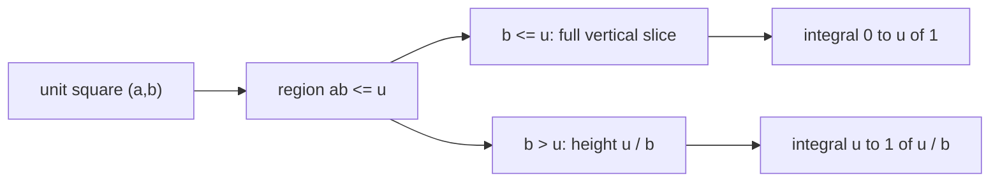

# Quant 3 · 连续随机变量分布：从 CDF 写起

这类题经常长这样：

```text
X, Y, Z 独立同分布，给一个 T = g(X, Y, Z)，求 T 的分布。
```

不要先找 density。先写 CDF：

$$
F_T(t)=P(T\le t)
$$

下一步是把事件 $T\le t$ 翻译成原变量的区域、条件概率或积分。

---

## 0. 先处理定义域

如果题目直接写：

$$
X,Y,Z\sim U[-1,1],\qquad T=(XY)^Z
$$

这个表达式在实数范围里不完整。原因是 $XY$ 可能为负，而 $Z$ 是连续实数。负数的非整数幂通常不是实数。

所以面试里要先问清楚：

```text
题目是不是想写 |XY|^|Z|？
还是只考虑 XY > 0 的条件分布？
还是允许复数值？
```

这里采用一个实数域下自然的版本：

$$
X,Y,Z\sim U[-1,1]\text{ 独立},\qquad T=|XY|^{|Z|}
$$

因为 $|X|,|Y|,|Z|$ 都服从 $U[0,1]$，这题仍然保留原题想考的技巧：乘法、随机指数、CDF 条件化和 $-\ln$ 变换。

---

## 1. 连续分布题的处理顺序

看到 $T=g(X,Y,Z)$，按下面顺序写：

```text
1. Support:
   T 的取值范围是什么？

2. CDF:
   F_T(t) = P(g(X,Y,Z) <= t)

3. Condition:
   哪个变量让不等式难处理，就先条件在它上面。

4. Transform:
   有乘法、除法、幂次，优先考虑 log。

5. Boundary:
   最后补全 t 在 support 外的情况。
```

这一步比积分技巧重要。很多题一旦 CDF 事件写对，后面只是计算。

---

## 2. 例题：$T=|XY|^{|Z|}$

题目：

```text
X, Y, Z 独立且都服从 U[-1,1]。
令 T = |XY|^{|Z|}。
求 T 的 CDF。
```

### 2.1 先看取值范围

因为：

$$
|X|,|Y|,|Z|\in[0,1]
$$

所以：

$$
|XY|\in[0,1],\qquad |XY|^{|Z|}\in[0,1]
$$

因此：

$$
F_T(t)=0,\quad t<0
$$

$$
F_T(t)=1,\quad t\ge 1
$$

真正需要算的是 $0<t<1$。

### 2.2 把绝对值变量换掉

令：

$$
A=|X|,\qquad B=|Y|,\qquad C=|Z|
$$

如果 $X\sim U[-1,1]$，那么 $A=|X|\sim U[0,1]$。证明很短：

$$
P(A\le a)=P(|X|\le a)=P(-a\le X\le a)=\frac{2a}{2}=a,\qquad 0\le a\le1
$$

所以 $A,B,C$ 独立且都服从 $U[0,1]$。题目变成：

$$
T=(AB)^C
$$

### 2.3 写 CDF，并条件在指数上

对 $0<t<1$：

$$
F_T(t)=P((AB)^C\le t)
$$

随机指数 $C$ 让不等式不方便处理，所以先固定 $C=c$。当 $c>0$ 时：

$$
(AB)^c\le t
$$

等价于：

$$
AB\le t^{1/c}
$$

于是：

$$
F_T(t)=\int_0^1 P(AB\le t^{1/c})\,dc
$$

$c=0$ 这个点不用单独处理，因为 $P(C=0)=0$。

---

## 3. 先求两个 uniform 乘积的分布

令：

$$
U=AB
$$

其中 $A,B\sim U[0,1]$ 独立。为了更容易看图，下面把 $A$ 写成横轴 $x$，把 $B$ 写成纵轴 $y$。对 $0<u<1$：

$$
F_U(u)=P(AB\le u)
$$

也就是：

$$
P(xy\le u)
$$

### 3.1 二重积分的几何意思

因为 $(A,B)$ 在单位正方形 $[0,1]\times[0,1]$ 上均匀分布，所以：

```text
概率 = 满足条件的面积
```

要求 $P(AB\le u)$，就是在单位正方形里找出所有满足：

$$
xy\le u
$$

的点。边界曲线是：

$$
x=\frac{u}{y}
$$

图上可以这样想：

```text
y
1 |█████████████████░░░░░░░░
  |███████████░░░░░░░░░░░░░░
  |████████░░░░░░░░░░░░░░░░░
u |█████████████████████████
  |█████████████████████████
0 +------------------------- x
    0        u/y           1

█ = xy <= u 的区域
░ = xy > u 的区域
```

这个图不是按比例画的，只表达结构：

- 当 $y$ 很小，$u/y\ge1$，整条横向切片都满足。
- 当 $y$ 变大，$u/y<1$，只有左边长度为 $u/y$ 的部分满足。

### 3.2 为什么要固定 $y$

二维区域不好直接算，就把它切成很多很薄的横条。固定 $Y=y$ 后，只看这一条横线：

```text
固定 y:

x: 0 ---------------- u/y ---------------- 1
   [    满足 xy <= u    ][    不满足    ]

这一条横线贡献的长度 = min(1, u/y)
```

由于联合密度是 1，这条薄横条的面积就是：

$$
\text{横向长度}\times dy
$$

所以：

$$
P(AB\le u)
=
\int_0^1 \min\left(1,\frac{u}{y}\right)\,dy
$$

这就是二重积分的本质。它不是凭空出现的公式，而是在单位正方形里把区域切成很多条横线，再把每条横线的长度加起来。

### 3.3 为什么积分要分两段

关键分界点是：

$$
\frac{u}{y}=1
$$

也就是：

$$
y=u
$$

所以要分成两种情况：

| 固定的 $y$ | 横线上的条件 | 满足条件的 $x$ 长度 |
| --- | --- | --- |
| $0<y\le u$ | $u/y\ge1$ | 整段 $[0,1]$，长度 $1$ |
| $u<y\le1$ | $u/y<1$ | $0\le x\le u/y$，长度 $u/y$ |

因此：

$$
F_U(u)=\int_0^u 1\,dy+\int_u^1 \frac{u}{y}\,dy
$$

第一段是“下面那一块完整矩形”，第二段是“上面那一块曲线左侧区域”：

$$
\underbrace{\int_0^u 1\,dy}_{y\le u,\ 整条横线都算}
+
\underbrace{\int_u^1 \frac{u}{y}\,dy}_{y>u,\ 只算到 x=u/y}
$$

计算得到：

$$
F_U(u)=u-u\ln u=u(1-\ln u),\qquad 0<u<1
$$

后面会反复用到这个结果：

$$
P(AB\le u)=u(1-\ln u)
$$



---

## 4. 回到 $T=(AB)^C$

代回：

$$
F_T(t)=\int_0^1 F_U(t^{1/c})\,dc
$$

因为：

$$
F_U(u)=u(1-\ln u)
$$

所以：

$$
F_T(t)=\int_0^1 t^{1/c}\left(1-\ln(t^{1/c})\right)\,dc
$$

令：

$$
a=-\ln t>0
$$

则：

$$
t=e^{-a},\qquad t^{1/c}=e^{-a/c}
$$

并且：

$$
1-\ln(t^{1/c})=1+\frac{a}{c}
$$

于是：

$$
F_T(t)=\int_0^1 e^{-a/c}\left(1+\frac{a}{c}\right)\,dc
$$

这里用到的导数是：

$$
\frac{d}{dc}\left(c e^{-a/c}\right)
=
e^{-a/c}\left(1+\frac{a}{c}\right)
$$

所以：

$$
F_T(t)=\left[c e^{-a/c}\right]_{0}^{1}
$$

上限是：

$$
e^{-a}=t
$$

下限是：

$$
\lim_{c\to0^+} c e^{-a/c}=0
$$

因此：

$$
F_T(t)=t,\qquad 0<t<1
$$

完整 CDF 是：

$$
F_T(t)=
\begin{cases}
0, & t<0,\\
t, & 0\le t\le 1,\\
1, & t\ge 1.
\end{cases}
$$

也就是说：

$$
|XY|^{|Z|}\sim U[0,1]
$$

---

## 5. 结构更清楚的做法：取负对数

看到 $[0,1]$ 上的乘法和幂次，可以考虑：

$$
-\ln(\cdot)
$$

原因是乘法会变成加法：

$$
-\ln(AB)=(-\ln A)+(-\ln B)
$$

如果 $A\sim U[0,1]$，那么：

$$
-\ln A\sim \mathrm{Exp}(1)
$$

证明：

$$
P(-\ln A\le s)=P(A\ge e^{-s})=1-e^{-s},\qquad s\ge0
$$

现在令：

$$
R=-\ln A,\qquad S=-\ln B
$$

则：

$$
R,S\sim \mathrm{Exp}(1),\qquad R+S\sim \mathrm{Gamma}(2,1)
$$

记：

$$
G=R+S=-\ln(AB)
$$

所以：

$$
AB=e^{-G}
$$

原变量：

$$
T=(AB)^C
$$

取负对数：

$$
-\ln T=-\ln((AB)^C)=C[-\ln(AB)]=CG
$$

其中：

$$
G\sim \mathrm{Gamma}(2,1),\qquad f_G(g)=g e^{-g},\quad g>0
$$

对 $0<t<1$，令 $a=-\ln t$。事件 $T\le t$ 等价于：

$$
-\ln T\ge -\ln t
$$

也就是：

$$
CG\ge a
$$

固定 $G=g$：

```text
如果 g < a:
  CG <= g < a，不可能满足。

如果 g >= a:
  CG >= a 等价于 C >= a / g。
```

因为 $C\sim U[0,1]$：

$$
P(C\ge a/g)=1-\frac{a}{g},\qquad g\ge a
$$

因此：

$$
P(CG\ge a)=\int_a^\infty \left(1-\frac{a}{g}\right)g e^{-g}\,dg
$$

化简：

$$
\int_a^\infty (g-a)e^{-g}\,dg
$$

分别计算：

$$
\int_a^\infty g e^{-g}\,dg=(a+1)e^{-a}
$$

$$
\int_a^\infty a e^{-g}\,dg=a e^{-a}
$$

所以：

$$
P(CG\ge a)=e^{-a}=t
$$

同样得到：

$$
F_T(t)=t
$$

这个方法更像结构解法。以后看到 product of uniforms、power of uniforms，就要想到 $-\ln$。

---

## 6. 同一类变形

下面这些题都先写 CDF。不要急着找 density。

### 6.1 $T=|XY|$

设 $X,Y\sim U[-1,1]$ 独立。求：

$$
T=|XY|
$$

因为 $|X|,|Y|\sim U[0,1]$，所以这就是两个 $U[0,1]$ 的乘积：

$$
F_T(t)=t(1-\ln t),\qquad 0<t<1
$$

### 6.2 $T=|XYZ|$

设 $X,Y,Z\sim U[-1,1]$ 独立。求：

$$
T=|XYZ|
$$

取负对数：

$$
-\ln T=(-\ln |X|)+(-\ln |Y|)+(-\ln |Z|)
$$

右边是三个独立 $\mathrm{Exp}(1)$ 的和，所以是 $\mathrm{Gamma}(3,1)$。结果：

$$
F_T(t)=t\left(1-\ln t+\frac{(\ln t)^2}{2}\right),\qquad 0<t<1
$$

### 6.3 $T=|X|^{|Y|}$

设 $X,Y\sim U[-1,1]$ 独立。求：

$$
T=|X|^{|Y|}
$$

令 $A=|X|,B=|Y|$。对 $0<t<1$：

$$
F_T(t)=P(A^B\le t)
$$

固定 $B=b$：

$$
A^b\le t
$$

等价于：

$$
A\le t^{1/b}
$$

所以：

$$
F_T(t)=\int_0^1 t^{1/b}\,db
$$

这个积分可以作为正确答案。如果进一步化简，会涉及 exponential integral；面试里能写出正确 CDF 积分已经是关键。

### 6.4 $T=|X|^{1/|Y|}$

设 $X,Y\sim U[-1,1]$ 独立。求：

$$
T=|X|^{1/|Y|}
$$

固定 $B=|Y|=b$：

$$
A^{1/b}\le t
$$

等价于：

$$
A\le t^b
$$

所以：

$$
F_T(t)=\int_0^1 t^b\,db=\frac{t-1}{\ln t},\qquad 0<t<1
$$

### 6.5 $T=\max(|XY|,|Z|)$

设 $X,Y,Z\sim U[-1,1]$ 独立。求：

$$
T=\max(|XY|,|Z|)
$$

用 CDF：

$$
\max(|XY|,|Z|)\le t
$$

等价于：

$$
|XY|\le t,\qquad |Z|\le t
$$

所以：

$$
F_T(t)=P(|XY|\le t)P(|Z|\le t)=t^2(1-\ln t),\qquad 0<t<1
$$

### 6.6 $T=\min(|XY|,|Z|)$

设 $X,Y,Z\sim U[-1,1]$ 独立。求：

$$
T=\min(|XY|,|Z|)
$$

这种题用 survival 更直接：

$$
F_T(t)=1-P(T>t)
$$

而：

$$
\min(|XY|,|Z|)>t
$$

等价于：

$$
|XY|>t,\qquad |Z|>t
$$

因此：

$$
F_T(t)
=
1-\left[1-t(1-\ln t)\right](1-t),\qquad 0<t<1
$$

### 6.7 $T=(|XYZ|)^{|W|}$

设 $X,Y,Z,W\sim U[-1,1]$ 独立。求：

$$
T=(|XYZ|)^{|W|}
$$

令：

$$
G=-\ln |XYZ|
$$

那么 $G\sim \mathrm{Gamma}(3,1)$。再用和主例题相同的方法：

$$
F_T(t)=P(|W|G\ge -\ln t)
$$

结果是：

$$
F_T(t)=t\left(1-\frac{1}{2}\ln t\right),\qquad 0<t<1
$$

---

## 7. 面试里怎么写

可以按这个模板回答：

```text
1. 先检查定义域。如果变量在 [-1,1]，随机实数指数要求底数非负。
2. 如果题目是 |XY|^|Z|，令 A=|X|, B=|Y|, C=|Z|。
3. A,B,C 独立且都是 U[0,1]。
4. 对 0<t<1 写 CDF:
   F_T(t)=P((AB)^C <= t)
5. 条件在 C=c:
   P((AB)^C <= t | C=c)=P(AB <= t^{1/c})
6. 用 P(AB <= u)=u(1-ln u)。
7. 积分得到 F_T(t)=t。
8. 补全 t<0 和 t>=1。
```

这类题可以压成两句话：

```text
求分布，先写 CDF。
乘法和幂次，优先试 -ln。
```
