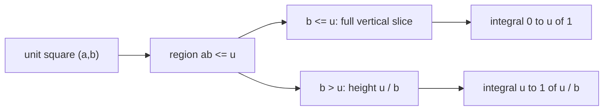

# Quant 3 · Continuous Distributions: CDF, Geometric Regions, and Variable Transformations

These types of problems often look like this:

```text
X, Y, Z are i.i.d. Given T = g(X, Y, Z), find the distribution of T.
```

Do not start by finding the density. Start by writing the CDF:

$$
F_T(t)=P(T\le t)
$$

The next step is to translate the event $T\le t$ into a region of the original variables, a conditional probability, or an integral.

This lecture combines three common techniques:

```text
CDF:
  To find a distribution, start by writing P(T <= t).

geometry:
  The probability of a uniform random point can be viewed as the area or volume of a region.

transform:
  Multiplication and powers on [0,1] are often simplified using -log.
```

---

## 0. Handling the Domain First

If a problem is stated directly as:

$$
X,Y,Z\sim U[-1,1],\qquad T=(XY)^Z
$$

This expression is incomplete in the real number domain. The reason is that $XY$ might be negative, while $Z$ is a continuous real number. Non-integer powers of negative numbers are generally not real numbers.

Therefore, in an interview, you should clarify:

```text
Does the problem intend to write |XY|^|Z|?
Or should we only consider the conditional distribution where XY > 0?
Or are complex values allowed?
```

Here, we adopt a version that is natural in the real domain:

$$
X,Y,Z\sim U[-1,1]\text{ i.i.d.},\qquad T=|XY|^{|Z|}
$$

Since $|X|,|Y|,|Z|$ all follow $U[0,1]$, this problem still retains the techniques the original question intended to test: multiplication, random exponents, CDF conditioning, and $-\ln$ transformations.

---

## 1. Processing Order for Continuous Distribution Problems

When you see $T=g(X,Y,Z)$, follow this order:

```text
1. Support:
   What is the range of values for T?

2. CDF:
   F_T(t) = P(g(X,Y,Z) <= t)

3. Condition:
   Condition on the variable that makes the inequality difficult to handle.

4. Transform:
   For multiplication, division, or powers, prioritize using log.

5. Boundary:
   Finally, complete the cases where t is outside the support.
```

This step is more important than integration techniques. For many problems, once the CDF event is written correctly, the rest is just calculation.

---

## 2. Example: $T=|XY|^{|Z|}$

Problem:

```text
X, Y, Z are independent and follow U[-1,1].
Let T = |XY|^{|Z|}.
Find the CDF of T.
```

### 2.1 Determine the Range

Because:

$$
|X|,|Y|,|Z|\in[0,1]
$$

Therefore:

$$
|XY|\in[0,1],\qquad |XY|^{|Z|}\in[0,1]
$$

Thus:

$$
F_T(t)=0,\quad t<0
$$

$$
F_T(t)=1,\quad t\ge 1
$$

What we really need to calculate is $0<t<1$.

### 2.2 Substitute the Absolute Value Variables

Let:

$$
A=|X|,\qquad B=|Y|,\qquad C=|Z|
$$

If $X\sim U[-1,1]$, then $A=|X|\sim U[0,1]$. The proof is short:

$$
P(A\le a)=P(|X|\le a)=P(-a\le X\le a)=\frac{2a}{2}=a,\qquad 0\le a\le1
$$

So $A,B,C$ are independent and all follow $U[0,1]$. The problem becomes:

$$
T=(AB)^C
$$

### 2.3 Write the CDF and Condition on the Exponent

For $0<t<1$:

$$
F_T(t)=P((AB)^C\le t)
$$

The random exponent $C$ makes the inequality inconvenient to handle, so we first fix $C=c$. When $c>0$:

$$
(AB)^c\le t
$$

is equivalent to:

$$
AB\le t^{1/c}
$$

Thus:

$$
F_T(t)=\int_0^1 P(AB\le t^{1/c})\,dc
$$

The point $c=0$ does not need to be handled separately because $P(C=0)=0$.

---

## 3. First, Find the Distribution of the Product of Two Uniforms

Let:

$$
U=AB
$$

where $A,B\sim U[0,1]$ are independent. To make the visualization easier, let $A$ be the horizontal axis $x$ and $B$ be the vertical axis $y$. For $0<u<1$:

$$
F_U(u)=P(AB\le u)
$$

which is:

$$
P(xy\le u)
$$

### 3.1 Geometric Meaning of the Double Integral

Because $(A,B)$ is uniformly distributed over the unit square $[0,1]\times[0,1]$:

```text
Probability = Area satisfying the condition
```

To find $P(AB\le u)$, we need to find all points in the unit square that satisfy:

$$
xy\le u
$$

The boundary curve is:

$$
x=\frac{u}{y}
$$

You can visualize it like this:

```text
y
1 |█████████████████░░░░░░░░
  |███████████░░░░░░░░░░░░░░
  |████████░░░░░░░░░░░░░░░░░
u |█████████████████████████
  |█████████████████████████
0 +------------------------- x
    0        u/y           1

█ = region where xy <= u
░ = region where xy > u
```

This diagram is not drawn to scale; it only represents the structure:

- When $y$ is very small, $u/y\ge1$, the entire horizontal slice satisfies the condition.
- When $y$ increases, $u/y<1$, only the part on the left with length $u/y$ satisfies the condition.

### 3.2 Why Fix $y$?

A 2D region is hard to calculate directly, so we slice it into many thin horizontal strips. After fixing $Y=y$, we only look at this horizontal line:

```text
Fix y:

x: 0 ---------------- u/y ---------------- 1
   [    satisfies xy <= u    ][    does not satisfy    ]

Length contributed by this horizontal line = min(1, u/y)
```

Since the joint density is 1, the area of this thin horizontal strip is:

$$
\text{horizontal length}\times dy
$$

Therefore:

$$
P(AB\le u)
=
\int_0^1 \min\left(1,\frac{u}{y}\right)\,dy
$$

This is the essence of a double integral. It is not a formula that appears out of thin air, but rather the result of slicing the region in the unit square into many horizontal lines and summing their lengths.

### 3.3 Why Split the Integral into Two Parts?

The critical dividing point is:

$$
\frac{u}{y}=1
$$

which is:

$$
y=u
$$

So we must split it into two cases:

| Fixed $y$ | Condition on the horizontal line | Length of $x$ satisfying the condition |
| --- | --- | --- |
| $0<y\le u$ | $u/y\ge1$ | Entire segment $[0,1]$, length $1$ |
| $u<y\le1$ | $u/y<1$ | $0\le x\le u/y$, length $u/y$ |

Therefore:

$$
F_U(u)=\int_0^u 1\,dy+\int_u^1 \frac{u}{y}\,dy
$$

The first part is the "complete rectangle at the bottom," and the second part is the "region to the left of the curve at the top":

$$
\underbrace{\int_0^u 1\,dy}_{y\le u,\ entire\ horizontal\ line\ counts}
+
\underbrace{\int_u^1 \frac{u}{y}\,dy}_{y>u,\ only\ count\ up\ to\ x=u/y}
$$

Calculating this gives:

$$
F_U(u)=u-u\ln u=u(1-\ln u),\qquad 0<u<1
$$

We will use this result repeatedly:

$$
P(AB\le u)=u(1-\ln u)
$$



---

## 4. Probability and Volume: Why is $P(S_n<1) = 1/n!$?

When calculating $P(AB\le u)$ above, we used the fact that if a random point falls uniformly in a unit square, the probability of an event is the area of the corresponding region. The same applies in higher dimensions.

Let:

$$
r_1,\ldots,r_n \overset{i.i.d.}{\sim} U[0,1],
\qquad
S_n=r_1+\cdots+r_n
$$

We want to find:

$$
P(S_n<1)
$$

This involves two steps:

```text
1. Explain why this probability equals the volume of an n-dimensional region.
2. Calculate why the volume of this region is 1 / n!.
```

### 4.1 Why Uniform Distribution Turns Probability into Volume

The random vector:

$$
(r_1,\ldots,r_n)
$$

is uniformly distributed in the unit hypercube:

$$
[0,1]^n
$$

Its joint density is:

$$
f(x_1,\ldots,x_n)=1,\qquad (x_1,\ldots,x_n)\in[0,1]^n
$$

So the probability of any region $A\subseteq[0,1]^n$ is:

$$
P((r_1,\ldots,r_n)\in A)
=
\int_A f(x_1,\ldots,x_n)\,dx_1\cdots dx_n
=
\int_A 1\,dx_1\cdots dx_n
$$

This final integral is the volume of region $A$:

$$
P((r_1,\ldots,r_n)\in A)=\operatorname{Vol}(A)
$$

This is not a special trick, but the definition of a uniform distribution: the density of every small volume element in the entire large box is the same. The total volume of the unit box is 1, so the probability of a random point falling into a region is equal to the volume that the region occupies.

The region here is:

$$
A_n=
\{(x_1,\ldots,x_n)\in[0,1]^n:\ x_1+\cdots+x_n<1\}
$$

Therefore:

$$
P(S_n<1)=\operatorname{Vol}(A_n)
$$

### 4.2 Look at Low-Dimensional Images

When $n=2$, the condition is:

$$
x_1+x_2<1
$$

It is a right triangle in the bottom-left corner of the unit square:

```text
x2
1 |\
  | \
  |  \     x1 + x2 = 1
  |██ \
  |████\
0 +----- x1
  0     1

█ = x1 + x2 < 1
```

The area is:

$$
\frac{1}{2}=\frac{1}{2!}
$$

When $n=3$, the condition is:

$$
x_1+x_2+x_3<1
$$

It is a tetrahedron in the corner of the unit cube. The intercepts on the three coordinate axes are all 1:

```text
          x3
          |
          |\
          | \
          |  \
          |___\____ x2
         /
        /
       x1

x1 + x2 + x3 < 1
```

The volume is:

$$
\frac{1}{6}=\frac{1}{3!}
$$

In higher dimensions, it is the same shape, just impossible to draw directly. It is called a standard simplex.

### 4.3 Proving the Volume via Slicing Recursion

Define:

$$
V_n(t)=\operatorname{Vol}\{(x_1,\ldots,x_n):x_i\ge0,\ x_1+\cdots+x_n<t\}
$$

We ultimately want $V_n(1)$.

First, fix the last coordinate:

$$
x_n=s
$$

If the last coordinate has already used $s$, the total budget remaining for the first $n-1$ coordinates is:

$$
t-s
$$

So the volume of this slice is:

$$
V_{n-1}(t-s)
$$

Sweeping $s$ from $0$ to $t$, we get:

$$
V_n(t)=\int_0^t V_{n-1}(t-s)\,ds
$$

This is the same idea as the double integral where we fixed $y$:

```text
Fix one coordinate
  -> Calculate how large this slice is
  -> Sum up all slices
```

Representing the recurrence relation with a diagram:


Now, use induction. When $n=1$:

$$
V_1(t)=t
$$

Assume:

$$
V_{n-1}(u)=\frac{u^{n-1}}{(n-1)!}
$$

Then:

$$
V_n(t)
=
\int_0^t \frac{(t-s)^{n-1}}{(n-1)!}\,ds
$$

Let $u=t-s$, we get:

$$
V_n(t)
=
\frac{1}{(n-1)!}\int_0^t u^{n-1}\,du
=
\frac{t^n}{n!}
$$

So:

$$
V_n(1)=\frac{1}{n!}
$$

Finally:

$$
P(S_n<1)=\frac{1}{n!}
$$

This type of problem can be summarized in one sentence:

```text
When uniform random points fall into a unit box, the probability is the volume of the region;
the volume of the standard simplex where sum xi < 1 is 1 / n!.
```

---

## 5. Back to $T=(AB)^C$

Substitute back:

$$
F_T(t)=\int_0^1 F_U(t^{1/c})\,dc
$$

Because:

$$
F_U(u)=u(1-\ln u)
$$

So:

$$
F_T(t)=\int_0^1 t^{1/c}\left(1-\ln(t^{1/c})\right)\,dc
$$

Let:

$$
a=-\ln t>0
$$

Then:

$$
t=e^{-a},\qquad t^{1/c}=e^{-a/c}
$$

And:

$$
1-\ln(t^{1/c})=1+\frac{a}{c}
$$

Thus:

$$
F_T(t)=\int_0^1 e^{-a/c}\left(1+\frac{a}{c}\right)\,dc
$$

The derivative used here is:

$$
\frac{d}{dc}\left(c e^{-a/c}\right)
=
e^{-a/c}\left(1+\frac{a}{c}\right)
$$

So:

$$
F_T(t)=\left[c e^{-a/c}\right]_{0}^{1}
$$

The upper limit is:

$$
e^{-a}=t
$$

The lower limit is:

$$
\lim_{c\to0^+} c e^{-a/c}=0
$$

Therefore:

$$
F_T(t)=t,\qquad 0<t<1
$$

The complete CDF is:

$$
F_T(t)=
\begin{cases}
0, & t<0,\\
t, & 0\le t\le 1,\\
1, & t\ge 1.
\end{cases}
$$

In other words:

$$
|XY|^{|Z|}\sim U[0,1]
$$

---

## 6. A More Structured Approach: Taking the Negative Logarithm

When you see multiplication and powers on $[0,1]$, consider:

$$
-\ln(\cdot)
$$

The reason is that multiplication becomes addition:

$$
-\ln(AB)=(-\ln A)+(-\ln B)
$$

If $A\sim U[0,1]$, then:

$$
-\ln A\sim \mathrm{Exp}(1)
$$

Proof:

$$
P(-\ln A\le s)=P(A\ge e^{-s})=1-e^{-s},\qquad s\ge0
$$

Now let:

$$
R=-\ln A,\qquad S=-\ln B
$$

Then:

$$
R,S\sim \mathrm{Exp}(1),\qquad R+S\sim \mathrm{Gamma}(2,1)
$$

Let:

$$
G=R+S=-\ln(AB)
$$

So:

$$
AB=e^{-G}
$$

Original variable:

$$
T=(AB)^C
$$

Take the negative logarithm:

$$
-\ln T=-\ln((AB)^C)=C[-\ln(AB)]=CG
$$

where:

$$
G\sim \mathrm{Gamma}(2,1),\qquad f_G(g)=g e^{-g},\quad g>0
$$

For $0<t<1$, let $a=-\ln t$. The event $T\le t$ is equivalent to:

$$
-\ln T\ge -\ln t
$$

which is:

$$
CG\ge a
$$

Fix $G=g$:

```text
If g < a:
  CG <= g < a, impossible to satisfy.

If g >= a:
  CG >= a is equivalent to C >= a / g.
```

Because $C\sim U[0,1]$:

$$
P(C\ge a/g)=1-\frac{a}{g},\qquad g\ge a
$$

Therefore:

$$
P(CG\ge a)=\int_a^\infty \left(1-\frac{a}{g}\right)g e^{-g}\,dg
$$

Simplify:

$$
\int_a^\infty (g-a)e^{-g}\,dg
$$

Calculate separately:

$$
\int_a^\infty g e^{-g}\,dg=(a+1)e^{-a}
$$

$$
\int_a^\infty a e^{-g}\,dg=a e^{-a}
$$

So:

$$
P(CG\ge a)=e^{-a}=t
$$

We obtain the same result:

$$
F_T(t)=t
$$

This method is more like a structural solution. In the future, when you see products of uniforms or powers of uniforms, think of $-\ln$.

---

## 7. Similar Transformations

For all the problems below, write the CDF first. Do not rush to find the density.

### 7.1 $T=|XY|$

Let $X,Y\sim U[-1,1]$ be independent. Find:

$$
T=|XY|
$$

Since $|X|,|Y|\sim U[0,1]$, this is the product of two $U[0,1]$ variables:

$$
F_T(t)=t(1-\ln t),\qquad 0<t<1
$$

### 7.2 $T=|XYZ|$

Let $X,Y,Z\sim U[-1,1]$ be independent. Find:

$$
T=|XYZ|
$$

Take the negative logarithm:

$$
-\ln T=(-\ln |X|)+(-\ln |Y|)+(-\ln |Z|)
$$

The right side is the sum of three independent $\mathrm{Exp}(1)$ variables, so it is $\mathrm{Gamma}(3,1)$. Result:

$$
F_T(t)=t\left(1-\ln t+\frac{(\ln t)^2}{2}\right),\qquad 0<t<1
$$

### 7.3 $T=|X|^{|Y|}$

Let $X,Y\sim U[-1,1]$ be independent. Find:

$$
T=|X|^{|Y|}
$$

Let $A=|X|,B=|Y|$. For $0<t<1$:

$$
F_T(t)=P(A^B\le t)
$$

Fix $B=b$:

$$
A^b\le t
$$

is equivalent to:

$$
A\le t^{1/b}
$$

So:

$$
F_T(t)=\int_0^1 t^{1/b}\,db
$$

This integral can serve as the correct answer. Further simplification would involve the exponential integral; in an interview, being able to write the correct CDF integral is the key.

### 7.4 $T=|X|^{1/|Y|}$

Let $X,Y\sim U[-1,1]$ be independent. Find:

$$
T=|X|^{1/|Y|}
$$

Fix $B=|Y|=b$:

$$
A^{1/b}\le t
$$

is equivalent to:

$$
A\le t^b
$$

So:

$$
F_T(t)=\int_0^1 t^b\,db=\frac{t-1}{\ln t},\qquad 0<t<1
$$

### 7.5 $T=\max(|XY|,|Z|)$

Let $X,Y,Z\sim U[-1,1]$ be independent. Find:

$$
T=\max(|XY|,|Z|)
$$

Use the CDF:

$$
\max(|XY|,|Z|)\le t
$$

is equivalent to:

$$
|XY|\le t,\qquad |Z|\le t
$$

So:

$$
F_T(t)=P(|XY|\le t)P(|Z|\le t)=t^2(1-\ln t),\qquad 0<t<1
$$

### 7.6 $T=\min(|XY|,|Z|)$

Let $X,Y,Z\sim U[-1,1]$ be independent. Find:

$$
T=\min(|XY|,|Z|)
$$

For this type of problem, using survival is more direct:

$$
F_T(t)=1-P(T>t)
$$

And:

$$
\min(|XY|,|Z|)>t
$$

is equivalent to:

$$
|XY|>t,\qquad |Z|>t
$$

Therefore:

$$
F_T(t)
=
1-\left[1-t(1-\ln t)\right](1-t),\qquad 0<t<1
$$

### 7.7 $T=(|XYZ|)^{|W|}$

Let $X,Y,Z,W\sim U[-1,1]$ be independent. Find:

$$
T=(|XYZ|)^{|W|}
$$

Let:

$$
G=-\ln |XYZ|
$$

Then $G\sim \mathrm{Gamma}(3,1)$. Using the same method as the main example:

$$
F_T(t)=P(|W|G\ge -\ln t)
$$

The result is:

$$
F_T(t)=t\left(1-\frac{1}{2}\ln t\right),\qquad 0<t<1
$$
