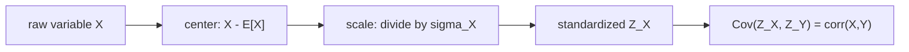

# Quant 4 · Covariance, Correlation, and Positive Semidefinite Correlation Matrices

A common question asks:

```text
Given n random variables X1,...,Xn,
what is the smallest possible sum of all pairwise correlations?
```

The shortest answer is:

$$
\sum_{1\le i<j\le n}\operatorname{corr}(X_i,X_j)\ge -\frac n2
$$

When $n=4$, the lower bound is:

$$
-\frac42=-2
$$

This result does not come from guessing the correlations. It follows from one basic fact:

```text
The variance of a random variable cannot be negative.
```

A correlation matrix being positive semidefinite is the matrix form of this statement.

---

## 1. What covariance measures

For two random variables $X,Y$, covariance is defined as:

$$
\operatorname{Cov}(X,Y)
=
\mathbb{E}\left[(X-\mathbb{E}X)(Y-\mathbb{E}Y)\right]
$$

It measures whether the two variables tend to move in the same direction when they deviate from their means.

| Situation | Intuition | Sign of covariance |
| --- | --- | --- |
| When $X$ is above its mean, $Y$ is also often above its mean | They rise and fall together | Positive |
| When $X$ is above its mean, $Y$ is often below its mean | One rises while the other falls | Negative |
| No stable linear relationship | Weak linear comovement | Close to 0 |

A simple picture to remember:

```text
positive covariance        negative covariance        near zero covariance

y                          y                          y
|        *                 | *                        |   *    *
|      *                   |   *                      | *   *
|    *                     |     *                    |      *
|  *                       |       *                  | *       *
+--------- x               +--------- x               +--------- x
```

Covariance has one drawback: it depends on the units. Converting dollars to cents greatly increases the covariance. Interview problems therefore usually use correlation.

---

## 2. Correlation is standardized covariance

Correlation is defined as:

$$
\operatorname{corr}(X,Y)
=
\frac{\operatorname{Cov}(X,Y)}{\sigma_X\sigma_Y}
$$

where:

$$
\sigma_X=\sqrt{\operatorname{Var}(X)},\qquad
\sigma_Y=\sqrt{\operatorname{Var}(Y)}
$$

We can instead standardize the variables first:

$$
Z_X=\frac{X-\mathbb{E}X}{\sigma_X},
\qquad
Z_Y=\frac{Y-\mathbb{E}Y}{\sigma_Y}
$$

After standardization:

$$
\mathbb{E}Z_X=0,\qquad \operatorname{Var}(Z_X)=1
$$

Thus:

$$
\operatorname{corr}(X,Y)=\operatorname{Cov}(Z_X,Z_Y)
$$

Correlation can be viewed as the strength of linear comovement between two variables after removing their units.



---

## 3. Why correlation is always in [-1,1]

After standardization, $\operatorname{Var}(Z_X)=\operatorname{Var}(Z_Y)=1$. For any real number $t$:

$$
\operatorname{Var}(Z_X-tZ_Y)\ge0
$$

Expanding:

$$
\operatorname{Var}(Z_X-tZ_Y)
=
1-2t\operatorname{Cov}(Z_X,Z_Y)+t^2
$$

Let:

$$
\rho=\operatorname{corr}(X,Y)=\operatorname{Cov}(Z_X,Z_Y)
$$

Then:

$$
t^2-2\rho t+1\ge0,\qquad \forall t
$$

This quadratic is nonnegative for every $t$, so its discriminant cannot be positive:

$$
(-2\rho)^2-4\le0
$$

Therefore:

$$
\rho^2\le1
$$

That is:

$$
-1\le \operatorname{corr}(X,Y)\le 1
$$

Note that $\rho=0$ means only that there is no linear correlation, not that the variables are independent. Independence implies zero covariance, but the converse does not always hold.

---

## 4. Covariance matrices and correlation matrices

For random variables $X_1,\ldots,X_n$, the covariance matrix is:

$$
\Sigma_{ij}=\operatorname{Cov}(X_i,X_j)
$$

Its diagonal entries are variances:

$$
\Sigma_{ii}=\operatorname{Var}(X_i)
$$

If each variable is standardized first:

$$
Z_i=\frac{X_i-\mathbb{E}X_i}{\sigma_i}
$$

then the correlation matrix is the covariance matrix of the $Z_i$:

$$
R_{ij}
=
\operatorname{corr}(X_i,X_j)
=
\operatorname{Cov}(Z_i,Z_j)
$$

Therefore:

$$
R=
\begin{pmatrix}
1 & \rho_{12} & \cdots & \rho_{1n}\\
\rho_{21} & 1 & \cdots & \rho_{2n}\\
\vdots & \vdots & \ddots & \vdots\\
\rho_{n1} & \rho_{n2} & \cdots & 1
\end{pmatrix}
$$

A correlation matrix has three basic properties:

| Property | Reason |
| --- | --- |
| Symmetric | $\operatorname{corr}(X_i,X_j)=\operatorname{corr}(X_j,X_i)$ |
| Diagonal entries equal 1 | The correlation of each standardized variable with itself is 1 |
| Positive semidefinite | The variance of every linear combination is nonnegative |

The third property is the most important.

---

## 5. Why a correlation matrix is always PSD

Choose arbitrary real numbers $a_1,\ldots,a_n$ and consider:

$$
W=a_1Z_1+\cdots+a_nZ_n
$$

This is a random variable, so:

$$
\operatorname{Var}(W)\ge0
$$

Expanding the variance:

$$
\operatorname{Var}(W)
=
\operatorname{Var}\left(\sum_{i=1}^n a_iZ_i\right)
=
\sum_{i=1}^n\sum_{j=1}^n a_i a_j \operatorname{Cov}(Z_i,Z_j)
$$

Since $\operatorname{Cov}(Z_i,Z_j)=R_{ij}$:

$$
\operatorname{Var}(W)=a^\top R a
$$

Thus, for every vector $a$:

$$
a^\top R a\ge0
$$

This is the definition of positive semidefiniteness:

$$
R\succeq0
$$

A diagram to remember:

```text
choose weights a1,...,an
        |
        v
linear combination W = sum ai Zi
        |
        v
variance Var(W) cannot be negative
        |
        v
a^T R a >= 0 for every a
        |
        v
R is PSD
```

---

## 6. Geometric interpretation: The correlation matrix is a Gram matrix

Standardized random variables can be treated as vectors with inner product:

$$
\langle Z_i,Z_j\rangle=\operatorname{Cov}(Z_i,Z_j)
$$

Because:

$$
\langle Z_i,Z_i\rangle=\operatorname{Var}(Z_i)=1
$$

each $Z_i$ behaves like a unit vector. The correlation is the cosine of the angle between two unit vectors:

$$
\operatorname{corr}(X_i,X_j)=\cos\theta_{ij}
$$

The correlation matrix is the Gram matrix of all pairwise inner products:

$$
R_{ij}=\langle Z_i,Z_j\rangle
$$

A Gram matrix is always PSD because:

$$
a^\top R a
=
\left\langle \sum_i a_iZ_i,\sum_j a_jZ_j\right\rangle
=
\left\|\sum_i a_iZ_i\right\|^2
\ge0
$$

In probability language, variance is nonnegative. In geometric language, squared length is nonnegative.

```text
probability view:
  Var(sum ai Zi) >= 0

geometry view:
  ||sum ai vi||^2 >= 0

same statement
```

---

## 7. Example: Minimum sum of pairwise correlations among four variables

The problem can be stated as:

```text
Given four random variables X1, X2, X3, X4,
each with nonzero variance, find the smallest possible value of:

corr(X1,X2)+corr(X1,X3)+corr(X1,X4)
+ corr(X2,X3)+corr(X2,X4)+corr(X3,X4)
```

Let:

$$
\rho_{ij}=\operatorname{corr}(X_i,X_j)
$$

Standardize the variables:

$$
Z_i=\frac{X_i-\mathbb{E}X_i}{\sigma_i}
$$

Then:

$$
\operatorname{Var}(Z_i)=1,\qquad
\operatorname{Cov}(Z_i,Z_j)=\rho_{ij}
$$

Now consider the sum of all standardized variables:

$$
W=Z_1+Z_2+Z_3+Z_4
$$

Its variance is nonnegative:

$$
\operatorname{Var}(W)\ge0
$$

Expanding:

$$
\operatorname{Var}(Z_1+Z_2+Z_3+Z_4)
=
\sum_{i=1}^4\operatorname{Var}(Z_i)
+2\sum_{1\le i<j\le4}\operatorname{Cov}(Z_i,Z_j)
$$

Since every $\operatorname{Var}(Z_i)=1$:

$$
\operatorname{Var}(W)
=
4+2\sum_{1\le i<j\le4}\rho_{ij}
$$

From $\operatorname{Var}(W)\ge0$:

$$
4+2\sum_{1\le i<j\le4}\rho_{ij}\ge0
$$

Therefore:

$$
\sum_{1\le i<j\le4}\rho_{ij}\ge -2
$$

The answer cannot be smaller than $-2$.

### 7.1 Why the lower bound is attainable

We must also show that $-2$ is not merely a loose lower bound. Construct the valid correlation matrix:

$$
R=
\begin{pmatrix}
1 & -1/3 & -1/3 & -1/3\\
-1/3 & 1 & -1/3 & -1/3\\
-1/3 & -1/3 & 1 & -1/3\\
-1/3 & -1/3 & -1/3 & 1
\end{pmatrix}
$$

All six off-diagonal correlations equal $-1/3$, so their sum is:

$$
6\cdot\left(-\frac13\right)=-2
$$

This matrix is PSD. Geometrically, it corresponds to the four vertex directions of a regular tetrahedron in three-dimensional space: four unit vectors point symmetrically in different directions, their center is the origin, and the dot product of every pair is $-1/3$.

```text
four standardized variables
        |
        v
regular tetrahedron directions
        |
        v
all pairwise correlations = -1/3
        |
        v
sum of 6 correlations = -2
```

Algebraically, let:

$$
R=\frac{4}{3}I-\frac{1}{3}J
$$

where $J$ is the all-ones matrix. The vector $\mathbf{1}=(1,1,1,1)$ has eigenvalue:

$$
\frac43-\frac13\cdot4=0
$$

Every direction orthogonal to $\mathbf{1}$ has eigenvalue:

$$
\frac43
$$

Thus, the eigenvalues of $R$ are:

$$
0,\frac43,\frac43,\frac43
$$

They are all nonnegative, so $R$ is a valid correlation matrix. A four-dimensional normal random vector with mean 0 and covariance matrix $R$ provides random variables that attain the lower bound.

The final answer is:

$$
\boxed{-2}
$$

---

## 8. Generalization: The answer for $n$ variables is $-n/2$

The same derivation works for $n$ variables.

Standardize:

$$
Z_i=\frac{X_i-\mathbb{E}X_i}{\sigma_i}
$$

Consider:

$$
W=Z_1+\cdots+Z_n
$$

Since:

$$
\operatorname{Var}(W)\ge0
$$

expanding gives:

$$
\operatorname{Var}(W)
=
n+2\sum_{1\le i<j\le n}\operatorname{corr}(X_i,X_j)
$$

Therefore:

$$
\sum_{1\le i<j\le n}\operatorname{corr}(X_i,X_j)
\ge
-\frac n2
$$

This lower bound is also attainable. Set all off-diagonal correlations equal to:

$$
\rho_{ij}=-\frac{1}{n-1},\qquad i\ne j
$$

Then their sum is:

$$
\binom n2\left(-\frac{1}{n-1}\right)
=
\frac{n(n-1)}{2}\left(-\frac{1}{n-1}\right)
=
-\frac n2
$$

The corresponding correlation matrix is:

$$
R=
\frac{n}{n-1}I-\frac{1}{n-1}J
$$

Its eigenvalues are:

$$
0,\frac{n}{n-1},\ldots,\frac{n}{n-1}
$$

so it is PSD and therefore a valid correlation matrix.

Geometrically, these are the $n$ vertex directions of a regular simplex in $(n-1)$-dimensional space. Every direction is a unit vector, all vectors sum to 0, and each pair has dot product:

$$
-\frac{1}{n-1}
$$
