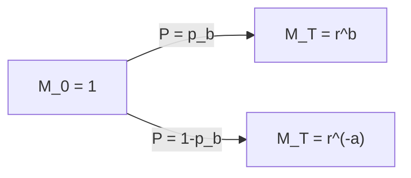

# Quant 11 · 鞅、停时与最优停时定理：一维随机游走的应用

这一讲把 Quant 10 里已经用过的工具（鞅、无套利概率）往数学基础的方向补全：鞅的严格定义、停时的定义、最优停时定理（Optional Stopping Theorem, OST）成立需要的条件，以及 OST 失效时会出什么问题。主线例子统一用一维随机游走：先讲对称情形（Gambler's Ruin 的鞅解法），再讲不对称情形（指数鞅），最后用一个经典反例说明为什么 OST 的条件不能随便跳过。每个概念只配一道例题，用来落地对应的定义或定理，不铺开做题海。

```text
看到这类问题该想什么：
1. 先确认要分析的过程是不是鞅：算一步条件期望 E[X_{n+1} | F_n]，看它是不是恒等于 X_n。
2. 再确认停止的时刻是不是合法的停时：判断"要不要在时刻 n 停"这件事，能不能只用截止到时刻 n 的信息决定，不能偷看未来。
3. 想用 E[X_T] = E[X_0] 之前，先检查停时是不是满足 OST 的三个充分条件之一（有界、停止过程有界、或者期望停时有限+增量有界）；不满足就不能直接套用，需要额外论证或者干脆结论不成立。
4. 一维随机游走上，S_n 本身在对称情形下是鞅；不对称情形下 S_n 不是鞅，但指数鞅 (q/p)^{S_n} 是，这是解不对称 Gambler's Ruin 的关键代换。
5. 想要期望吸收时间，光用 S_n 这个鞅不够，还需要用到 S_n^2 - n（对称情形）或者进一步的鞅来算二阶信息。
```

---

## 模块一：鞅（Martingale）

### 1. 定义

设 $\{\mathcal F_n\}$ 是一列不断变粗的信息（filtration，$\mathcal F_n \subseteq \mathcal F_{n+1}$，代表"到时刻 $n$ 为止已知的全部信息"）。随机过程 $\{X_n\}$ 相对于 $\{\mathcal F_n\}$ 是鞅，需要同时满足三个条件：

$$
\text{(i) } X_n \text{ 是 } \mathcal F_n\text{-可测的} \qquad \text{(ii) } \mathbb E[|X_n|] < \infty \qquad \text{(iii) } \mathbb E[X_{n+1} \mid \mathcal F_n] = X_n
$$

条件 (i) 说的是"$X_n$ 的值由截止到时刻 $n$ 的信息完全决定"；条件 (ii) 是纯技术性的可积要求，保证条件期望有意义；条件 (iii) 是核心，说的是"站在时刻 $n$ 往前看一步，对 $X_{n+1}$ 最优的预测就是 $X_n$ 本身"，既不系统性地涨也不系统性地跌，这正是"公平游戏"的数学刻画。

反复用塔性质（tower property）$\mathbb E[\mathbb E[\cdot \mid \mathcal F_{n+1}] \mid \mathcal F_n] = \mathbb E[\cdot \mid \mathcal F_n]$，可以把条件 (iii) 延伸到任意步：$\mathbb E[X_m \mid \mathcal F_n] = X_n$（$m>n$），取全期望还能得到一个经常被用来做合理性检验的推论：$\mathbb E[X_n] = \mathbb E[X_0]$ 对所有 $n$ 成立，也就是说鞅在任意固定时刻的期望值都不会变。

**例题 1**：设 $S_n = X_1 + \cdots + X_n$（$S_0=0$）是简单对称随机游走，$X_i$ 独立同分布，$P(X_i=1)=P(X_i=-1)=\tfrac12$。证明 $M_n = S_n^2 - n$ 是关于 $\mathcal F_n = \sigma(X_1,\ldots,X_n)$ 的鞅。

**证明**：$M_n$ 显然是 $\mathcal F_n$-可测的且可积。关键验证条件 (iii)：

$$
\mathbb E[M_{n+1} \mid \mathcal F_n] = \mathbb E[(S_n+X_{n+1})^2 - (n+1) \mid \mathcal F_n] = \mathbb E[S_n^2 + 2S_nX_{n+1} + X_{n+1}^2 - n - 1 \mid \mathcal F_n]
$$

$S_n$ 是 $\mathcal F_n$-可测的可以提出条件期望，$X_{n+1}$ 独立于 $\mathcal F_n$ 且 $\mathbb E[X_{n+1}]=0$，$X_{n+1}^2 \equiv 1$（因为 $X_{n+1}\in\{-1,+1\}$）：

$$
= S_n^2 + 2S_n \cdot \mathbb E[X_{n+1}] + \mathbb E[X_{n+1}^2] - n - 1 = S_n^2 + 0 + 1 - n - 1 = S_n^2 - n = M_n
$$

得证。这个鞅是后面求解 Gambler's Ruin 期望吸收时间的关键工具——直觉上，$S_n^2$ 平均而言以速度 $1$ 逐步增长（每步方差贡献 $1$），减去 $n$ 之后正好抵消掉这个系统性增长，剩下的部分才是"公平"的。

**常见追问 / 面试陷阱**

> 追问"$S_n$ 本身是不是鞅"：是，且证明方式和上面几乎一样（$\mathbb E[S_{n+1}\mid\mathcal F_n] = S_n + \mathbb E[X_{n+1}] = S_n$），只是 $S_n$ 只能用来算一阶信息（比如吸收概率），$S_n^2-n$ 才能算二阶信息（比如期望吸收时间）；很多人会漏掉后者，只会用 $S_n$，导致算不出期望时间。

---

## 模块二：停时（Stopping Time）

### 2. 定义

随机时刻 $T$（取值在 $\{0,1,2,\ldots\}\cup\{\infty\}$）是关于 $\{\mathcal F_n\}$ 的停时，如果对任意 $n$，事件 $\{T \le n\}$ 都是 $\mathcal F_n$-可测的。直觉上：**要不要在时刻 $n$ 停下来这个决定，只能用截止到时刻 $n$ 已经发生的信息，不能偷看未来**。

典型的停时：首次到达某个水平的时刻（比如"随机游走第一次碰到 $b$ 的时刻"），因为在时刻 $n$ 判断"是否已经碰到过 $b$"只需要看 $X_1,\ldots,X_n$。典型的**非**停时：比如"过程最后一次访问 $0$ 的时刻"，因为要判断某一步是不是"最后一次"，必须知道未来还会不会再回到 $0$，这信息在当下根本拿不到。

**例题 2**：设 $S_n$ 是简单随机游走，判断下面两个随机时刻哪个是合法的停时：

（a）$T_1 = \min\{n : S_n = 5\}$（首次到达 $5$ 的时刻）

（b）$T_2 = T_1 - 1$（首次到达 $5$ 的**前一步**）

**解答**：$T_1$ 是停时：判断"$T_1 \le n$"等价于判断"$S_1,\ldots,S_n$ 里是否出现过 $5$"，这只需要截止到时刻 $n$ 的信息。$T_2$ **不是**停时：站在时刻 $n$，要判断"是否 $T_2=n$"，等价于判断"$S_n \ne 5$ 但 $S_{n+1}=5$"，而 $S_{n+1}$ 是未来才会实现的信息，在时刻 $n$ 无法仅凭已知信息判断，所以 $T_2$ 违反停时的定义——这是"往前看一步"类型的非停时里最典型的例子。

**常见追问 / 面试陷阱**

> 追问"两个停时的和/最小值还是不是停时"：是。如果 $T_1, T_2$ 都是停时，$T_1 \wedge T_2 = \min(T_1,T_2)$、$T_1 \vee T_2 = \max(T_1,T_2)$、$T_1+T_2$ 都仍然是停时（比如 $\{T_1\wedge T_2 \le n\} = \{T_1\le n\}\cup\{T_2\le n\}$，两个 $\mathcal F_n$-可测事件的并集仍然是 $\mathcal F_n$-可测的）。这个性质在处理"哪个事件先发生就停"类型的问题（比如 Gambler's Ruin 里"先撞到上界还是下界"）时经常被隐式用到。

---

## 模块三：最优停时定理（Optional Stopping Theorem）

### 3. 定理与三个充分条件

**核心结论**：如果 $\{X_n\}$ 是鞅，$T$ 是停时，并且满足下面三个条件中的**任意一个**，那么 $\mathbb E[X_T] = \mathbb E[X_0]$：

$$
\begin{aligned}
\text{条件 A：} &\ T \text{ 有界（存在常数 } N \text{ 使得 } T \le N \text{ 几乎必然成立）} \\
\text{条件 B：} &\ T \text{ 几乎必然有限，且停止过程 } \{X_{n\wedge T}\} \text{ 一致有界} \\
\text{条件 C：} &\ \mathbb E[T] < \infty，\text{且鞅的增量有界（存在 } c \text{ 使得 } |X_{n+1}-X_n|\le c \text{ 恒成立）}
\end{aligned}
$$

这三个条件的本质都是在防止同一件坏事：**停止时刻太晚才发生的"小概率但极端"的情况，把整个期望搅乱**。条件 A 直接不给这种情况发生的机会（时间线本身有限）；条件 B 允许时间线无限长，但要求过程本身不会飙到很极端的值；条件 C 允许过程无界，但要求"平均等待时间"有限，且每一步变化幅度可控。三者选其一验证即可，不需要同时满足。

**例题 3（经典反例：为什么不能跳过条件直接用 OST）**：设 $S_n$ 是简单对称随机游走，$S_0=0$，$T=\min\{n:S_n=1\}$（首次到达 $1$ 的时刻）。已知 $T$ 几乎必然有限（对称随机游走是常返的，一定会碰到 $1$），如果直接套 $\mathbb E[S_T]=\mathbb E[S_0]$，会得到 $1=0$，明显错误。问题出在哪？

**解答**：$T$ 虽然几乎必然有限，但既不满足条件 A（$T$ 没有一致的上界，可以任意长），也不满足条件 B（停止过程 $S_{n\wedge T}$ 不是一致有界的——在到达 $1$ 之前，$S_n$ 可以先跌到任意负的深度，绝对值没有上界），也不满足条件 C（可以证明 $\mathbb E[T]=\infty$：虽然常返，"平均"要等无穷久才会碰到 $1$，这是对称随机游走的一个标准结论，可以用生成函数或者反射原理证明首中时间的分布尾部是 $P(T=2k-1)\sim k^{-3/2}$，求和后期望发散）。三个条件全部不满足，$\mathbb E[S_T]=\mathbb E[S_0]$ 这个等式没有理论保证，实际算出来也确实不成立。

**常见追问 / 面试陷阱**

> 追问"是不是只要 $T$ 几乎必然有限就能用 OST"：这是最常见的误用，例题 3 就是专门用来打破这个错觉的。$T$ 几乎必然有限（也就是"迟早会停"）只是使用 OST 的必要条件之一，不是充分条件，条件 A/B/C 里的额外要求都在排除"虽然迟早会停，但停止时刻的分布有一个很重的尾巴，导致期望被少数极端路径主导"这种情况。

---

## 模块四：应用于一维随机游走的 Gambler's Ruin

### 4.1 对称情形：用鞅一次性解出吸收概率和期望时间

**题目**：简单对称随机游走从 $S_0=0$ 出发，$T=\min\{n: S_n=-a \text{ 或 } S_n=b\}$（$a,b$ 是正整数，两个吸收边界）。求（i）$P(S_T=b)$（即先到 $b$ 而不是先到 $-a$ 的概率），（ii）$\mathbb E[T]$。

**推导（i）**：$T$ 满足 OST 条件 C（可以证明 $\mathbb E[T]<\infty$，且 $S_n$ 每步增量恒为 $\pm1$ 有界），对鞅 $S_n$ 用 OST：

$$
\mathbb E[S_T] = \mathbb E[S_0] = 0
$$

$S_T$ 只能取两个值 $-a$ 或 $b$，设 $p_b = P(S_T=b)$：

$$
-a(1-p_b) + b\,p_b = 0 \implies p_b = \frac{a}{a+b}
$$

**推导（ii）**：对鞅 $M_n=S_n^2-n$（例题 1 已证明）用 OST：

$$
\mathbb E[S_T^2 - T] = \mathbb E[S_0^2 - 0] = 0 \implies \mathbb E[T] = \mathbb E[S_T^2]
$$

$S_T^2$ 只能取 $a^2$（概率 $1-p_b$）或 $b^2$（概率 $p_b$）：

$$
\mathbb E[T] = a^2\cdot\frac{b}{a+b} + b^2\cdot\frac{a}{a+b} = \frac{ab(a+b)}{a+b} = ab
$$

$$
\boxed{p_b = \frac{a}{a+b}, \qquad \mathbb E[T] = ab}
$$


**例题 4**：取 $a=3, b=5$，代入上式：$p_b = \dfrac{3}{8} = 0.375$，$\mathbb E[T] = 3\times5=15$。

**常见追问 / 面试陷阱**

> 追问"这个方法和 Quant 2 里 Gambler's Ruin 用 first-step equations 解出来的结果是不是一样"：是完全一样的结果，鞅方法和 first-step analysis（对每个状态写期望方程再解线性递推）是解同一个问题的两条不同路径。鞅方法的优势在于不需要解一个关于状态的线性差分方程，只需要验证一两个鞅、直接代入边界值求解代数方程，过程更短；first-step analysis 的优势在于更"暴力"、不需要提前构造出合适的鞅，两种方法都值得掌握。

### 4.2 不对称情形：指数鞅

**题目**：随机游走 $S_n$ 每步以概率 $p$ 向上、概率 $q=1-p$ 向下（$p\ne q$），$S_0=0$，$T$ 同样是首次到达 $-a$ 或 $b$ 的时刻。求 $P(S_T=b)$。

**思路**：$p\ne q$ 时 $\mathbb E[X_{n+1}]=p-q\ne0$，$S_n$ 本身**不再是鞅**（是次鞅或上鞅，取决于 $p$ 和 $q$ 谁更大），不能直接套用模块 4.1 的方法。这时候需要构造一个新的鞅：**指数鞅** $M_n = r^{S_n}$，其中 $r=q/p$。

**验证 $M_n$ 是鞅**：

$$
\mathbb E[r^{X_{n+1}}] = p\cdot r^{1} + q\cdot r^{-1} = p\cdot\frac{q}{p} + q\cdot\frac{p}{q} = q+p = 1
$$

所以 $\mathbb E[M_{n+1}\mid\mathcal F_n] = M_n\cdot\mathbb E[r^{X_{n+1}}] = M_n$，验证成立。这个"取 $q/p$ 作为底数"的选择不是凑出来的，而是恰好让每一步的期望倍率精确抵消为 $1$ 的唯一非平凡选择。

**求解**：对 $M_n$ 用 OST（$T$ 仍然满足条件 A/C 的适当版本，因为 $T$ 有限且增量有界）：

$$
\mathbb E[M_T] = M_0 = r^0 = 1
$$

$$
r^{-a}(1-p_b) + r^{b}\,p_b = 1
$$

解出：

$$
\boxed{p_b = \frac{r^a-1}{r^{a+b}-1}, \qquad r=\frac{q}{p}}
$$

当 $p\to\tfrac12$（即 $r\to1$）时，这个公式的极限恰好退化成对称情形的 $a/(a+b)$（可以用洛必达法则验证），说明两个公式是同一套理论在不同参数下的特例，不是互相独立的结果。



**例题 5**：取 $p=0.4$（$q=0.6$，$r=q/p=1.5$），$a=2,b=3$：

$$
p_b = \frac{1.5^2-1}{1.5^5-1} = \frac{1.25}{6.59375} = \frac{40}{211} \approx 0.1896
$$

因为每一步向下的概率更大（$q=0.6>p=0.4$），先到达上界 $b$ 的概率明显低于对称情形下 $\tfrac{2}{5}=0.4$ 这个基准值，符合直觉。

**常见追问 / 面试陷阱**

> 追问"不对称情形下期望吸收时间要怎么算"：思路一样，需要再构造一个鞅把"$n$ 这个时间项"和某个有界随机变量联系起来。标准做法是用 $N_n = S_n - n(p-q)$（补偿掉漂移后的鞅，因为 $\mathbb E[X_{n+1}]=p-q$，减去这个漂移项之后 $N_n$ 才重新是鞅），对 $N_n$ 用 OST 可以解出 $\mathbb E[T] = \dfrac{\mathbb E[S_T]}{p-q}$，其中 $\mathbb E[S_T]$ 由上面已经解出的 $p_b$ 直接代入 $\mathbb E[S_T]=b\,p_b-a(1-p_b)$ 算出。

### 4.3 小结：常返性、期望停时与 OST 条件的呼应

对称随机游走是**常返**的（几乎必然回到任意有限水平，包括模块三例题 3 里的水平 $1$），但正因为期望停时是无穷大，模块三的反例才会失败；不对称随机游走是**瞬变**的（$p\ne q$ 时几乎必然趋向 $+\infty$ 或 $-\infty$ 之一，不会以概率 $1$ 回到起点），但一旦加上有限的吸收边界（模块 4.1、4.2 的设定），停时就重新变得"温和"（有限期望、增量有界），OST 才能放心使用。这条线索把模块三和模块四串在一起：**同一个随机游走，在"自由游走"和"加了吸收边界"这两种设定下，停时是否满足 OST 条件可以完全不同**，用 OST 之前先看清楚问题到底是哪一种设定。

```text
一维随机游走的核心结论速查：
对称（p=1/2）：
  S_n 本身是鞅；P(先到 b) = a/(a+b)；E[T] = ab；
  常返但期望回归时间无穷大，是 OST 失效的标准反例来源。
不对称（p != 1/2）：
  S_n 不是鞅，但 r^{S_n}（r=q/p）是；P(先到 b) = (r^a-1)/(r^{a+b}-1)；
  瞬变（几乎必然跑向一侧无穷），但加了双边吸收边界后停时满足 OST 条件。
```

---

## 可视化：一维随机游走的路径与吸收边界

下面这个交互演示可以重新模拟一条随机游走路径，切换对称 / 不对称两种参数，直观看一次具体路径最终撞到哪个边界、走了多少步（注意这是**单次模拟**的结果，会随机波动，和上面算出的**期望值**不是一回事，多点几次"重新模拟"能感受到这种波动）。

```random-walk-ruin-demo
```

---

## 快速选择题

```quiz
title: 快速选择题 1
question: 随机过程 X_n 是鞅，其定义中最核心的一条是：
answer: C
A. X_n 的方差不随时间变化
B. X_n 严格单调
C. E[X_{n+1} | F_n] = X_n，即给定当前信息，下一步的最优预测就是当前值
D. X_n 的分布不随时间变化
explanation: 鞅的核心条件是条件期望的"公平游戏"性质：站在时刻 n 往前看一步，对 X_{n+1} 的最优预测就是 X_n 本身，不涉及方差不变或分布不变这些更强的要求。
```

```quiz
title: 快速选择题 2
question: 关于停时的定义，下列说法正确的是：
answer: B
A. 停时可以依赖任意未来信息，只要它是一个有限的随机变量
B. T 是停时要求"是否 T <= n"这件事只能由截止到时刻 n 的信息决定
C. 停时必须是一个确定性的常数
D. 随机游走的最后一次归零时刻是一个合法的停时
explanation: 停时的定义就是"决定是否在时刻n停下"只能用当下及之前的信息判断，不能偷看未来；D 是经典的非停时例子，因为判断"是不是最后一次归零"需要知道未来是否还会归零。
```

```quiz
title: 快速选择题 3
question: 简单对称随机游走 S_n 首次到达水平 1 的时刻 T 满足下列哪个性质，导致直接套用 E[S_T]=E[S_0] 会出错？
answer: D
A. T 不是一个合法的停时
B. S_n 根本不是鞅
C. T 是有界的
D. T 几乎必然有限，但期望 E[T] 是无穷大，且停止过程无界
explanation: T 确实是合法停时，S_n 确实是鞅；问题在于 T 虽然几乎必然有限（对称随机游走常返），但不满足 OST 的任何一个充分条件（不有界、停止过程无界、E[T]=无穷），所以 E[S_T]=E[S_0] 没有理论保证，实际算出来也确实不成立（1 != 0）。
```

```quiz
title: 快速选择题 4
question: 最优停时定理的三个常见充分条件中，"条件 C"具体要求的是：
answer: A
A. E[T] < 无穷，且鞅的每一步增量有界
B. T 必须是一个常数
C. 鞅本身必须是有界的
D. 停时必须几乎必然等于 0
explanation: 条件 C 允许过程本身无界、时间线无限长，但要求平均等待时间有限，并且每一步变化幅度有一个统一的上界，这样才能保证期望不被"极端但小概率"的长时间路径主导。
```

```quiz
title: 快速选择题 5
question: 对称简单随机游走从 0 出发，吸收边界为 -a 和 b。先到达 b 的概率是：
answer: B
A. 1/2，与 a、b 无关
B. a / (a+b)
C. b / (a+b)
D. a·b / (a+b)
explanation: 对 S_n 这个鞅用 OST 得 E[S_T]=0，S_T 只能取 -a 或 b，解方程 -a(1-p_b)+b·p_b=0 得 p_b=a/(a+b)（先到 b 的概率），边界离起点越远，先到达它的概率越小。
```

```quiz
title: 快速选择题 6
question: 对称简单随机游走从 0 出发，吸收边界为 -a 和 b，期望吸收时间 E[T] 是：
answer: C
A. a + b
B. (a+b)^2
C. a·b
D. 需要额外条件才能确定
explanation: 对鞅 M_n=S_n^2-n 用 OST 得 E[T]=E[S_T^2]，代入 S_T^2 的两种取值和对应概率算出 E[T]=a·b，这是一个只依赖 a、b 乘积的简洁结果。
```

```quiz
title: 快速选择题 7
question: 不对称随机游走（每步向上概率 p、向下概率 q=1-p，p≠q）中，为什么不能直接对 S_n 用 OST 求吸收概率？
answer: B
A. 因为不对称随机游走没有停时的概念
B. 因为 p≠q 时 S_n 存在系统性漂移，不再是鞅，E[X_{n+1}]=p-q≠0
C. 因为不对称随机游走一定不满足 OST 的有界性条件
D. 因为不对称情形下期望吸收时间总是无穷大
explanation: S_n 是不是鞅只取决于每一步的条件期望增量是否为 0；不对称情形下增量期望是 p-q≠0，S_n 本身有系统性漂移不是鞅，需要换成指数鞅 r^{S_n}（r=q/p）才能重新应用 OST。
```

```quiz
title: 快速选择题 8
question: 指数鞅 M_n = r^{S_n} 中，r 的取值 r=q/p 是如何确定的？
answer: A
A. 唯一满足 E[r^{X_{n+1}}] = p·r + q/r = 1 的非平凡取值
B. 任意大于 1 的常数都可以
C. r 必须等于 p/q，不能是 q/p
D. r 由吸收边界 a、b 的具体数值决定
explanation: 要让 r^{S_n} 是鞅，唯一需要满足的条件是 E[r^{X_{n+1}}]=1，代入 X_{n+1}=+1（概率p）或-1（概率q）得方程 pr+q/r=1，解出 r=q/p（r=1 是平凡解，对应对称情形退化回 S_n 本身）。
```

```quiz
title: 快速选择题 9
question: 关于一维随机游走的常返性与瞬变性，下列说法正确的是：
answer: C
A. 对称和不对称随机游走都是常返的
B. 对称和不对称随机游走都是瞬变的
C. 对称随机游走是常返的（但期望回归时间无穷大），不对称随机游走是瞬变的
D. 常返性只取决于吸收边界的设置，与 p 是否等于 1/2 无关
explanation: 对称简单随机游走以概率 1 回到任意有限水平（常返），但期望回归时间是无穷大；不对称随机游走（p≠q）几乎必然趋向正负无穷之一，不会以概率 1 回到起点（瞬变）。这正是模块三 OST 反例出现的根源。
```

```quiz
title: 快速选择题 10
question: 关于"OST 反例"和"加了吸收边界的 Gambler's Ruin"这两个设定，下列说法最准确的是：
answer: D
A. 两者本质相同，OST 在两种设定下都不成立
B. 两者本质相同，OST 在两种设定下都成立
C. Gambler's Ruin 设定下 OST 不成立，自由随机游走下 OST 成立
D. 自由随机游走单边停时（如首中 1）不满足 OST 条件，而加了双边吸收边界后停时的期望有限、增量有界，重新满足 OST 条件
explanation: 关键区别在于停时本身的性质：自由游走下"首次碰到某个单侧水平"的停时期望无穷大、停止过程无界；一旦加上双边吸收边界，停时几乎必然在有限期望步数内发生，且过程本身被边界限制在有界范围内，满足 OST 的充分条件。同一个随机游走在不同问题设定下，停时是否满足 OST 条件可以完全不同。
```
