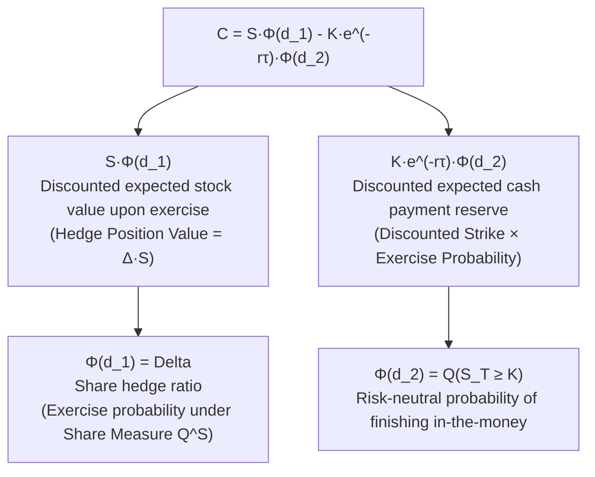

# Quant 12 · Brownian Motion, Itô Calculus, Stopping Times & Option Trading

This tutorial systematically unpacks the core continuous-time stochastic analysis framework in quantitative finance: from the continuous limit of 1D and 2D random walks (Brownian motion and Donsker's Invariance Principle), to sample path geometric irregularities (infinite first-order variation and finite quadratic variation), to Itô's Lemma and the structural divergence between Itô and Stratonovich integrals, continuous-time stopping times, exponential martingales, and the Reflection Principle, and finally to Geometric Brownian Motion, Black-Scholes-Merton PDE, Delta hedging Gamma PnL, and volatility signature arbitrage.

```text
Core Mental Model & Roadmap:
1. Path Geometry: Brownian motion W_t is almost surely continuous everywhere but nowhere differentiable. Its total variation is infinite, while its quadratic variation is deterministic [W]_t = t. Ordinary Riemann-Stieltjes calculus collapses; one must Taylor-expand to order (dW_t)^2 = dt.
2. 2D Random Walk & Donsker Limit: Discrete grid walks weakly converge to 2D Brownian motion. Discrete 2D walk is recurrent (Pólya's theorem). Continuous 2D Brownian motion is point-transient (never hits an exact pre-assigned point, capacity 0) but neighborhood-recurrent (visits any open ball B_eps(x) infinitely often), and possesses conformal invariance under analytic maps (Paul Lévy's Theorem).
3. Itô vs. Stratonovich Geometry: Itô evaluates at left endpoints (non-anticipating/adapted), maintaining the martingale property with E[I_t] = 0 (essential for financial causality and no-arbitrage). Stratonovich evaluates at midpoints, preserving standard chain rules but injecting an anticipating drift correction of +(1/2) dt.
4. Stopping Times & Reflection Principle: For the hitting time \tau_a = inf{t: W_t = a}, strong Markov property and spatial mirror symmetry yield P(M_t >= a) = 2 P(W_t >= a), leading directly to the Lévy distribution for first passage times.
5. Option Hedging & Volatility Signature: Delta hedging eliminates first-order directional risk dW_t. The instantaneous hedging PnL is d\Pi = (1/2) S^2 \Gamma (\sigma_{realized}^2 - \sigma_{implied}^2) dt - r \Pi dt. Long Gamma is fundamentally a bet that realized volatility will exceed implied volatility.
```

---

## Module 1: Basics & Path Geometry of Brownian Motion

### 1. Axiomatic Characterization

A standard one-dimensional Brownian motion (Wiener process) $\{W_t\}_{t \ge 0}$ defined on a probability space $(\Omega, \mathcal{F}, \mathbb{P})$ satisfies:

$$
\begin{aligned}
\text{(i) Starting Point:} &\ W_0 = 0 \text{ almost surely} \\
\text{(ii) Independent Increments:} &\ \forall 0 \le t_0 < t_1 < \dots < t_n,\ \text{increments } W_{t_1}-W_{t_0}, \dots, W_{t_n}-W_{t_{n-1}} \text{ are mutually independent} \\
\text{(iii) Stationary Gaussian Increments:} &\ \forall 0 \le s < t,\ W_t - W_s \sim \mathcal{N}(0, t - s) \\
\text{(iv) Sample Path Continuity:} &\ t \mapsto W_t(\omega) \text{ is continuous for almost all } \omega
\end{aligned}
$$

The covariance kernel for any $s, t \ge 0$ (assuming $s \le t$) is:

$$
\operatorname{Cov}(W_s, W_t) = \mathbb{E}[W_s W_t] = \mathbb{E}[W_s (W_s + W_t - W_s)] = \mathbb{E}[W_s^2] + 0 = s = \min(s, t)
$$

### 2. Path Geometry: Nowhere Differentiability and Quadratic Variation

For a partition $\Pi_n: 0 = t_0 < t_1 < \dots < t_n = T$ with mesh size $|\Pi_n| = \max_i |t_i - t_{i-1}| \to 0$:

#### (1) First-Order Total Variation Diverges to Infinity

$$
\operatorname{TV}_T(W) = \lim_{|\Pi_n| \to 0} \sum_{i=1}^n |W_{t_i} - W_{t_{i-1}}| = \infty \quad \text{almost surely}
$$

**Proof sketch**: Let $\Delta W_i = W_{t_i} - W_{t_{i-1}} = \sqrt{\Delta t_i} Z_i$ ($Z_i \sim \mathcal{N}(0, 1)$). Then $\mathbb{E}[|\Delta W_i|] = \sqrt{\frac{2}{\pi}} \sqrt{\Delta t_i}$. For uniform partitions $\Delta t = T/n$:

$$
\mathbb{E}\left[ \sum_{i=1}^n |\Delta W_i| \right] = n \cdot \sqrt{\frac{2}{\pi}} \sqrt{\frac{T}{n}} = \sqrt{\frac{2}{\pi}} \sqrt{T} \sqrt{n} \xrightarrow{n \to \infty} \infty
$$

#### (2) Quadratic Variation Converges Deterministically to $T$

$$
[W]_T = \lim_{|\Pi_n| \to 0} \sum_{i=1}^n (W_{t_i} - W_{t_{i-1}})^2 = T \quad \text{in } L^2 \text{ and in probability}
$$

**Proof**: Let $Q_n = \sum_{i=1}^n (\Delta W_i)^2$. The expectation is $\mathbb{E}[Q_n] = \sum \Delta t_i = T$. The variance is:

$$
\operatorname{Var}(Q_n) = \sum_{i=1}^n (\Delta t_i)^2 \operatorname{Var}(Z_i^2) = 2 \sum_{i=1}^n (\Delta t_i)^2 \le 2 |\Pi_n| \sum \Delta t_i = 2 |\Pi_n| T \xrightarrow{|\Pi_n| \to 0} 0
$$

In differential notation:

$$
(dW_t)^2 = dt
$$

> **Key Quant Takeaway**: Because $(dW_t)^2 = dt$ has the same first-order scale as $dt$, any Taylor expansion of a function along a Brownian path must include second derivatives.

```brownian-motion-demo
```

### 3. Symmetries and Invariant Transformations

1. **Brownian Scaling**: $\forall c > 0$, $X_t = \frac{1}{\sqrt{c}} W_{ct}$ is a standard Brownian motion.
2. **Time Inversion**: $Y_t = t W_{1/t}$ (with $Y_0 = 0$) is a standard Brownian motion.
3. **Spatial Reflection**: $Z_t = -W_t$ is a standard Brownian motion.

### 4. Transition Density & Heat Equation

The transition probability density from $x$ to $y$ across time $t$ is:

$$
p(t, x, y) = \frac{1}{\sqrt{2\pi t}} \exp\left( -\frac{(y-x)^2}{2t} \right)
$$

It directly satisfies the Heat Equation / Kolmogorov backward & forward PDE:

$$
\frac{\partial p}{\partial t} = \frac{1}{2} \frac{\partial^2 p}{\partial x^2} \quad (\text{Backward}) \qquad \frac{\partial p}{\partial t} = \frac{1}{2} \frac{\partial^2 p}{\partial y^2} \quad (\text{Forward / Fokker-Planck})
$$

---

## Module 2: 2D Random Walk & Brownian Motion

### 1. Donsker's Invariance Principle (Functional Central Limit Theorem)

Let $\xi_1, \xi_2, \dots$ be i.i.d. step vectors on the discrete integer lattice $\mathbb{Z}^2$, choosing each cardinal direction with probability $1/4$: $\mathbb{E}[\xi_i] = (0, 0)$, $\operatorname{Cov}(\xi_i) = \frac{1}{2} I_2$. Construct the piecewise linear random walk $S_k = \sum_{i=1}^k \xi_i$ and the rescaled process:

$$
B_N(t) = \frac{1}{\sqrt{N}} S_{\lfloor Nt \rfloor}
$$

Donsker's Invariance Principle states that as $N \to \infty$, $B_N(\cdot)$ converges weakly in $C([0, T], \mathbb{R}^2)$ to standard two-dimensional Brownian motion:

$$
B_N(t) \implies \left( \frac{1}{\sqrt{2}} B_t^{(1)}, \frac{1}{\sqrt{2}} B_t^{(2)} \right)
$$

```two-d-walk-demo
```

### 2. Recurrence vs. Transience: Pólya's Theorem and Topological Finesse

| Spatial Dimension $d$ | Discrete Grid Walk ($\mathbb{Z}^d$) | Continuous Brownian Motion ($\mathbb{R}^d$) | Properties |
| :--- | :--- | :--- | :--- |
| **$d = 1$** | **Recurrent** | **Recurrent** | Returns to origin almost surely, $\mathbb{E}[\tau] = \infty$ (null recurrent) |
| **$d = 2$** | **Recurrent** | **Neighborhood Recurrent, Point Transient** | Discrete: $P(\text{return}) = 1$; Continuous: $P(\exists t>0: B_t = 0) = 0$, but enters any open disk $B_\epsilon(x)$ infinitely often |
| **$d \ge 3$** | **Transient** | **Transient** | Discrete $d=3$: $P(\text{return}) \approx 0.340537$; Continuous: $\lim_{t\to\infty} \|B_t\| = \infty$ a.s. |

### 3. Conformal Invariance (Paul Lévy's Theorem)

Let $Z_t = B_t^{(1)} + i B_t^{(2)}$ be standard complex Brownian motion, and let $f: U \to V$ be a non-degenerate holomorphic (analytic) function. Then:

$$
f(Z_t) = \widetilde{Z}_{\tau_t}
$$

where $\widetilde{Z}$ is another standard complex Brownian motion and $\tau_t = \int_0^t |f'(Z_s)|^2 ds$ is a strictly increasing time change. Conformal mappings preserve the Brownian motion structure, enabling geometric transformations of complex boundary value problems.

---

## Module 3: Itô Calculus & Itô Geometry

### 1. Second-Order Taylor Expansion & Itô's Lemma

For an Itô diffusion $dX_t = \mu(t, X_t) dt + \sigma(t, X_t) dW_t$ and $f(t, x) \in C^{1,2}$:

$$
\Delta f = \frac{\partial f}{\partial t}\Delta t + \frac{\partial f}{\partial x}\Delta X_t + \frac{1}{2}\frac{\partial^2 f}{\partial x^2}(\Delta X_t)^2 + \mathcal{O}((\Delta t)^{3/2})
$$

Using the multiplication rules:

| $\times$ | $dt$ | $dW_t$ |
| :---: | :---: | :---: |
| **$dt$** | $0$ | $0$ |
| **$dW_t$** | $0$ | **$dt$** |

we obtain **Itô's Lemma**:

$$
df(t, X_t) = \left( \frac{\partial f}{\partial t} + \mu \frac{\partial f}{\partial x} + \frac{1}{2}\sigma^2 \frac{\partial^2 f}{\partial x^2} \right) dt + \sigma \frac{\partial f}{\partial x} dW_t
$$

### 2. Multi-Dimensional Itô's Lemma

For correlated Brownian motions $dW_t^i dW_t^j = \rho_{ij} dt$ and $dX_t^i = \mu_i dt + \sum_k \sigma_{ik} dW_t^k$:

$$
df(t, X_t) = \left( \frac{\partial f}{\partial t} + \sum_{i} \mu_i \frac{\partial f}{\partial x_i} + \frac{1}{2} \sum_{i,j} \left( \sum_{k,l} \sigma_{ik}\sigma_{jl}\rho_{kl} \right) \frac{\partial^2 f}{\partial x_i \partial x_j} \right) dt + \sum_i \frac{\partial f}{\partial x_i} \sum_k \sigma_{ik} dW_t^k
$$

### 3. Itô Geometry vs. Stratonovich Integral

For a partition $0 = t_0 < t_1 < \dots < t_n = T$:

$$
S_n^{(\alpha)} = \sum_{i=0}^{n-1} X_{(1-\alpha)t_i + \alpha t_{i+1}} (W_{t_{i+1}} - W_{t_i})
$$

```ito-geometry-demo
```

1. **Itô Integral ($\alpha = 0$, Left Endpoint)**:
   - Evaluated at $t_i$. Non-anticipating (adapted to $\mathcal{F}_{t_i}$).
   - **Martingale property**: $\mathbb{E}[\int_0^T X_t dW_t] = 0$. Reflects financial causality (no trader can execute trades using future ticks).
2. **Stratonovich Integral ($\alpha = 1/2$, Midpoint)**:
   - Evaluated at $(t_i + t_{i+1})/2$. Satisfies standard calculus chain rule $d(f(W)) = f'(W) \circ dW$.
   - **Conversion Formula**:

$$
\int_0^T X_t \circ dW_t = \int_0^T X_t dW_t + \frac{1}{2} [X, W]_T
$$

For $X_t = W_t$:

$$
\int_0^T W_t \circ dW_t = \frac{1}{2} W_T^2 \qquad \text{vs.} \qquad \int_0^T W_t dW_t = \frac{1}{2} W_T^2 - \frac{1}{2} T
$$

---

## Module 4: The Itô Integral & Itô Isometry

For adapted processes $H_t \in \mathcal{L}^2_{\mathcal{F}}([0, T])$ with $\mathbb{E}[\int_0^T H_t^2 dt] < \infty$:

1. **Martingale Property**: $\mathbb{E}[\int_0^T H_t dW_t \mid \mathcal{F}_s] = \int_0^s H_t dW_t \implies \mathbb{E}[\int_0^T H_t dW_t] = 0$.
2. **Itô Isometry**:

$$
\mathbb{E}\left[ \left( \int_0^T H_t dW_t \right)^2 \right] = \mathbb{E}\left[ \int_0^T H_t^2 dt \right]
$$

Cross terms vanish by the tower property because future increments $\Delta W_j$ are independent of past filtration $\mathcal{F}_{t_j}$.

---

## Module 5: Stopping Times & Extreme Values

### 1. Exponential Martingales & Wald's Identity

For any $\theta \in \mathbb{R}$, the Doléans-Dade exponential martingale:

$$
M_t^\theta = \exp\left( \theta W_t - \frac{1}{2} \theta^2 t \right)
$$

satisfies $dM_t^\theta = \theta M_t^\theta dW_t$. Under the Optional Stopping Theorem (OST):

$$
\mathbb{E}\left[ \exp\left( \theta W_\tau - \frac{1}{2}\theta^2 \tau \right) \right] = 1
$$

### 2. Two-Sided Absorbing Boundaries

For $\tau = \inf\{t \ge 0 : W_t \notin (-b, a)\}$ ($a, b > 0$):
- **Hitting Probability**: $\mathbb{E}[W_\tau] = 0 \implies P(\text{hit } a \text{ first}) = \frac{b}{a+b}$.
- **Expected Exit Time**: $\mathbb{E}[W_\tau^2 - \tau] = 0 \implies \mathbb{E}[\tau] = ab$.

### 3. The Reflection Principle & Running Maximum Distribution

Let $M_t = \max_{0 \le s \le t} W_s$ and $\tau_a = \inf\{s \ge 0 : W_s = a\}$.

```reflection-principle-demo
```

By the strong Markov property and spatial reflection across barrier $a$ after $\tau_a$:

$$
\mathbb{P}(M_t \ge a) = \mathbb{P}(\tau_a \le t) = 2 \mathbb{P}(W_t \ge a) = 2 \left( 1 - \Phi\left( \frac{a}{\sqrt{t}} \right) \right)
$$

The first passage time density is the **Lévy Distribution**:

$$
f_{\tau_a}(t) = \frac{d}{dt} \mathbb{P}(\tau_a \le t) = \frac{a}{\sqrt{2\pi t^3}} \exp\left( -\frac{a^2}{2t} \right) \quad (t > 0)
$$

---

## Module 6: Black-Scholes-Merton Model, Analytical Derivations & Quant Trading

### 6.1 Underlying Asset Dynamics: Geometric Brownian Motion (GBM)

In the Black-Scholes framework, the underlying price process $\{S_t\}_{t \ge 0}$ follows a Geometric Brownian Motion (GBM) stochastic differential equation:

$$
\frac{dS_t}{S_t} = \mu dt + \sigma dW_t \iff dS_t = \mu S_t dt + \sigma S_t dW_t
$$

where $\mu \in \mathbb{R}$ is the expected rate of return (drift), $\sigma > 0$ is the volatility (diffusion), and $W_t$ is a standard Brownian motion.

**Analytical Log-Normal Solution**:
Applying Itô's Lemma to $f(S) = \ln S$ (with $f' = 1/S$ and $f'' = -1/S^2$):

$$
d(\ln S_t) = \frac{1}{S_t} dS_t - \frac{1}{2 S_t^2} (dS_t)^2 = \left( \mu - \frac{1}{2}\sigma^2 \right) dt + \sigma dW_t
$$

Integrating over $[0, t]$:

$$
\ln\left( \frac{S_t}{S_0} \right) = \left( \mu - \frac{1}{2}\sigma^2 \right) t + \sigma W_t \implies \boxed{S_t = S_0 \exp\left( \left( \mu - \frac{1}{2}\sigma^2 \right) t + \sigma W_t \right)}
$$

Thus, $\ln(S_t/S_0) \sim \mathcal{N}\left( (\mu - \frac{1}{2}\sigma^2)t, \sigma^2 t \right)$, meaning $S_t$ is log-normally distributed with moments:

$$
\mathbb{E}[S_t] = S_0 e^{\mu t}, \qquad \operatorname{Var}(S_t) = S_0^2 e^{2\mu t} \left( e^{\sigma^2 t} - 1 \right)
$$

---

### 6.2 Core Assumptions of the Black-Scholes-Merton World

1. **Asset Dynamics**: The underlying price follows a GBM with constant drift $\mu$ and constant volatility $\sigma$;
2. **Frictionless Markets**: Zero transaction costs, zero taxes, and zero bid-ask spread with continuous trading of arbitrary fractional shares;
3. **Unrestricted Short Selling**: Full access to borrowing and shorting at the risk-free rate;
4. **Constant Risk-Free Rate**: Lending and borrowing occur at a constant rate $r > 0$;
5. **No Arbitrage**: No riskless free lunches exist;
6. **European Style**: The derivative can only be exercised at maturity $T$, with no discrete dividend payments before $T$ (extendable to continuous dividend yield $q$).

---

### 6.3 Dual Derivations of the Black-Scholes PDE

Let $V(t, S)$ denote the fair price of a European derivative with terminal payoff $\Phi(S_T)$ at maturity $T$.

#### Method 1: No-Arbitrage Delta Replicating Portfolio (The Classical BSM Approach)

Construct a portfolio $\Pi_t$: **Long 1 unit of the derivative $V(t, S_t)$, Short $\Delta_t$ shares of the underlying $S_t$**:

$$
\Pi_t = V(t, S_t) - \Delta_t S_t
$$

Over an infinitesimal interval $dt$:

$$
d\Pi_t = dV(t, S_t) - \Delta_t dS_t
$$

By Itô's Lemma, expanding $V(t, S_t)$ to order $dt$:

$$
dV = \left( \frac{\partial V}{\partial t} + \mu S \frac{\partial V}{\partial S} + \frac{1}{2}\sigma^2 S^2 \frac{\partial^2 V}{\partial S^2} \right) dt + \sigma S \frac{\partial V}{\partial S} dW_t
$$

Substituting $dV$ and $dS_t = \mu S dt + \sigma S dW_t$ into $d\Pi_t$:

$$
d\Pi_t = \left( \frac{\partial V}{\partial t} + \mu S \frac{\partial V}{\partial S} + \frac{1}{2}\sigma^2 S^2 \frac{\partial^2 V}{\partial S^2} - \Delta_t \mu S \right) dt + \sigma S \left( \frac{\partial V}{\partial S} - \Delta_t \right) dW_t
$$

To eliminate the stochastic noise $dW_t$ completely, set the **Delta Hedge**:

$$
\Delta_t = \frac{\partial V}{\partial S}
$$

The portfolio becomes locally riskless. Under the no-arbitrage principle, its return must equal the risk-free rate: $d\Pi_t = r \Pi_t dt = r (V - \Delta_t S) dt$. Equating both sides yields the **Black-Scholes-Merton PDE**:

$$
\boxed{\frac{\partial V}{\partial t} + r S \frac{\partial V}{\partial S} + \frac{1}{2}\sigma^2 S^2 \frac{\partial^2 V}{\partial S^2} = r V}
$$

> **Crucial Insight**: The subjective expected drift $\mu$ disappears entirely! The option value is purely determined by volatility $\sigma$, interest rate $r$, spot price $S$, strike $K$, and time to expiry $\tau = T - t$.

---

#### Method 2: Risk-Neutral Martingale Pricing & Feynman-Kac Theorem

By Girsanov's Theorem, under the equivalent martingale measure $\mathbb{Q}$ (the risk-neutral measure):

$$
dS_t = r S_t dt + \sigma S_t d\widetilde{W}_t \quad (\widetilde{W}_t \text{ is a } \mathbb{Q}\text{-Brownian motion})
$$

The discounted asset $e^{-rt}S_t$ is a $\mathbb{Q}$-martingale. The no-arbitrage price is the discounted expected payoff:

$$
V(t, S_t) = e^{-r(T-t)} \mathbb{E}^\mathbb{Q}\left[ \Phi(S_T) \;\middle|\; \mathcal{F}_t \right]
$$

By the **Feynman-Kac Theorem**, this conditional expectation solves the BSM PDE with terminal condition $V(T, S) = \Phi(S)$.

---

### 6.4 Analytical Closed-Form Derivation of the Call and Put Formulas

Consider a European Call option with payoff $\Phi(S_T) = \max(S_T - K, 0)$ and time to maturity $\tau = T - t$.
Under $\mathbb{Q}$, the terminal price is $S_T = S_t \exp\left( (r - \frac{1}{2}\sigma^2)\tau + \sigma\sqrt{\tau} Z \right)$ where $Z \sim \mathcal{N}(0, 1)$.

$$
C(S_t, t) = e^{-r\tau} \int_{-\infty}^\infty \max\left( S_t e^{(r - \frac{1}{2}\sigma^2)\tau + \sigma\sqrt{\tau} z} - K, 0 \right) \frac{1}{\sqrt{2\pi}} e^{-z^2/2} dz
$$

#### Step 1: Integration Lower Bound
$S_T > K$ if and only if $z > -d_2$, where:

$$
\boxed{d_2 = \frac{\ln(S_t/K) + (r - \frac{1}{2}\sigma^2)\tau}{\sigma\sqrt{\tau}}}
$$

#### Step 2: Decomposition into Asset and Cash Integrals

$$
C(S_t, t) = \underbrace{e^{-r\tau} \int_{-d_2}^\infty S_t e^{(r - \frac{1}{2}\sigma^2)\tau + \sigma\sqrt{\tau} z} \frac{e^{-z^2/2}}{\sqrt{2\pi}} dz}_{I_1} - \underbrace{K e^{-r\tau} \int_{-d_2}^\infty \frac{e^{-z^2/2}}{\sqrt{2\pi}} dz}_{I_2}
$$

#### Step 3: Evaluating Cash Integral $I_2$

$$
I_2 = K e^{-r\tau} P(Z \ge -d_2) = K e^{-r\tau} \Phi(d_2)
$$

#### Step 4: Evaluating Asset Integral $I_1$ via Completing the Square

$$
I_1 = S_t e^{-\frac{1}{2}\sigma^2\tau} \int_{-d_2}^\infty \frac{1}{\sqrt{2\pi}} \exp\left( -\frac{z^2 - 2\sigma\sqrt{\tau} z}{2} \right) dz
$$

Completing the square: $z^2 - 2\sigma\sqrt{\tau} z = (z - \sigma\sqrt{\tau})^2 - \sigma^2\tau$. The factor $e^{\frac{1}{2}\sigma^2\tau}$ cancels $e^{-\frac{1}{2}\sigma^2\tau}$ exactly:

$$
I_1 = S_t \int_{-d_2}^\infty \frac{1}{\sqrt{2\pi}} \exp\left( -\frac{(z - \sigma\sqrt{\tau})^2}{2} \right) dz
$$

Substituting $u = z - \sigma\sqrt{\tau}$ changes the lower bound to $-d_2 - \sigma\sqrt{\tau} \triangleq -d_1$:

$$
d_1 = d_2 + \sigma\sqrt{\tau} = \frac{\ln(S_t/K) + (r + \frac{1}{2}\sigma^2)\tau}{\sigma\sqrt{\tau}} \implies I_1 = S_t \Phi(d_1)
$$

#### Step 5: Master Black-Scholes Pricing Formula

$$
\boxed{C(S, t) = S \Phi(d_1) - K e^{-r(T-t)} \Phi(d_2)}
$$

Via Put-Call Parity $P = C - S + K e^{-r\tau}$:

$$
\boxed{P(S, t) = K e^{-r(T-t)} \Phi(-d_2) - S \Phi(-d_1)}
$$

---

### 6.5 Financial and Probabilistic Interpretations of $d_1$ and $d_2$



1. **$\Phi(d_2) = \mathbb{Q}(S_T \ge K)$**: The exact risk-neutral probability that the option finishes in-the-money (ITM). $K e^{-r\tau} \Phi(d_2)$ represents the discounted cash reserve needed to deliver the strike price upon exercise.
2. **$\Phi(d_1) = \Delta = \frac{\partial C}{\partial S}$**: The replicating delta (number of underlying shares to hold). Under the Share Measure $\mathbb{Q}^S$ (taking $S_t$ as numeraire), $\Phi(d_1) = \mathbb{Q}^S(S_T \ge K)$ is the probability of exercise.
3. **The Core Derivative Identity**:

$$
\boxed{S \phi(d_1) = K e^{-r\tau} \phi(d_2)}
$$

This identity guarantees that cross terms vanish when calculating Greeks.

---

### 6.6 Put-Call Parity

For European options with identical strike $K$ and maturity $T$:

$$
\boxed{C_t - P_t = S_t - K e^{-r(T-t)}}
$$

---

### 6.7 Complete Summary of Black-Scholes Greeks

| Greek | Financial Meaning | Call Formula | Put Formula | Key Properties |
| :--- | :--- | :--- | :--- | :--- |
| **Delta ($\Delta$)** | Price Sensitivity $\frac{\partial V}{\partial S}$ | $\Phi(d_1)$ | $\Phi(d_1) - 1 = -\Phi(-d_1)$ | Call $\in (0, 1)$, Put $\in (-1, 0)$ |
| **Gamma ($\Gamma$)** | Convexity $\frac{\partial^2 V}{\partial S^2}$ | $\frac{\phi(d_1)}{S \sigma \sqrt{\tau}}$ | $\frac{\phi(d_1)}{S \sigma \sqrt{\tau}}$ | Strictly positive and identical ($\Gamma > 0$) |
| **Vega ($\mathcal{V}$)** | Volatility Sensitivity $\frac{\partial V}{\partial \sigma}$ | $S \sqrt{\tau} \phi(d_1)$ | $S \sqrt{\tau} \phi(d_1)$ | Strictly positive and identical ($\mathcal{V} > 0$) |
| **Theta ($\Theta$)** | Time Decay $\frac{\partial V}{\partial t}$ | $-\frac{S\phi(d_1)\sigma}{2\sqrt{\tau}} - r K e^{-r\tau}\Phi(d_2)$ | $-\frac{S\phi(d_1)\sigma}{2\sqrt{\tau}} + r K e^{-r\tau}\Phi(-d_2)$ | Negative for long positions (decay) |
| **Rho ($\rho$)** | Interest Rate Sensitivity $\frac{\partial V}{\partial r}$ | $K \tau e^{-r\tau} \Phi(d_2)$ | $-K \tau e^{-r\tau} \Phi(-d_2)$ | Call $\rho > 0$, Put $\rho < 0$ |

**Gamma-Theta Trade-off Relation**:

$$
\boxed{\Theta + \frac{1}{2}\sigma^2 S^2 \Gamma = r(V - S\Delta)}
$$

---

### 6.8 Dynamic Delta Hedging & Volatility Arbitrage

In practical market making, options are priced with implied vol $\sigma_I$, while the underlying moves with realized vol $\sigma_R$:

$$
\boxed{d\Pi_t = \frac{1}{2} S_t^2 \Gamma_t \left( \sigma_R^2 - \sigma_I^2 \right) dt}
$$

```delta-hedging-demo
```

- **Long Gamma ($\Gamma > 0$)**: Earns positive alpha when realized volatility exceeds implied volatility ($\sigma_R > \sigma_I$).
- **Short Gamma ($\Gamma < 0$)**: Harvests steady Theta decay in calm regimes ($\sigma_R < \sigma_I$), but carries tail risk during volatility shocks.

---

## Module 7: Deep Quant Interview Problems & Step-by-Step Solutions

### Problem 1: Itô Isometry & Higher-Order Stochastic Integral

**Problem**: Evaluate the expectation $\mathbb{E}[I_T]$ and variance $\operatorname{Var}(I_T)$ for $I_T = \int_0^T W_t^2 dW_t$, and express $I_T$ explicitly in terms of $W_T$ and $\int_0^T W_t dt$.

**Solution**:
1. **Expectation**: $\mathbb{E}[I_T] = 0$ as Itô integrals of $\mathcal{L}^2$ processes are martingales.
2. **Variance**: By Itô Isometry and $\mathbb{E}[W_t^4] = 3t^2$:

$$
\operatorname{Var}(I_T) = \mathbb{E}\left[ \int_0^T W_t^4 dt \right] = \int_0^T 3t^2 dt = T^3
$$

3. **Algebraic Formula**: Applying Itô's Lemma to $f(w) = w^3$:

$$
d(W_t^3) = 3 W_t^2 dW_t + 3 W_t dt \implies \int_0^T W_t^2 dW_t = \frac{1}{3} W_T^3 - \int_0^T W_t dt
$$

---

### Problem 2: Drifted Brownian Motion Two-Sided Hitting Times

**Problem**: Let $X_t = \mu t + \sigma W_t$ ($X_0 = 0, \mu > 0$). Let $\tau = \inf\{t \ge 0 : X_t \notin (-a, b)\}$. Find the probability $P(X_\tau = b)$ and the expected exit time $\mathbb{E}[\tau]$.

**Solution**:
The exponential martingale $M_t = \exp\left( -\frac{2\mu}{\sigma^2} X_t \right)$ is a true martingale. Let $\gamma = \frac{2\mu}{\sigma^2}$. By OST:

$$
\mathbb{E}[M_\tau] = 1 \implies p_b e^{-\gamma b} + (1 - p_b) e^{\gamma a} = 1 \implies p_b = \frac{e^{\gamma a} - 1}{e^{\gamma a} - e^{-\gamma b}}
$$

For expected time, applying OST to $X_t - \mu t$:

$$
\mathbb{E}[\tau] = \frac{\mathbb{E}[X_\tau]}{\mu} = \frac{b p_b - a(1 - p_b)}{\mu}
$$

---

### Problem 3: Barrier Touch Digital Option Pricing

**Problem**: Under risk-neutral measure $\mathbb{Q}$, derive the closed-form price of an Up-and-In Cash-at-Hit Digital option paying $\$1$ if $S_t$ touches $H > S_0$ before $T$.

**Solution**:
Let $Y_t = \frac{\ln(S_t/S_0)}{\sigma} = \alpha t + W_t$ with $\alpha = \frac{r - \frac{1}{2}\sigma^2}{\sigma}$, and barrier $h = \frac{\ln(H/S_0)}{\sigma}$. By Girsanov's change of measure:

$$
\mathbb{Q}(\tau_H \le T) = \Phi\left( \frac{\ln(S_0/H) + (r - \frac{1}{2}\sigma^2)T}{\sigma \sqrt{T}} \right) + \left( \frac{H}{S_0} \right)^{\frac{2r}{\sigma^2} - 1} \Phi\left( \frac{\ln(S_0/H) - (r - \frac{1}{2}\sigma^2)T}{\sigma \sqrt{T}} \right)
$$

The discounted price is $V_0 = e^{-rT} \mathbb{Q}(\tau_H \le T)$.

---

### Problem 4: Discrete Hedging Slippage & Gamma Variance

**Problem**: For a delta-hedged option rebalanced at intervals $\Delta t$ in a market where $\sigma_R = \sigma_I = \sigma$ and $r = 0$, prove that the single-step error $\epsilon_k$ has zero mean and compute the variance of total hedging slippage over $[0, T]$.

**Solution**:
Taylor expansion yields $\epsilon_k \approx -\frac{1}{2} S^2 \Gamma \sigma^2 \Delta t (Z^2 - 1)$ where $Z \sim \mathcal{N}(0, 1)$.
1. $\mathbb{E}[\epsilon_k] = 0$.
2. $\operatorname{Var}(\epsilon_k) = \frac{1}{2} S^4 \Gamma^2 \sigma^4 (\Delta t)^2$.
Over $N = T/\Delta t$ independent steps, the total tracking variance is:

$$
\operatorname{Var}\left( \sum_{k=0}^{N-1} \epsilon_k \right) \approx \frac{1}{2} T S^4 \Gamma^2 \sigma^4 \Delta t
$$

The standard deviation of hedging error scales with $\sqrt{\Delta t}$, establishing the fundamental tradeoff between gamma hedging variance and transaction costs in quantitative market making.
