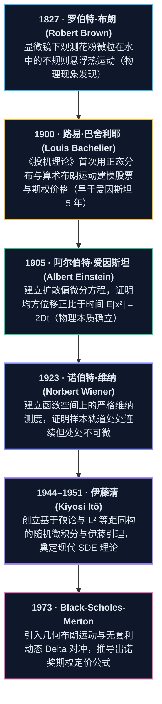
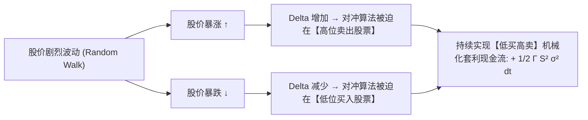
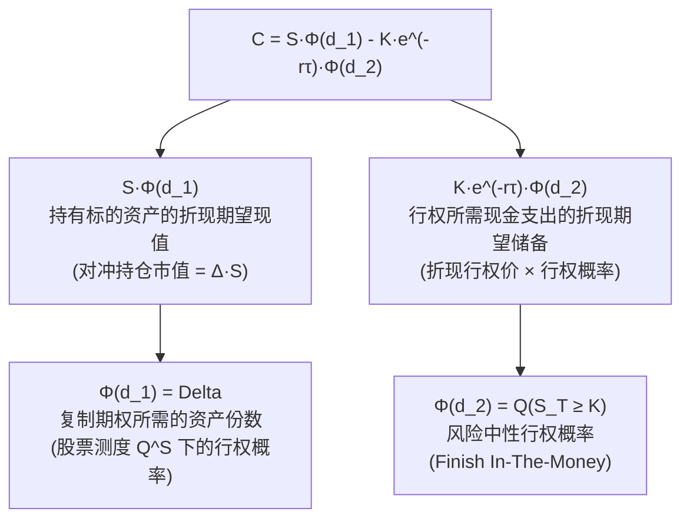

# Quant 12 · 布朗运动、伊藤微积分、停时与期权交易应用

这一讲将量化金融中最核心的连续时间随机分析体系系统化拆解：从一维与二维随机游走的极限（布朗运动与 Donsker 不变原理），到样本轨道几何特异性（无界全变差与有限二次变差），再到伊藤引理、伊藤几何与斯特拉托诺维奇积分的本质差异，进而探讨连续时间停时、指数鞅与反射原理，最终落地到几何布朗运动、Black-Scholes-Merton PDE、Delta 对冲中的 Gamma PnL 与波动率套利机制。

```text
看到这类连续时间与衍生品问题该想什么：
1. 样本轨道几何：布朗运动 W_t 处处连续但处处不可微，全变差为无穷大，二次变差 [W]_t = t。因此经典 Riemann-Stieltjes 积分失效，必须使用二阶 Taylor 展开展开到 (dW_t)^2 = dt 阶。
2. 2D 随机游走与布朗运动：由 Donsker 定理弱收敛而来。离散 2D 游走是常返的（Pólya 定理），连续 2D 布朗运动是单点瞬变（不撞具体单点）但邻域常返的（任意小开球必进无穷次），且具有复解析保角变换不变性（Lévy 定理）。
3. 伊藤积分 vs. 斯特拉托诺维奇积分：伊藤积分采用左端点求和（非预期/适应过程），保持鞅性质与 E[I_t]=0，符合金融无套利与因果律；Stratonovich 采用中点，保经典链式法则但带有未来漂移修正项 (1/2) dt。
4. 停时与反射原理：对首次撞击水平 a 的停时 \tau_a，利用强马尔可夫性与空间对称性，\tau_a 之后的路径翻折给出 P(M_t >= a) = 2 P(W_t >= a)，首达时间服从 Lévy 分布。
5. 期权对冲与波动率签名：Delta 对冲消除一阶方向风险 dW_t，剩余瞬时损益为 d\Pi = (1/2) S^2 \Gamma (\sigma_{realized}^2 - \sigma_{implied}^2) dt - r \Pi dt，做多 Gamma 本质上是做多已实现波动率超越隐含波动率的差额。
```

---

## 模块一：布朗运动基础与几何性质（Basics & Geometry of Brownian Motion）

### 1. 定义与公理化刻画

标准一维布朗运动（Brownian Motion，又称维纳过程 Wiener Process）$\{W_t\}_{t \ge 0}$ 是定义在概率空间 $(\Omega, \mathcal{F}, \mathbb{P})$ 上的连续时间随机过程，满足以下四条公理：

$$
\begin{aligned}
\text{(i) 起点确定：} &\ W_0 = 0 \text{ 几乎必然成立} \\
\text{(ii) 独立增量：} &\ \forall 0 \le t_0 < t_1 < \dots < t_n,\ \text{增量 } W_{t_1}-W_{t_0}, \dots, W_{t_n}-W_{t_{n-1}} \text{ 相互独立} \\
\text{(iii) 平稳高斯增量：} &\ \forall 0 \le s < t,\ W_t - W_s \sim \mathcal{N}(0, t - s) \\
\text{(iv) 轨道连续性：} &\ t \mapsto W_t(\omega) \text{ 对几乎所有样本点 } \omega \text{ 连续（a.s. continuous paths）}
\end{aligned}
$$

由上述公理可立即推出协方差结构：对于任意 $s, t \ge 0$（不妨设 $s \le t$）：

$$
\operatorname{Cov}(W_s, W_t) = \mathbb{E}[W_s W_t] = \mathbb{E}[W_s (W_s + (W_t - W_s))] = \mathbb{E}[W_s^2] + \mathbb{E}[W_s]\mathbb{E}[W_t - W_s] = s = \min(s, t)
$$

### 2. 样本轨道的几何特异性：处处不可微与二次变差

经典微积分建立在函数具有**有限全变差（Bounded Total Variation）**的基础之上。对于时间区间 $[0, T]$ 上的分割 $\Pi_n: 0 = t_0 < t_1 < \dots < t_n = T$，其最大网格步长 $|\Pi_n| = \max_i |t_i - t_{i-1}| \to 0$：

#### （1）一阶全变差（First-Order Total Variation）发散到无穷大

$$
\operatorname{TV}_T(W) = \lim_{|\Pi_n| \to 0} \sum_{i=1}^n |W_{t_i} - W_{t_{i-1}}| = \infty \quad \text{几乎必然成立}
$$

**直觉与证明要点**：设 $\Delta W_i = W_{t_i} - W_{t_{i-1}} \sim \sqrt{\Delta t_i} Z_i$（$Z_i \sim \mathcal{N}(0, 1)$）。则 $\mathbb{E}[|\Delta W_i|] = \sqrt{\Delta t_i} \mathbb{E}[|Z_i|] = \sqrt{\frac{2}{\pi}} \sqrt{\Delta t_i}$。若取等间距 $\Delta t = T/n$，求和期望为：

$$
\mathbb{E}\left[ \sum_{i=1}^n |\Delta W_i| \right] = n \cdot \sqrt{\frac{2}{\pi}} \sqrt{\frac{T}{n}} = \sqrt{\frac{2}{\pi}} \sqrt{T} \sqrt{n} \xrightarrow{n \to \infty} \infty
$$

#### （2）二次变差（Quadratic Variation）严格收敛到常数 $T$

$$
[W]_T = \lim_{|\Pi_n| \to 0} \sum_{i=1}^n (W_{t_i} - W_{t_{i-1}})^2 = T \quad \text{在 } L^2 \text{ 与概率意义下成立}
$$

**证明**：设 $Q_n = \sum_{i=1}^n (\Delta W_i)^2$。由于 $\Delta W_i^2 = \Delta t_i Z_i^2$，其期望为 $\mathbb{E}[Q_n] = \sum \Delta t_i \mathbb{E}[Z_i^2] = \sum \Delta t_i = T$。
方差为：

$$
\operatorname{Var}(Q_n) = \sum_{i=1}^n \operatorname{Var}((\Delta W_i)^2) = \sum_{i=1}^n (\Delta t_i)^2 \operatorname{Var}(Z_i^2) = 2 \sum_{i=1}^n (\Delta t_i)^2 \le 2 |\Pi_n| \sum_{i=1}^n \Delta t_i = 2 |\Pi_n| T \xrightarrow{|\Pi_n| \to 0} 0
$$

方差趋于 0 意味着 $Q_n \xrightarrow{L^2} T$。微元记号表示为：

$$
(dW_t)^2 = dt
$$

> **核心量化启示**：正因为 $(dW_t)^2 = dt$ 具有一阶时间量纲 $O(dt)$，在对包含随机项的函数进行 Taylor 展开时，二阶项 $(\Delta W)^2$ **无法像普通微积分那样被忽略**，这正是伊藤微积分中二阶导数修正项（伊藤漂移）的数学根源。

```brownian-motion-demo
```

### 3. 布朗运动的三大对称不变性

1. **尺度变换不变性（Brownian Scaling）**：$\forall c > 0$，过程 $X_t = \frac{1}{\sqrt{c}} W_{ct}$ 依然是标准布朗运动。
2. **时间反转不变性（Time Inversion）**：过程 $Y_t = t W_{1/t}$（规定 $Y_0 = 0$）依然是标准布朗运动。
3. **空间镜像对称性（Reflection Symmetry）**：过程 $Z_t = -W_t$ 依然是标准布朗运动。

### 4. 转移密度与偏微分方程（热传导与 Kolmogorov 方程）

从 $x$ 出发在时刻 $t$ 到达 $y$ 的转移概率密度为：

$$
p(t, x, y) = \frac{1}{\sqrt{2\pi t}} \exp\left( -\frac{(y-x)^2}{2t} \right)
$$

直接求偏导可得热传导方程（Heat Equation / Kolmogorov 倒向与前向方程）：

$$
\frac{\partial p}{\partial t} = \frac{1}{2} \frac{\partial^2 p}{\partial x^2} \quad (\text{倒向形式}) \qquad \frac{\partial p}{\partial t} = \frac{1}{2} \frac{\partial^2 p}{\partial y^2} \quad (\text{前向 Fokker-Planck 形式})
$$

---

## 模块二：二维随机游走与布朗运动（2D Random Walk & 2D Brownian Motion）

### 1. Donsker 不变原理（泛函中心极限定理）

设 $\xi_1, \xi_2, \dots$ 为二维平面格点 $\mathbb{Z}^2$ 上的独立同分布随机步长，向上下左右四个方向各以概率 $1/4$ 移动：$\mathbb{E}[\xi_i] = (0, 0)$，$\operatorname{Cov}(\xi_i) = \frac{1}{2} I_2$。
构造离散折线过程 $S_k = \sum_{i=1}^k \xi_i$。引入空间-时间缩放：

$$
B_N(t) = \frac{1}{\sqrt{N}} S_{\lfloor Nt \rfloor}
$$

**Donsker 不变原理**断言：当 $N \to \infty$ 时，随机折线 $B_N(\cdot)$ 在连续函数空间 $C([0, T], \mathbb{R}^2)$ 上弱收敛（依分布收敛）至标准二维布朗运动：

$$
B_N(t) \implies \left( \frac{1}{\sqrt{2}} B_t^{(1)}, \frac{1}{\sqrt{2}} B_t^{(2)} \right)
$$

其中 $B^{(1)}$ 与 $B^{(2)}$ 为两个独立的一维标准布朗运动。

```two-d-walk-demo
```

### 2. 常返与瞬变：Pólya 定理与二维布朗运动的精细拓扑

1921 年波利亚（Pólya）证明了经典随机游走的常返性结论（俗称"醉鬼总能找到回家的路，而醉鸟会迷失在空中"）：

| 空间维度 $d$ | 离散网格游走（$\mathbb{Z}^d$） | 连续布朗运动（$\mathbb{R}^d$） | 性质与概率 |
| :--- | :--- | :--- | :--- |
| **$d = 1$** | **常返（Recurrent）** | **常返** | 以概率 1 回到原点 0，期望返回时间 $\mathbb{E}[\tau] = \infty$（零常返） |
| **$d = 2$** | **常返（Recurrent）** | **邻域常返，单点瞬变** | 离散：$P(\text{回原点}) = 1$；连续：$P(\exists t > 0, B_t = 0) = 0$，但对任意 $\epsilon > 0$，$P(B_t \in B_\epsilon(x) \text{ i.o.}) = 1$ |
| **$d \ge 3$** | **瞬变（Transient）** | **瞬变** | 离散 $d=3$：$P(\text{回原点}) \approx 0.340537$；连续：$\lim_{t\to\infty} \|B_t\| = \infty$ a.s. |

> **关键拓扑洞察（为什么 2D 连续布朗运动不撞单点？）**：
> 在 $\mathbb{R}^2$ 中，单点集 $\{x\}$ 的对数对偶容量（Logarithmic Capacity）为 0，二维布朗运动的样本轨道维度为豪斯多夫维数 $d_H = 2$。空间维度恰好等于轨道维度时，点被撞到的概率为 0。但平面上的任何开圆盘 $B_\epsilon(x)$ 具有正容量，布朗运动会在无限时间里密集缠绕并无限次穿过该圆盘。

### 3. 保角变换不变性（Conformal Invariance & Lévy's Theorem）

Paul Lévy 发现二维布朗运动具有非常独特的几何对称性：**在复平面的解析映射下保持布朗运动性质不变**。

**Lévy 保角不变性定理**：设 $Z_t = B_t^{(1)} + i B_t^{(2)}$ 为复平面上的标准布朗运动，$f: U \to V$ 为非退化全纯函数（解析函数，满足 Cauchy-Riemann 方程 $f'(z) \ne 0$）。则变换后的复过程 $W_t = f(Z_t)$ 满足：

$$
W_t = \widetilde{Z}_{\tau_t}
$$

其中 $\widetilde{Z}$ 是另一个标准复布朗运动，而 $\tau_t = \int_0^t |f'(Z_s)|^2 ds$ 是一次确定性的局部时间伸缩（Clock Change）。
**应用**：利用保角映射将复杂的几何边界（如圆盘、上半平面、多边形）映射为简单区域，可以直接将偏微分方程的狄利克雷边界问题（Dirichlet Problem）转化为简单几何区域上的布朗运动首达退出时间问题。

---

## 模块三：伊藤微积分与伊藤几何（Itô Calculus & Itô Geometry 直觉核心）

### 1. 历史演进与思想脉络：从花粉微粒到现代华尔街

随机微积分不是数学家的纯抽象符号游戏，而是一场由物理世界的不规则运动驱动、最终重塑全球量化金融交易的革命：



1. **1827 年（Robert Brown）**：植物学家布朗观察悬浮花粉颗粒无休止的杂乱折线运动；
2. **1900 年（Louis Bachelier）**：博士论文《投机理论》（*Théorie de la Spéculation*）**早于爱因斯坦 5 年**以“公平赌博”假设导出资产价格高斯核，开创数理金融学；
3. **1905 年（Albert Einstein）与 1906 年（Marian Smoluchowski）**：从微观分子撞击导出宏观扩散方程 $\frac{\partial \rho}{\partial t} = D \nabla^2 \rho$，得出均方位移定律 $\mathbb{E}[(\Delta x)^2] = 2Dt$，并测定阿伏伽德罗常数；
4. **1923 年（Norbert Wiener）**：在连续路径空间 $C[0, \infty)$ 建立严格维纳测度，证明布朗运动轨道**处处连续但处处不可微（Continuous Everywhere, Nowhere Differentiable）**；
5. **1944–1951 年（伊藤清 Kiyosi Itô）**：破解经典微积分在随机样本轨道上的崩溃困境，以鞅论为基础创立随机微积分与伊藤引理，奠定现代随机微分方程（SDE）体系；
6. **1973 年（Black-Scholes-Merton）**：采用几何布朗运动（GBM）配合伊藤引理消除股票随机性，构建无风险 Delta 对冲，推导期权定价偏微分方程。

---

### 2. 为什么经典微积分会失效？三大核心物理与直觉图像

#### 直觉图像 1：为什么 $(dW_t)^2 = dt$ 会变成一个完全确定的常数？
> **掷硬币步长直觉**：
> 假设每 $\Delta t$ 秒抛一次硬币。为了让 1 秒后的总波动方差为 1，每次跳跃的步长不能是 $\pm \Delta t$（否则 $N = 1/\Delta t$ 步后的方差会趋近于 0），**步长必须是 $\pm \sqrt{\Delta t}$**！
> 
> 现在看一下单步位移的平方：
> $$(\pm \sqrt{\Delta t})^2 = +\Delta t$$
> **无论硬币抛出正面（$+1$）还是反面（$-1$），平方之后正负号彻底消失，随机性被彻底抹平！**
> 
> 把 1 秒内的所有微步平方累加起来：
> $$\sum_{i=1}^{1/\Delta t} (\Delta W_i)^2 = \left(\frac{1}{\Delta t}\right) \times \Delta t = 1 \text{ 秒}$$
> 
> **核心启示**：随机波动的平方，在极微观尺度下是一个**完全确定、毫无波动的常数时间流**！$(dW_t)^2 = dt$ 不是近似，而是大数定律下的必然常数！

---

#### 直觉图像 2：碗底抖动与二阶漂移（为什么会有 $\frac{1}{2} f''(x) dt$ 修正项？）
> **抛物线碗底直觉**：
> 想象你站在一个抛物线形的碗底 $f(x) = x^2$ 的中心 $x=0$ 处：
> - 此时有一股左右对称的随机推力，让你以 $50\%$ 概率向左移动 $1$ 米，以 $50\%$ 概率向右移动 $1$ 米；
> - **在水平方向上**：你的平均位移为 $\frac{+1 + (-1)}{2} = 0$（没有漂移）；
> - **但在垂直高度方向上**：向右走 $1$ 米高度上升 $(+1)^2 = 1$ 米；向左走 $1$ 米高度**同样上升 $(-1)^2 = 1$ 米**！
> - **结果**：虽然水平推力是公平纯噪声，但由于碗底是弯曲向上的（凸函数 $f''(x) > 0$），**每次左右随机抖动都必然将你的平均高度向上硬生生抬高 1 米！**
> 
> 这就是 **Jensen 不等式在连续时间中的实时动态体现**：
> $$\mathbb{E}[f(X + \Delta W)] - f(X) \approx \underbrace{f'(X)\mathbb{E}[\Delta W]}_{= 0} + \frac{1}{2} f''(X) \underbrace{\mathbb{E}[(\Delta W)^2]}_{= \Delta t} = \frac{1}{2} f''(X) \Delta t$$
> 
> - **碗越弯（$f''(x)$ 越大）**、**抖动越剧烈（$\sigma^2$ 越大）**，向上抬升的速度就越快！
> - 如果是拱形的**天花板（凹函数 $f''(x) < 0$）**，对称抖动就会把你平均高度往下拉！

---

#### 直觉图像 3：波动率拖拽损耗（Volatility Drag：$-\frac{1}{2}\sigma^2 dt$ 怎么吃掉你的收益？）
> **投资实战直觉**：
> 为什么资产真实几何收益率总比算术收益率低 $-\frac{1}{2}\sigma^2$？
> 
> 看一个极端投资案例：
> - 某杠杆基金第 1 天暴涨 $+50\%$（$100$ 元变成 $150$ 元）；
> - 第 2 天暴跌 $-50\%$（$150$ 元变成 $75$ 元）；
> - **算术平均收益率**：$\frac{+50\% - 50\%}{2} = 0\%$（看起来不赚不亏）；
> - **实际账户净值**：从 $100$ 元亏到了 $75$ 元，净亏损 $-25\%$！
> 
> 这凭空消失的 $-25\%$ 就是**离散波动率损耗（Volatility Drag）**！
> 在连续时间随机微积分中，对数收益函数 $f(S) = \ln S$ 是严格下凹的（$f''(S) = -1/S^2 < 0$）。在凹顶下承受布朗运动抖动，伊藤引理自然产生的几何下坠损耗恰好就是 **$-\frac{1}{2}\sigma^2 dt$**！

---

### 3. 伊藤引理（Itô's Lemma）速查乘法规则与极速心法

设资产价格满足伊藤扩散过程：$dX_t = \mu dt + \sigma dW_t$。

#### 伊藤乘法规则表（只有随机与随机相碰才能产生时间）

| $\times$ | $dt$ | $dW_t$ | 记忆直觉 |
| :---: | :---: | :---: | :--- |
| **$dt$** | $0$ | $0$ | 时间乘以时间是 $O(dt^2)$，极微小忽略 |
| **$dW_t$** | $0$ | **$dt$** | 两个 $\sqrt{dt}$ 相乘升阶为一阶时间 $dt$ |

#### 极速 3 步应用心法（面试 3 秒推导任何衍生品微元）：
1. **第 1 步（写出普通牛顿全微分）**：$\frac{\partial f}{\partial t} dt + \frac{\partial f}{\partial x} dX_t$；
2. **第 2 步（伊藤曲率踢一脚）**：补上二阶修正项 $+\frac{1}{2} \frac{\partial^2 f}{\partial x^2} (dX_t)^2$；
3. **第 3 步（代入 $(dX_t)^2 = \sigma^2 dt$ 并合并）**：

$$\boxed{df(t, X_t) = \left( \frac{\partial f}{\partial t} + \mu \frac{\partial f}{\partial x} + \frac{1}{2}\sigma^2 \frac{\partial^2 f}{\partial x^2} \right) dt + \sigma \frac{\partial f}{\partial x} dW_t}$$

---

### 4. 伊藤积分 vs. 斯特拉托诺维奇积分：为什么量化交易必须用伊藤？

```ito-geometry-demo
```

> **直觉解释（拒绝穿越时空的做市商）**：
> - **伊藤积分（$\alpha = 0$，左端点）**：
>   做市商在 09:30:00 挂单或者持仓 $H_{t}$，**只能根据 09:30:00 之前发生的历史行情做决策**。下一秒（09:30:01）股价是跳涨还是跳跌，是独立于过去的纯噪声。因此你在未来随机跳跃中获得的期望利润为 0：
>   $$\mathbb{E}[H_t \Delta W_t] = \mathbb{E}[H_t] \cdot \underbrace{\mathbb{E}[\Delta W_t]}_{=0} = 0 \implies \text{伊藤积分是真正的鞅（Martingale）}$$
> - **斯特拉托诺维奇积分（$\alpha = 1/2$，中点）**：
>   假设你持仓的基准价是 09:30:00 与 09:30:01 的**平均价格**。但这在现实交易中意味着你必须提前预知 09:30:01 的价格——**这相当于拥有时光机**！
> - **应用领域分工**：
>   - **金融量化、风险管理、对冲**：必须用**伊藤积分**（严格因果律，不能窥视未来）；
>   - **物理机器人、刚体旋转、微分流形几何**：通常用**斯特拉托诺维奇积分**（保持牛顿微积分链式法则和几何对称性）。

---

## 模块四：伊藤微积分在量化交易中的 3 大杀手级实战应用

### 1. 实战应用 1：几何布朗运动（GBM）闭式解秒杀

求解股价模型：$dS_t = \mu S_t dt + \sigma S_t dW_t$。
* **应用心法**：令 $f(S) = \ln S$。
  - $f'(S) = \frac{1}{S}$，二阶导数 $f''(S) = -\frac{1}{S^2}$；
  - 伊藤引理：
    $$d(\ln S_t) = \frac{1}{S_t} dS_t + \frac{1}{2} \left(-\frac{1}{S_t^2}\right) (dS_t)^2 = (\mu dt + \sigma dW_t) - \frac{1}{2}\sigma^2 dt = \left(\mu - \frac{1}{2}\sigma^2\right) dt + \sigma dW_t$$
* **两边积分得解析解**：
  $$\boxed{S_t = S_0 \exp\left( \left(\mu - \frac{1}{2}\sigma^2\right) t + \sigma W_t \right)}$$

---

### 2. 实战应用 2：期权 Long Gamma 自动高抛低吸机器（Volatility Harvesting）

在期权交易中，为什么持有看涨/看跌期权多头（Long Gamma，$\Gamma = \frac{\partial^2 V}{\partial S^2} > 0$）就能从标的剧烈波动中持续印钞？



* **对冲组合价值**：$\Pi = V(S) - \Delta S$；
* **瞬时损益（Taylor 展开）**：
  $$d\Pi = \underbrace{\left(\frac{\partial V}{\partial t}\right)}_{\Theta dt \text{ (时间损耗)}} dt + \underbrace{\left(\frac{\partial V}{\partial S} - \Delta\right)}_{=0 \text{ (Delta 中性)}} dS + \underbrace{\frac{1}{2} \frac{\partial^2 V}{\partial S^2} (dS)^2}_{\frac{1}{2}\Gamma S^2 \sigma^2 dt \text{ (Gamma 波动率现金流入)}}$$
* **直觉结论**：
  只要股价在晃动，Long Gamma 的自动化 Delta 对冲程序就会**被动地不断高卖低买**！每秒钟捕获的确定性现金流入正好等于 $\frac{1}{2} \Gamma S^2 \sigma^2 dt$！

---

### 3. 实战应用 3：伊藤等距（Itô Isometry）——如何快速算随机收益方差？

在期权对冲和投资组合方差计算中，不需要复杂的双重积分，直接应用**伊藤等距公式**：

$$\boxed{\operatorname{Var}\left( \int_0^T H_t dW_t \right) = \mathbb{E}\left[ \left( \int_0^T H_t dW_t \right)^2 \right] = \int_0^T \mathbb{E}[H_t^2] dt}$$

> **面试一句话直觉**：
> 随机积分的平方期望，等于**普通确定性积分中被积函数平方的积分**！随机微分项 $dW_t$ 在方差计算中直接等价替换为普通的 $dt$！


---


---

## 模块五：布朗运动的停时与极值理论（Stopping Times & Extreme Values）

### 1. 指数鞅与 Wald 恒等式

对于任意实常数 $\theta \in \mathbb{R}$，定义 **Doléans-Dade 指数鞅**：

$$
M_t^\theta = \exp\left( \theta W_t - \frac{1}{2} \theta^2 t \right)
$$

应用伊藤引理：$dM_t^\theta = \theta M_t^\theta dW_t$，由于无 $dt$ 漂移项且满足 Novikov 条件，故 $M_t^\theta$ 是一个真正的鞅。

**最优停时定理（OST）应用**：设 $\tau$ 为满足 OST 条件的停时，则：

$$
\mathbb{E}\left[ \exp\left( \theta W_\tau - \frac{1}{2} \theta^2 \tau \right) \right] = \mathbb{E}[M_0^\theta] = 1 \quad (\text{Wald 鞅恒等式})
$$

### 2. 首达时间（First Hitting Time）与双吸收边界

考虑常数边界 $a > 0, b > 0$，定义停时 $\tau = \inf\{t \ge 0 : W_t = a \text{ 或 } W_t = -b\}$：
1. **到达边界的概率**：对鞅 $W_t$ 用 OST 得 $\mathbb{E}[W_\tau] = 0 \implies a P(W_\tau = a) - b (1 - P(W_\tau = a)) = 0$，解得：

$$
P(\text{先到达 } a) = \frac{b}{a + b}
$$

2. **期望退出时间**：对鞅 $W_t^2 - t$ 用 OST 得 $\mathbb{E}[W_\tau^2 - \tau] = 0 \implies \mathbb{E}[\tau] = \mathbb{E}[W_\tau^2]$：

$$
\mathbb{E}[\tau] = a^2 \cdot \frac{b}{a+b} + (-b)^2 \cdot \frac{a}{a+b} = \frac{a^2 b + a b^2}{a+b} = a b
$$

### 3. 反射原理（The Reflection Principle）与运行极值分布

设 $M_t = \max_{0 \le s \le t} W_s$ 为时间 $t$ 内的运行最大值（Running Maximum），$a > 0$ 为给定阈值，$\tau_a = \inf\{s \ge 0 : W_s = a\}$ 为首次触达时间。

```reflection-principle-demo
```

**几何反射论证（Geometric Reflection Argument）**：
事件 $\{M_t \ge a\}$ 等价于 $\{\tau_a \le t\}$。
在时刻 $\tau_a$，轨道到达水平 $a$。根据布朗运动的**强马尔可夫性（Strong Markov Property）**，残余过程 $\widetilde{W}_s = W_{\tau_a + s} - a$（$s \ge 0$）是一条独立的标准布朗运动。
由空间镜像对称性，在时刻 $t$，该残余路径位于水平 $a$ 之上或之下的概率严格对称相等：

$$
\mathbb{P}(W_t \ge a \mid \tau_a \le t) = \mathbb{P}(W_t \le a \mid \tau_a \le t) = \frac{1}{2}
$$

由此得到著名的 **反射原理公式**：

$$
\mathbb{P}(M_t \ge a) = \mathbb{P}(\tau_a \le t) = 2 \mathbb{P}(W_t \ge a) = 2 \left( 1 - \Phi\left( \frac{a}{\sqrt{t}} \right) \right)
$$

对 $t$ 求导，得到首次到达水平 $a$ 的时间密度函数（**Lévy 分布**）：

$$
f_{\tau_a}(t) = \frac{d}{dt} \mathbb{P}(\tau_a \le t) = \frac{a}{\sqrt{2\pi t^3}} \exp\left( -\frac{a^2}{2t} \right) \quad (t > 0)
$$

---

## 模块六：Black-Scholes 模型、解析推导与期权量化交易（Black-Scholes Model & Trading Applications）

### 6.1 标的资产动力学：几何布朗运动（Geometric Brownian Motion）

在 Black-Scholes 框架下，标的资产（股票、指数、商品）的价格过程 $\{S_t\}_{t \ge 0}$ 服从几何布朗运动（GBM）随机微分方程：

$$
\frac{dS_t}{S_t} = \mu dt + \sigma dW_t \iff dS_t = \mu S_t dt + \sigma S_t dW_t
$$

其中 $\mu \in \mathbb{R}$ 为资产的预期收益率（漂移项），$\sigma > 0$ 为资产波动率（扩散项），$W_t$ 为标准布朗运动。

**求解对数正态解析解**：
对复合函数 $f(S) = \ln S$ 应用伊藤引理（一阶导 $f' = 1/S$，二阶导 $f'' = -1/S^2$）：

$$
d(\ln S_t) = \frac{1}{S_t} dS_t + \frac{1}{2} \left( -\frac{1}{S_t^2} \right) (dS_t)^2 = \left( \mu dt + \sigma dW_t \right) - \frac{1}{2 S_t^2} \left( \sigma^2 S_t^2 dt \right) = \left( \mu - \frac{1}{2}\sigma^2 \right) dt + \sigma dW_t
$$

两边在时间区间 $[0, t]$ 上直接积分：

$$
\ln\left( \frac{S_t}{S_0} \right) = \left( \mu - \frac{1}{2}\sigma^2 \right) t + \sigma W_t \implies \boxed{S_t = S_0 \exp\left( \left( \mu - \frac{1}{2}\sigma^2 \right) t + \sigma W_t \right)}
$$

由此可见，$\ln(S_t / S_0) \sim \mathcal{N}\left( (\mu - \frac{1}{2}\sigma^2)t, \sigma^2 t \right)$ 服从正态分布，因而 $S_t$ 服从**对数正态分布（Log-Normal Distribution）**。利用对数正态分布的矩母函数可得：

$$
\mathbb{E}[S_t] = S_0 e^{\mu t}, \qquad \operatorname{Var}(S_t) = S_0^2 e^{2\mu t} \left( e^{\sigma^2 t} - 1 \right)
$$

---

### 6.2 Black-Scholes-Merton 模型的基石假设

1. **标的动力学**：资产价格服从恒定漂移 $\mu$ 和恒定波动率 $\sigma$ 的几何布朗运动；
2. **无摩擦市场**：无交易税费、无买卖价差（Bid-Ask Spread = 0），支持任意小数份额交易；
3. **允许完全做空**：允许不受限制地以无风险利率借入资金与融券做空资产；
4. **恒定无风险利率**：资金借入与贷出利率恒为常数 $r > 0$；
5. **无套利机会（No Arbitrage）**：市场上不存在免费午餐，任何复制组合价格必须等于目标衍生品价格；
6. **欧式衍生品**：期权仅在到期日 $T$ 行权，标的资产在存续期内不支付离散红利（可拓展至连续股息率 $q$）。

---

### 6.3 Black-Scholes 偏微分方程（BSM PDE）的双向推导

设欧式衍生品在时刻 $t$、标的价格为 $S$ 时的理论价格为 $V(t, S)$，到期日为 $T$，到期支付函数为 $\Phi(S_T)$（如看涨期权为 $\max(S_T - K, 0)$）。

#### 推导方法一：无套利 Delta 动态对冲复制法（Black-Scholes-Merton 原始推导）

构造投资组合 $\Pi_t$：**做多 1 单位期权 $V(t, S_t)$，同时做空 $\Delta_t$ 单位标的资产 $S_t$**：

$$
\Pi_t = V(t, S_t) - \Delta_t S_t
$$

在极短时间微元 $dt$ 内，投资组合的价值增量为：

$$
d\Pi_t = dV(t, S_t) - \Delta_t dS_t
$$

根据伊藤引理，将衍生品价值 $V(t, S_t)$ 展开至 $dt$ 阶：

$$
dV = \left( \frac{\partial V}{\partial t} + \mu S \frac{\partial V}{\partial S} + \frac{1}{2} \sigma^2 S^2 \frac{\partial^2 V}{\partial S^2} \right) dt + \sigma S \frac{\partial V}{\partial S} dW_t
$$

将 $dV$ 与 $dS_t = \mu S dt + \sigma S dW_t$ 代入 $d\Pi_t$ 并整理同类项：

$$
d\Pi_t = \left( \frac{\partial V}{\partial t} + \mu S \frac{\partial V}{\partial S} + \frac{1}{2}\sigma^2 S^2 \frac{\partial^2 V}{\partial S^2} - \Delta_t \mu S \right) dt + \sigma S \left( \frac{\partial V}{\partial S} - \Delta_t \right) dW_t
$$

为了使投资组合彻底摆脱随机波动 $dW_t$ 的干扰（即消除所有市场方向性风险），令随机项系数为 0，选择 **Delta 对冲仓位**：

$$
\Delta_t = \frac{\partial V}{\partial S}
$$

代入后，$dW_t$ 项完全消失，$d\Pi_t$ 变成确定性微分方程：

$$
d\Pi_t = \left( \frac{\partial V}{\partial t} + \frac{1}{2}\sigma^2 S^2 \frac{\partial^2 V}{\partial S^2} \right) dt
$$

根据无套利定理，一个完全无风险的资产组合，其瞬时收益率必须严格等于无风险利率 $r$，即 $d\Pi_t = r \Pi_t dt = r (V - \Delta_t S) dt$。联立两式：

$$
\frac{\partial V}{\partial t} + \frac{1}{2}\sigma^2 S^2 \frac{\partial^2 V}{\partial S^2} = r \left( V - S \frac{\partial V}{\partial S} \right)
$$

移项整理即得著名的 **Black-Scholes-Merton 偏微分方程**：

$$
\boxed{\frac{\partial V}{\partial t} + r S \frac{\partial V}{\partial S} + \frac{1}{2}\sigma^2 S^2 \frac{\partial^2 V}{\partial S^2} = r V}
$$

> **关键见解**：BSM PDE 中**完全不包含标的资产的主观真实收益率 $\mu$**！期权的价格仅取决于波动率 $\sigma$、无风险利率 $r$、当前股价 $S$、行权价 $K$ 与剩余时间 $T-t$，与投资者对未来市场涨跌的乐观或悲观预期完全无关。

---

#### 推导方法二：风险中性测度与 Feynman-Kac 鞅定价法

根据 Girsanov 测度变换定理，定义市场风险溢价 $\theta = \frac{\mu - r}{\sigma}$。存在等价鞅测度 $\mathbb{Q}$（风险中性测度），在此测度下漂移项由 $\mu$ 转变为无风险利率 $r$：

$$
dS_t = r S_t dt + \sigma S_t d\widetilde{W}_t \quad (\widetilde{W}_t \text{ 为 } \mathbb{Q} \text{ 下标准布朗运动})
$$

折现资产价格 $e^{-rt}S_t$ 是 $\mathbb{Q}$ 下的鞅。无套利衍生品定价理论断言：衍生品的公允价值等于其在风险中性测度下未来支付的**折现条件期望**：

$$
V(t, S_t) = e^{-r(T-t)} \mathbb{E}^\mathbb{Q} \left[ \Phi(S_T) \;\middle|\; \mathcal{F}_t \right]
$$

根据 **Feynman-Kac 定理**，上述条件期望正是 BSM 偏微分方程满足终端条件 $V(T, S) = \Phi(S)$ 时的唯一柯西解。

---

### 6.4 欧式看涨与看跌期权闭式解的严格解析积分推导

考虑欧式看涨期权（European Call），到期支付为 $\Phi(S_T) = \max(S_T - K, 0)$。记剩余存续时间 $\tau = T - t$。
在风险中性测度 $\mathbb{Q}$ 下，$S_T$ 可精确写为：

$$
S_T = S_t \exp\left( \left( r - \frac{1}{2}\sigma^2 \right)\tau + \sigma\sqrt{\tau} Z \right), \quad Z \sim \mathcal{N}(0, 1)
$$

期权价格为：

$$
C(S_t, t) = e^{-r\tau} \mathbb{E}^\mathbb{Q} \left[ \max(S_T - K, 0) \right] = e^{-r\tau} \int_{-\infty}^\infty \max\left( S_t e^{(r - \frac{1}{2}\sigma^2)\tau + \sigma\sqrt{\tau} z} - K, 0 \right) \frac{1}{\sqrt{2\pi}} e^{-z^2/2} dz
$$

#### 步骤 1：确定实值行权分界点（Integration Lower Bound）
期权在到期时产生正收益（$S_T > K$）当且仅当：

$$
S_t \exp\left( \left( r - \frac{1}{2}\sigma^2 \right)\tau + \sigma\sqrt{\tau} z \right) > K \iff \sigma\sqrt{\tau} z > \ln\left( \frac{K}{S_t} \right) - \left( r - \frac{1}{2}\sigma^2 \right)\tau
$$

两边除以 $\sigma\sqrt{\tau}$ 并利用 $\ln(K/S_t) = -\ln(S_t/K)$：

$$
z > -\frac{\ln(S_t/K) + (r - \frac{1}{2}\sigma^2)\tau}{\sigma\sqrt{\tau}} \triangleq -d_2
$$

其中定义：

$$
\boxed{d_2 = \frac{\ln(S_t/K) + (r - \frac{1}{2}\sigma^2)\tau}{\sigma\sqrt{\tau}}}
$$

#### 步骤 2：拆解积分项为资产项 $I_1$ 与现金项 $I_2$

$$
C(S_t, t) = e^{-r\tau} \int_{-d_2}^\infty \left( S_t e^{(r - \frac{1}{2}\sigma^2)\tau + \sigma\sqrt{\tau} z} - K \right) \frac{1}{\sqrt{2\pi}} e^{-z^2/2} dz = I_1 - I_2
$$

#### 步骤 3：求解现金项 $I_2$

$$
I_2 = e^{-r\tau} K \int_{-d_2}^\infty \frac{1}{\sqrt{2\pi}} e^{-z^2/2} dz = K e^{-r\tau} P(Z \ge -d_2) = K e^{-r\tau} P(Z \le d_2) = K e^{-r\tau} \Phi(d_2)
$$

其中 $\Phi(x) = \int_{-\infty}^x \frac{1}{\sqrt{2\pi}} e^{-u^2/2} du$ 是标准正态分布的累积分布函数（CDF）。

#### 步骤 4：求解资产项 $I_1$（核心配方法）

$$
I_1 = e^{-r\tau} S_t e^{r\tau - \frac{1}{2}\sigma^2\tau} \int_{-d_2}^\infty \frac{1}{\sqrt{2\pi}} e^{\sigma\sqrt{\tau} z - \frac{z^2}{2}} dz = S_t e^{-\frac{1}{2}\sigma^2\tau} \int_{-d_2}^\infty \frac{1}{\sqrt{2\pi}} \exp\left( -\frac{z^2 - 2\sigma\sqrt{\tau}z}{2} \right) dz
$$

对指数中的二次多项式进行**完全平方配方**：

$$
z^2 - 2\sigma\sqrt{\tau}z = (z - \sigma\sqrt{\tau})^2 - \sigma^2\tau
$$

代入指数：

$$
\exp\left( -\frac{(z - \sigma\sqrt{\tau})^2 - \sigma^2\tau}{2} \right) = \exp\left( \frac{1}{2}\sigma^2\tau \right) \cdot \exp\left( -\frac{(z - \sigma\sqrt{\tau})^2}{2} \right)
$$

注意项外系数 $e^{-\frac{1}{2}\sigma^2\tau}$ 与配方产生的 $e^{\frac{1}{2}\sigma^2\tau}$ **精确抵消为 1**！

$$
I_1 = S_t \int_{-d_2}^\infty \frac{1}{\sqrt{2\pi}} \exp\left( -\frac{(z - \sigma\sqrt{\tau})^2}{2} \right) dz
$$

做变量代换：令 $u = z - \sigma\sqrt{\tau}$，则 $dz = du$。积分下限变为 $-d_2 - \sigma\sqrt{\tau} \triangleq -d_1$：

$$
d_1 = d_2 + \sigma\sqrt{\tau} = \frac{\ln(S_t/K) + (r + \frac{1}{2}\sigma^2)\tau}{\sigma\sqrt{\tau}}
$$

代入积分：

$$
I_1 = S_t \int_{-d_1}^\infty \frac{1}{\sqrt{2\pi}} e^{-u^2/2} du = S_t P(U \ge -d_1) = S_t \Phi(d_1)
$$

#### 步骤 5：最终经典定价公式

将 $I_1$ 与 $I_2$ 组合，得到欧式看涨期权（Call）的 **Black-Scholes 闭式解**：

$$
\boxed{C(S, t) = S \Phi(d_1) - K e^{-r(T-t)} \Phi(d_2)}
$$

根据看跌-看涨平价（Put-Call Parity）$P = C - S + K e^{-r\tau}$，利用 $1 - \Phi(x) = \Phi(-x)$：

$$
\boxed{P(S, t) = K e^{-r(T-t)} \Phi(-d_2) - S \Phi(-d_1)}
$$

其中：

$$
\boxed{d_1 = \frac{\ln(S/K) + (r + \frac{1}{2}\sigma^2)(T-t)}{\sigma\sqrt{T-t}}, \qquad d_2 = d_1 - \sigma\sqrt{T-t} = \frac{\ln(S/K) + (r - \frac{1}{2}\sigma^2)(T-t)}{\sigma\sqrt{T-t}}}
$$

---

### 6.5 $d_1$ 与 $d_2$ 的概率与金融物理学意义

在量化交易面试中，面试官最喜欢追问："请用直觉解释 $d_1$ 与 $d_2$ 以及 $\Phi(d_1)$ 和 $\Phi(d_2)$ 的物理本质是什么？"



1. **$\Phi(d_2) = \mathbb{Q}(S_T \ge K)$ —— 风险中性测度下的行权概率**：
   $\Phi(d_2)$ 是在风险中性世界中，标的资产价格在到期日 $T$ 落在行权价 $K$ 之上（期权处于实值 ITM 状态）的**精确概率**。因此，$K e^{-r\tau} \Phi(d_2)$ 代表期权空头在时刻 $t$ 为了在到期日履行交割义务所需准备的**纯现金折现储备**。
2. **$\Phi(d_1) = \Delta = \frac{\partial C}{\partial S}$ —— 复制期权所需的现货对冲头寸（Delta）**：
   $\Phi(d_1)$ 正是 Black-Scholes 复制组合中必须持有的股票股数。同时在测度变换视角下，若以标的股票自身作为计价资产（Numeraire）定义股票测度 $\mathbb{Q}^S$（Share Measure），$\Phi(d_1) = \mathbb{Q}^S(S_T \ge K)$ 正是股票测度下的行权概率。
3. **关键恒等式（The Core Derivative Identity）**：

$$
\boxed{S \phi(d_1) = K e^{-r\tau} \phi(d_2)}
$$

**证明**：
$$
\frac{\phi(d_1)}{\phi(d_2)} = \frac{e^{-d_1^2/2}}{e^{-d_2^2/2}} = \exp\left( -\frac{d_1^2 - d_2^2}{2} \right) = \exp\left( -\frac{(d_1 - d_2)(d_1 + d_2)}{2} \right)
$$
由于 $d_1 - d_2 = \sigma\sqrt{\tau}$，且 $d_1 + d_2 = \frac{2\ln(S/K) + 2r\tau}{\sigma\sqrt{\tau}}$：
$$
\frac{d_1^2 - d_2^2}{2} = \frac{\sigma\sqrt{\tau}}{2} \cdot \frac{2\ln(S/K) + 2r\tau}{\sigma\sqrt{\tau}} = \ln\left( \frac{S}{K} \right) + r\tau
$$
代入指数：
$$
\exp\left( -\left(\ln\left(\frac{S}{K}\right) + r\tau\right) \right) = \frac{K}{S} e^{-r\tau} \implies S \phi(d_1) = K e^{-r\tau} \phi(d_2)
$$
这个恒等式是求导所有期权希腊字母（Greeks）时交叉项自动相消的数学核心！

---

### 6.6 看跌-看涨平价（Put-Call Parity）

对于相同标的、相同到期日 $T$ 和相同行权价 $K$ 的欧式期权：

$$
\boxed{C_t - P_t = S_t - K e^{-r(T-t)}}
$$

**双向验证**：
1. **组合复制证明**：在到期日 $T$，组合 $C_T - P_T = \max(S_T - K, 0) - \max(K - S_T, 0) = S_T - K$。该支付与"持有 1 股股票并借入现金 $K$"在 $T$ 时刻的价值完全等价。由无套利定价原理，两组合在时刻 $t$ 的价值必须处处相等：$C_t - P_t = S_t - K e^{-r\tau}$。
2. **BSM 公式代数验证**：
$$
C - P = \left( S\Phi(d_1) - Ke^{-r\tau}\Phi(d_2) \right) - \left( Ke^{-r\tau}\Phi(-d_2) - S\Phi(-d_1) \right)
$$
$$
= S(\Phi(d_1) + \Phi(-d_1)) - Ke^{-r\tau}(\Phi(d_2) + \Phi(-d_2)) = S(1) - Ke^{-r\tau}(1) = S - Ke^{-r\tau}
$$

---

### 6.7 BSM 希腊字母（The Greeks）完整解析速查

| 希腊字母 | 经济含义 | 看涨期权 Call 公式 | 看跌期权 Put 公式 | 符号与性质 |
| :--- | :--- | :--- | :--- | :--- |
| **Delta ($\Delta$)** | 标的价格敏感度 $\frac{\partial V}{\partial S}$ | $\Phi(d_1)$ | $\Phi(d_1) - 1 = -\Phi(-d_1)$ | Call $\in (0, 1)$，Put $\in (-1, 0)$ |
| **Gamma ($\Gamma$)** | 曲线凸性 $\frac{\partial^2 V}{\partial S^2}$ | $\frac{\phi(d_1)}{S \sigma \sqrt{\tau}}$ | $\frac{\phi(d_1)}{S \sigma \sqrt{\tau}}$ | Call 与 Put 恒正且严格相等 ($\Gamma > 0$) |
| **Vega ($\mathcal{V}$)** | 波动率敏感度 $\frac{\partial V}{\partial \sigma}$ | $S \sqrt{\tau} \phi(d_1)$ | $S \sqrt{\tau} \phi(d_1)$ | Call 与 Put 恒正且严格相等 ($\mathcal{V} > 0$) |
| **Theta ($\Theta$)** | 时间价值衰减 $\frac{\partial V}{\partial t}$ | $-\frac{S\phi(d_1)\sigma}{2\sqrt{\tau}} - r K e^{-r\tau}\Phi(d_2)$ | $-\frac{S\phi(d_1)\sigma}{2\sqrt{\tau}} + r K e^{-r\tau}\Phi(-d_2)$ | 多头期权通常 $\Theta < 0$（时间流逝损耗价值） |
| **Rho ($\rho$)** | 利率敏感度 $\frac{\partial V}{\partial r}$ | $K \tau e^{-r\tau} \Phi(d_2)$ | $-K \tau e^{-r\tau} \Phi(-d_2)$ | Call $\rho > 0$，Put $\rho < 0$ |

**Gamma-Theta 平衡关系**：
将希腊字母代回 BSM PDE，即得期权做市商的盈亏守恒定律：

$$
\boxed{\Theta + \frac{1}{2}\sigma^2 S^2 \Gamma = r(V - S\Delta)}
$$

---

### 6.8 动态 Delta 对冲损益（Gamma PnL）与波动率套利

在实际交易中，期权按**隐含波动率（Implied Volatility $\sigma_I$）**定价，而标的资产按**真实已实现波动率（Realized Volatility $\sigma_R$）**波动：

$$
dS_t = \mu S_t dt + \sigma_R S_t dW_t
$$

做市商以理论模型 Delta 进行连续对冲，其对冲投资组合的真实微元损益为：

$$
d\Pi_t = dV_t - \Delta_t dS_t - r(V_t - \Delta_t S_t) dt
$$

将 $dV_t$ 按真实路径展开（包含 $\sigma_R^2$），同时利用定价方程中的 $\Theta + r S \Delta + \frac{1}{2}\sigma_I^2 S^2 \Gamma = r V$，相消后得到极其优雅的 **波动率套利主方程**：

$$
\boxed{d\Pi_t = \frac{1}{2} S_t^2 \Gamma_t \left( \sigma_R^2 - \sigma_I^2 \right) dt}
$$

```delta-hedging-demo
```

> **量化做市与波动率交易核心要诀**：
> 1. **多 Gamma（Long Gamma, $\Gamma > 0$）**：若实际波动率高于买入时的隐含波动率（$\sigma_R > \sigma_I$），动态再平衡带来的低买高卖收益将大于时间价值衰减（Theta Decay），组合获得正 alpha。
> 2. **空 Gamma（Short Gamma, $\Gamma < 0$）**：做空期权收取权利金，在平稳低波动市场（$\sigma_R < \sigma_I$）中赚取时间价值，但面临极端跳跃与波动率暴增的肥尾巨亏风险。

---

## 模块七：深度量化面试真题、参数推广与阶梯进阶题库（Deep Problems & Scaffolded Tutorials）

### 第一部分：三大高频核心真题与参数化推广（The 3 Core Quant Problems & Generalizations）

---

#### 真题 1：时间积分与随机积分的相关系数（Correlation of Brownian Time & Stochastic Integrals）

> **原题描述（SIG / Akuna / Citadel 高频笔试题）**：
> 
> 设 $W_t$ 为标准一维布朗运动（$W_0 = 0$），在时间区间 $[0, T]$ 上定义两个随机变量：
> 
> $$
> X = \int_0^T W_t dt, \qquad Y = \int_0^T t dW_t
> $$
> 
> 试求 $X$ 与 $Y$ 的相关系数 $\operatorname{Corr}(X, Y)$。

**严格推导与求解**：

**步骤 1：随机分部积分（Integration by Parts）**
对复合过程 $f(t, W_t) = t W_t$ 应用伊藤引理：

$$
d(t W_t) = t dW_t + W_t dt + (dt)(dW_t) = t dW_t + W_t dt
$$

在区间 $[0, T]$ 上积分：

$$
T W_T - 0 = \int_0^T t dW_t + \int_0^T W_t dt \implies T W_T = X + Y \implies X = T W_T - Y
$$

也可以利用 $W_t = \int_0^t dW_s$ 将 $X$ 转化为纯伊藤积分（Fubini 交换积分次序）：

$$
X = \int_0^T \left( \int_0^t dW_s \right) dt = \int_0^T \left( \int_s^T dt \right) dW_s = \int_0^T (T - t) dW_t
$$

由此可见，$X$ 与 $Y$ 都是确定性函数关于标准布朗运动的伊藤积分，因此 $X$ 与 $Y$ 联合服从**二元正态分布**，且期望均为 0：$\mathbb{E}[X] = \mathbb{E}[Y] = 0$。

**步骤 2：计算方差与协方差（应用伊藤等距）**
1. **$X$ 的方差**：
   $$\operatorname{Var}(X) = \mathbb{E}\left[ \left( \int_0^T (T - t) dW_t \right)^2 \right] = \int_0^T (T - t)^2 dt = \left[ -\frac{(T - t)^3}{3} \right]_0^T = \frac{T^3}{3}$$
2. **$Y$ 的方差**：
   $$\operatorname{Var}(Y) = \mathbb{E}\left[ \left( \int_0^T t dW_t \right)^2 \right] = \int_0^T t^2 dt = \left[ \frac{t^3}{3} \right]_0^T = \frac{T^3}{3}$$
3. **$X$ 与 $Y$ 的协方差**：
   利用极化恒等式或直接伊藤等距：
   $$\operatorname{Cov}(X, Y) = \mathbb{E}[X Y] = \mathbb{E}\left[ \left( \int_0^T (T - t) dW_t \right) \left( \int_0^T t dW_t \right) \right] = \int_0^T (T - t) t dt = \int_0^T (T t - t^2) dt = \frac{T^3}{2} - \frac{T^3}{3} = \frac{T^3}{6}$$

**步骤 3：计算相关系数**

$$
\operatorname{Corr}(X, Y) = \frac{\operatorname{Cov}(X, Y)}{\sqrt{\operatorname{Var}(X) \operatorname{Var}(Y)}} = \frac{\frac{T^3}{6}}{\sqrt{\frac{T^3}{3} \cdot \frac{T^3}{3}}} = \frac{\frac{T^3}{6}}{\frac{T^3}{3}} = \boxed{\frac{1}{2}}
$$

**几何直觉验算**：
因为 $X + Y = T W_T$，其总方差为 $\operatorname{Var}(T W_T) = T^2 \operatorname{Var}(W_T) = T^3$。
展开求和方差：$\operatorname{Var}(X + Y) = \operatorname{Var}(X) + \operatorname{Var}(Y) + 2\operatorname{Cov}(X, Y) = \frac{T^3}{3} + \frac{T^3}{3} + 2\left(\frac{T^3}{6}\right) = T^3$。各分量完全自洽！

---

#### 真题 2：二维布朗运动首达边界分布——推广至任意起点 $(x_0, y_0)$（2D Brownian Motion Hitting Distribution）

> **原题描述（Jane Street / Two Sigma 压轴题）**：
> 
> 在二维平面上，标准二维布朗运动 $(X_t, Y_t)$ 从右半平面的任意点 $(x_0, y_0)$ 出发（其中 $x_0 > 0, y_0 \in \mathbb{R}$）。
> 当过程**首次触碰纵轴（$y$ 轴）**时停止，停时定义为 $\tau = \inf\{t > 0 : X_t = 0\}$。
> 1. 求停止位置 $(0, Y_\tau)$ 落在 **$y$ 轴正半轴（$Y_\tau > 0$）** 的概率 $\mathbb{P}(Y_\tau > 0)$；
> 2. 求停止点纵坐标 $Y_\tau$ 的完整概率密度函数 $f_{Y_\tau}(u)$；
> 3. 特殊情形验证：求起点为 $(1, 1)$ 时的具体数值。

**严格推导与双重视角求解**：

**视角一：独立分量卷积与尺度混合（Lévy-Cauchy Mixture）**
1. **首达时间 $\tau$ 的分布**：
   由于 $X_t$ 与 $Y_t$ 独立，$\tau$ 完全由水平一维布朗运动 $X_t$（从 $x_0$ 走到 0）决定。由反射原理，$\tau$ 服从 **Lévy 分布**：
   $$f_\tau(t) = \frac{x_0}{\sqrt{2\pi t^3}} \exp\left( -\frac{x_0^2}{2t} \right) \quad (t > 0)$$
2. **给定 $\tau=t$ 时垂直分量 $Y_\tau$ 的条件分布**：
   由于 $Y_t$ 与 $X_t$ 独立，$Y_\tau \mid (\tau = t) \sim \mathcal{N}(y_0, t)$。
3. **计算 $Y_\tau$ 的边缘密度函数**（对 $t$ 全概率积分）：
   $$f_{Y_\tau}(u) = \int_0^\infty \frac{1}{\sqrt{2\pi t}} \exp\left( -\frac{(u - y_0)^2}{2t} \right) \cdot \frac{x_0}{\sqrt{2\pi t^3}} \exp\left( -\frac{x_0^2}{2t} \right) dt = \frac{x_0}{2\pi} \int_0^\infty \frac{1}{t^2} \exp\left( -\frac{x_0^2 + (u - y_0)^2}{2t} \right) dt$$
   令 $v = \frac{x_0^2 + (u - y_0)^2}{2t}$，则 $dt = -\frac{x_0^2 + (u - y_0)^2}{2 v^2} dv$：
   $$f_{Y_\tau}(u) = \frac{x_0}{2\pi} \cdot \frac{2}{x_0^2 + (u - y_0)^2} \int_0^\infty e^{-v} dv = \boxed{\frac{1}{\pi} \frac{x_0}{x_0^2 + (u - y_0)^2}}$$
   这正是位置参数为 $y_0$、尺度参数为 $x_0$ 的 **柯西分布（Cauchy Distribution）** $\text{Cauchy}(y_0, x_0)$！
4. **计算落在正半轴的概率**：
   $$\mathbb{P}(Y_\tau > 0) = \int_0^\infty \frac{x_0}{\pi (x_0^2 + (u - y_0)^2)} du = \left[ \frac{1}{\pi} \arctan\left( \frac{u - y_0}{x_0} \right) \right]_0^\infty = \frac{1}{\pi} \left( \frac{\pi}{2} - \arctan\left( -\frac{y_0}{x_0} \right) \right) = \boxed{\frac{1}{2} + \frac{1}{\pi} \arctan\left( \frac{y_0}{x_0} \right)}$$

**视角二：调和函数与共形几何（Harmonic Measure & Polar Angle）**
- 设 $u(x, y) = \mathbb{P}_{(x, y)}(Y_\tau > 0)$。由布朗运动强马氏性，函数 $u(x, y)$ 在右半平面 $\mathbb{H} = \{x > 0\}$ 内是**调和函数**（$\Delta u = \frac{\partial^2 u}{\partial x^2} + \frac{\partial^2 u}{\partial y^2} = 0$）。
- 边界条件（$x = 0$）：$u(0, y) = 1$（当 $y > 0$）；$u(0, y) = 0$（当 $y < 0$）。
- 观察原点极坐标角 $\theta = \arctan(y/x) \in (-\pi/2, \pi/2)$。由于复对数函数的虚部 $\text{Im}(\ln z) = \theta$ 天然是调和函数，构造线性变换：
  $$u(x, y) = \frac{1}{\pi}\left( \theta + \frac{\pi}{2} \right) = \frac{1}{2} + \frac{1}{\pi} \arctan\left( \frac{y}{x} \right)$$
  代入边界验证：当 $x \to 0^+$ 且 $y > 0$ 时 $\theta \to \pi/2 \implies u = 1$；当 $y < 0$ 时 $\theta \to -\pi/2 \implies u = 0$。唯一性定理保证这就是解析解！

**特殊情形代入**：
- **起点为 $(1, 1)$**（原图特例）：
  $$\mathbb{P}(Y_\tau > 0) = \frac{1}{2} + \frac{1}{\pi} \arctan\left(\frac{1}{1}\right) = \frac{1}{2} + \frac{1}{\pi} \cdot \frac{\pi}{4} = \frac{1}{2} + \frac{1}{4} = \boxed{\frac{3}{4} = 75\%}$$
- **起点在 $x$ 轴上（$y_0 = 0$）**：$\mathbb{P} = \frac{1}{2} + 0 = 50\%$（对称性成立）。
- **$y_0 \to +\infty$**：$\mathbb{P} \to 1$；$y_0 \to -\infty$：$\mathbb{P} \to 0$。

---

#### 真题 3：布朗桥的通用条件分布与高斯回归——推广至终点 $W_T = x$（Brownian Bridge & Gaussian Regression）

> **原题描述（Citadel / Optiver / Jump Trading 高频面试题）**：
> 
> 设 $W_t$ 为标准布朗运动（$W_0 = 0$）。已知在终点时刻 $T$ 的状态为 $W_T = x$（$T > 0, x \in \mathbb{R}$）。
> 对于任意给定的中间时刻 $t \in (0, T)$：
> 1. 求条件期望 $\mathbb{E}[W_t \mid W_T = x]$；
> 2. 求条件方差 $\operatorname{Var}(W_t \mid W_T = x)$，并写出 $W_t \mid (W_T = x)$ 的完整条件分布；
> 3. 定义无约束布朗桥过程 $B_t = W_t - \frac{t}{T} W_T$，证明 $B_t$ 与终点变量 $W_T$ 严格独立，并求其协方差函数 $\operatorname{Cov}(B_s, B_t)$；
> 4. 特殊数值验证：求 $W_0 = 0, W_2 = 1$ 条件下中间点 $W_{1/2}$ 的条件期望与方差。

**严格推导与求解**：

**步骤 1：二元正态分布条件均值与方差公式（Gaussian Conditioning）**
向量 $(W_t, W_T)^T$ 服从二元正态分布：

$$
\begin{pmatrix} W_t \\ W_T \end{pmatrix} \sim \mathcal{N}\left( \begin{pmatrix} 0 \\ 0 \end{pmatrix}, \begin{pmatrix} \operatorname{Var}(W_t) & \operatorname{Cov}(W_t, W_T) \\ \operatorname{Cov}(W_t, W_T) & \operatorname{Var}(W_T) \end{pmatrix} \right) = \mathcal{N}\left( \begin{pmatrix} 0 \\ 0 \end{pmatrix}, \begin{pmatrix} t & t \\ t & T \end{pmatrix} \right)
$$

应用标准高斯线性回归公式：
1. **条件期望**：
   $$\mathbb{E}[W_t \mid W_T = x] = \mathbb{E}[W_t] + \frac{\operatorname{Cov}(W_t, W_T)}{\operatorname{Var}(W_T)} (x - \mathbb{E}[W_T]) = 0 + \frac{t}{T}(x - 0) = \boxed{\frac{t}{T} x}$$
2. **条件方差**：
   $$\operatorname{Var}(W_t \mid W_T = x) = \operatorname{Var}(W_t) - \frac{(\operatorname{Cov}(W_t, W_T))^2}{\operatorname{Var}(W_T)} = t - \frac{t^2}{T} = \boxed{\frac{t(T - t)}{T}}$$
3. **完整条件分布**：
   $$\boxed{W_t \mid (W_T = x) \sim \mathcal{N}\left( \frac{t}{T} x, \frac{t(T - t)}{T} \right)}$$

**步骤 2：独立增量正交分解证明法（Orthogonal Increment Projection）**
令 $X = W_t \sim \mathcal{N}(0, t)$，$Y = W_T - W_t \sim \mathcal{N}(0, T - t)$。由布朗运动性质，$X$ 与 $Y$ 相互独立。
记 $Z = W_T = X + Y$。我们将 $X$ 对 $Z$ 作正交分解：$X = \beta Z + \epsilon$，其中：

$$
\beta = \frac{\operatorname{Cov}(X, Z)}{\operatorname{Var}(Z)} = \frac{\operatorname{Cov}(X, X + Y)}{\operatorname{Var}(X + Y)} = \frac{t}{t + (T - t)} = \frac{t}{T}
$$

余项（误差项）为：

$$
\epsilon = X - \frac{t}{T} Z = X - \frac{t}{T}(X + Y) = \frac{T - t}{T} X - \frac{t}{T} Y
$$

验证协方差：

$$
\operatorname{Cov}(\epsilon, Z) = \operatorname{Cov}\left( \frac{T - t}{T} X - \frac{t}{T} Y, X + Y \right) = \frac{T - t}{T} \operatorname{Var}(X) - \frac{t}{T} \operatorname{Var}(Y) = \frac{T - t}{T} t - \frac{t}{T} (T - t) = 0
$$

因为多元正态分布中“协方差为 0 等价于严格独立”，故 $\epsilon$ 独立于 $Z = W_T$。其均值为 0，方差为：

$$
\operatorname{Var}(\epsilon) = \left( \frac{T - t}{T} \right)^2 t + \left( \frac{t}{T} \right)^2 (T - t) = \frac{t(T - t)}{T^2} \left( (T - t) + t \right) = \frac{t(T - t)}{T}
$$

因此 $\mathbb{E}[X \mid Z = x] = \mathbb{E}\left[ \frac{t}{T} Z + \epsilon \;\middle|\; Z = x \right] = \frac{t}{T} x + \mathbb{E}[\epsilon] = \frac{t}{T} x$。

**步骤 3：布朗桥过程 $B_t$ 的协方差结构（$0 \le s \le t \le T$）**
定义标准布朗桥 $B_t = W_t - \frac{t}{T} W_T$（满足 $B_0 = 0, B_T = 0$）：

$$
\operatorname{Cov}(B_s, B_t) = \operatorname{Cov}\left( W_s - \frac{s}{T}W_T, W_t - \frac{t}{T}W_T \right) = \operatorname{Cov}(W_s, W_t) - \frac{t}{T}\operatorname{Cov}(W_s, W_T) - \frac{s}{T}\operatorname{Cov}(W_T, W_t) + \frac{st}{T^2}\operatorname{Var}(W_T)
$$

代入 $\operatorname{Cov}(W_s, W_t) = s, \operatorname{Cov}(W_s, W_T) = s, \operatorname{Cov}(W_T, W_t) = t, \operatorname{Var}(W_T) = T$：

$$
= s - \frac{st}{T} - \frac{st}{T} + \frac{st}{T^2} T = \boxed{s \left( 1 - \frac{t}{T} \right)}
$$

**步骤 4：特殊数值验证（原图特例：$T=2, t=1/2, x=1$）**
代入公式：
- 条件期望：$\mathbb{E}[W_{1/2} \mid W_2 = 1] = \frac{1/2}{2} \times 1 = \boxed{\frac{1}{4}}$
- 条件方差：$\operatorname{Var}(W_{1/2} \mid W_2 = 1) = \frac{\frac{1}{2} \cdot \left(2 - \frac{1}{2}\right)}{2} = \frac{\frac{1}{2} \cdot \frac{3}{2}}{2} = \boxed{\frac{3}{8}}$

---

### 第二部分：梯级过渡题库（Scaffolded Bridge Problems for Deep Intuition）

为了帮助彻底吃透上述核心方法，以下 5 道阶梯过渡题由浅入深，覆盖从**随机积分代数运算**、**二维复共形角分布**到**布朗桥极值统计**的全套核心思维：

---

#### 过渡题 1：随机积分互协方差与总方差守恒
**题目**：计算 $W_T$ 与 $X = \int_0^T W_t dt$ 的协方差 $\operatorname{Cov}(W_T, X)$，以及 $W_T$ 与 $Y = \int_0^T t dW_t$ 的协方差 $\operatorname{Cov}(W_T, Y)$。
**解答**：
- 写出 $W_T = \int_0^T 1 dW_t$。
- $\operatorname{Cov}(W_T, X) = \operatorname{Cov}\left( \int_0^T 1 dW_t, \int_0^T (T - t) dW_t \right) = \int_0^T (T - t) dt = \frac{T^2}{2}$。
- $\operatorname{Cov}(W_T, Y) = \operatorname{Cov}\left( \int_0^T 1 dW_t, \int_0^T t dW_t \right) = \int_0^T t dt = \frac{T^2}{2}$。
- 两者相加：$\operatorname{Cov}(W_T, X + Y) = \operatorname{Cov}(W_T, T W_T) = T \operatorname{Var}(W_T) = T^2 = \frac{T^2}{2} + \frac{T^2}{2}$，完美自洽！

---

#### 过渡题 2：二维布朗运动扇形区域退出概率与共形角映射
**题目**：二维布朗运动从扇形区域 $D = \{r e^{i\theta} : r > 0, 0 < \theta < \alpha\}$ 内部的极坐标点 $(r_0, \theta_0)$（其中 $0 < \theta_0 < \alpha$）出发，求过程首次触碰上射线（$\theta = \alpha$）而非下射线（$\theta = 0$）的概率。
**解答**：
- 设目标概率函数为 $u(r, \theta)$。因为 $u$ 在区域内满足 Laplace 方程 $\Delta u = 0$，且边界条件为 $u(r, \alpha) = 1, u(r, 0) = 0$。
- 显然极坐标角 $\theta$ 是调和函数，线性插值解为：
  $$u(r_0, \theta_0) = \boxed{\frac{\theta_0}{\alpha}}$$
- **洞察**：二维布朗运动的角位移在共形映射下保持尺度无关性（Scale Invariance），退出概率完全由初始角度占总张角的比例决定，与初始半径 $r_0$ 完全无关！

---

#### 过渡题 3：三点条件期望与马尔可夫性
**题目**：设 $0 < s < t < u < T$。已知 $W_s = a$ 且 $W_u = b$，求中间时刻 $W_t$ 的条件期望 $\mathbb{E}[W_t \mid W_s = a, W_u = b]$。
**解答**：
- 由布朗运动的马尔可夫性，给定 $W_s$ 和 $W_u$ 后，区间 $[s, u]$ 内部的轨迹与外部（包括 $W_0, W_T$）条件独立。
- 在子区间 $[s, u]$ 上，过程可看作起点为 $a$、终点为 $b$ 的局部布朗桥：
  $$\mathbb{E}[W_t \mid W_s = a, W_u = b] = a + \frac{t - s}{u - s}(b - a) = \boxed{\frac{u - t}{u - s} a + \frac{t - s}{u - s} b}$$
- 这是两端点确定值根据时间距离的**精确线性插值**！

---

#### 过渡题 4：布朗桥的全局最大值分布（Kolmogorov-Smirnov 统计量）
**题目**：设 $B_t$ 为 $[0, 1]$ 上的标准布朗桥（$B_0 = 0, B_1 = 0$）。求其最大值 $M = \max_{0 \le t \le 1} B_t$ 超过给定正阈值 $y > 0$ 的精确概率 $\mathbb{P}(M \ge y)$。
**解答**：
- 利用终点约束下的反射原理：
  $$\mathbb{P}\left( \max_{0 \le t \le 1} B_t \ge y \right) = \lim_{\epsilon \to 0} \mathbb{P}\left( \max_{0 \le t \le 1} W_t \ge y \;\middle|\; W_1 \in (-\epsilon, \epsilon) \right)$$
- 轨迹跨过水平线 $y$ 后沿 $y$ 作镜像翻转，终点 $W_1 = 0$ 被对称映射到 $2y - 0 = 2y$。
- 比对正态密度之比：
  $$\mathbb{P}(M \ge y) = \frac{\phi(2y)}{\phi(0)} = \frac{\frac{1}{\sqrt{2\pi}} e^{-\frac{(2y)^2}{2}}}{\frac{1}{\sqrt{2\pi}} e^0} = \boxed{e^{-2y^2}} \quad (y > 0)$$
- 这正是统计学著名的 **Kolmogorov-Smirnov 单边极限检验分布** 的数学起源！

---

#### 过渡题 5：带漂移布朗运动双边界退出（止盈与止损）
**题目**：$X_t = \mu t + \sigma W_t$（$\mu > 0$），$X_0 = 0$，退出边界为 $-a < 0 < b$。求止盈概率 $p_b$ 及平均退出时间 $\mathbb{E}[\tau]$。
**解答**：
- 构造指数鞅 $M_t = \exp\left( -\frac{2\mu}{\sigma^2} X_t \right)$，令 $\gamma = \frac{2\mu}{\sigma^2}$。由 OST 得：
  $$p_b = \boxed{\frac{e^{\gamma a} - 1}{e^{\gamma a} - e^{-\gamma b}}}$$
- 对去漂移鞅 $X_t - \mu t$ 用 OST 得：
  $$\mathbb{E}[\tau] = \frac{\mathbb{E}[X_\tau]}{\mu} = \boxed{\frac{b \cdot p_b - a(1 - p_b)}{\mu}}$$

---
