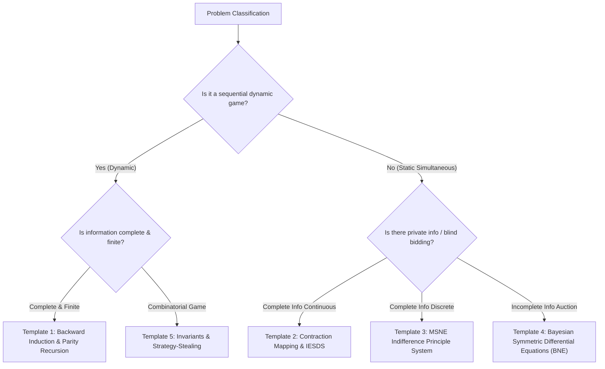

# Quant 13 · Game Theory & Strategic Decision Making: Nash Equilibrium, Backward Induction & Wall Street Classics

Game Theory is a foundational pillars of quantitative finance interviews (especially at Jane Street, Citadel, Optiver, SIG, IMC, Jump Trading) used to assess **strategic thinking, logical rigor, and opponent modeling**. In market making, blind auctions, dark pool interactions, and order book competition, game theory provides the mathematical bedrock for microstructural strategy design.

This note systematically breaks down the entire quantitative interview game theory syllabus, extracting **5 Unified Solution Templates**, and providing rigorous mathematical derivations and generalized modeling for **10 iconic problems from "The Green Book"** (*A Practical Guide To Quantitative Finance Interviews*) and **"Heard on the Street"** (*Quantitative Questions from Wall Street Job Interviews*).

---

## Module 1: Foundations of Non-Cooperative Game Theory

### 1. Mathematical Formulation of Games

#### Normal-Form (Strategic-Form) Games
An $n$-player finite normal-form game is defined by a tuple $\mathcal{G} = \left( \mathcal{N}, (S_i)_{i \in \mathcal{N}}, (u_i)_{i \in \mathcal{N}} \r\right)$:
- Player set $\mathcal{N} = \{1, 2, \dots, n\}$;
- Pure strategy space $S_i$ for each player $i$; profile space $S = S_1 \times S_2 \times \dots \times S_n$;
- Payoff function $u_i: S \to \mathbb{R}$.

#### Extensive-Form Games
A game tree representing sequential decision making: includes decision nodes, information sets, player actions, nature moves, and terminal payoffs.

---

### 2. Dominance & Iterated Elimination of Strictly Dominated Strategies (IESDS)

- **Strictly Dominant Strategy**: A strategy $s_i^* \in S_i$ such that against all opponent strategy profiles $s_{-i}$:
  $$u_i(s_i^*, s_{-i}) > u_i(s_i, s_{-i}), \quad \forall s_i \ne s_i^*$$
- **Strictly Dominated Strategy**: If there exists $s_i'$ (or mixed strategy $\sigma_i'$) such that for all $s_{-i}$, $u_i(s_i', s_{-i}) > u_i(s_i, s_{-i})$, then $s_i$ is strictly dominated.
- **IESDS Principle**: Rational players never play strictly dominated strategies. Recursively eliminating dominated strategies leads to the **Rationalizable Solution Set**.

---

### 3. Nash Equilibrium (NE)

#### Pure Strategy Nash Equilibrium (PNE)
A strategy profile $s^* = (s_1^*, s_2^*, \dots, s_n^*) \in S$ is a Nash Equilibrium if for all players $i \in \mathcal{N}$ and all unilateral deviations $s_i \in S_i$:
$$u_i(s_i^*, s_{-i}^*) \ge u_i(s_i, s_{-i}^*)$$
No player has an incentive to unilaterally deviate.

#### Mixed Strategy Nash Equilibrium (MSNE) & The Indifference Principle
Let player $i$ choose mixed strategy $\sigma_i \in \Delta(S_i)$.
> **The Indifference Principle**: In any MSNE, every pure strategy in player $i$'s support $\text{supp}(\sigma_i)$ must yield the **exact same expected payoff**, which is at least as high as any strategy outside the support:
> 
> $$\mathbb{E}_{\sigma_{-i}}[u_i(s_{i, 1}, \sigma_{-i})] = \mathbb{E}_{\sigma_{-i}}[u_i(s_{i, 2}, \sigma_{-i})] = \dots = \max_{s_i \in S_i} \mathbb{E}_{\sigma_{-i}}[u_i(s_i, \sigma_{-i})]$$

---

### 4. Zero-Sum Games & von Neumann's Minimax Theorem

In two-player zero-sum games ($u_1(s_1, s_2) + u_2(s_1, s_2) = 0$):
$$\max_{\sigma_1 \in \Delta_1} \min_{\sigma_2 \in \Delta_2} \mathbb{E}[u_1(\sigma_1, \sigma_2)] = \min_{\sigma_2 \in \Delta_2} \max_{\sigma_1 \in \Delta_1} \mathbb{E}[u_1(\sigma_1, \sigma_2)] = V^*$$
$V^*$ is the **Value of the Game**.

---

### 5. Dynamic Games & Subgame Perfect Nash Equilibrium (SPE)

- **Subgame**: A self-contained subtree starting from a singleton information set.
- **Subgame Perfect Equilibrium (SPE)**: A strategy profile that induces a Nash equilibrium in **every subgame**.
- **Kuhn's Theorem**: Every finite extensive-form game of perfect information can be solved via **Backward Induction** to find a pure-strategy SPE.

---

## Module 2: 5 Unified Quantitative Game Theory Solution Templates



---

### Template 1: Backward Induction & Parity Recursion
- **Applicability**: Pirate gold sharing, Tigers & Sheep, The Truel (3-way duel), sequential card picking.
- **Standard 3 Steps**:
  1. **Base Case ($k=1, 2$)**: Solve the terminal state with minimal remaining players;
  2. **Inductive Step ($k \to k+1$)**: Determine minimal cost to buy needed votes or leverage mortality threats;
  3. **Parity Collapse**: Identify odd/even cycles or modular absorbing patterns.

---

### Template 2: Contraction Mapping & IESDS
- **Applicability**: Guess $2/3$ of the Average (Beauty Contest), Traveler's Dilemma.
- **Standard 3 Steps**:
  1. **Define bounded strategy domain $[a_0, b_0]$**;
  2. **Prove strict dominance for upper slice**: Show $s > \alpha b_0$ is dominated;
  3. **Construct contraction sequence $b_{k+1} = \mathcal{T}(b_k)$** and compute the fixed point limit $s^* = 0$.

---

### Template 3: Mixed Strategy Indifference Principle
- **Applicability**: RPS variants, Inspection games, Poker bluffing, Russian roulette.
- **Standard 3 Steps**:
  1. **Parameterize opponent's mixed strategy $(p, 1-p)$**;
  2. **Compute expected payoffs for all pure actions in your support**;
  3. **Equate expected payoffs to solve for $p^*$**.

---

### Template 4: Bayesian Symmetric Bidding & ODEs
- **Applicability**: First-Price Auction, Second-Price, All-Pay Auction, Winner's Curse corporate acquisition.
- **Standard 3 Steps**:
  1. **Assume strictly monotonic symmetric bid function $b(v)$** with inverse $\beta(b)$;
  2. **Formulate expected profit function**: $\mathbb{E}[\Pi(b \mid v)] = (v - b) [F(\beta(b))]^{n-1}$;
  3. **FOC yields an ODE**: Substitute $\beta(b) = v$ and solve using integrating factor with $b(0) = 0$.

---

### Template 5: Combinatorial Games, Nim-Sum & Strategy-Stealing
- **Applicability**: Nim, Chomp chocolate grid, Coins in a line, Hat riddles.
- **Standard 3 Steps**:
  1. **Classify $P$-positions (Previous player wins) vs $N$-positions (Next player wins)**;
  2. **Find algebraic invariants**: Nim-sum $\bigoplus x_i = 0$ or parity partitioning;
  3. **Strategy-Stealing Proof**: If 2nd player had winning strategy, 1st player could steal it on move 1 by making a dummy move, yielding a contradiction.

---

## Module 3: 10 Classic Quant Interview Game Theory Problems (Green Book + Heard on the Street)

---

### Problem 1: Pirate Gold Sharing ($N$ Pirates & $M$ Gold Coins Generalization)

> **Source**: *The Green Book* / Jane Street, Citadel, Optiver Classic
> 
> **Problem**: 5 hyper-rational pirates (ranked 1 to 5 by seniority/cruelty, Pirate 1 most senior) must divide 100 gold coins.
> Rules:
> 1. Pirate 1 proposes an allocation. All pirates vote (including the proposer);
> 2. If $\ge 50\%$ vote YES, the proposal passes;
> 3. If rejected, the proposer is thrown overboard to sharks, and Pirate 2 proposes next;
> 4. Preferences: Survival > Gold > Bloodlust (throw people overboard if payout is tied).
> 
> **Question**: What allocation should Pirate 1 propose? What is the general rule for $N$ pirates?

#### Solution via Template 1 (Backward Induction)
- **Subgame 1 (2 Pirates left: 4, 5)**:
  - Pirate 4 votes YES $\implies 1/2 = 50\% \ge 50\%$. Pirate 4 takes `(100, 0)`. Pirate 5 gets 0.
- **Subgame 2 (3 Pirates left: 3, 4, 5)**:
  - Pirate 3 needs 1 more vote ($2/3 \ge 50\%$). Pirate 5 gets 0 in the next round, so offering Pirate 5 **1 coin** secures their vote ($1 > 0$).
  - Allocation: `Pirate 3: 99, Pirate 4: 0, Pirate 5: 1`. (Votes: 3, 5).
- **Subgame 3 (4 Pirates left: 2, 3, 4, 5)**:
  - Pirate 2 needs 1 more vote ($2/4 = 50\%$). If Pirate 2 dies, Pirate 4 gets 0, Pirate 5 gets 1. Pirate 2 buys Pirate 4 with 1 coin.
  - Allocation: `Pirate 2: 98, Pirate 3: 0, Pirate 4: 1, Pirate 5: 0`. (Votes: 2, 4).
- **Subgame 4 (Full Game 5 Pirates: 1 to 5)**:
  - Pirate 1 needs 2 more votes ($3/5 = 60\%$). If Pirate 1 dies: Pirate 3 gets 0, Pirate 5 gets 0.
  - Pirate 1 buys Pirate 3 with 1 coin and Pirate 5 with 1 coin:
  - Allocation: `Pirate 1: 96, Pirate 2: 0, Pirate 3: 1, Pirate 4: 0, Pirate 5: 1`.

$$\boxed{\text{Pirate 1 proposes: }(96, 0, 1, 0, 1) \quad \text{Votes: 1, 3, 5 (Passes)}}$$

---

### Problem 2: Tigers and Sheep Island ($N$ Tigers, 1 Sheep)

> **Source**: *The Green Book* / Optiver, SIG
> 
> **Problem**: An island has 1 sheep and $N$ rational tigers. Tigers can eat grass to survive, but prefer mutton. If a tiger eats the sheep, that tiger **turns into a sheep** (and can be eaten). Survival > Mutton.
> **Question**: For $N$ tigers, will the first tiger eat the sheep?

#### Solution via Template 1 (Parity Backward Induction)
- $N = 1$: Tiger eats sheep, becomes sheep, no other tigers. **Eats!**
- $N = 2$: If Tiger A eats sheep, becomes sheep with 1 tiger remaining. By $N=1$, Tiger B will eat it. Tiger A dies. **Does NOT eat!**
- $N = 3$: If Tiger A eats sheep, 2 tigers remain. By $N=2$, neither will eat it. Tiger A is safe. **Eats!**
- $N = 4$: If Tiger A eats sheep, reduces to $N=3$ where next tiger will eat it. **Does NOT eat!**

$$\boxed{\begin{cases} N \text{ is Odd} & \implies \text{The first tiger immediately eats the sheep} \\ N \text{ is Even} & \implies \text{No tiger eats the sheep; sheep survives} \end{cases}}$$

---

### Problem 3: The Truel (3-Player Duel with Accuracies $1/3, 2/3, 1$)

> **Source**: *Heard on the Street* / Jane Street, Citadel
> 
> **Problem**: 3 gunfighters A, B, C take turns shooting in order $A \to B \to C \to A \dots$ Accuracies: $p_A = 1/3, p_B = 2/3, p_C = 1$. Last survivor wins. A player can shoot any opponent or **shoot into the air (Pass)**.
> **Question**: What is A's optimal opening move? What are the survival probabilities?

#### Solution via Template 1 + State Transition SPE
1. **2-Player Subgames**:
   - $A \text{ vs } B$ ($A$ shoots first): $P_{AB} = \frac{1}{3} + \frac{2}{3} \cdot \frac{1}{3} P_{AB} \implies P_{AB} = \frac{3}{7}$.
   - $A \text{ vs } C$ ($A$ shoots first): $P_{AC} = \frac{1}{3}$.
   - $B \text{ vs } C$ ($B$ shoots first): $P_{BC} = \frac{2}{3}$.
2. **Targeting Incentives with 3 Alive**:
   - $B$ must target $C$ (if $B$ kills $A$, $C$ will kill $B$ on next turn with 100% accuracy);
   - $C$ must target $B$ (more dangerous than $A$).
3. **Player A's Opening Move**:
   - **If A shoots C**: If hits ($1/3$), B shoots first against A $\implies \mathbb{P}(\text{Win}) = \frac{1}{3}(1/7) + \frac{2}{3}(3/7) = 1/3 \approx 33.3\%$.
   - **If A shoots B**: If hits ($1/3$), C immediately kills A $\implies \mathbb{P}(\text{Win}) = 0 + \frac{2}{3}(3/7) \approx 28.6\%$.
   - **If A shoots into the air (Pass)**:
     - B must shoot C (kills C with prob $2/3$);
     - If B kills C ($2/3$), A shoots first against B: Win prob $P_{AB} = 3/7$;
     - If B misses C ($1/3$), C kills B ($1$), A shoots first against C: Win prob $P_{AC} = 1/3$;
     - Total survival prob:
       $$\mathbb{P}(A) = \frac{2}{3} \cdot \frac{3}{7} + \frac{1}{3} \cdot \frac{1}{3} = \frac{2}{7} + \frac{1}{9} = \boxed{\frac{25}{63} \approx 39.7\%}$$

$$\boxed{\text{Player A should deliberately shoot into the air (Pass)}} \quad (\mathbb{P}(A) \approx 39.7\%, \mathbb{P}(B) \approx 38.1\%, \mathbb{P}(C) \approx 22.2\%)$$

---

### Problem 4: Guess $2/3$ of the Average (Keynesian Beauty Contest)

> **Source**: *The Green Book* / Citadel, Two Sigma
> 
> **Problem**: $N \ge 3$ players pick a real number in $[0, 100]$. The player closest to $\frac{2}{3}$ of the average $\mu = \frac{1}{N}\sum x_i$ wins.
> **Question**: What is the unique Nash equilibrium under common knowledge of rationality?

#### Solution via Template 2 (Contraction Mapping & IESDS)
1. Since $x_i \le 100$, $\mu \le 100 \implies \frac{2}{3}\mu \le 66.67$. Any bid $> 66.67$ is strictly dominated. Round 1: $S_1 = [0, 66.67]$.
2. Knowing all rational bids $\le 66.67$, $\mu \le 66.67 \implies \frac{2}{3}\mu \le 44.44$. Round 2: $S_2 = [0, 44.44]$.
3. In round $k$, $S_k = [0, 100 \times (2/3)^k]$. As $k \to \infty$, $S_\infty = \{0\}$.

$$\boxed{\text{Unique Nash Equilibrium: Everyone bids } 0 \quad (x_1^* = \dots = x_N^* = 0)}$$

---

### Problem 5: Russian Roulette (Adjacent vs Non-Adjacent Re-spin)

> **Source**: *Heard on the Street* / Jane Street, SIG
> 
> **Problem**: 6-chamber revolver with 2 live bullets. Cylinder is spun randomly. Opponent pulls trigger first $\to$ **Click (Empty, survived)**. Now it is your turn. Should you (A) Pull trigger directly, or (B) Re-spin the cylinder?
> - Case 1: Bullets are **Adjacent**;
> - Case 2: Bullets are **Non-adjacent**.

#### Solution via Template 3 (Bayesian Conditioning)
- **Case 1 (Adjacent $(1, 1, 0, 0, 0, 0)$)**:
  - Opponent landed on one of 4 empty chambers.
  - If you pull directly: only 1 of the 4 empty chambers is followed by a bullet $\implies \mathbb{P}(\text{Shot} \mid \text{No Spin}) = \frac{1}{4} = \mathbf{25\%}$.
  - If you re-spin: $\mathbb{P}(\text{Shot} \mid \text{Re-spin}) = \frac{2}{6} = \mathbf{33.33\%}$.
  - **Decision 1: Do NOT re-spin (Pull directly, 25% < 33.3%)**.
- **Case 2 (Non-adjacent)**:
  - Both bullets are preceded by an empty chamber (2 out of 4 empty chambers lead to bullets).
  - If you pull directly: $\mathbb{P}(\text{Shot} \mid \text{No Spin}) = \frac{2}{4} = \mathbf{50\%}$.
  - If you re-spin: $\mathbb{P}(\text{Shot} \mid \text{Re-spin}) = \frac{2}{6} = \mathbf{33.33\%}$.
  - **Decision 2: MUST re-spin (33.3% < 50%)**.

---

### Problem 6: Auction Theory Masterclass (First-Price, Second-Price & All-Pay)

> **Source**: *The Green Book* / Citadel, Jump Trading, IMC
> 
> **Problem**: $n$ bidders, valuations $v_i \stackrel{\text{i.i.d.}}{\sim} U[0, 1]$.
> Find symmetric BNE bid functions $b^*(v)$ for:
> 1. Second-Price Auction (Vickrey);
> 2. First-Price Auction;
> 3. All-Pay Auction.

#### Solution via Template 4 (Bayesian ODE)
1. **Second-Price Auction**: Bidding true value $\boxed{b^*(v) = v}$ is a strictly dominant strategy.
2. **First-Price Auction**: $\mathbb{E}[\Pi] = (v - b) [\beta(b)]^{n-1}$. FOC yields $b'(v) v + (n-1) b(v) = (n-1) v \implies \boxed{b^*(v) = \frac{n-1}{n} v}$. (For $n=2$, bid half your valuation).
3. **All-Pay Auction**: $\mathbb{E}[\Pi] = v [\beta(b)]^{n-1} - b$. FOC yields $b'(v) = (n-1) v^{n-1} \implies \boxed{b^*(v) = \frac{n-1}{n} v^n}$.
4. **Revenue Equivalence Theorem**: All three yield expected seller revenue $\mathbb{E}[\text{Revenue}] = \frac{n-1}{n+1}$.

---

### Problem 7: Winner's Curse in Corporate Acquisition

> **Source**: *The Green Book* / Jane Street, SIG
> 
> **Problem**: Target company value $V \sim U[0, 100]$. Buyer A offers $B$. If $B \ge V$, target accepts and A creates 50% synergy ($1.5 V$), earning $1.5 V - B$. If $B < V$, deal fails (payoff 0).
> **Question**: What is the optimal bid $B^*$?

#### Solution via Template 4 (Adverse Selection Conditioning)
Conditioned on acquisition success ($V \le B$), the target's expected value is truncated: $\mathbb{E}[V \mid V \le B] = \frac{B}{2}$.
Post-acquisition value is $1.5 \times \frac{B}{2} = 0.75 B$.
Expected profit: $\mathbb{E}[\text{Profit}] = \frac{B}{100} (0.75 B - B) = -\frac{0.25 B^2}{100} \le 0$.

$$\boxed{\text{Optimal Bid is } B^* = 0 \quad (\text{Any positive bid results in expected loss due to Winner's Curse})}$$

---

### Problem 8: Coins in a Line Game ($2n$ Coins)

> **Source**: *Heard on the Street* / Two Sigma, Citadel
> 
> **Problem**: $2n$ coins with known values $v_1, v_2, \dots, v_{2n}$ in a line. 2 players alternate picking from either end.
> **Question**: Prove first player can always get at least 50% of the total sum. What is the winning strategy?

#### Solution via Template 5 (Parity Invariant)
Partition into Odd positions $O = \{v_1, v_3, \dots\}$ ($S_{\text{odd}}$) and Even positions $E = \{v_2, v_4, \dots\}$ ($S_{\text{even}}$).
- If $S_{\text{odd}} \ge S_{\text{even}}$, Player 1 takes $v_1$ (odd). Ends now show $v_2$ (even) and $v_{2n}$ (even). Player 2 is forced to pick an even coin, exposing an odd coin for Player 1 next turn.
- Player 1 can capture all odd coins (or all even coins).

$$\boxed{\text{Player 1 guaranteed payoff } \ge \max(S_{\text{odd}}, S_{\text{even}}) \ge \frac{1}{2}\sum_{i=1}^{2n} v_i}$$

---

### Problem 9: Chomp Chocolate Grid & Strategy-Stealing

> **Source**: *Heard on the Street* / Jane Street, Citadel
> 
> **Problem**: $R \times C$ chocolate grid ($R, C \ge 2$). Bottom-left $(1, 1)$ is poisoned. Players alternate choosing a cell $(r, c)$ and eating all cells $\ge r, \ge c$. Forced to eat $(1, 1)$ loses.
> **Question**: Prove First Player has a winning strategy.

#### Solution via Template 5 (Strategy-Stealing Contradiction)
Finite, deterministic, zero-sum game with no ties $\implies$ one player has a winning strategy (Zermelo's Theorem).
Assume Player 2 has a winning strategy $\mathcal{S}_2$.
- Player 1 eats only top-right $(R, C)$, leaving state $K$.
- By assumption, Player 2 has winning move $A$ from $K$ leading to winning state $K'$.
- But Player 1 could have chosen move $A$ on Turn 1 (since move $A$ automatically includes $(R, C)$), directly reaching $K'$ and stealing $\mathcal{S}_2$!
- Contradiction!

$$\boxed{\text{First Player must have a winning strategy (Non-constructive Proof)}}$$

---

### Problem 10: 100 Prisoners & Red/Blue Hats (Parity Coding)

> **Source**: *The Green Book* / Jane Street, Citadel
> 
> **Problem**: 100 prisoners in line. Each gets Red (1) or Blue (0) hat. Prisoner $i$ sees only $1, \dots, i-1$. Starting from Prisoner 100 down to 1, each must speak only "Red" or "Blue". Correct $\to$ live, wrong $\to$ die.
> **Question**: How many can be guaranteed to survive?

#### Solution via Template 5 (Parity Code Invariant)
- Prisoner 100 counts red hats ahead $S_{99} = \sum_{i=1}^{99} c_i$, and announces parity $P = S_{99} \pmod 2$. (Prisoner 100 has 50% chance of survival).
- Prisoner 99 sees $S_{98}$. Calculates own hat $c_{99} = (P - S_{98}) \pmod 2$. Announces $c_{99}$ with 100% accuracy!
- Prisoner 98 updates parity and calculates $c_{98}$ with 100% accuracy.
- All prisoners 1 to 99 survive with 100% certainty.

$$\boxed{\text{Guarantees at least 99 prisoners survive (Expected survival: } 99.5 \text{ prisoners)}}$$

---

## Module 4: Master Game Theory Interview Cheatsheet

| Classic Problem | Game Archetype | Recommended Template | Key Result / Optimal Policy |
| :--- | :--- | :--- | :--- |
| **Pirate Gold Sharing ($N$ Pirates, $M$ Coins)** | Complete info finite extensive game | **Template 1**: Backward Induction | 5 Pirates 100 Coins: $(96, 0, 1, 0, 1)$ |
| **Tigers & Sheep ($N$ Tigers, 1 Sheep)** | Parity absorbing threat game | **Template 1**: Parity Induction | Odd $N \implies$ Eat; Even $N \implies$ Never eat |
| **The Truel (Accuracies $1/3, 2/3, 1$)** | Markov sequential duel | **Template 1**: Subgame Transitions | Weakest player shoots into air (Pass) $\implies 39.7\%$ win rate |
| **Guess $2/3$ of Average (Beauty Contest)** | Continuous coordination game | **Template 2**: Contraction IESDS | Unique Nash Equilibrium: Bid $0$ |
| **Russian Roulette Re-spin** | Bayesian filtering under incomplete info | **Template 3**: Conditional Probability | Adjacent: No Re-spin ($25\%$); Non-adjacent: Re-spin ($33\%$) |
| **First-Price Auction (FPA)** | Independent private values Bayesian game | **Template 4**: Differential Equation | $b^*(v) = \frac{n-1}{n} v$ (For $n=2$, bid $50\%$ of valuation) |
| **Second-Price Auction (SPA / Vickrey)** | Dominant strategy mechanism | **Template 4**: Dominant Strategy | $b^*(v) = v$ (Truthful bidding) |
| **Corporate Acquisition (Winner's Curse)** | Adverse selection conditional expectation | **Template 4**: Truncated Expectation | $B^* = 0$ (Do not bid; adverse selection ensures loss) |
| **Coins in a Line ($2n$ Coins)** | Deterministic zero-sum combinatorial game | **Template 5**: Odd/Even Index Parity | First player captures max parity set $\ge 50\%$ total |
| **Chomp Chocolate Grid** | Impartial game with no ties | **Template 5**: Strategy-Stealing | First player winning strategy exists non-constructively |
| **100 Prisoners Hat Riddle** | Distributed noiseless cooperative game | **Template 5**: Global Parity Invariant | Sacrifice tail to broadcast parity $\implies 99$ survive |

---

## Module 5: Interactive Game Theory Simulator

```game-theory-interactive-demo
```

