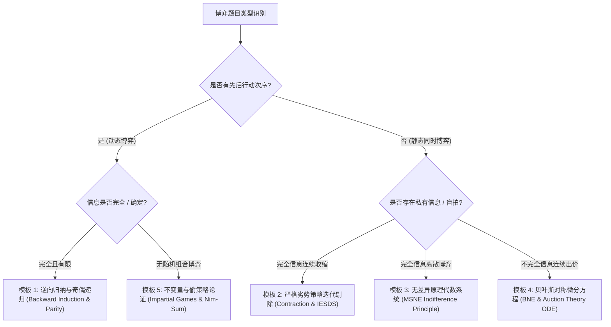

# Quant 13 · 博弈论与策略性决策：纳什均衡、逆向归纳与华尔街量化经典（Game Theory & Strategic Decision Making）

博弈论（Game Theory）是量化金融面试（尤其是 Jane Street, Citadel, Optiver, SIG, IMC, Jump Trading）中考察**策略思维、逻辑完备性与对手建模**的核心模块。在做市商（Market Making）、盲拍（Auction Bidding）、暗池博弈（Dark Pools）以及订单簿对抗中，博弈论构成了微观市场结构与策略设计的数学基石。

本文全面系统地梳理经典量化面试博弈论体系，提炼出 **5 大万能求解模板（Unified Templates）**，并对《绿皮书》（*A Practical Guide To Quantitative Finance Interviews*）与《街头传闻》（*Heard on the Street*）中的 **10 大经典博弈真题** 进行严格的数学推导与通用参数化建模。

---

## 模块一：非合作博弈论核心理论基石

### 1. 博弈的数学表达形式

#### 标准式博弈（Normal-Form Game）
一个 $n$ 人有限标准式博弈定义为一个三元组 $\mathcal{G} = \left( \mathcal{N}, (S_i)_{i \in \mathcal{N}}, (u_i)_{i \in \mathcal{N}}  \right)$：
- 局中人集合 $\mathcal{N} = \{1, 2, \dots, n\}$；
- 每个局中人的纯策略空间 $S_i$；策略组合空间 $S = S_1 \times S_2 \times \dots \times S_n$；
- 收益函数（Payoff Function）$u_i: S \to \mathbb{R}$。

#### 展开式博弈（Extensive-Form Game）
用博弈树（Game Tree）表示动态序列决策过程：包含博弈节点（决策点）、信息集（Information Sets）、行动（Actions）、自然轮转（Nature Moves）以及终点收益。

---

### 2. 占优策略与严格劣势策略迭代剔除（IESDS）

- **严格占优策略（Strictly Dominant Strategy）**：对局中人 $i$，若策略 $s_i^* \in S_i$ 满足对对手的所有可能策略组合 $s_{-i}$，均有：
  $$u_i(s_i^*, s_{-i}) > u_i(s_i, s_{-i}), \quad \forall s_i \ne s_i^*$$
- **严格劣势策略（Strictly Dominated Strategy）**：若存在策略 $s_i'$（或混合策略 $\sigma_i'$），使得对对手的任意策略 $s_{-i}$，均有 $u_i(s_i', s_{-i}) > u_i(s_i, s_{-i})$，则 $s_i$ 是严格劣势策略。
- **IESDS 原理**：理性人永远不会选择严格劣势策略。不断递归剔除所有局中人的劣势策略，若最终仅存唯一策略组合，则该解称为**可理性化解（Rationalizable Solution）**。

---

### 3. 纳什均衡（Nash Equilibrium, NE）

#### 纯策略纳什均衡（PNE）
策略组合 $s^* = (s_1^*, s_2^*, \dots, s_n^*) \in S$ 是一个纳什均衡，如果对任意局中人 $i \in \mathcal{N}$ 及任意单方面偏离策略 $s_i \in S_i$：
$$u_i(s_i^*, s_{-i}^*) \ge u_i(s_i, s_{-i}^*)$$
即**没有任何人在其他人不改变策略的前提下，有单方面改变自身策略的动力（Best Response 互为不动点）**。

#### 混合策略纳什均衡（MSNE）与无差异原理（Indifference Principle）
设局中人 $i$ 以概率分布 $\sigma_i \in \Delta(S_i)$ 选择策略。
> **核心定理（无差异原理）**：在混合策略纳什均衡中，局中人 $i$ 策略支撑集（Support, 即被赋予正概率的所有纯策略 $\text{supp}(\sigma_i)$）中的**每一个纯策略所带来的期望收益必须严格相等**，且不低于未被使用的纯策略收益！
> 
> $$\mathbb{E}_{\sigma_{-i}}[u_i(s_{i, 1}, \sigma_{-i})] = \mathbb{E}_{\sigma_{-i}}[u_i(s_{i, 2}, \sigma_{-i})] = \dots = \max_{s_i \in S_i} \mathbb{E}_{\sigma_{-i}}[u_i(s_i, \sigma_{-i})]$$

---

### 4. 零和博弈与冯·诺依曼极小极大定理（Minimax Theorem）

在两人零和博弈（$u_1(s_1, s_2) + u_2(s_1, s_2) = 0$）中，局中人 1 最大化收益等价于局中人 2 极小化局中人 1 的收益。

$$\max_{\sigma_1 \in \Delta_1} \min_{\sigma_2 \in \Delta_2} \mathbb{E}[u_1(\sigma_1, \sigma_2)] = \min_{\sigma_2 \in \Delta_2} \max_{\sigma_1 \in \Delta_1} \mathbb{E}[u_1(\sigma_1, \sigma_2)] = V^*$$

$V^*$ 称为博弈的**博弈值（Value of the Game）**。

---

### 5. 动态博弈与子博弈精炼纳什均衡（SPE）

在完全信息有限动态博弈中，纳什均衡可能包含“不可置信的威胁（Non-credible Threats）”。
- **子博弈（Subgame）**：从某个单节点信息集开始，包含其所有后继节点及其分支的自洽博弈结构。
- **子博弈精炼纳什均衡（Subgame Perfect Equilibrium, SPE）**：策略组合在**每一个子博弈中都构成纳什均衡**。
- **库恩定理（Kuhn's Theorem）**：所有有限完全信息动态博弈均可通过**逆向归纳法（Backward Induction）**在有限步内求解出纯策略 SPE！

---

## 模块二：量化面试五大万能求解模板（Unified Templates）

为了在量化面试中迅速理清解题思路，我们将所有博弈题抽象归纳为 5 个通用数学求解模板：



---

### 模板 1：逆向归纳与奇偶性递归模板（Backward Induction & Parity）
- **适用场景**：海盗分金、老虎吃羊、三方决斗（Truel）、轮流选牌决策。
- **标准三步法**：
  1. **确定终端基准态（Base Case $k=1, 2$）**：直接求解博弈末期仅剩极少局中人时的平凡解；
  2. **建立归纳假设与边际激励（Inductive Step $k \to k+1$）**：分析新增决策者如何以**最低成本**收买现有局中人（“给 0 变 1”），或者利用生死威胁锁定对手行为；
  3. **奇偶性/模运算不变量（Parity Collapse）**：若状态转移具有循环周期或吸收态，提取奇偶周期规律。

---

### 模板 2：收缩映射与劣势策略迭代剔除模板（Contraction Mapping & IESDS）
- **适用场景**：猜均值的 $2/3$（Beauty Contest）、旅行者困境（Traveler's Dilemma）。
- **标准三步法**：
  1. **界定可行策略上界 $[a_0, b_0]$**；
  2. **证明边界区间的严格劣势性**：对任意局中人，策略 $s > \alpha b_0$ 均被策略 $\alpha b_0$ 严格占优；
  3. **构造压缩区间序列**：$b_{k+1} = \mathcal{T}(b_k)$，由 Banach 不动点定理证明区间收缩至单点不动点 $s^* = 0$。

---

### 模板 3：混合策略无差异原理代数模板（Indifference Principle for MSNE）
- **适用场景**：石头剪刀布变体、检查博弈（Inspection Game）、扑克下注 Bluffing、俄罗斯轮盘赌。
- **标准三步法**：
  1. **设对手混合概率分布**：设局中人 2 以概率 $(p, 1-p)$ 行动；
  2. **列出局中人 1 各纯策略的期望收益**：$U_1(A) = f(p), U_1(B) = g(p)$；
  3. **令期望收益完全相等解方程**：$f(p^*) = g(p^*) \implies p^*$。

---

### 模板 4：贝叶斯对称出价与常微分方程模板（Bayesian Nash & Auction ODE）
- **适用场景**：一阶密封拍卖（First-Price Auction）、全支付拍卖（All-Pay Auction）、胜者诅咒估值收购。
- **标准三步法**：
  1. **对称单调出价假设**：假设所有对手采用严格单调递增出价函数 $b(v)$，反函数 $v = \beta(b)$；
  2. **构建目标期望利润函数**：
     $$\mathbb{E}[\Pi(b \mid v)] = (v - b) \cdot \mathbb{P}\left(\max_{j \ne i} v_j < \beta(b) \right) = (v - b) \cdot [F(\beta(b))]^{n-1}$$
  3. **一阶条件（FOC）化为 ODE 并代入边界条件求解**：令 $\frac{\partial \mathbb{E}[\Pi]}{\partial b} = 0$，将 $\beta(b) = v$ 代入得到线性 ODE 并积分。

---

### 模板 5：公平组合博弈、Nim 和与偷策略论证模板（Combinatorial Games & Strategy-Stealing）
- **适用场景**：Nim 取子博弈、Chomp 巧克力吃网格、黑白棋翻转、取硬币博弈。
- **标准三步法**：
  1. **定义 $P$-态（Previous Player Wins, 必败态）与 $N$-态（Next Player Wins, 必胜态）**；
  2. **异或不变量（Nim-Sum Invariant）**：计算二进制异或和 $\bigoplus_{i} x_i$，若为 0 则为 $P$-态，否则为 $N$-态；
  3. **偷策略反证法（Strategy-Stealing Argument）**：若第二行动者有必胜策略，先手在第 1 步走一步虚拟空步即可窃取该必胜策略，产生矛盾，从而非构造性证明先手必胜。

---

## 模块三：量化经典十大概率博弈真题深度全解（绿皮书 + 街头传闻精粹）

---

### 真题 1：海盗分金问题（5 Pirates & 100 Gold Coins Generalization）

> **题目来源**：《绿皮书》经典动态博弈 / Jane Street, Citadel, Optiver 高频必考
> 
> **题目描述**：
> 5 个极度聪明的海盗（编号 1 到 5，按凶悍程度由高到低排序，海盗 1 最凶，海盗 5 最弱）分 100 枚不可分割的金币。
> 规则：
> 1. 海盗 1 先提出分配方案，全体海盗（包括提议者）投票；
> 2. 若**赞成票达到或超过半数（$\ge 50\%$）**，方案通过，游戏结束；
> 3. 否则，提议者被扔进海里喂鲨鱼，由下一个最凶的海盗（海盗 2）继续提议；
> 4. 海盗的行为偏好优先级为：**保命第 1 > 拿更多金币第 2 > 在收益相同时更倾向于把人扔下海（残忍偏好）**。
> 
> **求解**：海盗 1 应该提出怎样的方案？若推广到 $N$ 个海盗分 $M$ 枚金币，规律是什么？

#### 应用模板：模板 1（逆向归纳法 Backward Induction）

#### 严密推导过程：
- **子博弈 1（仅剩 2 人：海盗 4, 5）**：
  - 海盗 4 提出方案：自己只要投自己一票，即满足 $\frac{1}{2} \ge 50\%$；
  - 决策：海盗 4 分配 `(100, 0)`。海盗 5 获得 0 金币。
- **子博弈 2（剩 3 人：海盗 3, 4, 5）**：
  - 海盗 3 需要再拉 1 票（共 2 票即满足 $2/3 \ge 50\%$）；
  - 观察海盗 4 与 5 的机会成本：海盗 5 在下阶段将一无所获（得 0），因此只需给海盗 5 **1 枚金币**，海盗 5 就会基于残忍性对比（$1 > 0$）投赞成票；
  - 海盗 3 分配：`海盗 3: 99, 海盗 4: 0, 海盗 5: 1`。投票结果：海盗 3, 5 赞成（2 票通过）。
- **子博弈 3（剩 4 人：海盗 2, 3, 4, 5）**：
  - 海盗 2 需要再拉 1 票（共 2 票满足 $2/4 = 50\%$）；
  - 检查机会成本：若海盗 2 死亡，海盗 4 获得 0 金币，海盗 5 获得 1 金币；
  - 海盗 2 只需收买海盗 4（给 1 枚金币）：
  - 海盗 2 分配：`海盗 2: 98, 海盗 3: 0, 海盗 4: 1, 海盗 5: 0`。投票结果：海盗 2, 4 赞成（2 票通过）。
- **子博弈 4（完整博弈 5 人：海盗 1 到 5）**：
  - 海盗 1 需要再拉 2 票（共 3 票满足 $3/5 = 60\% \ge 50\%$）；
  - 检查若海盗 1 死亡后各海盗所得：`海盗 2: 98, 海盗 3: 0, 海盗 4: 1, 海盗 5: 0`；
  - 海盗 1 应挑选要价最低的人收买：海盗 3（给 1 枚金币）、海盗 5（给 1 枚金币）：
  - 海盗 1 分配：`海盗 1: 96, 海盗 2: 0, 海盗 3: 1, 海盗 4: 0, 海盗 5: 1`。

$$\boxed{\text{海盗 1 提议：}(96, 0, 1, 0, 1) \quad \text{赞成票：海盗 1, 3, 5 (3 票通过)}}$$

#### $N$ 个海盗推广分析（当金币 $M$ 不足以收买所需半数票时）：
当海盗数量 $N > 2M$ 时，金币耗尽，海盗为了保命必须把全部金币送出（$0$ 金币保命）。当 $N$ 极大时，只有满足**可存活人数为 $2M + 2^k$** 形式的海盗才能存活，其余海盗必死。

---

### 真题 2：老虎与羊的岛屿博弈（Tigers and Sheep Island）

> **题目来源**：《绿皮书》经典动态逻辑题 / Optiver, SIG
> 
> **题目描述**：
> 孤岛上有 1 只羊和 $N$ 只完全理性的老虎。
> 规则：
> 1. 老虎吃草可以活，但更喜欢吃羊肉；
> 2. 一旦一只老虎吃掉羊，这只老虎就会**变成一只新的羊**（并可能被其他老虎吃掉）；
> 3. 老虎的偏好优先级：**保命第一 > 吃羊第二**；
> 4. 假设所有老虎都极度理性且知晓其他老虎完全理性。
> 
> **求解**：当岛上有 $N$ 只老虎时，第一只老虎会吃掉羊吗？

#### 应用模板：模板 1（奇偶归纳法 Parity Backward Induction）

#### 严密推导过程：
- **$N = 1$ 只老虎**：这只老虎吃掉羊，变成羊，岛上没有其他老虎，安全活下来。**吃！**
- **$N = 2$ 只老虎**：若老虎 A 吃掉羊，老虎 A 变成羊，此时岛上剩下 1 只老虎 B。根据 $N=1$ 的结论，老虎 B 必会吃掉变成羊的老虎 A。因此老虎 A 吃羊必死。由保命第一准则，**不吃！**
- **$N = 3$ 只老虎**：若老虎 A 吃掉羊，变成羊，岛上剩下 2 只老虎。根据 $N=2$ 的结论，剩下的 2 只老虎谁也不敢吃这只羊。因此老虎 A 吃羊后绝对安全！由吃羊偏好，**吃！**
- **$N = 4$ 只老虎**：若老虎 A 吃掉羊，退化为 $N=3$ 的局面，下一只老虎必吃它。因此**不吃！**

#### 通用奇偶法则：
$$\boxed{\begin{cases} N \text{ 为奇数 (Odd)} & \implies \text{第一只老虎立刻吃掉羊} \\ N \text{ 为偶数 (Even)} & \implies \text{任何老虎都不会吃羊，羊安全存活} \end{cases}}$$

---

### 真题 3：三方决斗博弈（The Truel: 3-Player Duel with Different Accuracies）

> **题目来源**：《街头传闻》经典概率博弈题 / Jane Street, Citadel
> 
> **题目描述**：
> 三名枪手 A, B, C 进行决斗，轮流开枪（顺序为 A $\to$ B $\to$ C $\to$ A $\dots$）。
> 各自的命中率固定为：
> - 枪手 A：命中率 $p_A = 1/3$；
> - 枪手 B：命中率 $p_B = 2/3$；
> - 枪手 C：命中率 $p_C = 1$（神枪手，百发百中）。
> 
> 存活到最后的人获胜。枪手在轮到自己时可以选择射击任意对手，也可以**故意朝天放枪（Pass / Shoot into the air）**。
> **求解**：枪手 A 在第一轮的最优策略是什么？最终三人的存活概率分别是多少？

#### 应用模板：模板 1 + 状态转移概率（Subgame Transition）

#### 严密推导过程：
1. **分析两人残局（Two-Player Subgames）**：
   - **A 与 B 对决（A 先开枪）**：设 A 胜率为 $P_{AB}$。
     $$P_{AB} = p_A + (1 - p_A)(1 - p_B) P_{AB} = \frac{1}{3} + \frac{2}{3} \cdot \frac{1}{3} P_{AB} = \frac{1}{3} + \frac{2}{9} P_{AB} \implies \boxed{P_{AB} = \frac{3}{7}}$$
     B 的胜率为 $1 - \frac{3}{7} = \frac{4}{7}$。
   - **A 与 C 对决（A 先开枪）**：
     $$P_{AC} = p_A + (1 - p_A) \cdot 0 = \boxed{\frac{1}{3}}$$
   - **B 与 C 对决（B 先开枪）**：
     $$P_{BC} = p_B + (1 - p_B) \cdot 0 = \boxed{\frac{2}{3}}$$

2. **分析 3 人在场时各枪手的目标选择（Targeting Logic）**：
   - **B 的最优目标**：必须射击最致命的威胁 **C**（若杀 A，轮到 C 开枪 B 必死；若杀 C，B 与 A 决斗胜率高）；
   - **C 的最优目标**：必须射击命中率更高的 **B**（若杀 A，轮到 B 开枪自己有 $2/3$ 概率死）。

3. **分析 A 的第一枪决策**：
   - **策略 1：A 尝试射杀 C**：
     - 若命中 C（概率 $1/3$），进入 A 与 B 决斗，但**轮到 B 先开枪**！A 的存活概率为 $(1 - p_B) P_{AB} = \frac{1}{3} \times \frac{3}{7} = \frac{1}{7}$；
     - 若未命中 C（概率 $2/3$），轮到 B，B 射杀 C，之后进入 A 与 B 决斗（A 先开枪），A 胜率为 $\frac{3}{7}$；
     - A 总胜率 $= \frac{1}{3} \times \frac{1}{7} + \frac{2}{3} \times \frac{3}{7} = \frac{1 + 6}{21} = \frac{7}{21} = \frac{1}{3} \approx 33.3\%$。
   - **策略 2：A 尝试射杀 B**：
     - 若命中 B（概率 $1/3$），轮到 C，C 必杀 A，A 存活率为 0；
     - 若未命中 B，轮到 B 杀 C，随后 A 先开枪决斗 B，胜率 $\frac{3}{7}$；
     - A 总胜率 $= \frac{1}{3} \times 0 + \frac{2}{3} \times \frac{3}{7} = \frac{6}{21} \approx 28.6\%$。
   - **策略 3：A 故意朝天放枪（Shoot into the air）**：
     - A 必然不击中任何人，轮到 B 开枪；
     - B 别无选择必须射杀 C（成功率 $2/3$）；
     - 若 B 杀死 C（概率 $2/3$），进入 A 对决 B 且 **A 拥有先手权**，胜率为 $P_{AB} = \frac{3}{7}$；
     - 若 B 射偏（概率 $1/3$），轮到 C，C 必然射杀 B，随后进入 A 对决 C 且 **A 拥有先手权**，胜率为 $P_{AC} = \frac{1}{3}$；
     - A 的总胜率为：
       $$\mathbb{P}(\text{A 获胜}) = \frac{2}{3} \times \frac{3}{7} + \frac{1}{3} \times \frac{1}{3} = \frac{2}{7} + \frac{1}{9} = \frac{18 + 7}{63} = \boxed{\frac{25}{63} \approx 39.7\%}$$

#### 结论：
$$\boxed{\text{枪手 A 的最优决策是：第一轮故意朝天放枪 (Shoot into the air)}}$$
- 各自最终胜率：$\mathbb{P}(A) = \frac{25}{63} \approx 39.7\%$, $\mathbb{P}(B) = \frac{2}{3} \times \frac{4}{7} = \frac{8}{21} = \frac{24}{63} \approx 38.1\%$, $\mathbb{P}(C) = \frac{1}{3} \times \frac{2}{3} = \frac{14}{63} \approx 22.2\%$。命中率最差的 A 胜率反而最高！

---

### 真题 4：猜均值的 $2/3$（Keynesian Beauty Contest / Guess $2/3$ of the Average）

> **题目来源**：《绿皮书》行为与微观博弈 / Citadel, Two Sigma
> 
> **题目描述**：
> $N$ 个玩家（$N \ge 3$）每人在闭区间 $[0, 100]$ 内独立写下一个实数 $x_i$。
> 设全体提交数字的算术平均值为 $\mu = \frac{1}{N} \sum_{i=1}^N x_i$。
> 谁提交的数字**最接近全场均值的 $2/3$（即 $\frac{2}{3}\mu$）**，谁获得全部奖励。
> **求解**：在完全理性的假设下，唯一的纳什均衡是什么？

#### 应用模板：模板 2（收缩映射与 IESDS）

#### 严密推导过程：
1. **初始可行空间**：$S_0 = [0, 100]$，均值最大可能为 $\mu \le 100$，故目标值 $\frac{2}{3}\mu \le \frac{200}{3} \approx 66.67$。
   - 任何大于 $66.67$ 的出价都是严格劣势策略（无论其他人怎么选，选 $66.67$ 永远比选 $>66.67$ 更接近目标）。
   - **第 1 轮剔除**：策略空间收缩为 $S_1 = [0, 66.67]$。
2. **第 2 轮剔除**：已知所有理性人的出价均落入 $[0, 66.67]$，则全场均值 $\mu \le 66.67$，目标值上限变为 $\frac{2}{3} \times 66.67 = \frac{400}{9} \approx 44.44$。
   - 策略空间收缩为 $S_2 = [0, 44.44]$。
3. **第 $k$ 轮递归收缩**：
   $$S_k = \left[ 0, 100 \times \left( \frac{2}{3} \right)^k  \right]$$
4. **求极限**：
   $$\lim_{k \to \infty} 100 \times \left( \frac{2}{3} \right)^k = 0 \implies S_\infty = \{0\}$$

$$\boxed{\text{唯一纳什均衡为：所有人都出 } 0 \quad (x_1^* = x_2^* = \dots = x_N^* = 0)}$$

---

### 真题 5：俄罗斯轮盘赌重转决策（Russian Roulette: Adjacent vs Non-Adjacent）

> **题目来源**：《街头传闻》条件概率与决策 / Jane Street, SIG
> 
> **题目描述**：
> 一把 6 孔左轮手枪装有 2 发实弹。枪膛被随机旋转一次。
> 规则：
> 1. 对手先拿起枪对准自己扣动扳机——**枪响为空（Click，活了下来）**；
> 2. 现在轮到你拿枪对准自己扣扳机。你有两个选择：
>    - **选择 A**：直接扣动扳机；
>    - **选择 B**：要求重新随机旋转枪膛（Re-spin）后再扣动扳机。
> 
> **求解**：在以下两种子情况下，你应当选择 A 还是 B？
> - **情况 1**：两发子弹是**相邻装填（Adjacent）**的；
> - **情况 2**：两发子弹是**非相邻装填（Non-adjacent）**的。

#### 应用模板：模板 3（条件概率与贝叶斯筛选）

#### 严密推导过程：
- **情况 1（相邻装填，形如 $(1, 1, 0, 0, 0, 0)$）**：
  - 枪膛的 6 个连续位置：$(B_1, B_2, E_3, E_4, E_5, E_6)$（$B$ 为子弹，$E$ 为空）；
  - 对手扣动扳机且为空，说明对手处于 $E_3, E_4, E_5, E_6$ 之一（共 4 种等可能状态）；
  - **若直接扣扳机（不重转）**：枪膛自动移到下一个位置：
    - 若对手在 $E_3 \to$ 下一个是 $E_4$（安全）；
    - 若对手在 $E_4 \to$ 下一个是 $E_5$（安全）；
    - 若对手在 $E_5 \to$ 下一个是 $E_6$（安全）；
    - 若对手在 $E_6 \to$ 下一个是 $B_1$（**中弹！**）；
    - 此时中弹概率为 $\mathbb{P}(\text{中弹} \mid \text{不重转}) = \frac{1}{4} = \mathbf{25\%}$。
  - **若要求重转（Re-spin）**：回到全概率空间（6 孔 2 弹）：
    - $\mathbb{P}(\text{中弹} \mid \text{重转}) = \frac{2}{6} = \frac{1}{3} \approx \mathbf{33.33\%}$。
  - **结论 1**：相邻装填时，**选择 A（不重转直接扣）中弹率更低（25% < 33.3%）**！

- **情况 2（非相邻装填）**：
  - 对手处于空位（共 4 个空位）；
  - 由于子弹不相邻，每个子弹前面必定紧跟着一个空位，即有 2 个空位的下一个位置是子弹；
  - **若直接扣扳机**：$\mathbb{P}(\text{中弹} \mid \text{不重转}) = \frac{2}{4} = \mathbf{50\%}$；
  - **若要求重转**：$\mathbb{P}(\text{中弹} \mid \text{重转}) = \frac{2}{6} = \mathbf{33.33\%}$；
  - **结论 2**：非相邻装填时，**选择 B（必须重转）中弹率更低（33.3% < 50%）**！

---

### 真题 6：经典拍卖理论全景（Auction Theory: First-Price vs Second-Price vs All-Pay）

> **题目来源**：《绿皮书》不完全信息博弈 / Citadel, Jump Trading, IMC
> 
> **题目描述**：
> $n$ 个独立买家竞拍一件标的物。每个买家对物品的真实估值 $v_i$ 独立服从 $[0, 1]$ 上的均匀分布 $U[0, 1]$。买家只知道自己的估值，其他人估值未知。
> 1. **二阶密封价格拍卖（Second-Price / Vickrey Auction）**：出价最高者赢得物品，但支付**第二高出价**；
> 2. **一阶密封价格拍卖（First-Price Auction）**：出价最高者赢得物品，支付**自己的出价**；
> 3. **全支付拍卖（All-Pay Auction）**：出价最高者赢得物品，但**所有人无论输赢都必须支付自己的出价**。
> 
> **求解**：三种拍卖机制下的对称纳什出价策略 $b(v)$ 及卖家的期望总收益。

#### 应用模板：模板 4（贝叶斯对称出价与常微分方程）

#### 严密推导过程：

#### 1. 二阶价格拍卖（Vickrey Auction）
- 证明弱占优策略出价为**真实估值出价** $b(v) = v$：
  - 若出价 $b > v$：仅当第二高价格 $P_2 \in (v, b)$ 时会改变结果，此时你中标但支付 $P_2 > v$，净亏损 $v - P_2 < 0$；
  - 若出价 $b < v$：仅当 $P_2 \in (b, v)$ 时会改变结果，你本来有利可图（$v - P_2 > 0$），却因降价导致未中标，收益为 0；
  - 因此 $\boxed{b^*(v) = v}$ 是严格弱占优策略！

#### 2. 一阶价格拍卖（First-Price Auction）
- 设对称单调递增出价函数 $b(v)$，反函数 $\beta(b)$。买家期望收益：
  $$\mathbb{E}[\Pi(b \mid v)] = (v - b) \cdot \mathbb{P}\left(\max_{j \ne i} v_j < \beta(b) \right) = (v - b) \cdot [\beta(b)]^{n-1}$$
- 对出价 $b$ 求一阶偏导（FOC）：
  $$- [\beta(b)]^{n-1} + (v - b) (n - 1) [\beta(b)]^{n-2} \beta'(b) = 0$$
- 在对称均衡处出价满足 $b = b(v) \implies \beta(b) = v$ 且 $\beta'(b) = \frac{1}{b'(v)}$：
  $$-v^{n-1} + (v - b(v)) (n - 1) v^{n-2} \frac{1}{b'(v)} = 0 \implies b'(v) v + (n - 1) b(v) = (n - 1) v$$
- 两边同乘积分因子 $v^{n-2}$：
  $$\frac{d}{dv} \left[ b(v) v^{n-1}  \right] = (n - 1) v^{n-1} \implies b(v) v^{n-1} = \frac{n - 1}{n} v^n + C$$
- 由边界条件 $b(0) = 0 \implies C = 0$：
  $$\boxed{b^*(v) = \frac{n - 1}{n} v}$$
  *对于两人拍卖（$n=2$），$b^*(v) = \frac{1}{2}v$（打五折出价）*。

#### 3. 全支付拍卖（All-Pay Auction）
- 期望利润：$\mathbb{E}[\Pi(b \mid v)] = v \cdot [\beta(b)]^{n-1} - b$。
- FOC：$v (n - 1) [\beta(b)]^{n-2} \beta'(b) - 1 = 0 \implies b'(v) = (n - 1) v^{n-1}$。
- 积分并代入 $b(0) = 0$：
  $$\boxed{b^*(v) = \frac{n - 1}{n} v^n}$$

#### 4. 收益等价定理（Revenue Equivalence Theorem）
尽管三种拍卖机制的出价形式截然不同，但满足四个基本假设（独立私有估值、风险中性、最高估值者中标、最低估值者收益为 0），**卖家的期望收益严格恒等**：
$$\mathbb{E}[\text{Revenue}] = \frac{n - 1}{n + 1}$$

---

### 真题 7：胜者诅咒与未知价值公司收购（Winner's Curse in Corporate Acquisition）

> **题目来源**：《绿皮书》不完全信息条件期望 / Jane Street, SIG
> 
> **题目描述**：
> 公司 A 打算收购目标公司 T。
> 规则：
> - 目标公司 T 当前的真实价值 $V$ 对 A 而言是未知的，只知道 $V \sim \text{Uniform}[0, 100]$；
> - 目标公司 T 的管理层完全知晓自身的真实价值 $V$；
> - 在 A 公司的更高效管理下，公司 T 在收购后的价值将**提升 $50\%$（即变为 $1.5 V$）**；
> - 收购规则为“一次性出价 $B$”：若 $B \ge V$，公司 T 接受收购并移交资产，公司 A 获得价值 $1.5 V$，扣除出价净利润为 $1.5 V - B$；若 $B < V$，收购失败，A 利润为 0。
> 
> **求解**：公司 A 应该出价多少以最大化期望利润？

#### 应用模板：模板 4（条件期望与胜者诅咒 Winner's Curse）

#### 严密推导过程：
- **常见思维陷阱**：无条件期望 $\mathbb{E}[V] = 50$，收购后期望价值 $1.5 \times 50 = 75$。于是以为出价 $B = 50$ 就能赚 $75 - 50 = 25$。
- **严密条件期望推导**：
  - 只有当 $V \le B$ 时，收购才会成功（买家面临严重的逆向选择 Adverse Selection！）；
  - **在收购成功的条件下，目标公司的真实价值均值不是 50，而是截断均值**：
    $$\mathbb{E}[V \mid V \le B] = \frac{B}{2}$$
  - 因此在收购成功时，公司 A 获得的收购后标的物期望价值仅为：
    $$\mathbb{E}[1.5 V \mid V \le B] = 1.5 \times \frac{B}{2} = 0.75 B$$
  - 公司 A 的期望净利润为：
    $$\mathbb{E}[\text{Profit}] = \mathbb{P}(V \le B) \cdot \left( \mathbb{E}[1.5 V \mid V \le B] - B  \right) = \frac{B}{100} \cdot (0.75 B - B) = -\frac{0.25 B^2}{100} \le 0$$

$$\boxed{\text{最优出价为：} B^* = 0 \quad (\text{任何正出价 } B > 0 \text{ 都会导致期望净亏损，绝不发起收购！})}$$

---

### 真题 8：排成一行的取硬币博弈（Coins in a Line Game）

> **题目来源**：《街头传闻》与 LeetCode 经典量化博弈 / Two Sigma, Citadel
> 
> **题目描述**：
> $2n$ 枚面值已知的硬币排成一行，面值依次为 $v_1, v_2, \dots, v_{2n}$。
> 规则：两名玩家轮流从这行硬币的**最左端**或**最右端**取走一枚硬币。双方都极度聪明。
> **求解**：证明先手玩家（First Player）永远能获得至少一半的总面值（即先手必不输）。先手的通用必胜策略是什么？

#### 应用模板：模板 5（奇偶不变性与策略着色分析）

#### 严密推导过程：
1. **硬币下标奇偶划分**：
   将所有硬币按原始位置下标分为两组：
   - **奇数位集合（Odd Set）**：$O = \{v_1, v_3, v_5, \dots, v_{2n-1}\}$，总面值 $S_{\text{odd}} = \sum v_{2k-1}$；
   - **偶数位集合（Even Set）**：$E = \{v_2, v_4, v_6, \dots, v_{2n}\}$，总面值 $S_{\text{even}} = \sum v_{2k}$。
2. **先手的奇偶锁定控制权（Parity Control）**：
   - 初始状态下，最左端是 $v_1$（奇数位），最右端是 $v_{2n}$（偶数位）；
   - **若先手想全部拿走奇数位的硬币**：
     - 先手第 1 步拿走 $v_1$（奇数位）；
     - 此时暴露在两端的硬币是 $v_2$（偶数位）和 $v_{2n}$（偶数位）；
     - **后手被迫只能从偶数位中挑选一枚**；
     - 随后无论后手选了哪一端的偶数位，两端必定重新暴露出一枚新的奇数位硬币给先手！
   - 同理，若先手第 1 步拿走 $v_{2n}$（偶数位），则后手被迫只能在奇数位中选择，先手可以全收偶数位硬币。
3. **先手策略**：
   - 比较 $S_{\text{odd}}$ 与 $S_{\text{even}}$：
     - 若 $S_{\text{odd}} \ge S_{\text{even}}$，先手第 1 步取 $v_1$，此后每一轮只取奇数位；
     - 若 $S_{\text{even}} > S_{\text{odd}}$，先手第 1 步取 $v_{2n}$，此后每一轮只取偶数位。

$$\boxed{\text{先手获得的收益下界为：} \max(S_{\text{odd}}, S_{\text{even}}) \ge \frac{1}{2} \sum_{i=1}^{2n} v_i}$$

---

### 真题 9：Chomp 巧克力吃网格博弈与偷策略论证（Chomp & Strategy-Stealing）

> **题目来源**：《街头传闻》组合博弈 / Jane Street, Citadel
> 
> **题目描述**：
> 棋盘为 $R \times C$（$R, C \ge 2$）的巧克力网格。左下角 $(1, 1)$ 位置是一块有毒的巧克力。
> 两名玩家轮流指定一块未被吃掉的格子 $(r, c)$，并把该格子及其右上方所有的格子（即满足 $x \ge r$ 且 $y \ge c$ 的所有方块）全部吃掉。
> 谁被迫吃到左下角 $(1, 1)$ 的有毒巧克力谁就输掉比赛。
> **求解**：证明对于任意 $R, C \ge 2$，先手玩家（First Player）必定存在必胜策略。

#### 应用模板：模板 5（偷策略反证法 Strategy-Stealing Argument）

#### 严密推导过程：
这是一个有限、确定、无平局的完全信息二人博弈，根据策梅洛定理（Zermelo's Theorem），必有一方拥有必胜策略。
我们采用**偷策略论证（Strategy-Stealing）**反证法证明后手不可能有必胜策略：
1. 假设后手存在某种必胜策略 $\mathcal{S}_2$；
2. 先手在第 1 步仅吃掉最右上角的单格 $(R, C)$。设此时的棋盘状态为 $K$；
3. 根据假设，后手此时面对状态 $K$ 拥有必胜走法，设后手的必胜走法是选择吃掉子矩形 $A$（以 $(r_0, c_0)$ 为角的区域），从而转移到必胜态 $K'$；
4. 然而，由于先手在第 1 步如果**直接选择走法 $A$**（因为吃掉 $A$ 必然自动包含了最右上角格 $(R, C)$），先手就能在第 1 步直接把棋盘转化为状态 $K'$，并由此接管后手的必胜策略 $\mathcal{S}_2$！
5. 这与“后手拥有必胜策略”产生矛盾。因此后手绝无必胜策略。

$$\boxed{\text{先手玩家 (First Player) 必定存在必胜策略 (非构造性证明)}}$$

---

### 真题 10：100 个囚犯与红蓝帽子（100 Prisoners Hat Riddle & Parity Code）

> **题目来源**：《绿皮书》信息论与分布式协作博弈 / Jane Street, Citadel
> 
> **题目描述**：
> 100 名囚犯排成一队。每个人头上被随机戴上一顶红帽子或蓝帽子。
> 规则：
> 1. 每个人只能看到排在自己前面的所有人头上的帽子颜色，看不到自己及身后人的帽子；
> 2. 从最后一个人（第 100 号，能看到前面 99 人的帽子）开始依次报出自己帽子的颜色，直到第 1 个人；
> 3. 除了报出“红”或“蓝”一个字以外，禁止任何其他交流；
> 4. 猜对帽子颜色者存活，猜错者处决。
> 
> **求解**：100 名囚犯在事前可以商量策略，最多能保证多少人绝对生还？

#### 应用模板：模板 5（奇偶编码不变量 Parity Invariant）

#### 严密推导过程：
- **颜色映射**：令红帽子 $= 1$，蓝帽子 $= 0$；
- **第 100 号囚犯的牺牲与广播策略**：
  - 第 100 号囚犯观察前面 99 个人头顶的红帽子总数 $S_{99} = \sum_{i=1}^{99} c_i$；
  - 第 100 号报出前面 99 顶帽子颜色值的**奇偶校验位（Parity Bit）**：
    $$\text{报出颜色} = S_{99} \pmod 2 \quad (\text{奇数报红，偶数报蓝})$$
  - 第 100 号本人有 $50\%$ 的概率蒙对保命（作为全局奇偶校验广播者）。
- **第 99 号到第 1 号的确定性自救**：
  - 第 99 号知道全场前 99 人的奇偶和 $P = S_{99} \pmod 2$；
  - 第 99 号自己能看到前面 98 人的帽子颜色，计算出前面 98 人的和 $S_{98}$；
  - 第 99 号推算自己的帽子颜色：
    $$c_{99} = (P - S_{98}) \pmod 2$$
  - 第 99 号以 $100\%$ 确定性报出自己真实的帽子颜色 $c_{99}$ 并成功生还！
  - 第 98 号听到第 99 号报出的 $c_{99}$，更新已知总和，同理精确计算出 $c_{98}$；
  - 依此类推，前 99 个人全部以 $100\%$ 准确率生还！

$$\boxed{\text{策略保证至少 } 99 \text{ 人绝对生还 (第 100 号亦有 } 50\% \text{ 生还概率，全队期望生还 } 99.5 \text{ 人)}}$$

---

## 模块四：量化博弈论面试快速决策矩阵（Master Cheatsheet）

| 经典博弈问题 | 核心博弈特征与类型 | 推荐通用模板 | 最优决策 / 核心结论 |
| :--- | :--- | :--- | :--- |
| **海盗分金 ($N$ 人 $M$ 金币)** | 完全信息有限动态博弈 | **模板 1**：逆向归纳法 | 5 人分 100 金币方案：$(96, 0, 1, 0, 1)$ |
| **老虎与羊 ($N$ 老虎 1 羊)** | 诱因威胁与奇偶吸收博弈 | **模板 1**：奇偶归纳法 | 奇数只老虎吃，偶数只老虎绝不吃 |
| **三方决斗 (Truel: $1/3, 2/3, 1$)** | 离散 Markov 状态转移动态博弈 | **模板 1**：残局逆向推理 | 最弱者首轮**朝天放枪 (Pass)**，胜率高达 $39.7\%$ |
| **猜均值 $2/3$ (Beauty Contest)** | 连续协调博弈 / 选美博弈 | **模板 2**：收缩映射 IESDS | 唯一纳什均衡为所有人出 $0$ |
| **俄罗斯轮盘赌决策** | 不完全信息贝叶斯筛选 | **模板 3**：条件概率对比 | 相邻装填选**不重转** (25%)；不相邻选**必须重转** (33%) |
| **一阶价格密封拍卖 (FPA)** | 独立私有估值对称静态博弈 | **模板 4**：对称微分方程 | $b^*(v) = \frac{n-1}{n} v$（双人拍卖出价打五折） |
| **二阶价格密封拍卖 (SPA)** | 显式弱占优策略机制 | **模板 4**：占优策略验证 | $b^*(v) = v$（诚实申报真实估值） |
| **未知价值公司收购 (胜者诅咒)** | 逆向选择与条件期望博弈 | **模板 4**：截断均值条件期望 | $B^* = 0$（面临胜者诅咒，任何正出价必亏） |
| **排成一行的硬币博弈** | 二人确定零和组合博弈 | **模板 5**：奇偶位置不变量 | 先手选择较大奇偶组，保底获得 $\ge 50\%$ 面值 |
| **Chomp 巧克力吃网格** | 无平局完全信息无偏博弈 | **模板 5**：偷策略反证法 | 先手必定存在必胜策略 (Non-constructive) |
| **100 囚犯红蓝帽子** | 分布式无噪声协作博弈 | **模板 5**：奇偶校验广播码 | 尾人牺牲广播全局奇偶，前 99 人 $100\%$ 存活 |

---

## 模块五：量化博弈论与策略性决策交互演示（Interactive Simulator）

```game-theory-interactive-demo
```

