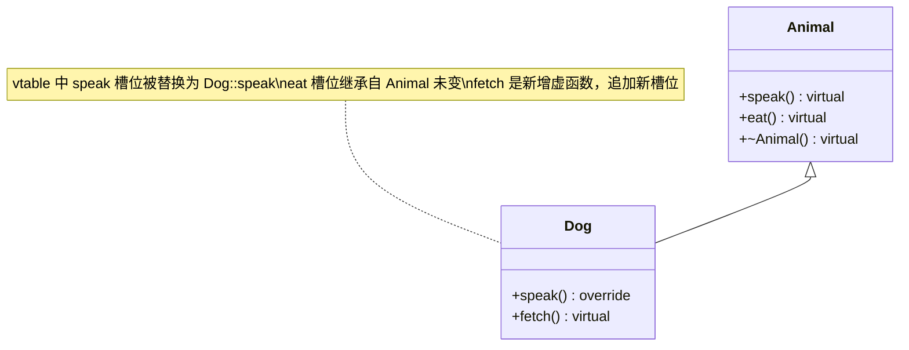
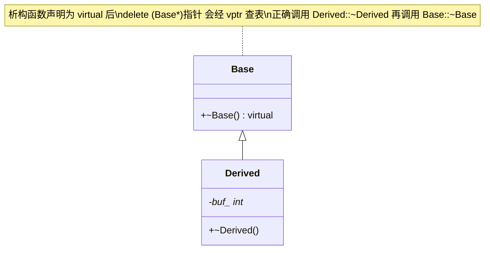

# C++ 面经 3 · 多态、虚函数与关键字

这一讲覆盖两条主线。第一条是多态：动态多态怎么靠虚函数表和虚指针在运行时完成分发、为什么析构函数经常要声明成虚函数而构造函数永远不能是虚函数、静态多态（重载、模板）和动态多态在触发时机上的本质区别。第二条是一组高频关键字：`static`、`const`、`extern`、`volatile`、四种类型转换、预处理指令、`typedef`/`define`、`override`。这些题目单独看很零碎，但面试官真正想考的是你对"编译期 vs 运行时""声明 vs 定义""类型安全"这几组对立概念的掌握程度。把每个关键字都放回这几组对立概念里去理解，比死记语法规则更抗问。

```text
1. 遇到"这是不是多态"的题，先问两个问题：调用点在编译期就能唯一确定目标函数吗？如果能，是静态多态（重载/模板）或者根本不是多态；如果要等运行时看对象的动态类型才能确定，是动态多态（虚函数）。
2. 遇到虚函数相关的内存/性能题，先画图：对象内存布局里 vptr 在哪、vtable 里各个槽位存的是谁的函数指针，图画对了，构造顺序、覆盖规则、多重继承下的 vptr 数量这些问题基本可以照图回答。
3. 遇到"某个函数能不能是虚函数"的题（构造函数、静态成员函数、模板成员函数），先看虚函数机制依赖的两个前提是否满足：对象已经有一个确定指向"当前动态类型"vtable 的 vptr；调用点确实是通过某个具体对象（隐式 this）发起的。哪个前提不满足，哪个就不能是虚函数。
4. 遇到关键字辨析题，先定位这个关键字在起作用的"阶段"：预处理阶段（#define、#ifdef、extern "C" 之外的宏)、编译阶段（typedef、const、static 的类型检查、override 的签名检查）、链接阶段（extern、static 的链接性）、运行时（volatile 禁止的优化、dynamic_cast 的 RTTI 查询）。分清阶段，很多"区别是什么"的问题会自动变得清晰。
5. 遇到类型转换题，先问"这个转换需不需要运行时检查"和"要不要修改 const/volatile 属性"，四种 cast 的定位马上就能对上号。
```

---

## 1. 多态：动态多态与静态多态

**核心结论**：多态广义上指"同一段调用代码在不同情况下执行不同的具体实现"，这句定义本身不限定"不同情况"是在编译期区分还是运行时区分。据此可以把 C++ 的多态分成两类：静态多态（编译期多态）在编译阶段就唯一确定调用哪个版本，靠函数重载、运算符重载、模板实现；动态多态（运行时多态）要等到程序运行、拿到对象的实际类型之后才能确定调用哪个版本，靠虚函数加继承体系实现。面试里不加限定词说"C++ 的多态"，默认指动态多态，但完整回答应该主动区分两类，这是加分项而不是可选项。

两者的差异集中在"绑定时机"上：

```cpp
// 静态多态：重载，编译期决定调用哪个版本
void print(int x)    { std::cout << "int: " << x << "\n"; }
void print(double x) { std::cout << "double: " << x << "\n"; }

print(1);    // 编译期就确定调用 print(int)
print(1.5);  // 编译期就确定调用 print(double)

// 动态多态：虚函数，运行时决定调用哪个版本
struct Animal { virtual void speak() const { std::cout << "...\n"; } };
struct Dog : Animal { void speak() const override { std::cout << "Woof\n"; } };

void makeSpeak(const Animal& a) {
    a.speak(); // 编译期只知道 a 是 Animal&，具体调哪个版本要看 a 运行时绑定的实际对象
}

Dog d;
makeSpeak(d); // 输出 Woof，但这个决定发生在运行时
```

`print` 调哪个重载版本，编译器在看到调用点的实参类型时就已经写死进了生成的机器码里，不需要任何运行时查表。`makeSpeak` 里的 `a.speak()` 不同：编译器只能确定"调用某个 `Animal` 子类的 `speak`"，具体是哪一个，取决于运行时传进来的对象到底是什么类型，这一步必须在程序运行时通过虚函数表完成。

| 对比维度 | 静态多态（重载/模板） | 动态多态（虚函数） |
|---|---|---|
| 绑定时机 | 编译期 | 运行时 |
| 依赖机制 | 函数签名匹配 / 模板实例化 | 虚函数表 + 虚指针 |
| 是否需要继承 | 不需要 | 需要（基类指针/引用 + 派生类覆盖） |
| 调用开销 | 无额外开销，等价于直接调用 | 多一次查表间接寻址，通常还多一次指针解引用 |
| 典型场景 | `std::max`、运算符重载、STL 模板算法 | 抽象基类定义接口、工厂模式、多态容器 |

**常见追问 / 面试陷阱**

> 追问"运算符重载算不算多态"：算，且是静态多态的一种，编译器根据操作数类型在编译期决定调用哪个重载版本。常见陷阱是把"重载"笼统地归为"和虚函数一样的多态"而不区分绑定时机，面试官通常想听到你明确说出"重载是编译期决定，虚函数是运行时决定"这句话，而不是笼统地说"都是多态"。

---

## 2. 虚函数实现动态多态的原理：vtable 与 vptr

**核心结论**：动态多态的底层机制是虚函数表（virtual table，简称 vtable）加虚指针（virtual pointer，简称 vptr）。编译器为每个含有虚函数的类生成一张 vtable，表里按声明顺序存放该类所有虚函数的函数指针；每个这样的类的对象实例（不是类本身）会多出一个隐藏成员 vptr，指向它所属类的那张 vtable。通过基类指针或引用调用虚函数时，程序在运行时先解引用对象的 vptr 找到对应的 vtable，再按这个虚函数在表中的固定槽位取出函数地址并调用，这一步叫动态绑定（dynamic binding），和编译期就把调用地址写死的静态绑定相对。

先看单个对象的内存布局。一个含虚函数的类，它的对象在内存里 vptr 通常排在最前面（具体位置是实现细节，不是标准强制的，但主流实现都这样做）：

```text
class Animal {
    virtual void speak() const;
    virtual ~Animal();
    int age_;
};

Animal 对象的内存布局：
+----------------+
| vptr           |  ---> 指向 Animal 的 vtable
+----------------+
| age_           |
+----------------+
```

再看两层继承下 vtable 槽位的覆盖情况。假设 `Dog` 覆盖了 `speak`，新增了 `fetch`：

```cpp
struct Animal {
    virtual void speak() const { std::cout << "...\n"; }
    virtual void eat()   const { std::cout << "eating\n"; }
    virtual ~Animal() = default;
};

struct Dog : Animal {
    void speak() const override { std::cout << "Woof\n"; } // 覆盖
    virtual void fetch() const { std::cout << "fetching\n"; } // 新增虚函数
};
```

```text
Animal::vtable                  Dog::vtable
+----------------------+        +----------------------+
| slot0: Animal::speak |        | slot0: Dog::speak     |  <- 被覆盖
| slot1: Animal::eat   |        | slot1: Animal::eat    |  <- 继承，未覆盖，指针不变
| slot2: Animal::~Animal|       | slot2: Dog::~Dog      |  <- 析构函数也是虚函数槽位之一
+----------------------+        | slot3: Dog::fetch     |  <- 新增，追加在表尾
                                 +----------------------+
```

`Dog` 对象的 vptr 指向 `Dog::vtable`，所以通过 `Animal*` 指向一个 `Dog` 对象再调用 `speak()`，查到的是 slot0 里 `Dog::speak` 的地址，这就是"基类指针调用出派生类版本"的全部原理。用类图表示这层继承和虚函数覆盖关系：



**虚函数 vs 纯虚函数**：虚函数 `virtual void f();` 有默认实现（也可以在类内直接写函数体），派生类可以选择覆盖也可以不覆盖，不覆盖就沿用基类版本。纯虚函数在声明末尾加 `= 0`：

```cpp
class Shape {
public:
    virtual double area() const = 0; // 纯虚函数：没有强制要求不能有实现，但类仍是抽象类
    virtual ~Shape() = default;
};
```

含有至少一个纯虚函数的类是抽象类（abstract class），不能被实例化，`Shape s;` 无法通过编译。纯虚函数的意义是强制派生类必须提供自己的实现：如果一个派生类没有覆盖基类的所有纯虚函数，这个派生类自己也仍然是抽象类，同样不能实例化。需要注意一个容易被忽略的细节：纯虚函数可以有函数体（`double Shape::area() const { return 0; }` 这种写法合法），只是这个类因为声明里的 `= 0` 仍然是抽象类；这个函数体通常用于给派生类提供一个可选调用的默认实现，派生类可以显式调用 `Shape::area()` 复用这段代码。

**常见追问 / 面试陷阱**

> 追问"每个对象都有一份 vtable 吗"：不是，vtable 是按类生成的，同一个类的所有对象共享同一张 vtable，只有 vptr 是每个对象各自持有的一份数据（因为不同对象可能是不同派生类，vptr 需要各自指向正确的表）。追问"多重继承下一个对象有几个 vptr"：如果一个类从多个含虚函数的基类多重继承而来，通常会有多个 vptr（每个基类子对象各自维护自己的 vptr），这也是多重继承下对象体积和虚函数调用开销都会增加的原因之一。

---

## 3. 父类析构函数是否应为虚函数？构造函数能不能是虚函数？

**核心结论**：任何可能被多态使用的基类（也就是可能通过基类指针或引用 `delete` 一个派生类对象）都应该把析构函数声明为虚函数，否则会发生资源泄露；反过来，构造函数在语法上直接被禁止声明为 `virtual`，因为虚函数机制依赖的前提（对象的 vptr 已经指向"当前动态类型"对应的 vtable）在构造函数执行期间根本不成立。

**析构函数为什么要是虚函数**：先看不加 `virtual` 会出什么问题。

```cpp
class Base {
public:
    ~Base() { std::cout << "~Base\n"; } // 没有声明为 virtual
};

class Derived : public Base {
public:
    Derived() : buf_(new int[100]) {}
    ~Derived() { delete[] buf_; std::cout << "~Derived\n"; }
private:
    int* buf_;
};

Base* p = new Derived();
delete p; // 只打印 "~Base"，Derived 的析构函数根本没被调用，buf_ 造成内存泄露
```

`delete p` 这一步，编译器在编译期只知道 `p` 的静态类型是 `Base*`，如果 `~Base` 不是虚函数，编译器会直接静态绑定到 `Base::~Base`，完全不去查 vtable，`Derived::~Derived` 也就永远不会被执行，`buf_` 指向的堆内存永远不会被释放。把 `~Base` 声明成 `virtual ~Base() {}` 之后，`delete p` 会通过 vptr 查表找到 `Derived::~Derived`，并且派生类析构函数执行完毕后会自动继续调用基类析构函数（析构函数的调用链本身不需要手动传递，语言保证），资源被正确释放。这也是为什么"这个基类会不会被多态地使用"是判断要不要写虚析构函数的标准：只要存在"用户可能通过基类指针管理这个对象生命周期"的可能性，基类析构函数就应该是虚函数，这是一条工程上的强约定。

反过来，如果一个类明确不打算被继承，或者即便被继承也不会通过基类指针/引用管理生命周期（比如只是复用实现的私有继承），不声明虚析构函数可以省下一个 vptr 的空间开销和一次查表的调用开销。这正是很多 STL 容器和工具类型（`std::vector`、`std::string` 等）不设计虚析构函数的原因：它们的设计意图是被组合使用而不是被继承，公开继承 `std::vector` 然后通过 `std::vector*` 删除派生类对象是不安全的用法。



**构造函数为什么不能是虚函数**：虚函数的动态分发依赖对象已经有一个正确设置好、指向"当前动态类型"vtable 的 vptr。但对象的 vptr 恰恰是在构造过程中被逐层建立起来的：基类构造函数执行期间，vptr 指向的是基类自己的 vtable（哪怕这个对象最终会是某个派生类的实例）；等到派生类的构造函数体开始执行，vptr 才会被更新指向派生类的 vtable。构造函数运行的目的就是把一个尚未初始化完全的内存区域变成一个合法对象，在这个过程还没走完之前，"这个对象的动态类型"这个概念本身还没有一个稳定的答案，虚函数机制赖以工作的前提不成立，所以 C++ 标准直接在语法层面禁止给构造函数加 `virtual` 关键字，写了会编译报错。

一个经常和这条规则一起考的陷阱是：在构造函数里调用虚函数，不会触发"面向最终派生类型"的动态多态。

```cpp
struct Base {
    Base() { init(); } // 在基类构造函数里调用虚函数
    virtual void init() { std::cout << "Base::init\n"; }
};

struct Derived : Base {
    void init() override { std::cout << "Derived::init\n"; }
};

Derived d; // 输出 "Base::init"，而不是 "Derived::init"
```

`Base()` 执行时，`Derived` 部分的成员还完全没有初始化，此时 `this` 的 vptr 指向的是 `Base` 的 vtable，`init()` 调用的是 `Base::init`，即使这个对象最终会是一个完整的 `Derived`。如果这里真的动态分发到 `Derived::init`，而 `Derived::init` 里又访问了 `Derived` 自己还没初始化的成员，就是未定义行为。语言选择让构造函数里的虚函数调用严格按照"当前正在构造的这一层"来解析，正是为了避免这种访问未初始化状态的风险。析构函数里调用虚函数有对称的规则：进入派生类析构函数体之后，vptr 已经被回退指向基类的 vtable，所以基类析构函数里调用虚函数同样只会分发到基类自己的版本。

**常见追问 / 面试陷阱**

> 追问"纯虚析构函数合法吗"：合法，`virtual ~Base() = 0;` 是把一个类强制变成抽象类的常见手法之一（尤其当这个类没有其他纯虚函数、但又想禁止直接实例化时）。要注意纯虚析构函数仍然必须提供函数体（可以在类外定义一个空实现），因为析构链的调用机制要求每一层析构函数都必须能被实际执行，不能像普通纯虚函数那样什么都不写。

---

## 4. 静态多态：重写、重载、模板

**核心结论**：重写（override）是动态多态的实现手段，运行时通过虚函数表分发，要求派生类函数和基类虚函数签名（参数列表、`const` 属性；返回类型允许协变）完全一致；重载（overload）是编译期现象，指同一作用域内出现多个同名但参数列表不同的函数，编译器在调用点根据实参类型静态选出最匹配的一个；模板是编译期为每一种实际用到的类型生成一份独立的代码（模板实例化），本质上是把"针对不同类型执行不同代码"这件事完全放到编译期完成，因此模板编程也被称为编译期多态。

```cpp
// 重写：签名必须与基类虚函数完全一致，运行时通过 vtable 分发
struct Base { virtual void f(int x) const; };
struct Derived : Base { void f(int x) const override; }; // 正确覆盖

// 重载：同一作用域，同名不同参数列表，编译期按实参类型匹配
void g(int x);
void g(double x);
void g(const std::string& s);

// 模板：编译期为每种实际类型生成一份代码
template <typename T>
T maxVal(T a, T b) { return a > b ? a : b; }

maxVal(1, 2);       // 实例化出 int 版本
maxVal(1.5, 2.5);   // 实例化出 double 版本
```

| 对比维度 | 重写 override | 重载 overload | 模板 template |
|---|---|---|---|
| 触发条件 | 派生类定义与基类虚函数签名一致的函数 | 同一作用域内同名、参数列表不同 | 用不同类型参数实例化同一份模板代码 |
| 绑定时机 | 运行时 | 编译期 | 编译期（实例化时确定） |
| 是否需要继承 | 需要 | 不需要 | 不需要 |
| 是否需要虚函数 | 需要（基类函数必须是 `virtual`） | 不需要 | 不需要 |
| 是否属于多态 | 属于动态多态 | 属于静态多态 | 属于静态多态（编译期多态） |

**常见追问 / 面试陷阱**

> 追问"返回类型不同算不算重载"：不算。C++ 的重载决议只看参数列表（包括参数的 `const`/引用限定），不看返回类型，两个函数如果只有返回类型不同、参数列表完全相同，会被判定为重复定义而编译报错，不会被当成合法的重载。追问"重写时返回类型必须完全一致吗"：不是绝对的，C++ 支持协变返回类型（covariant return type）：如果基类虚函数返回 `Base*`（或 `Base&`），派生类覆盖版本允许返回 `Derived*`（或 `Derived&`），只要 `Derived` 是 `Base` 的可访问、明确的公有派生类。

---

## 5. `static` 关键字

**核心结论**：`static` 在 C++ 里根据修饰对象的不同，含义完全不同，但可以归纳为一条主线：延长生命周期或者限制可见范围。修饰局部变量时延长生命周期，修饰全局变量/函数时限制链接范围，修饰类成员时把"属于对象"变成"属于类"。

**修饰局部变量**：`static` 局部变量只在第一次执行到它的定义处时被初始化一次，之后每次进入这个函数都不会重新初始化，它的生命周期跨越多次函数调用、持续到程序结束，但它的作用域仍然只限于定义它的那个函数内部（外部代码看不到、访问不到这个变量）。

```cpp
int callCount() {
    static int count = 0; // 只在第一次调用时初始化为 0
    return ++count;
}

callCount(); // 返回 1
callCount(); // 返回 2，count 的值在两次调用之间被保留下来
```

**修饰全局变量 / 文件作用域函数**：在文件作用域（不在任何类或函数内部）声明的变量或函数前加 `static`，会把该符号的链接性从默认的外部链接（external linkage，其他翻译单元可以通过 `extern` 引用到它）改成内部链接（internal linkage，只在当前翻译单元内可见，其他 `.cpp` 文件即使用 `extern` 声明同名符号也链接不到它）。这是 C 语言里 `static` 关键字最初、也是唯一的用法，用来实现"文件私有"的效果，避免多个源文件里的同名全局符号在链接阶段发生冲突。

```cpp
// file1.cpp
static int internalCounter = 0; // 只在 file1.cpp 内可见，file2.cpp 无法通过 extern 访问到它
static void helper() { /* ... */ } // 同理，file2.cpp 无法链接到这个函数
```

**修饰类的成员变量**：静态成员变量属于类本身，不属于任何一个具体对象，所有实例共享同一份存储，通常需要在类外单独定义（分配存储空间），因为类内的声明只是声明不是定义。

```cpp
class Counter {
public:
    static int instanceCount; // 类内声明
};
int Counter::instanceCount = 0; // 类外定义，分配实际存储

// C++17 起，用 inline static 可以直接在类内完成定义 + 初始化，不需要类外再写一行
class Counter2 {
public:
    inline static int instanceCount = 0; // 合法，多个翻译单元包含这个头文件也不会重复定义报错
    static constexpr int kMaxInstances = 100; // constexpr 静态成员隐式是 inline 的（C++17 起），本来就可以类内初始化
};
```

**修饰类的成员函数**：静态成员函数没有隐式的 `this` 指针，因此只能直接访问类的静态成员（静态数据成员、其他静态成员函数），不能访问非静态成员（因为非静态成员依赖具体对象，而静态成员函数根本不绑定到任何对象）。静态成员函数不能被声明为 `virtual`，因为虚函数机制依赖运行时通过某个具体对象的 vptr 去查表，而静态成员函数的调用根本不经过任何对象实例，"哪个对象的动态类型"这个前提对静态成员函数不存在。

**C 语言的 `static` 和 C++ 的 `static` 有什么区别**：C 语言的 `static` 只有两种含义：修饰全局变量/函数时表示内部链接，修饰局部变量时表示该变量的生命周期跨越函数调用持续到程序结束。C++ 在完全保留这两种含义的基础上，因为引入了类的概念，新增了第三种含义：修饰类的成员（数据成员或成员函数）时表示"归属于类而非对象"，这是纯粹面向对象语境下才有意义的用法，C 语言里没有对应物（C 的 `struct` 不能有成员函数，也没有"类的静态成员"这个概念）。

**常见追问 / 面试陷阱**

> 追问"`static` 局部变量的初始化是不是线程安全的"：C++11 起标准规定，函数内 `static` 局部变量的初始化在多线程环境下是线程安全的：如果多个线程同时第一次执行到这行代码，编译器生成的代码会保证初始化只发生一次，其他线程会阻塞等待初始化完成（这条规则常被称为"magic statics"）。这是 C++11 之后才有的标准保证，C++11 之前的实现不一定有这个保证。

---

## 6. `const` 关键字

**核心结论**：`const` 表达"这段代码里这个东西不可被修改"，编译器在编译期做这项检查。它可以修饰变量、指针、类的对象、类的成员函数，每种场景的语义各不相同，但核心都是"承诺不修改"。

**修饰变量**：`const int x = 5;` 声明一个编译期检查的常量，之后任何试图修改 `x` 的代码都会在编译期报错。

**修饰指针**：区分"指向常量的指针"（`const int* p`，指针本身可以改指向，但不能通过 `p` 修改它指向的值）和"常量指针"（`int* const p`，指针本身不能改指向，但可以通过 `p` 修改它指向的值）。这部分详细的类型读法（从右往左读、`const` 在 `*` 左右的区别）留在讲内存与指针的一篇里展开，这里只需要记住这两种语义是独立的，可以同时叠加成 `const int* const p`（指向常量的常量指针，两者都不能改）。

**修饰类的对象**：`const` 对象只能调用被声明为 `const` 的成员函数，调用非 `const` 成员函数会被编译器拒绝，因为非 `const` 成员函数没有承诺不修改对象状态，编译器无法保证调用它不会破坏这个对象的 `const` 属性。

**修饰类的成员函数**：`const` 成员函数在参数列表后加 `const`，本质是给隐式的 `this` 指针加上 `const`（相当于 `this` 的类型从 `T*` 变成 `const T*`），承诺函数体内不会修改 `this` 指向对象的非 `mutable` 成员。`const` 成员函数既可以被 `const` 对象调用，也可以被非 `const` 对象调用（非 `const` 对象的能力是 `const` 对象能力的超集）。

```cpp
class Widget {
public:
    int getValue() const { return value_; } // const 成员函数：承诺不修改 *this
    void setValue(int v) { value_ = v; }     // 非 const，不能被 const 对象调用

private:
    int value_;
};

const Widget w{};
w.getValue();  // 合法
// w.setValue(1); // 编译错误：const 对象不能调用非 const 成员函数
```

**`mutable` 关键字**：`mutable` 修饰的成员变量可以在 `const` 成员函数里被修改，用来表达"这个成员不算这个对象的逻辑状态的一部分，即使从外部看这个对象是常量，这个内部记账用的字段仍然允许变化"，典型场景是缓存字段和互斥锁：

```cpp
class ExpensiveComputation {
public:
    int result() const {
        if (!cached_) {
            cache_ = computeSlowly(); // 修改 mutable 成员，即使这是个 const 成员函数
            cached_ = true;
        }
        return cache_;
    }

private:
    int computeSlowly() const { /* 昂贵计算 */ return 42; }
    mutable int cache_ = 0;
    mutable bool cached_ = false; // 缓存标记，不属于对象的"逻辑状态"，允许在 const 函数里改
};
```

从调用方视角看，`result()` 是一个 `const` 操作（不改变这个对象在逻辑上代表的值），但它的内部实现需要惰性计算并缓存结果，`mutable` 就是用来协调这两者的机制。

**常见追问 / 面试陷阱**

> 追问"`const` 成员函数里能不能调用非 `const` 成员函数"：不能直接调用，因为 `this` 在 `const` 成员函数里的类型是 `const T*`，而非 `const` 成员函数要求的 `this` 类型是 `T*`，这是类型不匹配，编译器会报错。唯一的绕过方式是通过 `const_cast` 去掉 `const`（第 9 节详细讲），但这样做的前提是这个对象本身确实不是真正的 `const` 对象，否则修改行为未定义。

---

## 7. `extern` 关键字

**核心结论**：`extern` 修饰全局变量或函数时表示"这是一个声明，不是定义"，告诉编译器这个符号在别的翻译单元里已经有定义，当前文件只是要用它，实际的存储分配和链接工作留到链接阶段去别的目标文件里找。`extern "C"` 是它的另一个重要用法，作用是关闭 C++ 特有的 name mangling（名字修饰），让 C++ 代码可以正确调用用 C 编译器编译出的函数，反过来也可以让 C 代码调用按 C 规则导出符号的 C++ 函数。

```cpp
// header.h
extern int globalCounter; // 声明：告诉编译器这个变量在别处定义，这里先不分配存储

// source1.cpp
#include "header.h"
int globalCounter = 0; // 定义：真正分配存储的地方

// source2.cpp
#include "header.h"
void useCounter() {
    globalCounter++; // 链接阶段会找到 source1.cpp 里的定义
}
```

C++ 编译器为了支持函数重载，会把函数的参数类型信息编码进函数的实际符号名里（name mangling），而 C 编译器不做这件事，符号名就是函数名本身。如果 C++ 代码想调用一个用 C 编译器编译好的库函数，必须告诉 C++ 编译器"按 C 的规则去找这个符号名，不要做 name mangling"，这就是 `extern "C"` 的作用：

```cpp
extern "C" {
    void c_style_function(int x); // 按 C 的链接规则处理，不做 C++ 的 name mangling
    int  c_style_add(int a, int b);
}
```

`extern "C"` 只影响链接方式（符号名怎么生成、怎么匹配），不改变语言本身的语法规则。括号内仍然是合法的 C++ 声明语法，只是编译器在生成符号名和做函数重载决议时会按 C 的约定处理这些声明。

**常见追问 / 面试陷阱**

> 追问"为什么很多 C 库的头文件里会看到 `#ifdef __cplusplus extern "C" { #endif ... #ifdef __cplusplus } #endif` 这种写法"：这是让同一份头文件既能被 C 代码 `#include`，又能被 C++ 代码 `#include` 的标准写法：`__cplusplus` 宏只有在用 C++ 编译器编译时才会被定义，这段条件编译保证只有在 C++ 环境下才会加上 `extern "C"`，纯 C 环境下这段代码原样是普通的函数声明，不受影响。

---

## 8. `volatile` 关键字

**核心结论**：`volatile` 告诉编译器，每次访问这个变量都必须真正读写内存，不允许把它缓存进寄存器、不允许因为"编译器认为这个值不会变"而做常量传播、指令重排等优化。典型使用场景是内存映射的硬件寄存器（寄存器的值可能被外部硬件随时改变，编译器看不到这种变化，必须强制每次都重新读取）和会被中断服务程序或信号处理函数异步修改的变量。

```cpp
volatile uint32_t* const statusRegister = reinterpret_cast<volatile uint32_t*>(0x40000000);

while ((*statusRegister & 0x1) == 0) {
    // 没有 volatile，编译器可能认为循环体内没有代码修改 *statusRegister，
    // 于是把这次读取结果缓存进寄存器，把这个循环优化成死循环；
    // 有 volatile，编译器保证每次循环都真的重新从内存地址读一次
}
```

需要明确纠正的误用：`volatile` 不提供原子性，也不提供任何内存序（memory order）保证，它只保证"不做编译期优化、每次都访问真实内存"，不保证多核 CPU 下这次写入什么时候能被其他核心看到，也不保证多个 `volatile` 变量之间的读写顺序在多线程下不会被 CPU 乱序执行重排。多线程间的同步应该使用 `std::atomic`（配合恰当的内存序）或者互斥锁这类真正提供原子性和同步语义的工具，把 `volatile` 当成多线程同步手段是一个常见但错误的用法，这个误区在早期 Java/C# 语境里也存在，C++ 的 `volatile` 语义更弱，专门只针对编译器优化，和硬件层面的可见性、原子性没有关系。

**一个变量可以既是 `const` 又是 `volatile` 吗**：可以，`const volatile int x;` 这个组合语义上表示"当前这段代码不能修改它（`const`），但它的值可能被外部因素随时改变（`volatile`），所以每次读取都不能用缓存的旧值"。典型场景是只读的硬件状态寄存器：程序只从这个地址读取状态，不会去写它，所以标 `const`；但寄存器的值由硬件更新，程序看不到这种更新，所以标 `volatile` 防止编译器优化掉重复读取。

```cpp
const volatile uint32_t* hardwareStatus = /* 硬件状态寄存器地址 */;
uint32_t s = *hardwareStatus; // 只读，且每次都必须真实读内存，不能用编译器缓存的旧值
```

**常见追问 / 面试陷阱**

> 追问"`volatile` 能不能让一个变量在多线程下的自增操作变成原子的"：不能。`count++` 无论是否加 `volatile`，本质上都是"读取当前值、加一、写回"三个步骤，`volatile` 只保证这三步里的读和写都不会被优化掉或缓存，但不能保证这三步作为一个整体不被其他线程的操作打断，多个线程同时对同一个 `volatile` 变量做自增仍然会有数据竞争，正确做法是用 `std::atomic<int>` 并调用它的 `fetch_add` 或 `++` 运算符。

---

## 9. 四种类型转换：static_cast、dynamic_cast、const_cast、reinterpret_cast

**核心结论**：C++ 用四个命名清晰的转换运算符取代 C 风格的 `(Type)x` 强制转换，每一个负责一类语义明确、安全等级不同的转换。`static_cast` 是编译期检查的"常规"转换；`dynamic_cast` 是运行时检查的多态类型转换；`const_cast` 是唯一能增删 `const`/`volatile` 修饰的转换；`reinterpret_cast` 是几乎不做任何检查的按位重新解释。

**`static_cast`**：用于数值类型之间的转换（`int` 到 `double`）、有继承关系的指针或引用之间的转换、`void*` 与具体类型指针之间的转换等编译器能在编译期验证合理性的场景。对继承体系，从派生类指针转到基类指针（上行转换，upcast）总是安全的，因为派生类对象天然包含一个完整的基类子对象；从基类指针转到派生类指针（下行转换，downcast）时 `static_cast` 不做任何运行时检查，只是简单地按照声明的目标类型重新解释指针，如果这个基类指针实际指向的不是目标派生类对象，转换后访问派生类新增的成员是未定义行为。

```cpp
double d = static_cast<double>(42);         // 数值转换，编译期检查
Base* b = static_cast<Base*>(new Derived);  // 上行转换，总是安全
Derived* d2 = static_cast<Derived*>(b);     // 下行转换：编译器不检查 b 实际指向什么，用者自行保证
```

**`dynamic_cast`**：专门用于沿继承体系做运行时检查的类型转换，要求转换涉及的类型至少有一个是多态类型（polymorphic type，即含有虚函数的类，不管是自己声明的还是从基类继承来的）。下行转换失败时，对指针返回 `nullptr`，对引用则抛出 `std::bad_cast` 异常（引用不能是空的，所以不能用返回空值的方式表达失败）。它依赖 RTTI（Run-Time Type Information，运行时类型信息）：多态对象通过 vptr 间接关联到编译器为每个多态类型生成的类型描述信息，`dynamic_cast` 在运行时借助这份信息判断指针实际指向的对象是不是目标类型或其派生类型。

```cpp
Base* b = new Derived;
if (Derived* d = dynamic_cast<Derived*>(b)) {
    // 转换成功，d 不是 nullptr，可以安全使用派生类接口
} else {
    // b 实际不是 Derived 或其派生类，转换失败，返回 nullptr
}

Base& refBase = *b;
try {
    Derived& refDerived = dynamic_cast<Derived&>(refBase);
} catch (const std::bad_cast& e) {
    // 引用形式转换失败会抛异常
}
```

**`const_cast`**：四种转换里唯一能够增加或去掉 `const`（以及 `volatile`）修饰的转换，其他三种都不允许改变 `const` 属性。它只应该用在一种安全场景：对象本身不是真正的 `const` 对象，只是当前代码通过一个 `const` 指针或引用访问它，这种情况下用 `const_cast` 去掉 `const` 再修改是合法的；如果对象本身在定义时就是 `const`（比如 `const int x = 5;`），通过 `const_cast` 去 `const` 后再修改它是未定义行为，即使程序不一定立刻崩溃。

```cpp
void legacyApi(char* s); // 一个不接受 const char* 的旧接口，但实际不会修改内容

void call(const std::string& s) {
    legacyApi(const_cast<char*>(s.c_str())); // 危险但常见的用法，前提是确信 legacyApi 不会真的修改内容
}

const int x = 5;
int* p = const_cast<int*>(&x);
*p = 10; // 未定义行为：x 本身就是 const 对象，修改它是非法的
```

**`reinterpret_cast`**：四种转换里最不安全的一种，用于指针类型之间几乎没有语义关联的强制转换，或者指针与足够容纳指针宽度的整数类型之间的转换，编译器几乎不对这种转换做任何合理性检查，只是把同一段比特位重新按目标类型解释。

```cpp
int x = 65;
int* p = &x;
char* c = reinterpret_cast<char*>(p); // 把 int* 重新解释为 char*，用于按字节访问
uintptr_t addr = reinterpret_cast<uintptr_t>(p); // 指针转整数，用于打印地址或做位运算
```

| 转换方式 | 编译期/运行时检查 | 能否用于继承体系 | 能否增删 const/volatile | 安全性 |
|---|---|---|---|---|
| `static_cast` | 编译期 | 能（上行安全，下行不检查） | 不能 | 中等，依赖调用者保证前提 |
| `dynamic_cast` | 运行时（需要 RTTI，至少一方是多态类型） | 能，专门为此设计，下行失败可检测 | 不能 | 较高，失败有明确反馈 |
| `const_cast` | 编译期 | 不涉及 | 唯一能做到的转换 | 视场景而定，改真 const 对象是未定义行为 |
| `reinterpret_cast` | 几乎不检查 | 能，但语义上不推荐 | 不能（大多数实现不允许） | 最低，几乎不做任何保证 |

**为什么不推荐直接用 C 风格 `(Type)x` 强制转换**：C 风格转换在语法上不区分意图，编译器会按一套固定的优先级尝试把它解释成 `const_cast`、`static_cast`、`static_cast` 加 `const_cast`、或者 `reinterpret_cast`（必要时还会再叠加一次 `const_cast`）里最先能编译通过的一种，写代码的人往往说不清楚自己实际触发的是哪一种，也就可能在不知不觉间执行了本不该允许的下行转换或者去 `const` 修改，且这种写法在代码里很难用文本搜索定位（`(Type)` 到处都是），而四个 C++ 转换运算符名字里就写明了意图，既方便代码审查，也方便用 `grep 'dynamic_cast\|const_cast'` 之类的命令定位所有潜在风险点。

**常见追问 / 面试陷阱**

> 追问"`dynamic_cast` 对非多态类型会怎样"：如果目标类型或源类型都不含虚函数（不是多态类型），`dynamic_cast` 用于指针/引用间的转换在编译期就会报错（因为没有 vptr 可以在运行时查询类型信息），这是和 `static_cast` 的关键区别之一：`static_cast` 对非多态类型的继承体系一样能编译通过（只是不做运行时检查）。

---

## 10. `#ifdef`、`#else`、`#endif` 与 `#ifndef` 的作用

**核心结论**：这几个是预处理阶段的条件编译指令，在编译器真正开始编译代码之前，由预处理器根据某个宏是否被定义来决定保留还是删除某一段源代码。

最常见的用途是头文件防止重复包含（include guard）：一个头文件如果在同一个翻译单元里被多次 `#include`（常见于多层头文件互相包含），如果不做防护，里面的类型定义、函数声明会被重复处理，轻则编译报错，重则出现难以排查的重复定义错误。

```cpp
// MyHeader.h
#ifndef MY_HEADER_H   // 如果 MY_HEADER_H 还没被定义
#define MY_HEADER_H   // 定义它，作为"已经被包含过一次"的标记

class MyClass { /* ... */ };

#endif // MY_HEADER_H
```

第一次 `#include "MyHeader.h"` 时 `MY_HEADER_H` 还没定义，`#ifndef` 判断为真，中间的内容被保留并且顺带定义了这个宏；同一个翻译单元里第二次再包含这个头文件时，`MY_HEADER_H` 已经被定义过，`#ifndef` 判断为假，中间内容被预处理器直接跳过，不会重复出现在最终交给编译器的代码里。更现代的写法是用非标准但被几乎所有主流编译器支持的 `#pragma once`，效果等价但写法更简洁、也避免了宏名冲突的可能性（两个不同头文件万一用了相同的 include guard 宏名会互相冲突，`#pragma once` 不存在这个问题）。

另一个常见用途是跨平台或调试/发布版本的分支编译：

```cpp
#ifdef _WIN32
    #include <windows.h>
#elif defined(__linux__)
    #include <unistd.h>
#endif

#ifdef DEBUG
    std::cout << "debug info: " << x << std::endl;
#endif
```

`#ifdef DEBUG` 这类写法可以让调试专用的日志代码只在定义了 `DEBUG` 宏的编译配置下才会真正出现在编译产物里，发布版本编译时不定义这个宏，相关代码在预处理阶段就被整段剔除，不会带来任何运行时开销。

**常见追问 / 面试陷阱**

> 追问"`#pragma once` 和传统 include guard 有什么区别"：`#pragma once` 不是 C++ 标准的一部分（是编译器扩展，但事实上被所有主流编译器支持），依赖编译器识别"这是同一个物理文件"，写法更短、不需要想一个不会和别的头文件冲突的宏名；传统 include guard 是标准做法，可移植性上没有任何疑虑，但需要程序员自己保证宏名在整个项目里唯一。两者可以同时使用互不冲突。

---

## 11. `typedef` 和 `#define` 的区别

**核心结论**：`typedef` 是编译阶段起作用的类型别名机制，编译器把它当成真正的类型来做类型检查，并且受作用域规则约束；`#define` 是预处理阶段的纯文本替换，预处理器只是机械地把代码里所有匹配的记号替换成宏定义的文本，不理解、也不检查被替换内容的类型语义，也不受任何作用域限制（一旦定义，从这一行往后的整个翻译单元都会被替换，除非用 `#undef` 取消）。

经典陷阱例子：

```cpp
typedef char* PCHAR;
PCHAR a, b;
// 等价于：char* a; char* b;
// a 和 b 都是 char*，因为 typedef 定义的是一个真正的类型 "PCHAR = char*"，
// 声明多个变量时这个类型作用于每一个变量

#define PCHAR2 char*
PCHAR2 a, b;
// 预处理阶段做纯文本替换，展开成：char* a, b;
// 因为 * 只跟在第一个变量名前面生效，实际效果是 a 是 char*，b 只是普通的 char
```

`typedef char* PCHAR;` 让 `PCHAR` 成为编译器认知里一个完整的类型，`PCHAR a, b;` 在类型系统层面就是"声明两个 `PCHAR` 类型（也就是 `char*` 类型）的变量"，语义清晰。而 `#define PCHAR2 char*` 只是告诉预处理器"看到 `PCHAR2` 就换成 `char*`"，替换是逐字符串的，`PCHAR2 a, b;` 被机械展开成 `char* a, b;`，而这一行按 C++ 语法解析，`*` 只修饰紧跟在它后面的第一个声明符 `a`，`b` 声明的是普通 `char` 而不是 `char*`，这个差异在写宏的人没意识到的情况下极容易造成隐藏的 bug。

再看一个经典的"标准"宏：`MIN` 的实现和它的括号陷阱。

```cpp
#define MIN(a, b) ((a) < (b) ? (a) : (b))
```

每个参数都套一层括号、整个表达式再套一层括号，都是为了防止宏展开后运算符优先级发生意外。如果写成不带括号的 `#define MIN(a, b) a < b ? a : b`：

```cpp
int x = MIN(1, 2) + 3;
// 期望展开成 ((1) < (2) ? (1) : (2)) + 3，结果是 1 + 3 = 4
// 实际（去掉参数括号后）展开成 1 < 2 ? 1 : 2 + 3
// 按运算符优先级，? : 的优先级低于 +，这一行被解析成 1 < 2 ? 1 : (2 + 3)
// 结果变成 1（因为条件为真取第一个分支），而不是期望的 4
```

这正是为什么 `MIN` 宏的每个参数、以及整个宏体，都必须无一例外地套上括号：宏展开是纯文本替换，替换进去的表达式会和外面的代码一起重新按运算符优先级解析，任何没被括号保护起来的地方都有可能在特定的调用上下文里被错误地结合。

宏还有一个和括号无关、更本质的问题：宏参数在宏体里每出现一次就会被文本替换一次，如果传入的实参本身带有副作用，这个副作用会被执行多次。

```cpp
int i = 5, j = 10;
int m = MIN(i++, j++);
// 展开成 ((i++) < (j++) ? (i++) : (j++))
// i++ 和 j++ 在这一行里都被求值了两次（一次在比较里，一次在分支结果里）
// 而不是符合直觉的"各自自增一次"
```

因为存在这两类问题（不可控的运算符优先级组合、参数重复求值），C++ 里更推荐用 `inline` 函数或者函数模板替代这类工具宏，它们作为真正的函数参与类型检查，参数只求值一次，行为符合直觉：

```cpp
template <typename T>
inline T minVal(const T& a, const T& b) { return a < b ? a : b; }

int m = minVal(i++, j++); // i++、j++ 各自只被求值一次，行为符合预期
```

**常见追问 / 面试陷阱**

> 追问"`typedef` 能不能用于模板"：不能直接给模板本身起别名（`typedef` 要求被别名的类型是一个具体、完整的类型，而模板本身不是类型，是"生成类型的模板"）。C++11 引入的 `using` 别名声明弥补了这个缺口，`template <typename T> using Vec = std::vector<T>;` 可以给一族类型模板起别名，这是 `typedef` 做不到、而 `using` 能做到的地方，也是 `using` 别名相对 `typedef` 更现代、更推荐的原因之一。

---

## 12. `int`、`bool`、`float`、指针变量与"零值"比较的写法

**核心结论**：不同类型和"零值"比较的正确写法不一样，浅层原因是各类型的存储和比较语义不同，深层原因是"看起来直观的写法"在某些类型上会引入不必要的开销、误导性的可读性问题，甚至（对浮点数而言）根本性的错误。

**`int` 类型**：直接用 `==` 比较即可，整数在硬件层面就是精确的二进制表示，不存在精度问题。

```cpp
int n = 0;
if (n == 0) { /* ... */ }
```

**`bool` 类型**：推荐 `if (!flag)` 或者 `if (flag == false)` 来判断"假"，判断"真"直接写 `if (flag)` 即可，不需要写 `if (flag == true)`。`flag == true` 属于多余写法：`true` 本身就是 `bool` 类型的字面量，`if (flag)` 已经在语义上完整表达了"当 `flag` 为真时执行"，多写一层比较不会更清晰，反而是常见的初学者冗余写法，代码审查里通常会被要求去掉。

```cpp
bool flag = false;
if (!flag) { /* ... */ }       // 推荐
if (flag) { /* ... */ }        // 推荐，不需要写成 if (flag == true)
```

**`float`/`double` 类型**：不能直接用 `==` 和 `0.0` 比较。浮点数在硬件里用二进制科学计数法（IEEE 754）表示，很多十进制小数（比如 `0.1`）根本无法用有限位二进制精确表示，经过若干次算术运算之后的浮点数结果，即使数学上应该精确等于 0，实际存储的比特位也可能是一个极小的非零值，直接用 `==` 比较会得到违反直觉的 `false`。正确做法是判断这个浮点数是否落在一个很小的容差（epsilon）范围内：

```cpp
const double EPSILON = 1e-9;
double f = computeSomething();
if (std::fabs(f) < EPSILON) { /* 认为 f 足够接近 0 */ }
```

**指针类型**：`if (p == nullptr)`（或者简写 `if (!p)`）。C++11 起推荐用 `nullptr` 字面量而不是 `NULL` 或者裸的整数 `0` 来表示空指针，原因是类型安全：`NULL` 在很多实现里被定义为整数字面量 `0`（或者 `((void*)0)`，具体取决于实现，在 C++ 里通常是 `0` 或 `0L`），当它出现在重载决议的场景中，编译器可能把它当成一个普通的整数类型而不是指针类型，导致调用到本不该被调用的重载版本；而 `nullptr` 是 C++11 引入的、类型为 `std::nullptr_t` 的关键字，它可以隐式转换成任何指针类型，但不会被当成整数参与重载决议，从根本上消除了这类二义性。

```cpp
void f(int x);
void f(char* p);

f(NULL);    // 有些实现下 NULL 是整数 0，可能会调用 f(int) 而不是本意的 f(char*)，甚至在没有 f(char*) 时才勉强正确
f(nullptr); // 明确调用 f(char*)，因为 nullptr 的类型只能转换成指针类型，不会被当成 int
```

**常见追问 / 面试陷阱**

> 追问"为什么不能简单地把 EPSILON 定死成某个值就适用所有场景"：绝对容差（`fabs(f) < EPSILON`）在数值本身很大或者很小的场景下会失真：比较两个上百万的浮点数时，`1e-9` 的容差过于苛刻；比较两个接近 0 的极小数时，同样的容差又可能过于宽松。更严谨的做法是用相对容差（比较 `fabs(a - b)` 相对于 `fabs(a)`、`fabs(b)` 的量级），或者直接使用 `<cmath>` 里提供的 `std::numeric_limits<double>::epsilon()` 结合具体数值量级来设计容差，但面试里给出"用一个小的绝对容差判断，而不是直接 `==`"这个核心思路通常已经足够。

---

## 13. `override` 关键字；重写、重载、隐藏的区别

**核心结论**：`override` 是 C++11 引入的关键字，加在派生类成员函数声明的末尾，显式表达"这个函数打算重写某个基类虚函数"这一意图，编译器会检查这个函数的签名是否真的能匹配到基类里某一个虚函数，匹配不上就在编译期直接报错。它不改变程序的运行时行为，纯粹是一道编译期安全网，专门用来防止"重写签名写错却没有任何报错提示，只在运行时才会发现调用错了版本"这类隐蔽 bug。

```cpp
struct Base {
    virtual void handle(int x) const;
};

struct Derived : Base {
    void handle(int x) override;
    // 编译错误：Base::handle 是 const 成员函数，这里少写了 const，
    // 这其实定义了一个新的、和基类同名但不同签名的函数（构成隐藏而不是重写），
    // 但因为写了 override，编译器会主动检查并报错，而不是让它悄悄编译通过
};
```

如果不写 `override`，上面这段代码在没有 `const` 的情况下依然能编译通过，只是 `Derived::handle` 不再重写 `Base::handle`，而是隐藏了它，这类 bug 往往要到运行时通过基类指针调用却发现走的是基类逻辑才会被发现，排查成本高。`override` 把这类问题提前到编译期，是现代 C++ 里工程规范强烈建议的写法：每一个意图重写基类虚函数的派生类函数都应该带 `override`。

**重写、重载、隐藏的区别**：

- **重写（override）**：派生类虚函数的签名（参数列表、`const`/引用限定符）与基类某个虚函数完全一致（协变返回类型除外），运行时通过虚函数表分发到派生类版本。
- **重载（overload）**：同一作用域内（比如同一个类里）出现多个同名函数，参数列表不同，编译期根据调用点的实参类型静态选出最匹配的一个。
- **隐藏（hiding）**：派生类定义了一个和基类某个成员函数同名的函数，但不构成有效的重写（不管这个基类函数是不是虚函数，也不管参数列表是否相同），这会导致基类中所有同名的函数（包括所有重载版本）在派生类的作用域下都被隐藏掉，不再参与派生类对象上的名字查找和重载决议。

```cpp
struct Base {
    void f(int x)    { std::cout << "Base::f(int)\n"; }
    void f(double x) { std::cout << "Base::f(double)\n"; }
};

struct Derived : Base {
    void f(const std::string& s) { std::cout << "Derived::f(string)\n"; }
    // 这里没有用 using 引入 Base::f，Derived::f 和 Base 里两个 f 参数列表都不同，
    // 但只要名字相同、且不构成有效重写，Base 的两个重载版本都会被隐藏
};

Derived d;
d.f("hello");  // 输出 Derived::f(string)
d.f(1);        // 编译错误！Base::f(int) 已经被隐藏，即使参数类型明显更匹配 f(int)
               // 编译器在 Derived 作用域找到同名的 f 后就停止向上查找，
               // 不会再去 Base 里找更匹配的重载
```

`d.f(1)` 报错是这里最容易踩的陷阱：直觉上编译器应该在 `Base::f(int)`、`Base::f(double)`、`Derived::f(const string&)` 里挑一个最匹配的，但 C++ 的名字查找规则是先在派生类作用域找到名字 `f`，找到就停止继续往基类作用域找，然后才在这个作用域内部做重载决议，由于 `Derived` 作用域里只有一个 `f`（参数是 `const string&`），根本轮不到 `Base` 里的两个重载版本参与决议，把整数 `1` 传给 `const std::string&` 类型的参数无法隐式转换成功，因此编译报错，而不是"选中一个不够精确的版本"。

用 `using` 声明可以把基类的同名函数重新带回派生类作用域，让它们和派生类自己的版本一起参与重载决议：

```cpp
struct Derived2 : Base {
    using Base::f; // 把 Base 的所有 f 重载都引入 Derived2 的作用域
    void f(const std::string& s) { std::cout << "Derived2::f(string)\n"; }
};

Derived2 d2;
d2.f(1);       // 正常输出 Base::f(int)
d2.f("hello"); // 输出 Derived2::f(string)
```

**常见追问 / 面试陷阱**

> 追问"隐藏和重写的本质区别是什么，看名字很容易混"：重写要求签名完全匹配基类的某个**虚函数**，是运行时动态分发的机制；隐藏不要求任何签名匹配，只要派生类里出现同名函数（哪怕基类版本根本不是虚函数），就会屏蔽掉基类里所有同名的重载版本，是纯粹的编译期名字查找规则，和是否存在虚函数、是否发生运行时分发完全无关。很多人以为"参数列表不同就自动是重载"，但这条规则只在同一个类/同一个作用域内成立，跨越派生关系时，参数列表不同不能阻止隐藏发生，这正是本节例子要说明的陷阱。

---

## 快速选择题

1. 关于动态多态和静态多态，下列说法错误的是：
   A. 函数重载在编译期就能确定调用哪个版本，属于静态多态
   B. 虚函数机制下，具体调用哪个版本要等到运行时根据对象的实际类型才能确定
   C. 模板实例化发生在编译期，因此模板编程也被称为编译期多态
   D. 只要一个类里出现了虚函数，这个类的所有成员函数调用都自动变成运行时多态

**答案：D** — 只有通过基类指针/引用调用虚函数这种特定形式才触发运行时多态；同一个类里的非虚成员函数、通过对象本身（而非指针/引用）发起的调用，都仍然是编译期静态绑定，不会因为类里存在虚函数就整体变成运行时多态。

2. 关于 vtable 和 vptr，下列说法正确的是：
   A. 每个对象都有自己独立的一份 vtable
   B. vtable 按类生成，同一个类的所有对象共享同一张 vtable；vptr 是每个对象各自持有的一份数据
   C. 只有基类对象才有 vptr，派生类对象没有
   D. vptr 指向的是这个对象的基类的 vtable，与对象的实际派生类型无关

**答案：B** — vtable 是编译期为每个含虚函数的类生成的，同类对象共享；vptr 是运行时每个对象各自持有、指向"当前动态类型"vtable 的隐藏指针，与 A、C、D 描述相反。

3. 阅读下面代码，判断输出：
```cpp
struct Base {
    Base() { init(); }
    virtual void init() { std::cout << "Base::init\n"; }
};
struct Derived : Base {
    void init() override { std::cout << "Derived::init\n"; }
};
int main() { Derived d; }
```
   A. Derived::init
   B. Base::init
   C. 先输出 Base::init 再输出 Derived::init
   D. 未定义行为，输出不确定

**答案：B** — `Base()` 执行期间，对象的 vptr 还指向 `Base` 的 vtable（`Derived` 部分尚未构造），此时调用虚函数 `init()` 只会分发到 `Base::init`，不会等到构造完成后再"补上"对 `Derived::init` 的调用。

4. 关于基类析构函数是否应该声明为虚函数，下列说法正确的是：
   A. 所有类的析构函数都应该无条件声明为虚函数
   B. 只有可能被通过基类指针/引用多态删除派生类对象的基类，才需要虚析构函数；不打算被这样使用的类可以不加，以节省 vptr 开销
   C. 虚析构函数只是编码风格问题，不加也不会有实际后果
   D. 只要类里有其他虚函数，析构函数就会自动变成虚函数，不需要显式声明

**答案：B** — 虚析构函数是否需要取决于这个基类会不会被多态地管理生命周期；C 错在不加确实会导致派生类部分资源泄露（真实后果）；D 错在每个函数（包括析构函数）是否是虚函数都需要独立声明，不会因为类里有别的虚函数就自动继承这个属性。

5. 下列关于 static 关键字的说法，错误的是：
   A. 修饰文件作用域的全局变量，会把它的链接性限制为内部链接，其他翻译单元无法通过 extern 访问
   B. 修饰函数内的局部变量，只在第一次执行到定义处时初始化一次，生命周期跨越多次函数调用
   C. 类的静态成员函数可以直接访问类的非静态成员，因为它们同属一个类
   D. 类的静态数据成员被该类所有对象共享，通常需要在类外单独定义（除非用 inline static 或类内初始化的 constexpr static）

**答案：C** — 静态成员函数没有隐式 this 指针，不绑定到任何具体对象，因此不能直接访问非静态成员（非静态成员的访问必须依附于某个具体对象）；只能访问类的静态成员。

6. 阅读下面代码，判断 `w.setValue(1)` 这一行能否编译通过：
```cpp
class Widget {
public:
    int getValue() const { return value_; }
    void setValue(int v) { value_ = v; }
private:
    int value_ = 0;
};
const Widget w;
```
   A. 可以，const 对象也能调用任意成员函数
   B. 不能，const 对象只能调用 const 成员函数，setValue 不是 const 成员函数
   C. 可以，因为 setValue 的参数不是 const
   D. 不能，因为 Widget 类没有声明拷贝构造函数

**答案：B** — `w` 是 const 对象，只能调用被声明为 const 的成员函数；`setValue` 没有 const 修饰，会修改 `*this`，编译器直接拒绝这次调用，与拷贝构造函数、参数是否 const 都无关。

7. 关于四种类型转换，下列说法正确的是：
   A. static_cast 和 dynamic_cast 都会在运行时做类型检查
   B. dynamic_cast 要求转换涉及的类型至少一方是多态类型（含有虚函数），否则无法用于指针/引用间转换
   C. const_cast 可以用来把裸指针转换成完全无关的类型
   D. reinterpret_cast 和 static_cast 一样，对下行转换会做运行时安全检查

**答案：B** — dynamic_cast 依赖 RTTI，只能用于多态类型；A 错在 static_cast 是编译期检查，只有 dynamic_cast 做运行时检查；C 错在 const_cast 只能增删 const/volatile，不能改变指针指向的类型；D 错在 reinterpret_cast 和 static_cast 一样不做运行时安全检查，"运行时检查"是 dynamic_cast 独有的特征。

8. 阅读下面代码，判断输出：
```cpp
typedef char* PCHAR;
PCHAR a, b;
#define PCHAR2 char*
PCHAR2 c, d;
std::cout << std::is_same<decltype(a), decltype(b)>::value << " "
          << std::is_same<decltype(c), decltype(d)>::value;
```
   A. 1 1
   B. 1 0
   C. 0 1
   D. 0 0

**答案：B** — `typedef char* PCHAR;` 让 `PCHAR` 成为一个真正的类型，`PCHAR a, b;` 里 a、b 都是 `char*`，类型相同；`#define PCHAR2 char*` 是纯文本替换，`PCHAR2 c, d;` 展开成 `char* c, d;`，`*` 只修饰 c，c 是 `char*`，d 是普通 `char`，类型不同。

9. 关于宏 `#define MIN(a, b) ((a) < (b) ? (a) : (b))`，下列说法错误的是：
   A. 每个参数和整个表达式都套括号，是为了防止宏展开后运算符优先级出错
   B. `MIN(i++, j++)` 会导致 i++ 或 j++ 被求值两次，这是宏参数副作用重复执行的问题
   C. 这种写法完全等价于一个函数调用，不会有任何额外风险
   D. 更推荐用 inline 函数或函数模板替代这类宏，因为函数参数只求值一次且能做类型检查

**答案：C** — 宏展开是纯文本替换，即使加了括号也无法解决参数被多次替换导致的副作用重复执行问题（对应 B），也不参与类型检查，和真正的函数调用并不等价；A、B、D 都是宏相对函数的真实风险点和推荐做法。

10. 关于浮点数与零值比较，下列写法最合适的是：
    A. `if (f == 0.0)`
    B. `if (f == 0)`
    C. `if (std::fabs(f) < EPSILON)`（EPSILON 是一个预先设定好的极小正数）
    D. `if ((int)f == 0)`

**答案：C** — 浮点数的二进制表示存在精度误差，直接与 0 做相等比较可能因为极小的舍入误差而得到错误结果；正确做法是判断浮点数的绝对值是否落在一个足够小的容差范围内；D 把浮点数强转成 int 会丢失小数部分，同样不可靠。

11. 关于 `override` 关键字和重写/重载/隐藏的区别，下列说法错误的是：
    A. `override` 会让编译器检查派生类函数签名是否真的匹配基类某个虚函数，不匹配就报错
    B. 重写要求派生类函数与基类虚函数签名一致，属于运行时动态分发
    C. 派生类定义了和基类同名但参数列表不同的函数，一定会形成重载，两者会一起参与派生类对象的重载决议
    D. 使用 `using Base::f;` 可以把基类的同名函数重新引入派生类作用域，使其能和派生类自己的版本一起参与重载决议

**答案：C** — 派生类同名函数只要不构成有效重写，就会隐藏基类所有同名重载版本，而不是自动和它们构成重载；只有基类版本是虚函数且派生类签名完全一致（重写），或者显式用 `using` 声明引入基类版本（对应 D），基类的版本才会继续参与派生类作用域下的调用。

12. 关于指针与空值比较，下列说法正确的是：
    A. `NULL`、`0`、`nullptr` 在所有场景下都完全等价，可以随意互换
    B. `nullptr` 的类型是 `std::nullptr_t`，只能转换为指针类型，不会在重载决议中被误判成整数类型，这是它相比 `NULL`/`0` 更类型安全的原因
    C. `if (p == nullptr)` 只在 C++11 之前的标准下才合法
    D. `nullptr` 和 `0` 一样，可以隐式转换为任意整数类型参与算术运算

**答案：B** — `nullptr` 是 C++11 引入的、类型为 `std::nullptr_t` 的字面量，专门设计为只能转换成指针类型，避免了 `NULL`（通常是整数 0）在函数重载决议中可能被错误匹配到接受整数参数的重载版本的问题；C、D 均与 `nullptr` 的实际语言规则相反。
