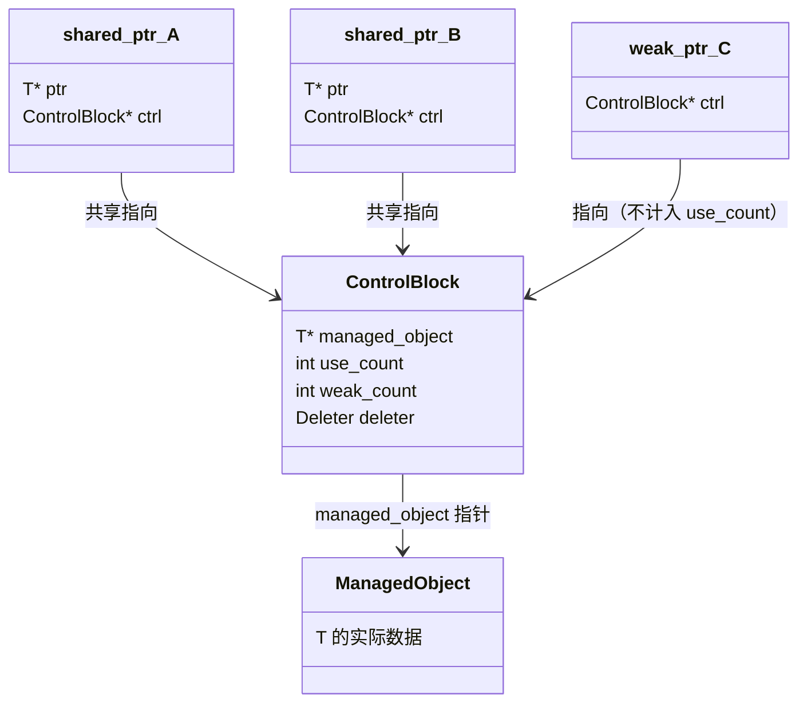
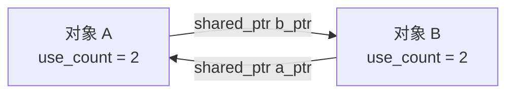

# C++ 面经 4 · 现代 C++：移动语义与智能指针

这一讲覆盖量化开发岗 C++ 面试里出现频率最高的一类"现代 C++"问题：移动语义和智能指针。二者表面上是两套不同的语言机制，实际上解决的是同一个底层问题：谁拥有一份资源、这份资源什么时候可以被安全地转移或释放。C++11 之前，资源所有权的转移只能靠拷贝（代价是额外分配和复制一份数据）或者手动裸指针管理（代价是容易忘记释放、重复释放、悬空指针）；移动语义让"转移所有权"变成一个廉价操作，智能指针把"该由谁释放、什么时候释放"这件事从程序员的记忆里转移到类型系统和 RAII 机制里。面试官从"左值右值怎么分"问到"`shared_ptr` 循环引用怎么破"，考察的是你对"资源所有权在对象生命周期里如何流动"这条主线的理解，而不是零散的 API 记忆。

```text
1. 判断一个表达式是左值还是右值，先问"它有没有名字、能不能取地址、这一条语句结束后它还存不存在"，而不是死记字面量表。带名字的右值引用变量本身是左值，这一条几乎每次都会被拿来出陷阱题。
2. 看到 std::move，先确认目标类型是否真的提供了移动构造/移动赋值。std::move 只是做类型转换（static_cast<T&&>），它自己不移动任何东西，移动是不是真的发生取决于重载决议选中了谁。
3. 遇到"移动之后还能不能用这个对象"的题，标准答案是"处于合法但未指定的状态，能安全析构和重新赋值，但不要依赖它的旧值"。
4. 遇到智能指针的题，先确定这是单一所有权（unique_ptr）还是共享所有权（shared_ptr）场景，再讨论具体行为；auto_ptr 只在"历史遗留问题"语境下提，不要当成现代代码的选项。
5. shared_ptr 相关的性能/内存题，脑子里先画出控制块示意图（管理对象指针 + 强引用计数 + 弱引用计数），make_shared 和 shared_ptr(new T()) 的分配次数差异几乎必考。
6. 循环引用的题，先画出两个对象互相持有 shared_ptr 的示意图，指出哪条边应该换成 weak_ptr，通常是"从属"或"反向"关系的那条边（子指向父、观察者指向被观察者）。
```

---

## 1. 左值与右值的区别，什么是右值引用

**核心结论**：区分左值（lvalue）和右值（rvalue）的直观标准是"这个表达式有没有名字、能不能取地址、这条语句执行完之后它是否还存在"。左值通常有名字、可以出现在 `&` 的操作数位置、生命周期不受当前表达式限制；右值通常是临时的、没有名字、表达式求值结束后就被销毁，比如字面量 `42`、算术表达式的中间结果 `a + b`、函数按值返回的临时对象。C++11 引入右值引用 `T&&`，专门用来绑定右值，目的是让重载决议能区分出"这个实参是一个可以被安全'掏空'（偷走内部资源）的临时对象"还是"一个之后还要保留原值的正常对象"，从而在拷贝语义和移动语义之间做出选择。

```cpp
int a = 10;
int& lref = a;        // 合法：a 是左值
// int& lref2 = 10;    // 非法：10 是右值，不能绑定到非 const 左值引用
const int& cref = 10;  // 合法：const 左值引用可以延长临时对象的生命周期，这是 C++98 就有的规则

int&& rref = 10;       // 合法：右值引用绑定右值
// int&& rref2 = a;    // 非法：a 是左值，不能直接绑定到右值引用
int&& rref3 = std::move(a); // 合法：std::move 把 a "标记"成右值
```

右值引用存在的意义不是"多一种引用语法"，而是给函数重载决议提供了一个新的判断维度：

```cpp
class Buffer {
public:
    Buffer(const Buffer& other) {           // 拷贝构造：other 是左值引用参数
        data_ = new int[other.size_];
        std::copy(other.data_, other.data_ + other.size_, data_);
        size_ = other.size_;
        std::cout << "copy ctor\n";
    }

    Buffer(Buffer&& other) noexcept {        // 移动构造：other 是右值引用参数
        data_ = other.data_;                 // 直接偷走指针，不重新分配内存
        size_ = other.size_;
        other.data_ = nullptr;               // 置空，避免析构时重复释放
        other.size_ = 0;
        std::cout << "move ctor\n";
    }
    // ...
private:
    int* data_;
    std::size_t size_;
};

Buffer makeBuffer() { return Buffer(100); }   // 返回一个临时对象（右值）

Buffer b1 = makeBuffer();   // makeBuffer() 的返回值是右值，优先匹配移动构造（或被 RVO 直接省略构造）
Buffer b2 = b1;             // b1 是左值，匹配拷贝构造
```

`makeBuffer()` 的返回值是一个即将被销毁的临时对象，把它里面的堆内存指针"偷"给 `b1`，比重新分配一块内存再逐元素拷贝要快得多，而且临时对象本来就要被析构，偷走它的资源不会有任何副作用。这就是移动语义要解决的核心问题：拷贝在语义上只在"两个独立对象都要保留各自数据"时才是必要的，对一个反正要被销毁的临时对象做深拷贝纯属浪费。

**易混淆规则：具名的右值引用变量本身是左值。** 这条规则的依据是"值类别是表达式的属性，不是类型的属性"。`T&&` 描述的是这个变量的类型，但一旦这个右值引用被绑定到一个具名变量上，使用这个变量名的表达式本身有名字、可以取地址、在作用域内持续存在，所以是左值。

```cpp
void takeOwnership(Buffer&& buf) {   // buf 的类型是右值引用，但 buf 这个表达式本身是左值
    // Buffer b = buf;    // 会调用拷贝构造，因为 buf 作为表达式是左值
    Buffer b = std::move(buf);       // 必须显式 std::move，才能再次把它转成右值，触发移动构造
}
```

这也是为什么"函数体内拿到一个 `T&&` 参数后，如果想把它继续当右值转发出去，必须显式写 `std::move`"。参数声明为右值引用只保证"调用方传进来的是一个右值"，不代表函数体内使用这个参数名的表达式还是右值。

### 完美转发（perfect forwarding）

**思路**：模板函数经常需要把收到的参数原封不动转发给另一个函数（比如工厂函数转发给构造函数），并且希望保留参数原来的值类别：传进来是左值就按左值转发，是右值就按右值转发，这样目标函数才能选中正确的重载（拷贝 vs 移动）。这需要两个机制配合：**万能引用**（universal reference，模板参数推导上下文中的 `T&&`，注意和普通右值引用的区别，只有在 `T` 由模板参数推导时 `T&&` 才是万能引用，能同时绑定左值和右值）和 `std::forward`。

```cpp
class Target {
public:
    explicit Target(const Buffer& b)  { std::cout << "Target(const Buffer&)\n"; }
    explicit Target(Buffer&& b)       { std::cout << "Target(Buffer&&)\n"; }
};

template <typename T>
Target wrapper(T&& arg) {              // T&& 是万能引用：T 由调用点推导
    return Target(std::forward<T>(arg));  // 用 std::forward 保持 arg 原来的值类别
}

Buffer buf(10);
wrapper(buf);              // arg 推导为左值引用绑定，转发后调用 Target(const Buffer&)
wrapper(std::move(buf));   // arg 推导为右值引用绑定，转发后调用 Target(Buffer&&)
wrapper(Buffer(10));       // 同上，临时对象是右值
```

万能引用能同时绑定左值和右值靠的是**引用折叠**（reference collapsing）规则：当 `T` 被推导为左值引用类型（比如传入左值时 `T` 推导为 `Buffer&`）时，`T&&` 展开成 `Buffer& &&`，按引用折叠规则 `& + && → &`，最终 `arg` 的类型是 `Buffer&`；当传入右值时 `T` 推导为 `Buffer`（不带引用），`T&&` 就是普通的 `Buffer&&`。四条引用折叠规则可以总结为一句话：只要折叠中出现一个左值引用 `&`，结果就是左值引用，只有 `&& + && → &&` 时结果才是右值引用。

`std::forward<T>(arg)` 内部本质上也是一次 `static_cast`，但它是"条件转换"：根据 `T` 被推导成的类型决定转换目标是左值引用还是右值引用，而 `std::move` 是无条件转换成右值引用。这就是为什么转发场景必须用 `std::forward` 而不能用 `std::move`。如果 `wrapper` 里直接写 `Target(std::move(arg))`，即使调用方传进来的是左值 `buf`，也会被无条件转成右值，错误地在只应该拷贝的地方触发移动，破坏调用方对 `buf` 后续状态的预期。

如果完全不做任何转换，直接写 `Target(arg)`，则不管调用方传的是左值还是右值，`arg` 作为函数体内的具名参数本身都是左值（前面讲过的规则），转发链路里会先退化成左值，然后一路匹配 `Target(const Buffer&)`，即使调用方原本传的是一个右值（本可以被移动），也会退化成拷贝，这是不使用完美转发时最常见的性能陷阱。

**常见追问 / 面试陷阱**

> 面试官常问"`T&&` 一定是右值引用吗"。答案是否定的：只有在 `T` 是通过模板参数推导（或者 `auto&&`）得到的上下文里，`T&&` 才是万能引用，可以绑定左值也可以绑定右值；如果 `T` 是一个具体类型（比如 `void f(Buffer&& b)`，`Buffer` 不是模板参数），`Buffer&&` 就是普通右值引用，只能绑定右值。判断的关键是看这个 `&&` 出现的地方是否存在"类型推导"这一步。

---

## 2. std::move 函数

**核心结论**：`std::move` 本身不移动任何数据，它是一个无条件的类型转换，等价于 `static_cast<typename std::remove_reference<T>::type&&>(t)`，把一个左值表达式强行"标记"成右值表达式，从而让重载决议在拷贝构造/拷贝赋值和移动构造/移动赋值之间优先选中后者。这是面试里最常被误解的一点：很多人以为"写了 `std::move` 就等于发生了移动"，但 `std::move` 只是打开了移动的候选通道，真正是否发生移动、发生了什么样的移动，取决于目标类型有没有提供移动构造/移动赋值函数。

```cpp
#include <utility>

std::vector<int> v1 = {1, 2, 3};
std::vector<int> v2 = std::move(v1);
// std::vector 提供了移动构造函数：v2 直接接管 v1 内部的堆内存指针，O(1) 操作
// v1 之后处于"合法但未指定"的状态（通常是空的，但标准不保证）

struct NoMoveType {
    NoMoveType(const NoMoveType&) { std::cout << "copy\n"; }
    // 没有声明移动构造函数，且下面这行说明"没有提供"和"被删除"效果一样都会退化成拷贝
};

NoMoveType a;
NoMoveType b = std::move(a);   // 依然打印 "copy"：找不到匹配的移动构造，重载决议退回拷贝构造
```

之所以 `std::move(a)` 之后 `b` 仍然是拷贝构造出来的，是因为 `std::move(a)` 只是把 `a` 变成了一个 `NoMoveType&&` 类型的右值表达式，编译器在重载决议时会优先尝试匹配 `NoMoveType(NoMoveType&&)`，但这个类没有声明，且拷贝构造函数 `NoMoveType(const NoMoveType&)` 的参数类型 `const NoMoveType&` 可以绑定右值（`const` 左值引用能绑定右值这条规则从 C++98 就存在），于是退回去匹配拷贝构造。整个过程编译期就能确定，不会报错，但也不会有任何移动语义带来的性能收益。这正是这个误解危险的地方：代码"看起来"用了移动语义，实际上悄悄退化成了拷贝，性能问题很难被发现。

**重要警告：移动之后的对象处于"有效但未指定"（valid but unspecified state）的状态。** C++ 标准规定，标准库类型被移出（moved-from）之后仍然是一个合法对象，可以析构、可以被重新赋值（这些操作没有前置条件），但它的具体内容是未指定的：不能假设它还保留原来的值，也不能对它调用有前置条件的操作（比如假设 `vector` 移出后还有特定大小的元素）。对于自定义类型，"移出后处于什么状态"完全取决于移动构造/移动赋值函数是怎么写的；写得不规范的话，甚至可能出现内部指针没有置空、留下悬空状态的问题。

```cpp
std::string s1 = "hello world, this is a long string";
std::string s2 = std::move(s1);

std::cout << s2 << std::endl;   // 正确，s2 拥有完整数据
// std::cout << s1 << std::endl;  // 不推荐：s1 内容未指定，可能是空串，也可能是别的值，不要依赖它
s1 = "new value";                // 正确：赋值没有前置条件，可以安全地给移出后的对象重新赋值
s1.clear();                      // 正确：clear() 同样没有前置条件
```

**常见追问 / 面试陷阱**

> "对移动后的对象取值算不算未定义行为？"答案是不算严格的 undefined behavior，取值本身是合法操作，只是值的内容不可预测（unspecified，不是 undefined）；但继续依赖这个值做业务逻辑判断几乎总是 bug 的源头，面试里说清楚"valid but unspecified"和"undefined behavior"的区别是加分点。另一个常见陷阱是把 `std::move` 和"移动语义"混为一谈：`std::move` 只是类型转换工具，移动构造/移动赋值函数才是真正执行"偷资源"这个动作的代码。

---

## 3. 四种智能指针及底层实现：auto_ptr、unique_ptr、shared_ptr、weak_ptr

**核心结论**：四种智能指针对应资源所有权的四种不同语义：`auto_ptr` 是失败的独占所有权尝试（已被移除），`unique_ptr` 是正确的独占所有权，`shared_ptr` 是共享所有权，`weak_ptr` 是"观察但不拥有"。理解它们的关键在于底层的所有权计数机制，尤其是 `shared_ptr` 的控制块结构。

### auto_ptr（C++98，已废弃）

`auto_ptr` 是 C++98 提供的第一版独占所有权智能指针，问题出在"用拷贝构造函数的语法实现所有权转移的语义"：`auto_ptr` 的拷贝构造函数和拷贝赋值运算符并不是真正的拷贝，而是把源对象的所有权转移给目标对象，并把源对象悄悄置空。

```cpp
std::auto_ptr<int> a(new int(42));
std::auto_ptr<int> b = a;   // 语法上看起来是拷贝，实际上 a 的所有权被转移给了 b
// std::cout << *a << std::endl;  // 危险：a 现在持有空指针，解引用是未定义行为
```

这违反了拷贝操作"拷贝之后源对象应保持不变"的基本预期，把 `auto_ptr` 放进 `std::vector` 等容器里尤其危险（容器内部的拷贝操作会不知不觉地清空其他元素）。这条问题在 C++11 引入右值引用和移动语义之后有了正确的解法：`unique_ptr` 用移动语义（而不是拷贝语义）表达所有权转移，转移动作必须显式写 `std::move`，不会在看起来像普通拷贝的地方发生。`auto_ptr` 在 C++11 中被正式弃用（deprecated），在 C++17 中被彻底从标准中移除。

### unique_ptr（C++11，独占所有权）

**核心结论**：`unique_ptr` 独占管理一个对象，禁止拷贝（拷贝构造函数和拷贝赋值运算符被显式删除），只能移动，移动之后原 `unique_ptr` 变为空。它在析构时自动对持有的指针调用删除器（默认是 `delete`）。

```cpp
std::unique_ptr<Buffer> p1 = std::make_unique<Buffer>(100);  // C++14 起提供 make_unique
// std::unique_ptr<Buffer> p2 = p1;      // 编译错误：拷贝构造函数被删除
std::unique_ptr<Buffer> p2 = std::move(p1);  // 合法：所有权转移给 p2，p1 变为 nullptr

if (!p1) {
    std::cout << "p1 is now empty\n";   // 会打印
}
```

`unique_ptr` 通常不带来额外的内存开销：默认情况下（使用默认删除器）它就是对一个裸指针的包装，`sizeof(std::unique_ptr<T>)` 通常等于 `sizeof(T*)`。如果自定义了删除器且删除器本身带有状态（比如一个函数对象里存了数据成员），删除器会作为 `unique_ptr` 内部的一部分参与存储，才会增加额外的空间。这也是 `unique_ptr` 相比 `shared_ptr` 更轻量的原因之一，它不需要维护任何引用计数或控制块。

### shared_ptr（C++11，共享所有权）与控制块

**核心结论**：多个 `shared_ptr` 可以共同管理同一个对象，通过一个额外分配的**控制块**（control block）维护"强引用计数"（use count，记录有多少个 `shared_ptr` 共享这个对象）和"弱引用计数"（weak count，记录有多少个 `weak_ptr` 在观察这个对象）。每次拷贝 `shared_ptr` 时强引用计数加一，`shared_ptr` 析构或者被重新赋值指向别处时强引用计数减一，减到 0 时才真正调用删除器释放被管理对象；弱引用计数归零（意味着既没有 `shared_ptr` 也没有 `weak_ptr` 了）时才释放控制块本身。



```cpp
std::shared_ptr<Buffer> sp1 = std::make_shared<Buffer>(100);
std::cout << sp1.use_count() << std::endl;  // 1

std::shared_ptr<Buffer> sp2 = sp1;          // 拷贝：强引用计数 +1
std::cout << sp1.use_count() << std::endl;  // 2

sp2.reset();                                // sp2 不再指向该对象：强引用计数 -1
std::cout << sp1.use_count() << std::endl;  // 1
```

**`make_shared` 与 `shared_ptr<T>(new T())` 的关键区别在于内存分配次数。** `shared_ptr<T>(new T(args...))` 需要两次独立的堆分配：一次是 `new T(args...)` 分配被管理对象本身，一次是 `shared_ptr` 构造函数内部分配控制块。`std::make_shared<T>(args...)` 把对象和控制块合并成一次内存分配（对象直接构造在控制块内部预留的存储里），标准并不强制要求这一点，但所有主流实现（libstdc++、libc++、MSVC STL）都这样做。这带来两个好处：分配次数从两次减到一次，减少了堆分配的开销和内存碎片；对象和控制块在内存上相邻，有更好的缓存局部性。代价是：如果有 `weak_ptr` 在所有 `shared_ptr` 都析构之后仍然存活，由于对象和控制块是同一块内存，被管理对象占用的内存要等到最后一个 `weak_ptr` 也析构（弱引用计数归零）才能真正释放，这在被管理对象很大而 `weak_ptr` 存活时间很长时可能是一个需要权衡的点。另外，`make_shared` 要求目标构造函数是可公开访问的（不能用它构造只有 `friend` 才能调用私有构造函数的类型），而 `shared_ptr<T>(new T())` 如果在有访问权限的上下文里调用，可以绕过这一限制；`make_shared` 也不支持传入自定义删除器。

| | `unique_ptr` | `shared_ptr` |
|---|---|---|
| 所有权 | 独占，同一时刻只有一个持有者 | 共享，多个持有者共同管理生命周期 |
| 拷贝 | 禁止（编译期删除） | 允许，拷贝会增加强引用计数 |
| 移动 | 允许，转移所有权 | 允许，不改变引用计数总量 |
| 额外开销 | 通常为 0（等同裸指针大小） | 需要额外的控制块（引用计数 + 弱引用计数） |
| 推荐创建方式 | `std::make_unique`（C++14） | `std::make_shared`（C++11，通常单次分配） |
| 典型场景 | 明确的单一所有者，比如类内部管理一个只属于自己的资源 | 生命周期由多方共同决定，比如被多个数据结构同时引用的节点 |

### weak_ptr（C++11，观察但不拥有）

**核心结论**：`weak_ptr` 指向一个由 `shared_ptr` 管理的对象，但不增加强引用计数，因此它的存在不会阻止对象被释放。要访问对象，必须调用 `lock()`，如果对象还存活，`lock()` 返回一个新的 `shared_ptr`（强引用计数临时加一，保证访问期间对象不会被并发释放）；如果对象已经被释放，`lock()` 返回一个空的 `shared_ptr`。

```cpp
std::shared_ptr<Buffer> sp = std::make_shared<Buffer>(100);
std::weak_ptr<Buffer> wp = sp;   // 不增加强引用计数

if (std::shared_ptr<Buffer> locked = wp.lock()) {
    std::cout << "object is still alive\n";   // 会执行，因为 sp 仍然持有对象
}

sp.reset();                       // 强引用计数归零，对象被释放
if (wp.expired()) {
    std::cout << "object has been destroyed\n";  // 会执行
}

std::shared_ptr<Buffer> locked2 = wp.lock();  // 返回空的 shared_ptr
```

`weak_ptr` 最典型的两个用途：一是打破循环引用（下一节详细展开），二是实现"观察者只想知道被观察对象是否还活着，但不应该延长它的生命周期"这类语义，比如缓存系统里缓存持有 `weak_ptr` 指向真正的数据对象，数据对象该被释放时缓存不应该阻止它。

**常见追问 / 面试陷阱**

> "`weak_ptr` 会不会被算进 `use_count()`？"答案是不会。`weak_ptr` 只影响控制块自己的弱引用计数，`use_count()` 返回的是强引用计数，不包含 `weak_ptr` 的数量。另一个常问点是"控制块什么时候释放"：强引用计数归零时释放被管理对象（调用删除器），但控制块本身要等弱引用计数也归零才释放，这也是前面提到的 `make_shared` 与大对象长期存活的 `weak_ptr` 搭配使用时需要留意的点。

---

## 4. shared_ptr 中的循环引用怎么解决

**核心结论**：两个（或一组）对象如果互相持有指向对方的 `shared_ptr`，会形成一个环，环上任意一个对象的强引用计数永远不会降到 0，导致整个环里的对象都不会被析构，造成内存泄露；这类问题不是运行时崩溃，而是悄无声息的资源永久占用，比较难在测试中被发现。

```cpp
struct B;

struct A {
    std::shared_ptr<B> b_ptr;
    ~A() { std::cout << "A destroyed\n"; }
};

struct B {
    std::shared_ptr<A> a_ptr;
    ~B() { std::cout << "B destroyed\n"; }
};

void createCycle() {
    auto a = std::make_shared<A>();
    auto b = std::make_shared<B>();
    a->b_ptr = b;   // b 的强引用计数变为 2（局部变量 b 本身 + a->b_ptr）
    b->a_ptr = a;   // a 的强引用计数变为 2（局部变量 a 本身 + b->a_ptr）
}   // 函数结束，局部变量 a、b 析构，各自的强引用计数从 2 降到 1，都不为 0
    // "A destroyed" 和 "B destroyed" 都不会打印：内存泄露
```



下面这个交互演示可以切换"循环引用"和"打破循环"两种情况，对照 use_count 和析构结果的变化：

```shared-ptr-cycle-demo
```

`createCycle()` 返回后，局部变量 `a`、`b` 离开作用域被析构，但 `A` 对象的强引用计数只从 2 减到 1（因为 `b->a_ptr` 还指着它），`B` 对象同理。两者互相拖住对方，谁的强引用计数都到不了 0，析构函数永远不会被调用。

**解决方案**：把环上会形成"反向"或"从属"关系的那一条边换成 `weak_ptr`。典型判断标准是所有权方向应该单向流动：如果 `A` 逻辑上是"主"，`B` 是被 `A` 拥有或者只是需要偶尔访问 `A` 的一方，那么 `B` 持有 `A` 的那一条应该改成 `weak_ptr`。

```cpp
struct B;

struct A {
    std::shared_ptr<B> b_ptr;   // A 仍然拥有 B（强引用）
    ~A() { std::cout << "A destroyed\n"; }
};

struct B {
    std::weak_ptr<A> a_ptr;     // B 只观察 A，不参与所有权
    ~B() { std::cout << "B destroyed\n"; }

    void useA() {
        if (std::shared_ptr<A> a = a_ptr.lock()) {  // 需要访问时才临时提升为 shared_ptr
            // 使用 a
        }
    }
};

void noCycle() {
    auto a = std::make_shared<A>();
    auto b = std::make_shared<B>();
    a->b_ptr = b;    // b 的强引用计数变为 2
    b->a_ptr = a;    // a 的强引用计数不变，仍为 1（weak_ptr 不增加强引用计数）
}   // 函数结束：a 强引用计数从 1 降到 0，A 被析构；A 析构时 a->b_ptr 释放，b 强引用计数降到 0，B 被析构
    // 打印 "A destroyed" 和 "B destroyed"
```

这个模式在树形/图状结构里最常见：父节点用 `shared_ptr` 持有子节点（父节点存在则子节点应该存在），子节点用 `weak_ptr` 回指父节点（子节点不应该决定父节点的生死）；双向链表也是类似道理，`next` 用 `shared_ptr`，`prev` 用 `weak_ptr`，否则每一对相邻节点都会形成一个局部循环引用。

**`shared_ptr` 和 `unique_ptr` 的选择原则**：默认优先使用 `unique_ptr`，它更轻量（没有控制块开销），所有权关系在代码里一目了然（这个指针就是唯一的所有者），也从根本上不存在循环引用问题（因为不能拷贝，两个 `unique_ptr` 不可能互相指向对方）。只有在确实存在"多个独立的所有者都需要参与决定这个对象什么时候被释放"这种共享生命周期的场景时，才应该引入 `shared_ptr`，并且要主动检查所有权关系图里有没有环，一旦有环就必须用 `weak_ptr` 打断。两者都遵循 RAII（资源获取即初始化）：对象在析构函数里自动释放持有的资源，即使中途抛出异常，栈展开过程中局部智能指针的析构函数依然会被调用，不会造成资源泄露，这是它们相比手动 `new`/`delete` 最根本的优势。

**常见追问 / 面试陷阱**

> "为什么不直接用裸指针代替 `weak_ptr` 打破循环？"答案是裸指针确实也能打破循环（不参与引用计数），但失去了"安全判断对象是否还存活"的能力：裸指针在对象被释放后会变成悬空指针，解引用是未定义行为；而 `weak_ptr` 通过 `lock()`/`expired()` 能安全地知道对象是否还活着，这是它相比裸指针的核心价值，不仅仅是"不增加计数"这一点。

---

## 快速选择题

```quiz
title: 快速选择题 1
question: 下列表达式中，属于左值的是：
answer: C
A. `42`
B. `a + b`（`a`、`b` 为 `int` 变量）
C. `a`（`a` 为已定义的 `int` 变量）
D. `getTempObject()`（返回类型为按值返回的临时对象）
explanation: `a` 是一个有名字、可以取地址、语句结束后仍然存在的变量，是典型左值；A、B、D 都是没有名字、语句结束即销毁的临时结果，属于右值。
```

2. 关于下面这段代码，输出结果是什么？

```cpp
void f(int&& x) {
    int y = x;      // x 在函数体内被当作什么？
    std::cout << y << std::endl;
}
f(10);
```

   A. 编译错误，因为 `int&&` 不能接收字面量 `10`
   B. 正常编译运行，输出 10；`x` 作为具名的右值引用参数，在函数体内使用时是左值，`int y = x` 只是普通的整型拷贝
   C. 正常编译运行，但 `y` 的值是未定义的
   D. 需要写成 `int y = std::move(x)` 才能编译通过

**答案：B** — `f(10)` 中 `10` 是右值，可以绑定到 `int&&` 参数，合法；进入函数体后 `x` 作为具名变量本身是左值，`int y = x` 是普通拷贝初始化，对内置类型 `int` 而言拷贝和"移动"没有区别，输出 10。

3. 关于万能引用（universal reference），下列说法正确的是：

```cpp
template <typename T>
void f(T&& x);          // (1)

void g(std::string&& x); // (2)
```

   A. (1) 和 (2) 中的 `&&` 都是万能引用
   B. (1) 中的 `T&&` 是万能引用（因为 `T` 由模板参数推导），(2) 中的 `std::string&&` 是普通右值引用（因为 `std::string` 是具体类型，没有类型推导）
   C. (1) 和 (2) 都是普通右值引用，只能绑定右值
   D. 只有出现在 `auto` 声明里的 `T&&` 才是万能引用，模板函数参数里的不算

**答案：B** — 判断万能引用的关键是"这个 `&&` 所修饰的类型是否在当前上下文中被推导"：(1) 里的 `T` 是模板参数，会在调用点被推导，`T&&` 可以绑定左值也可以绑定右值；(2) 里 `std::string` 是写死的具体类型，不存在推导，`std::string&&` 只能绑定右值。`auto&&` 同样属于万能引向的一种（`auto` 也是一种类型推导上下文），但不是唯一场景，D 错误。

4. 一个模板函数需要把参数原封不动转发给另一个函数并保留其值类别，下列写法正确的是：

```cpp
template <typename T>
void wrapper(T&& arg) {
    target(/* 这里怎么写 */);
}
```

   A. `target(arg)`
   B. `target(std::move(arg))`
   C. `target(std::forward<T>(arg))`
   D. A、B、C 效果完全相同

**答案：C** — `std::forward<T>(arg)` 根据 `T` 被推导出的类型做条件转换，是完美转发的标准写法；A 直接传递会让 `arg`（具名参数，本身是左值）一律按左值转发，右值实参也会退化成拷贝；B 无条件转换成右值，会导致调用方传入左值时也被错误地当右值处理，可能破坏调用方对该左值后续状态的预期。

```quiz
title: 快速选择题 5
question: 关于 `std::move` 的说法，下列正确的是：
answer: B
A. `std::move(a)` 会立即把 `a` 的资源转移到一个临时对象里
B. `std::move` 本质上是一次无条件的类型转换，把左值表达式转换为右值引用类型的表达式，本身不移动任何数据
C. 对没有定义移动构造函数的类型调用 `std::move` 会导致编译错误
D. `std::move` 只能用于自定义类型，不能用于内置类型如 `int`
explanation: `std::move` 等价于 `static_cast<T&&>`，只做类型标记，不执行任何数据搬移；C 错误，没有移动构造函数时会安全地退化为拷贝构造，不会编译错误；D 错误，`std::move` 对任何类型都合法，只是对内置类型没有实际的"移动优化"意义。
```

6. 下列代码执行后，输出的是什么？

```cpp
std::unique_ptr<int> p1 = std::make_unique<int>(42);
std::unique_ptr<int> p2 = std::move(p1);
std::cout << (p1 == nullptr) << " " << *p2 << std::endl;
```

   A. `0 42`
   B. `1 42`
   C. 编译错误，因为 `unique_ptr` 不能被移动
   D. 运行时崩溃，因为 `p1` 变成了悬空指针

**答案：B** — `unique_ptr` 支持移动（禁止的是拷贝），`std::move(p1)` 把所有权转移给 `p2`，之后 `p1` 变为空指针（`p1 == nullptr` 为真，即 1），`p2` 正确持有原值 42；`p1` 是空指针而不是悬空指针，`*p2` 访问的是转移后仍然有效的内存，不会崩溃。

```quiz
title: 快速选择题 7
question: 关于 `auto_ptr`，下列说法错误的是：
answer: C
A. `auto_ptr` 的"拷贝构造函数"实际执行的是所有权转移，源对象会被置空
B. `auto_ptr` 在 C++11 中被弃用，在 C++17 中被正式从标准中移除
C. 把 `auto_ptr` 放进 `std::vector` 等标准容器是完全安全的，不会有意外行为
D. `unique_ptr` 是 `auto_ptr` 的现代替代品，用移动语义代替了容易出错的"伪拷贝"语义
explanation: 恰恰相反，把 `auto_ptr` 放进标准容器是经典的危险用法：容器内部实现（如排序、扩容搬移）经常会做看似无害的"拷贝"操作，而 `auto_ptr` 的拷贝会悄悄转移所有权、置空源对象，导致容器里的其他 `auto_ptr` 在不知情的情况下失去所管理的对象；A、B、D 都是准确描述。
```

```quiz
title: 快速选择题 8
question: 关于 `make_shared<T>(args...)` 相比 `std::shared_ptr<T>(new T(args...))` 的说法，下列正确的是：
answer: B
A. 两者分配内存的次数完全相同，只是写法不同
B. `make_shared` 通常只需要一次堆分配（对象和控制块一起分配），而 `shared_ptr<T>(new T())` 需要两次独立分配（一次分配对象，一次分配控制块）
C. `make_shared` 分配次数更多，因为它需要额外维护弱引用计数
D. 两种写法在异常安全性上有本质差异，只有 `make_shared` 是异常安全的
explanation: 这是两者最核心的实现差异，`make_shared` 把对象和控制块合并到一次分配里，是主流实现的通用做法（标准鼓励但不强制）；D 描述有一定历史背景（早期在函数实参求值顺序不确定的情况下，`f(shared_ptr<T>(new T()), g())` 这种写法在 `g()` 抛异常时可能泄露内存，而 `make_shared` 把分配和构造绑成一步更安全），但 C++17 起标准明确了函数实参的求值顺序限制、加上现代写法通常直接把 `make_shared` 的结果作为独立语句赋值，这个差异已不是"本质"区别，B 是最准确、最核心的答案。
```

```quiz
title: 快速选择题 9
question: 下列关于 `shared_ptr` 控制块的说法，错误的是：
answer: D
A. 控制块中保存了强引用计数（use_count）和弱引用计数（weak_count）
B. 强引用计数归零时，被管理对象会被释放（调用删除器）
C. 弱引用计数归零时，控制块本身占用的内存才会被释放
D. 只要还有 `shared_ptr` 存在，`weak_ptr` 的存在就会阻止被管理对象被释放
explanation: `weak_ptr` 不参与强引用计数，不会阻止对象被释放；对象是否被释放只取决于强引用计数是否归零，与 `weak_ptr` 数量无关。A、B、C 都是控制块的正确行为描述。
```

10. 关于下面这段代码，运行结果最可能是：

```cpp
struct Node {
    std::shared_ptr<Node> next;
    ~Node() { std::cout << "destroyed\n"; }
};

void run() {
    auto n1 = std::make_shared<Node>();
    auto n2 = std::make_shared<Node>();
    n1->next = n2;
    n2->next = n1;
}

int main() {
    run();
    std::cout << "run() returned\n";
}
```

   A. 输出 `run() returned`，随后打印两次 `destroyed`
   B. 只输出 `run() returned`，两个 `Node` 对象都不会被析构，造成内存泄露
   C. 编译错误，`Node` 不能包含指向自身类型的 `shared_ptr` 成员
   D. 运行时抛出异常，因为检测到了循环引用

**答案：B** — `n1` 和 `n2` 互相持有对方的 `shared_ptr`，构成经典循环引用；`run()` 返回后局部变量 `n1`、`n2` 析构，但两个 `Node` 对象各自还被对方的 `next` 成员持有一份强引用，强引用计数都从 2 降到 1 而不是 0，析构函数不会被调用，`shared_ptr` 不会在运行时检测或抛异常来提示这种情况，是典型的静默内存泄露。

```quiz
title: 快速选择题 11
question: 要修复上一题的循环引用问题，同时保持"每个节点都能通过 `next` 访问下一个节点"的功能，最合适的修改是：
answer: B
A. 把 `next` 类型从 `std::shared_ptr<Node>` 改成裸指针 `Node*`
B. 把 `next` 类型从 `std::shared_ptr<Node>` 改成 `std::weak_ptr<Node>`，访问时用 `next.lock()` 获取临时的 `shared_ptr`
C. 在析构函数里手动把 `next` 置为 `nullptr`
D. 把 `Node` 改成用 `std::unique_ptr<Node>` 管理 `next`
explanation: 只要双向的 `next` 关系都必须存在（互相引用是这个数据结构本身要求的），就需要把其中至少一条边改成 `weak_ptr` 来打断计数循环，访问时通过 `lock()` 安全地取得临时 `shared_ptr`；A 虽然也能打破循环，但裸指针没有"对象是否已被释放"的安全查询能力，容易产生悬空指针风险；C 治标不治本，且需要精确控制析构顺序，容易出错；D 在双向都需要引用同一节点的场景下不适用（`unique_ptr` 不能同时被两个方向共享）。
```

```quiz
title: 快速选择题 12
question: 关于 `unique_ptr` 与 `shared_ptr` 的选择原则，下列说法最准确的是：
answer: B
A. 应该始终优先使用 `shared_ptr`，因为它功能更全，可以随时复制
B. 默认应优先使用 `unique_ptr`，因为它更轻量、所有权关系更清晰；只有真正需要多个独立所有者共同决定对象生命周期时才使用 `shared_ptr`
C. `unique_ptr` 只适合管理简单类型，管理类对象必须用 `shared_ptr`
D. 两者性能完全相同，选择只是编码风格问题
explanation: `unique_ptr` 没有引用计数开销，所有权在类型层面就是唯一确定的，是更安全、更高效的默认选择；`shared_ptr` 的共享语义应该只在真正存在多个独立所有者时使用，滥用 `shared_ptr` 会带来额外的控制块开销和潜在的循环引用风险。A、C、D 都是错误的一般性断言。
```
