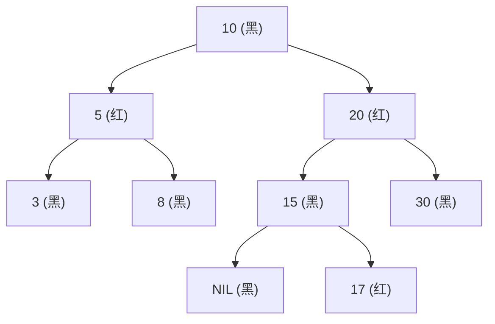

# C++ 面经 6 · 手撕代码与高级数据结构

这一篇是"真刀真枪"的手撕代码面试题：面试官不再满足于"你说说 XX 是什么"，而是要求当场在白板或共享文档里写出可以运行的代码，同时穿插问底层机制。核心考点集中在三类：能不能正确管理资源的生命周期（`String` 类的深拷贝与异常安全）、能不能用一种数据结构模拟另一种数据结构的行为并给出复杂度证明（两个栈实现队列）、知不知道工业界真正在用的高级数据结构长什么样、为什么这样设计（红黑树、B/B+ 树、图）。最后收尾到编译链接与对象内存模型，这两块常常作为手撕代码之后的追问，考察你是否理解自己写的代码最终变成了什么。这些题目对代码正确性要求很高，任何一个边界条件或者一次隐式的浅拷贝都可能直接导致面试失败。

```text
手撕代码面试自查清单：
1. 涉及裸指针成员时，五/三法则（Rule of Three/Five）是否都覆盖到了？
   —— 析构、拷贝构造、拷贝赋值；如果实现移动语义，再加移动构造、移动赋值。
2. 拷贝赋值运算符有没有处理自赋值？有没有异常安全？
   —— 用 copy-and-swap，一行代码同时解决这两个问题。
3. 用一种结构模拟另一种结构时，均摊复杂度怎么证明？
   —— 找一个"每个元素一辈子最多被搬动几次"的不变量。
4. 讨论树形索引结构时，先问："操作发生在内存里还是磁盘上？"
   —— 内存里瘦高的二叉树（红黑树）胜出；磁盘上矮胖的多叉树（B/B+ 树）胜出。
5. 讨论对象内存布局时，先分清"语言标准保证的东西"和"编译器 ABI 的约定"。
   —— vptr 存在是各家编译器的一致实现，但它在对象里的具体位置不是标准强制的。
```

---

## 1. 手写一个 `String` 类

### 1.1 最小可用版本

**核心结论**：手写 `String` 类的本质是练习资源管理——类内部持有一块堆内存（`char*` 指针和长度），凡是持有资源的类都要在特殊成员函数里回答同一个问题："这份资源被拷贝、赋值、销毁的时候该怎么办？"下面给出一份教学用的最小实现，覆盖构造、析构、拷贝构造、拷贝赋值（copy-and-swap）、下标访问、拼接和长度查询，并在最后补充移动语义作为进阶优化。

```cpp
#include <cstring>   // strlen, memcpy
#include <algorithm> // std::swap
#include <stdexcept> // std::out_of_range
#include <utility>   // std::move

class MyString {
public:
    // 默认构造：给一个空字符串，仍然分配 1 字节存放 '\0'，
    // 这样 data_ 永远不是 nullptr，后面的函数不用到处判空。
    MyString() : data_(new char[1]{'\0'}), size_(0) {}

    // 从 C 风格字符串构造。如果传入 nullptr，退化成空字符串，
    // 避免 strlen(nullptr) 触发未定义行为。
    MyString(const char* s) {
        size_ = s ? std::strlen(s) : 0;
        data_ = new char[size_ + 1];      // +1 留给结尾的 '\0'
        std::memcpy(data_, s ? s : "", size_ + 1);
    }

    // 拷贝构造函数：必须深拷贝。
    // 如果只写 data_(other.data_)，两个 MyString 对象会指向同一块堆内存，
    // 其中一个对象析构时 delete[] 掉这块内存，另一个对象的指针立刻变成悬空指针，
    // 之后任何一次访问或者第二次析构（重复释放）都是未定义行为。
    // 深拷贝的规则是：拷贝构造函数看到的是"别人的资源"，
    // 自己必须新申请一块内存，把内容复制过来，绝不能只拷贝指针的值。
    MyString(const MyString& other) : size_(other.size_) {
        data_ = new char[size_ + 1];
        std::memcpy(data_, other.data_, size_ + 1);
    }

    // 析构函数：释放构造函数里申请的堆内存。
    // 用 delete[] 而不是 delete，因为 data_ 指向的是一个数组（new char[] 分配的）。
    ~MyString() {
        delete[] data_;
    }

    // swap 成员函数：只交换指针和长度，不涉及任何内存分配，因此绝不会抛异常。
    // noexcept 承诺了这一点，这是 copy-and-swap idiom 能成立的前提。
    void swap(MyString& other) noexcept {
        std::swap(data_, other.data_);
        std::swap(size_, other.size_);
    }

    // 拷贝赋值运算符：copy-and-swap idiom。
    //
    // 写法一（教学时最先想到、但有问题的版本）：
    //   MyString& operator=(const MyString& other) {
    //       delete[] data_;                 // 先释放自己的资源
    //       size_ = other.size_;
    //       data_ = new char[size_ + 1];    // 如果这里 new 抛出 bad_alloc……
    //       std::memcpy(data_, other.data_, size_ + 1);
    //       return *this;
    //   }
    // 这个版本有两个问题：
    //   (1) 自赋值 a = a 时，先 delete[] 掉 data_，再从（已经被释放的）
    //       other.data_ 里读数据，直接读到野内存。
    //   (2) 异常安全性差：new 抛出异常时，*this 的 data_ 已经被 delete
    //       但还没有被赋新值，对象处于"半销毁"状态，之后析构会再次
    //       delete[] 一个悬空指针。
    //
    // copy-and-swap 用一次值传参 + swap 同时解决这两个问题：
    MyString& operator=(MyString other) {
        // 参数 other 是按值传递的，调用这个函数时编译器已经用拷贝构造函数
        // 把实参深拷贝了一份到 other 里。如果拷贝构造中途因为 new 失败
        // 抛出异常，异常发生在函数体执行之前，*this 完全没有被触碰，
        // 仍然是修改前的合法状态——这就是"强异常安全保证"。
        //
        // 自赋值 a = a 也是安全的：other 是 a 的一份独立深拷贝，
        // 下面的 swap 只是把 *this 和这份拷贝互换资源，逻辑上等价于什么都没变。
        // 因此这里不需要写 if (this != &other) 做自赋值检查——
        // 值传参已经隐含地把这个情况处理掉了。
        swap(other);
        return *this;
        // other 在函数结束时被销毁，此时它持有的是"旧的 *this"资源，
        // 由 other 的析构函数负责释放，不需要手动 delete。
    }

    // 下标访问。越界策略：
    // - operator[] 约定不做边界检查（对齐 std::string 的语义），追求性能；
    // - 如果要提供边界检查版本，命名为 at()，越界时抛 std::out_of_range。
    char& operator[](size_t index) {
        return data_[index];  // 调用方越界访问是未定义行为，责任在调用方
    }
    const char& operator[](size_t index) const {
        return data_[index];
    }
    char& at(size_t index) {
        if (index >= size_) {
            throw std::out_of_range("MyString::at index out of range");
        }
        return data_[index];
    }

    // 拼接：返回一个新对象，不修改任意一个操作数。
    MyString operator+(const MyString& rhs) const {
        MyString result;
        delete[] result.data_;
        result.size_ = size_ + rhs.size_;
        result.data_ = new char[result.size_ + 1];
        std::memcpy(result.data_, data_, size_);
        std::memcpy(result.data_ + size_, rhs.data_, rhs.size_ + 1); // 连 '\0' 一起拷
        return result;  // 现代编译器对返回局部对象做 NRVO，通常不会触发额外拷贝
    }

    size_t size() const { return size_; }
    size_t length() const { return size_; }  // 与 size() 语义相同，兼容 std::string 的习惯命名
    const char* c_str() const { return data_; }

    // ---- 进阶：移动构造 / 移动赋值 ----
    // 拷贝是"深拷贝一份新内存"，移动是"把资源的所有权偷过来"。
    // 当右侧操作数是一个将要销毁的临时对象（右值）时，深拷贝纯属浪费：
    // 那块内存反正马上要被源对象析构掉，不如直接指针互换。
    MyString(MyString&& other) noexcept
        : data_(other.data_), size_(other.size_) {
        // 偷走指针后，必须把源对象的指针置空。
        // 如果不置空，other 析构时会 delete[] 同一块内存，
        // 而这块内存已经被 *this 接管，造成重复释放（double free）。
        other.data_ = nullptr;
        other.size_ = 0;
    }

    MyString& operator=(MyString&& other) noexcept {
        if (this != &other) {          // 移动赋值仍建议保留自赋值检查：
                                        // a = std::move(a) 若不检查，会先释放自己的
                                        // data_，再把（同一块已释放的）指针赋给自己。
            delete[] data_;             // 释放自己原有的资源
            data_ = other.data_;        // 偷指针
            size_ = other.size_;
            other.data_ = nullptr;      // 置空源对象，避免它析构时重复释放
            other.size_ = 0;
        }
        return *this;
    }

private:
    char*  data_;
    size_t size_;
};
```

### 1.2 逐段说明为什么必须这样写

**为什么拷贝构造函数必须深拷贝，不能直接拷贝指针**：`MyString` 的每个对象把"独占一块堆内存"当作自己的不变量——它的析构函数假定 `data_` 指向一块只属于自己的、还没被释放的内存，并对它调用 `delete[]`。如果拷贝构造函数写成 `data_(other.data_)`（浅拷贝，只拷贝指针的值），就制造出两个对象共享同一块内存的局面，这直接破坏了"独占"这个不变量：这块内存现在有两个"主人"，但只应该被释放一次。第一个对象析构时释放内存，第二个对象的 `data_` 变成悬空指针；如果先发生的是赋值或访问，那就是在用一个已经不再独占的指针，行为已经不可预测。深拷贝的做法是新 `new` 一块内存，把内容复制过来，这样两个对象即使内容相同，也各自持有独立的、生命周期互不影响的资源。

**为什么拷贝赋值要处理自赋值、要考虑异常安全**：自赋值（`a = a`，或者更隐蔽的 `a = get_reference_to_a()`）在直觉上是无意义的操作，但如果实现里先释放旧资源、再读取"参数"的内容，而参数恰好和 `*this` 是同一个对象，就会读到已经被释放的内存。异常安全的问题则出在资源释放和资源获取不是一个原子操作：先 `delete` 后 `new`，中间任何一步失败，对象都可能停留在一个既不是旧值也不是新值的损坏状态。copy-and-swap idiom 把这两个问题一起解决：把拷贝赋值运算符的参数改成**按值传递**（而不是 `const&`），调用时编译器自动用拷贝构造函数生成一份完整的、独立的深拷贝；如果这一步失败（比如内存不足），异常在进入函数体之前就抛出了，`*this` 完全没被动过。函数体内只做一次 `swap`，而 `swap` 只交换指针和整数，不分配内存、不可能失败，天然满足 `noexcept`。自赋值也因此被自动处理：`other` 是 `*this` 的独立拷贝，`swap` 之后 `*this` 拿到的是这份拷贝的资源，逻辑等价于原值不变，不需要额外写 `if (this != &other)` 分支。

**为什么 `operator[]` 不做边界检查而单独提供 `at()`**：这是一个设计取舍，不是正确性问题。`operator[]` 用在性能敏感、调用者已经能保证下标合法的场景（比如遍历循环），每次都检查边界会有额外开销；`at()` 用在不确定下标是否合法、需要明确报错的场景，用抛异常把"错误处理"这件事显式化。`std::string`、`std::vector` 都采用同样的分工。

**关于 `operator+` 返回新对象**：拼接不修改任何一个操作数，函数应当是 `const` 成员函数，返回一个全新构造的对象。这里没有直接调用拷贝构造函数拼两次再合并，而是一次性计算出总长度、分配一次内存、做两次 `memcpy`，避免中间产生临时对象带来的额外分配。

**常见追问 / 面试陷阱**

- 追问"如果不用 copy-and-swap，能不能只加一个 `if (this != &other)` 就解决问题？"——能部分解决自赋值，但解决不了异常安全：`new` 抛异常时对象仍然处于旧资源已释放、新资源未就位的中间态。
- 追问"移动构造/移动赋值为什么要标 `noexcept`？"——`std::vector` 等容器在扩容时，只有确认元素的移动操作不会抛异常，才会用移动而不是拷贝来搬运元素（否则移动到一半抛异常会导致容器数据丢失，无法回滚，因此标准库转而退回更安全但更慢的拷贝）。
- 追问"三/五法则（Rule of Three/Five）是什么？"——如果一个类需要自定义析构函数、拷贝构造函数、拷贝赋值运算符中的任意一个，通常意味着它管理某种资源，三者应该一起显式定义（三法则）；C++11 之后如果还想支持移动语义，再加上移动构造和移动赋值，凑成五法则。反过来，"零法则"提倡的是：如果一个类不直接管理裸资源，而是用 `std::string`、`std::vector`、智能指针这些已经管好资源的成员组合而成，就什么特殊成员函数都不用写，编译器生成的默认版本已经正确。

---

## 2. 用两个栈实现一个队列

### 2.1 思路

**核心结论**：栈是后进先出（LIFO），队列是先进先出（FIFO），用两个栈可以把顺序"反转两次"，从而用 LIFO 结构模拟出 FIFO 行为。

具体做法是分工：一个 `inStack` 专门负责入队时的 `push`，一个 `outStack` 专门负责出队时的 `pop`。入队永远只操作 `inStack`，直接压栈即可，$O(1)$。出队时看 `outStack`：如果它不为空，直接弹出它的栈顶，这就是队首元素；如果它为空，就把 `inStack` 里的所有元素依次弹出、依次压入 `outStack`。

为什么这一步"倒腾"能让顺序变回先进先出？假设 `inStack` 从栈底到栈顶依次是入队顺序 `1, 2, 3`（3 最后入队，在栈顶）。第一次反转（从 `inStack` 弹出、压入 `outStack`）会把顺序整体倒过来：`outStack` 从栈底到栈顶变成 `3, 2, 1`，最先入队的 `1` 现在正好在 `outStack` 的栈顶。这时候对 `outStack` 做 `pop`，弹出的就是 `1`——也就是最早入队的元素，符合队列语义。两次"后进先出"的复合，等价于一次"先进先出"。

```cpp
#include <stack>

class MyQueue {
public:
    void push(int x) {
        inStack_.push(x);
    }

    int pop() {
        moveIfNeeded();
        int front = outStack_.top();
        outStack_.pop();
        return front;
    }

    int front() {
        moveIfNeeded();
        return outStack_.top();
    }

    bool empty() const {
        return inStack_.empty() && outStack_.empty();
    }

private:
    // 只有 outStack 为空时才发生一次"倒腾"，
    // 这一步是均摊复杂度分析的关键：它不是每次 pop 都做。
    void moveIfNeeded() {
        if (outStack_.empty()) {
            while (!inStack_.empty()) {
                outStack_.push(inStack_.top());
                inStack_.pop();
            }
        }
    }

    std::stack<int> inStack_;
    std::stack<int> outStack_;
};
```

### 2.2 均摊复杂度分析

单次 `pop` 的最坏情况是 $O(n)$：如果 `outStack` 恰好为空，且 `inStack` 里积压了 $n$ 个元素，这次 `pop` 要把这 $n$ 个元素全部倒腾一遍。但这个最坏情况不会连续发生。

关键不变量是：**每个元素从入队到出队，一辈子最多经历一次"倒腾"**（从 `inStack` 弹出、压入 `outStack`）。一个元素一旦进入 `outStack`，之后只会被单纯地 `pop` 出去，不会再被倒腾回 `inStack`。所以，把一次 `push` 和一次 `pop` 各自的操作次数加起来看：

- 每个元素恰好被压入 `inStack` 一次（`push` 时）；
- 每个元素恰好被从 `inStack` 弹出一次、压入 `outStack` 一次（倒腾发生时，且只发生一次）；
- 每个元素恰好被从 `outStack` 弹出一次（`pop` 时）。

也就是说，$n$ 次 `push` 加 $n$ 次 `pop` 总共只产生 $O(n)$ 次栈的基本操作（每个元素固定贡献 4 次：入 `inStack`、出 `inStack`、入 `outStack`、出 `outStack`）。把这 $O(n)$ 均摊到 $n$ 次操作上，每次操作的均摊代价是 $O(1)$。用符号写就是：

$$
\text{总操作数} \le 4n = O(n)
\quad\Longrightarrow\quad
\text{均摊每次操作} = \frac{O(n)}{n} = O(1)
$$

```text
一次典型的倒腾过程（push 1,2,3 之后第一次 pop）：

  push 1,2,3 之后：
    inStack (栈顶→栈底): 3 2 1
    outStack:            (空)

  第一次 pop，outStack 为空，触发倒腾：
    依次弹出 inStack 的 3、2、1，依次压入 outStack
    inStack :  (空)
    outStack (栈顶→栈底): 1 2 3
                          ↑
                     栈顶恰好是最早入队的 1

  pop() 弹出 outStack 栈顶 → 返回 1，符合先进先出

  之后只要 outStack 非空，pop() 就直接弹 outStack 栈顶，O(1)，
  不再触发倒腾，直到 outStack 再次耗尽。
```

**常见追问 / 面试陷阱**

- 追问"最坏情况下单次操作的复杂度是多少？"——不要只回答 $O(1)$，要说清楚"均摊 $O(1)$，但单次最坏 $O(n)$"，并能解释均摊分析用的是聚合法（aggregate method）：把一长串操作的总代价除以操作次数。
- 追问"如果两个栈换成两个队列，实现一个栈，复杂度会怎样变化？"——方向正好相反。用两个队列 `q1`、`q2` 实现栈时，思路是每次 `push` 之后立刻把 `q1` 中除新元素之外的所有元素倒腾到 `q2`（或者反过来，具体实现有多种等价写法），让最新压入的元素排到队首，这样下次 `pop`（对队列做 `front` + `pop_front`）能第一时间取出它。这意味着**每一次 `push` 都要做一次 $O(n)$ 的搬运**，而不是像两栈实现队列那样，把代价摊开、大多数操作是 $O(1)$。也就是说：两栈实现队列是"出队时偶尔付出大代价，均摊后很便宜"；两队列实现栈是"每次入栈都固定付出大代价，没有均摊空间"。这个对比经常被拿来考察你是否真的理解均摊分析，而不是死记"用两个 X 实现 Y"这几道题的代码。

---

## 3. 高级数据结构概览：红黑树、B/B+ 树、图

### 3.1 红黑树

**核心结论**：红黑树是一棵通过着色规则维持"近似平衡"的二叉搜索树，五条性质共同保证从根到任意叶子的最长路径不超过最短路径的两倍，从而树高维持在 $O(\log n)$，查找、插入、删除都是 $O(\log n)$。

五条性质：

1. 每个节点非红即黑；
2. 根节点是黑色；
3. 每个红色节点的两个子节点都必须是黑色（等价地说，不允许出现两个连续的红色节点）；
4. 每个叶子节点（这里的"叶子"指的是真实节点之外的 NIL 哨兵节点）是黑色；
5. 从任一节点到其每一个后代叶子节点的路径上，经过的黑色节点数目相同——这个数目称为该节点的**黑高**（black-height）。

为什么这五条能保证树高是 $O(\log n)$：性质 3 保证任意一条从根到叶子的路径上，红色节点不会连续出现，也就是说红色节点最多占路径长度的一半；性质 5 保证所有路径的黑色节点数目一致，等于根的黑高 $bh$。结合两点可以推出：最长路径的长度最多是最短路径长度的两倍（最短路径全是黑节点，长度为 $bh$；最长路径红黑交替，长度最多 $2\,bh$）。再结合"一棵黑高为 $bh$ 的红黑树，其内部节点数 $n$ 至少是 $2^{bh}-1$"这个引理（可以对黑高归纳证明：每个节点的两棵子树黑高至少是 $bh-1$，子树节点数至少 $2^{bh-1}-1$），可以解出 $bh \le \log_2(n+1)$，再结合树高 $h \le 2\,bh$，最终得到：

$$
h \le 2\log_2(n+1)
$$

也就是树高是 $O(\log n)$，查找、插入、删除的路径长度都被这个上界约束住。

插入或删除新节点之后，可能会暂时破坏"不能有两个连续红节点"或"黑高一致"这两条性质，恢复平衡靠两种操作：**变色**（把某个节点的颜色在红黑之间切换）和**旋转**（左旋 / 右旋，通过局部重新挂接子树来调整树的形状，不改变中序遍历顺序）。具体到插入之后要看新节点的"叔叔节点"颜色、删除之后要看"兄弟节点"的颜色和子女颜色分好几种情形分别处理，这里不逐一展开旋转的完整推导，只需要理解设计动机：旋转负责调整局部形状且不破坏二叉搜索树的有序性，变色负责在不改变形状的前提下恢复黑高的一致性，二者配合能在 $O(\log n)$ 的时间内把被打破的平衡修复回来。

C++ 标准库里的 `std::map`、`std::set`（以及 `std::multimap`、`std::multiset`）在主流实现（libstdc++、libc++、MSVC STL）中都是用红黑树实现的，这也是为什么它们的迭代器按 key 有序、插入删除查找都是 $O(\log n)$。



图中根节点到 `3`/`8`/`30` 这几条路径都是"黑-红-黑"，长度为 2；根节点到 `17` 这条路径是"黑-红-黑-红"，长度为 3，仍然满足"最长路径不超过最短路径两倍"（这里最短路径是根到直接的黑色子节点，长度为 1）。

**常见追问 / 面试陷阱**：不要把红黑树和 AVL 树混淆——AVL 树对平衡的要求更严格（任意节点左右子树高度差不超过 1），查找更快但插入删除时旋转更频繁；红黑树对平衡的要求更宽松（用两倍的高度差换取更少的旋转次数），插入删除的均摊性能更好，因此更常被用作通用容器的底层实现。

### 3.2 B 树与 B+ 树

**核心结论**：数据库索引和文件系统偏爱 B/B+ 树而不是红黑树，根本原因是访问介质不同——红黑树假设访问代价是均匀的内存访问，而磁盘索引的瓶颈是磁盘 I/O 次数，B/B+ 树通过"变矮变胖"直接压缩树高，从而压缩查询所需的 I/O 次数。

磁盘不是按字节读取的，而是按"页"（page，通常 4KB 或更大）为单位读取，一次磁盘 I/O 的代价（尤其是机械硬盘的寻道时间）比一次内存访问高出好几个数量级。如果索引结构是红黑树这种二叉树，$n$ 个节点的树高是 $O(\log_2 n)$，节点分散存储在磁盘的不同页上，一次查找可能要经过 $\log_2 n$ 次磁盘 I/O，当 $n$ 是几亿这个量级时，$\log_2 n$ 有三十多层，是不可接受的开销。B/B+ 树把二叉搜索树改造成多叉搜索树：一个节点可以存多个 key 和多个子指针，节点大小通常刚好设计成一个磁盘页的大小，这样每次访问一个节点只需要一次 I/O，而"矮胖"的多叉树把树高压缩到 $O(\log_m n)$（$m$ 是每个节点的分支数，可以是几百甚至上千），显著减少了查询需要的 I/O 次数。

B 树和 B+ 树的核心区别在于数据放在哪里：

- **B 树**：内部节点既存 key 也存实际的 value（或指向实际记录的指针），查找可能在中途的内部节点就命中。
- **B+ 树**：内部节点只存 key，纯粹用于导航，不存实际数据；所有实际数据都下沉到叶子节点。并且，B+ 树的所有叶子节点之间用指针连接成一个有序链表。

B+ 树叶子节点链表结构对范围查询极为有利：找到范围起点对应的叶子节点之后，不需要再回到内部节点重新定位，只要沿着叶子链表顺序向后扫描即可把整个范围内的记录读出来。而 B 树没有这种叶子间的横向连接，范围查询需要反复做中序遍历式的回溯（从一个节点找到下一个节点，往往要先向上回到公共祖先，再向下进入另一个子树），每往前走一步都可能牵扯到重新从上层节点定位，I/O 局部性更差。这正是 MySQL InnoDB 等主流数据库选择 B+ 树而不是经典 B 树作为索引结构的主要原因：范围查询（`BETWEEN`、`ORDER BY` 配合索引、前缀匹配等）在实际业务里极其常见，B+ 树的叶子链表把这类查询的代价从"多次树遍历"降低到"一次定位 + 一次顺序扫描"。

```text
B+ 树结构示意（内部节点只导航，叶子节点存数据并横向相连）：

                    [ 30 | 60 ]                <- 根节点（内部节点，只存 key）
                   /     |      \
            [10|20]   [40|50]   [70|80]         <- 内部/叶子节点（此处画作叶子层的上一层）
             /  |  \    /  |  \    /  |  \
        叶子: [5,8]->[10,15]->[20,25]->[30,35]->...->[80,85]
              (每个叶子存 key-value，箭头是叶子间的双向/单向链表指针)

范围查询 20 <= key <= 50：
  1. 从根导航到 key=20 所在的叶子（一次树高的 I/O 开销）
  2. 沿叶子链表向右顺序扫描，直到 key > 50 为止
  3. 全程不需要再次回到内部节点
```

**常见追问 / 面试陷阱**：追问"为什么不直接用哈希索引，哈希查找不是 $O(1)$ 更快吗？"——哈希索引确实对等值查询更快，但哈希本身破坏了 key 的顺序，无法支持范围查询和排序，这也是数据库通常同时提供 B+ 树索引（默认）和哈希索引（针对纯等值查询场景，如 MySQL Memory 引擎）的原因。

### 3.3 图：邻接矩阵与邻接表

**核心结论**：图的两种基本存储方式各有取舍，邻接矩阵用空间换查询速度，邻接表用查询速度换空间，选择取决于图是稠密还是稀疏。

- **邻接矩阵**：用一个 $V \times V$ 的二维数组，`matrix[i][j]` 表示 $i$ 到 $j$ 是否有边（或边权）。空间复杂度 $O(V^2)$，与边数无关；查询任意两点是否相邻是 $O(1)$（直接下标访问）；但遍历某个点的所有邻居需要扫描一整行，是 $O(V)$，即使这个点只有很少的邻居。适合稠密图（边数接近 $V^2$）。

- **邻接表**：给每个顶点维护一个列表，存它直接相连的邻居。空间复杂度 $O(V+E)$，与实际边数成正比；遍历某个点的所有邻居只需要遍历它自己的列表，通常比邻接矩阵快得多；但查询两个指定点是否相邻，最坏要扫描一条列表，是 $O(\deg(v))$ 而不是 $O(1)$。适合稀疏图（边数远小于 $V^2$），大多数实际场景（社交网络、路网、依赖图）都是稀疏图，因此邻接表是更常见的默认选择。

```text
以有向图 1→2, 1→3, 2→3 为例：

邻接矩阵（V=3）：          邻接表：
      1  2  3              1: [2, 3]
   1  0  1  1              2: [3]
   2  0  0  1              3: []
   3  0  0  0
空间 O(V^2) = 9 格         空间 O(V+E) = 3 个顶点 + 3 条边
```

图上的经典算法——广度优先搜索（BFS）、深度优先搜索（DFS）、最短路径（Dijkstra、Bellman-Ford）、最小生成树（Prim、Kruskal）——这里只点名，不展开推导，因为这些更适合放在算法编程题环节现场写代码考察，而不是作为"八股"背诵的知识点；这份笔记的重点是弄清楚图这种结构本身的存储权衡。

**常见追问 / 面试陷阱**：追问"无向图的邻接矩阵有什么特点？"——无向图的邻接矩阵一定是对称矩阵，可以只存上三角或下三角省一半空间；追问"带权图怎么办？"——邻接矩阵里把 0/1 换成权值（无边处通常用 $\infty$ 或者一个哨兵值表示），邻接表里每个邻居连带存一个权值字段。

---

## 4. 编译链接机制、内存布局、C++ 对象模型

### 4.1 从源文件到可执行程序

**核心结论**：一个 `.cpp` 文件变成可以运行的程序，要经过预处理、编译、汇编、链接四个阶段，每个阶段的输入输出边界要分清楚，这是"手写代码"面试之后最常见的追问方向之一，因为它直接关系到"为什么会出现链接错误 undefined reference"这类实际调试经验。


- **预处理**：纯文本层面的替换，展开宏（`#define`）、把 `#include` 替换成对应头文件的实际内容、根据 `#ifdef`/`#ifndef` 决定保留哪部分代码。这一步不理解 C++ 语法，只做文本替换。
- **编译**：把预处理后的翻译单元转换成汇编代码。做词法分析（切词）、语法分析（构建抽象语法树）、语义分析（类型检查、重载决议、模板实例化）以及各种优化（内联、常量折叠、死代码消除等）。这一步是编译器做"理解代码"的主要工作。
- **汇编**：把汇编代码翻译成目标机器的二进制机器码，产出目标文件（`.o` / `.obj`）。目标文件里已经有函数体和全局变量的机器码，但涉及到"调用另一个翻译单元里定义的函数"或"引用另一个文件里的全局变量"时，这些引用还没有具体地址，只是留下一个待解析的**符号引用**（记录在目标文件的符号表里）。
- **链接**：把一个或多个目标文件、以及用到的库文件拼接、整合起来，把所有未解析的符号引用替换成具体的内存地址，生成最终的可执行文件（或共享库）。链接又分两种：
  - **静态链接**：把用到的库代码直接拷贝一份合并进最终的可执行文件，生成的文件更大，但运行时不依赖外部库文件，部署更简单。
  - **动态链接**：可执行文件里只保留一个对共享库（`.so` / `.dll` / `.dylib`）里符号的引用，实际的代码在程序加载时（load time）或者运行时按需（比如 `dlopen`）才被加载进内存并完成地址绑定。多个进程可以共享同一份库代码在内存里的拷贝，节省内存和磁盘空间，升级库文件也不需要重新编译使用它的程序，但增加了运行时对库文件版本兼容性的依赖。

"undefined reference to `foo`" 这类报错发生在链接阶段：某个目标文件里引用了符号 `foo`，但链接器在所有参与链接的目标文件和库里都找不到 `foo` 的定义。"error: 'foo' was not declared"这类报错则发生在编译阶段：编译器在做语义分析时根本不知道 `foo` 这个名字的存在。分清这两类报错发生在哪个阶段，是排查编译问题的基本功。

### 4.2 内存分区布局（简要回顾）

一个运行中的进程，内存通常划分为代码段（存放机器指令，只读）、常量区（存放字符串字面量等只读常量，有的实现把它并入代码段或数据段的只读部分）、数据段（存放已初始化的全局/静态变量）、BSS 段（存放未初始化或初始化为零的全局/静态变量，可执行文件里不需要为它实际占用磁盘空间）、堆（`new`/`malloc` 动态分配，从低地址向高地址增长，需要程序员或智能指针管理生命周期）、栈（函数调用时的局部变量、参数、返回地址，从高地址向低地址增长，由编译器自动管理生命周期）。这部分的完整图解和每个分区的具体例子，参见本系列"内存模型与指针陷阱"一篇，这里不重复展开。

### 4.3 C++ 对象模型：有虚函数和没有虚函数的区别

**核心结论**：一个不含虚函数的类，对象的内存布局基本等价于把成员变量按声明顺序（同一访问权限区段内）平铺排列（考虑对齐和字节填充），成员函数不占对象的内存；一旦类里有虚函数，编译器通常会在对象里插入一个隐藏的指针（vptr），这个额外的指针开销是"多态"这个语言特性在内存层面的直接代价。

对于不含虚函数的类，成员函数（包括构造、析构、普通成员函数）的代码只有一份，存放在代码段，被这个类的所有对象共享；调用成员函数时，编译器在背后把对象自身的地址作为一个隐式参数（`this` 指针）传进去，函数内部通过 `this` 区分是在操作哪个具体对象的数据。所以：

```text
class Point {         对象内存布局（不含虚函数）：
    int x;             +--------+
    int y;             |   x    |   4 字节
public:                +--------+
    int getX();         |   y    |   4 字节
};                      +--------+
                       sizeof(Point) == 8
                       （getX 不占对象任何内存，
                        所有 Point 对象共享同一份 getX 代码）
```

对于含虚函数的类，多数主流编译器实现（遵循 Itanium C++ ABI，g++、clang 都是这个约定；这是一种被广泛采用的工业惯例，但**不是 C++ 标准强制规定的**——标准只规定了多态调用必须表现出的行为，没有规定必须用 vptr/vtable 实现，也没有规定 vptr 必须放在对象的哪个偏移位置）会在对象内存布局的最前面插入一个隐藏的指针，指向该类的虚函数表（vtable）。虚函数表本身是一张函数指针数组，每个类（如果有虚函数）对应一张，同样是所有对象共享的（存放在只读数据段附近），对象里存的只是"指向哪张表"的指针。

```text
class Shape {                对象内存布局（含虚函数）：
    double area_;              +----------+
public:                        |  vptr    |  指向 Shape 的 vtable，8 字节（64 位平台）
    virtual double area();     +----------+
    virtual ~Shape();          |  area_   |  8 字节
};                             +----------+
                              sizeof(Shape) == 16
                              （相比不含虚函数、只多一个 double 成员的类，
                               多付出一个指针大小的内存开销）

Shape 的 vtable（只读数据段，所有 Shape 对象共享同一份）：
    [0] -> &Shape::area
    [1] -> &Shape::~Shape
```

这就是为什么"一个类只要声明了虚函数，它的每个对象都要多付出一个指针大小（64 位平台上通常是 8 字节）的内存开销"——不是每个虚函数都单独占对象的空间，而是整个类共享一张 vtable，对象里只放一个指向这张表的指针；派生类如果新增虚函数或覆写基类虚函数，改变的是 vtable 的内容和大小，不会让每个对象再多一个指针。虚函数调用（比如通过基类指针调用被派生类覆写的虚函数）在运行时是"先通过对象的 vptr 找到对应的 vtable，再按固定偏移量在表里找到函数指针，最后跳转执行"，这也是虚函数调用比普通函数调用多一次间接寻址、性能略低的原因。vtable 的具体结构和多重继承、虚继承下更复杂的布局，参见本系列"多态与虚函数表"一篇，这里只关注它对单个对象内存大小的影响。

**常见追问 / 面试陷阱**

- 追问"vptr 一定在对象的最前面吗？"——不一定，这是 Itanium ABI 的约定（g++/clang 遵循），但标准没有强制规定位置，个别编译器实现可以有不同的布局；正确的说法是"通常在最前面，但这是 ABI 约定，不是语言标准的保证"。
- 追问"多重继承时对象里会有几个 vptr？"——如果一个类从多个含虚函数的基类多重继承而来，通常每个含虚函数的基类子对象各自带一份 vptr，具体数目和布局属于更深入的对象模型话题，这里不展开。
- 追问"为什么建议给含有虚函数的基类声明虚析构函数？"——如果基类的析构函数不是虚函数，通过基类指针 `delete` 一个派生类对象时，只会调用基类的析构函数，派生类新增的资源不会被正确释放，造成资源泄漏；这是"多态"那一篇的内容，但经常在这里被追问到。

---

## 快速选择题

```quiz
title: 快速选择题 1
question: 关于 `MyString` 拷贝构造函数为什么必须深拷贝，以下说法最准确的是：
answer: B
A. 深拷贝运行更快
B. 浅拷贝会让两个对象共享同一块堆内存，其中一个析构后另一个变成悬空指针，可能造成重复释放
C. 深拷贝可以节省内存
D. 编译器不允许写浅拷贝的拷贝构造函数
explanation: 浅拷贝只拷贝指针的值，破坏了"每个对象独占一块内存"的不变量，导致悬空指针和潜在的 double free。
```

```quiz
title: 快速选择题 2
question: copy-and-swap idiom 中，拷贝赋值运算符的参数为什么要按值传递而不是 `const&`：
answer: B
A. 按值传递性能更好
B. 这样调用时会自动触发一次拷贝构造，若拷贝构造失败在进入函数体之前就抛出异常，`*this` 完全不受影响，同时自然处理了自赋值
C. 按值传递是语法要求，`const&` 不能配合 swap 使用
D. 只是习惯写法，没有实际作用
explanation: 按值传参把"深拷贝"这一步移到函数调用之前完成，异常安全性和自赋值都被这个设计自动覆盖。
```

```quiz
title: 快速选择题 3
question: `swap` 成员函数为什么要标注 `noexcept`：
answer: C
A. 这样编译器会自动内联它
B. `noexcept` 是 C++ 的语法强制要求，不写会报错
C. `swap` 只交换指针和整数，不分配内存不可能抛异常，标注后能让 copy-and-swap 提供强异常安全保证，也让标准库容器在移动元素时更愿意选择移动而不是拷贝
D. 标注了之后 `swap` 执行速度会变快
explanation: `noexcept` 是对"不会抛异常"这一事实的显式声明，直接影响异常安全等级和标准库的优化路径选择。
```

```quiz
title: 快速选择题 4
question: 两个栈实现队列时，为什么均摊复杂度是 $O(1)$：
answer: B
A. 因为 `std::stack` 底层已经优化过
B. 因为每个元素从入队到出队最多只会经历一次"倒腾"（从 inStack 弹出压入 outStack），$n$ 次操作总代价是 $O(n)$
C. 因为 `outStack` 永远不会为空
D. 因为倒腾操作本身就是 $O(1)$
explanation: 单次倒腾可能是 $O(n)$，但每个元素一辈子只被倒腾一次，$n$ 次操作总代价被均摊到 $O(n)$，均摊每次 $O(1)$。
```

```quiz
title: 快速选择题 5
question: 用两个队列实现一个栈，和用两个栈实现一个队列相比，复杂度分布上的差异是：
answer: B
A. 两者复杂度分布完全相同
B. 两队列实现栈的每次 `push` 都需要 $O(n)$ 搬运，没有均摊空间；两栈实现队列则是搬运代价被均摊，大多数操作 $O(1)$
C. 两队列实现栈更快，因为队列本身效率更高
D. 两者都是 $O(n)$，没有区别
explanation: 两队列实现栈需要在每次 `push` 后就把除新元素外的所有元素倒腾一遍，让新元素排到队首，这个代价无法被均摊掉；两栈实现队列的倒腾只在 `outStack` 耗尽时才发生。
```

```quiz
title: 快速选择题 6
question: 关于红黑树的五条性质，以下哪一项不属于其中：
answer: C
A. 根节点是黑色
B. 红色节点的两个子节点必须是黑色
C. 每个节点最多有两个红色子节点相连接
D. 从任一节点到其每个后代叶子的路径包含相同数目的黑色节点
explanation: 正确表述应是"不允许出现两个连续的红色节点"（即红节点的子节点必须是黑色），C 选项的表述本身自相矛盾，不是标准性质。
```

```quiz
title: 快速选择题 7
question: B+ 树相比 B 树更适合范围查询，最主要的原因是：
answer: B
A. B+ 树的节点更小
B. B+ 树的叶子节点之间用指针连接成有序链表，找到起点后可以顺序扫描，不需要重新回到内部节点定位
C. B+ 树的树高比 B 树更矮
D. B+ 树不需要保持有序
explanation: 这是 B+ 树叶子链表设计的核心目的：把范围查询从"多次树遍历"降到"一次定位 + 一次顺序扫描"。
```

```quiz
title: 快速选择题 8
question: 数据库索引偏爱 B/B+ 树而不是红黑树，根本原因是：
answer: C
A. B/B+ 树代码实现更简单
B. 红黑树不支持有序遍历
C. 磁盘 I/O 代价远高于内存访问，B/B+ 树把节点设计成一个磁盘页大小、用多叉结构压低树高，减少一次查询所需的磁盘 I/O 次数
D. B/B+ 树占用内存更少
explanation: 红黑树是为内存访问设计的"瘦高"二叉树，B/B+ 树是为磁盘 I/O 设计的"矮胖"多叉树，树高直接决定了查询所需的 I/O 次数。
```

```quiz
title: 快速选择题 9
question: 一个类如果声明了虚函数，它的每个对象通常会额外付出多大的内存开销：
answer: C
A. 每个虚函数一个指针的开销
B. 整个虚函数表的大小
C. 一个指针大小的开销（vptr），无论这个类有多少个虚函数，都只需要一个指针指向共享的 vtable
D. 没有额外开销，vtable 存在成员变量里
explanation: vtable 是整个类共享的一张表，对象里只保存一个指向它的指针，虚函数数量不影响这个额外开销的大小。
```

```quiz
title: 快速选择题 10
question: 关于 vptr 在对象内存布局中的位置，以下说法最准确的是：
answer: B
A. C++ 标准强制规定 vptr 必须位于对象内存的最前面
B. vptr 位于对象最前面是 Itanium C++ ABI（g++、clang 等遵循）的工业惯例，是实现细节，不是语言标准的强制要求
C. vptr 位置因操作系统而异，和编译器无关
D. vptr 不会出现在对象内存里，而是单独存放在栈上
explanation: C++ 标准只规定多态必须表现出的行为，具体用 vptr/vtable 实现、以及 vptr 放在什么偏移位置，都属于编译器 ABI 层面的约定。
```
