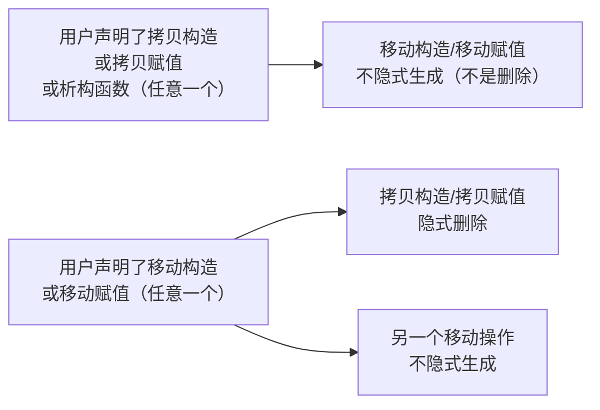

# Effective Modern C++ 2 · 迈向现代 C++（条款 7-17）

> 声明：本篇是围绕 Scott Meyers《Effective Modern C++》相关条款主题独立整理的学习笔记，内容为原创总结、示例代码与图解，不摘录、不改写原书文字，仅标注对应的条款编号和主题方便对照阅读，不构成对原书版权内容的复制。

这一讲对应《Effective Modern C++》第三章"迈向现代 C++"，是全书篇幅最大的一章，涵盖 11 个条款。这一章的主题不是某个孤立特性，而是一组"C++11/14 改了什么、为什么要改、改了之后还留下哪些坑"的语言层面变化：初始化语法的统一尝试、空指针字面量的类型安全、类型别名的模板化、枚举的作用域收紧、函数删除机制、迭代器的 const 正确性、异常规约的重新设计、编译期计算的扩展、const 成员函数的线程安全承诺，以及特殊成员函数生成规则的精确化。这些条款单独看是语法细节，放在一起看是"C++11 在多大程度上修复了 C++98 的历史遗留设计缺陷"这条主线，也是面试里最容易被逐条盘问的一章。

```text
1. 遇到初始化相关的题，先分清"用 () 还是用 {}"这个语法选择本身要解决的三个问题：窄化转换检查、容器列表初始化、最令人烦恼的解析（most vexing parse），再单独检查目标类是否有 initializer_list 构造函数——这一条几乎总是这类题目的陷阱所在。
2. 遇到空指针相关的题，记住核心矛盾：0 和 NULL 本质是整数类型，只有 nullptr 是真正的指针类型（std::nullptr_t），这决定了它们在重载决议和模板推导里的行为差异。
3. 遇到 typedef vs using 的题，答案的落脚点永远是"能不能模板化"：using 可以直接写别名模板，typedef 做不到，只能套一层 struct 加 typename ... ::type。
4. 遇到枚举题，先问"这个枚举的枚举量需不需要被限定在自己的作用域里、需不需要阻止和整数的隐式转换"，能回答 yes 就该用 enum class。
5. 遇到"这个函数为什么被隐式删除/需要显式删除"的题，先确认是不是想禁止拷贝或阻止某个重载被意外选中，= delete 比 private 不定义版本的核心优势是报错时机从链接期提前到编译期，且能用于任意函数而不仅是特殊成员函数。
6. 遇到 override/const_iterator/noexcept/constexpr 这类"看起来加不加都能编译通过"的关键字题，思路统一是：这个关键字要么是给编译器的一份可验证承诺（override 让签名不匹配变成编译错误，noexcept 让违反承诺时程序直接终止），要么是解锁某种优化或编译期能力（noexcept 解锁移动优化，constexpr 解锁编译期求值），从"承诺 vs 能力解锁"这两个角度切入基本能覆盖所有追问。
7. 遇到特殊成员函数生成规则的精确追问，脑子里直接摆出"声明了什么 → 还剩什么会被自动生成"的矩阵，不要用"拷贝和移动是不是对称"这种模糊直觉去猜，移动操作对拷贝操作的抑制是"删除"，拷贝操作对移动操作的抑制只是"不生成"，这两者不是一回事。
```

---

## 条款 7：区分 () 和 {} 创建对象

**核心结论**：C++11 引入花括号初始化（也叫统一初始化，uniform initialization）试图给所有初始化场景提供一套统一语法，它比小括号初始化多了两个好处——禁止隐式的窄化转换、能直接给容器传一组初始值——但也带来一个必须记住的陷阱：一旦目标类型存在接受 `std::initializer_list` 的构造函数，花括号初始化会强烈偏向这个构造函数，即使它明显不是最佳匹配。

先看窄化转换检查，这是花括号初始化最直接的优势：

```cpp
double d = 2.5;

int x1(d);   // 合法，编译通过：d 被截断为 2，值信息丢失但编译器不管
int x2{d};   // 编译错误：花括号初始化禁止窄化转换（double -> int 可能丢失精度）
int x3 = d;  // 合法：拷贝初始化不做花括号那一套检查

int x4{2.5}; // 编译错误：2.5 是字面量，同样触发窄化转换检查
```

`x1` 和 `x3` 的截断在 C++98/03 里是完全合法且默默发生的行为，很多隐蔽的数值 bug 就来自这种无声截断。花括号初始化把这类转换从"运行时行为"变成"编译期错误"，这是它被称为"更安全的初始化语法"的主要原因。

第二个优势是花括号能消除"最令人烦恼的解析"（most vexing parse）——一个把对象定义误解析成函数声明的经典歧义：

```cpp
class Widget {
public:
    Widget() { std::cout << "default ctor\n"; }
};

Widget w1();   // 陷阱：这不是"调用默认构造函数创建 w1"，而是声明了一个名为 w1、
               // 不接受参数、返回 Widget 的函数！不会有任何构造函数被调用
Widget w2{};   // 正确：花括号初始化没有这个歧义，明确创建一个 Widget 对象
```

`Widget w1();` 之所以被解析成函数声明，是因为 C++ 语法规定"任何能被解析成声明的东西都会被解析成声明"，而 `()` 里没有内容、外面又没有其它上下文时，这一行完全符合"声明一个无参函数"的语法。花括号初始化没有这个歧义，因为 `Type obj{}` 从语法上就不可能是函数声明。

现在看这个条款最重要、最常被考的陷阱——`initializer_list` 构造函数对花括号初始化的"霸占"效应：

```cpp
std::vector<int> v1(10, 20);  // 调用 vector(size_type count, const T& value)
                               // 结果：10 个元素，每个都是 20
std::cout << v1.size() << "\n";     // 10
std::cout << v1[0] << "\n";         // 20

std::vector<int> v2{10, 20};  // 调用 vector(std::initializer_list<int>)
                               // 结果：2 个元素，值分别是 10 和 20
std::cout << v2.size() << "\n";     // 2
std::cout << v2[0] << " " << v2[1] << "\n";  // 10 20
```

`v1(10, 20)` 用小括号调用构造函数，正常走重载决议，选中的是 `vector(size_type, const T&)` 这个"重复 n 次某个值"的构造函数。`v2{10, 20}` 用花括号初始化，编译器的规则是：只要类存在一个接受 `std::initializer_list` 的构造函数，编译器就会先尝试把整个花括号列表当成这个构造函数的唯一实参，只有这条路径完全走不通（比如列表里的元素类型无法转换成 `initializer_list` 的元素类型）时，才退回去把花括号内容当普通实参列表做常规重载决议。`std::vector` 恰好提供了 `vector(std::initializer_list<T>)`，`{10, 20}` 里的 `10` 和 `20` 都能转换成 `int`，于是这条路径畅通无阻，直接锁定 `initializer_list` 版本，哪怕程序员的本意明显是调用"n 个相同值"的那个重载。

这个规则甚至能让空的花括号产生反直觉行为：

```cpp
std::vector<int> v3{};   // 调用默认构造函数，得到空 vector（{} 不构成一个非空的 initializer_list 实参）
std::vector<int> v4(3);  // 调用 vector(size_type)，得到 3 个值为 0 的元素
std::vector<int> v5{3};  // 调用 vector(initializer_list<int>{3})，得到 1 个值为 3 的元素
```

**要记住**
- 花括号初始化在编译期拒绝窄化转换，小括号初始化不做这个检查，会静默截断。
- 花括号初始化天生没有"最令人烦恼的解析"这个歧义，`Widget w{};` 永远是对象定义。
- 只要类提供了 `std::initializer_list` 构造函数，花括号初始化会强烈偏向它，即使存在明显更匹配的普通构造函数重载。
- `vector(10, 20)` 是 10 个值为 20 的元素，`vector{10, 20}` 是恰好两个元素 `{10, 20}`——这是本条款最高频的面试考点。
- 写自己的类时，如果同时提供了普通构造函数和 `initializer_list` 构造函数，调用方几乎无法通过肉眼预判花括号调用会落到哪个重载，这是花括号初始化没能完全兑现"统一初始化"承诺的地方。

**常见追问 / 面试陷阱**

> 追问"那我应该默认用哪种初始化语法"：书里的建议是没有一个放之四海而皆准的答案——如果目标类型有 `initializer_list` 构造函数且你的本意确实是构造一个包含这些值的容器，用花括号；如果目标类型有 `initializer_list` 构造函数但你想调用的是另一个重载（比如 `vector` 的"n 份拷贝"构造函数），必须用小括号；普通类的普通初始化，选哪种更多是团队风格问题。记住"有没有 `initializer_list` 构造函数"是决定行为差异的开关就足够应付面试。

---

## 条款 8：优先使用 nullptr 而非 0 和 NULL

**核心结论**：字面量 `0` 的类型永远是 `int`，`NULL` 通常被宏定义成 `0` 或 `0L`，本质仍然是一个整型常量，两者都不是真正的指针类型；只有 C++11 引入的 `nullptr`拥有专属类型 `std::nullptr_t`，它可以隐式转换成任意指针类型，但不能隐式转换成任何整型，这消除了用整数字面量表示空指针带来的重载决议歧义。

先看重载决议被 `0`/`NULL` 搞错的经典场景：

```cpp
void f(int);
void f(bool);
void f(void*);

f(0);        // 调用 f(int)：0 本来就是 int 字面量，这是"意料之中"但常常不是本意
f(NULL);     // 大概率也调用 f(int) 或编译报错（如果 NULL 被定义成 0L，
             // long -> int / long -> bool 和 long -> void* 之间可能产生二义性，具体行为依赖实现）
f(nullptr);  // 调用 f(void*)：nullptr 的类型是 std::nullptr_t，可以隐式转换到任意指针类型，
             // 但不能转换成 int 或 bool，重载决议没有歧义
```

如果程序员写 `f(0)` 或 `f(NULL)` 的本意是"传一个空指针给指针版本的重载"，实际发生的却是整数版本被选中，这种错误在编译期通常没有任何警告，只有运行到分支逻辑时才会发现行为不对。`nullptr` 从类型系统层面直接堵死了这条路。

第二个场景是模板转发中的类型退化问题，这一点比重载决议本身更容易被面试官追问：

```cpp
int    f1(std::shared_ptr<Widget> spw);
double f2(std::unique_ptr<Widget> upw);
bool   f3(Widget* pw);

template <typename FuncType, typename PtrType>
auto callWithNull(FuncType func, PtrType ptr) -> decltype(func(ptr)) {
    return func(ptr);
}

callWithNull(f1, 0);        // 错误：PtrType 被推导为 int，f1 的形参是 shared_ptr<Widget>，类型不匹配
callWithNull(f2, NULL);     // 同样错误：NULL 也会被推导成某个整型
callWithNull(f3, nullptr);  // 正确：PtrType 被推导为 std::nullptr_t，可以隐式转换到 Widget*
```

`0` 和 `NULL` 传入模板函数时，模板参数推导只看它们的字面类型（`int` 或某种整型），并不知道调用者的意图是"空指针"，推导结果自然是一个整型而不是指针类型，导致后续调用彻底失配。`nullptr` 的类型 `std::nullptr_t` 本身能被推导且能安全转换到任意指针类型，模板转发链路才能正确工作。

**要记住**
- `0` 是 `int` 字面量，`NULL` 通常也只是整型宏，两者都不具备指针类型。
- `nullptr` 拥有独立类型 `std::nullptr_t`，可隐式转换到任意指针类型，但不能隐式转换到任何整型，消灭了重载决议里指针版本和整数版本的歧义。
- 在模板参数推导/完美转发场景下，用 `0`/`NULL` 会让指针语义"退化"成整型语义，`nullptr` 不会。
- 现代 C++ 代码里表示空指针应统一使用 `nullptr`，不再有任何理由使用 `0` 或 `NULL`。

---

## 条款 9：优先使用别名声明而非 typedef

**核心结论**：`using Identifier = Type;` 这种别名声明和传统 `typedef` 在给单一类型起别名这件事上完全等价，但别名声明多了一项 `typedef` 做不到的能力——可以直接写成模板，即"别名模板"（alias template）——这让别名声明在需要参数化类型别名的场景里彻底甩开 `typedef`。

先看简单场景下两者的等价性，函数指针类型上 `using` 语法的可读性优势尤其明显：

```cpp
typedef void (*FP1)(int, const std::string&);   // typedef 语法：类型名夹在中间，阅读顺序反直觉
using FP2 = void (*)(int, const std::string&);  // using 语法：等号左边是新名字，右边是原类型，符合阅读习惯
// FP1 和 FP2 是同一个类型，纯风格差异
```

真正的分水岭在于"能不能模板化"。假设需要一个"始终使用自定义分配器 `MyAlloc` 的 `vector`"作为通用别名，`using` 可以直接写：

```cpp
template <typename T>
using MyVec = std::vector<T, MyAlloc<T>>;   // 别名模板：直接可用

MyVec<int> v;   // 等价于 std::vector<int, MyAlloc<int>>，用起来和普通模板类型没有区别
```

`typedef` 无法直接模板化（不存在"typedef 模板"这种语法），要达到同样效果只能把 `typedef` 包裹进一个模板结构体里，然后在每次使用时都要多写一层 `typename ... ::type`：

```cpp
template <typename T>
struct MyVecT {
    typedef std::vector<T, MyAlloc<T>> type;   // typedef 必须嵌在 struct 里才能"参数化"
};

MyVecT<int>::type v;   // 每次使用都要写 ::type，且如果 T 本身依赖某个模板参数，
                        // 还需要在前面加 typename 消除编译器的歧义：
template <typename T>
class Widget {
    typename MyVecT<T>::type data_;   // 必须写 typename，否则编译器无法确定 MyVecT<T>::type 是类型还是静态成员
};

template <typename T>
class WidgetAlias {
    MyVec<T> data_;   // 别名模板：不需要 typename，也不需要 ::type，直接当成一个正常类型使用
};
```

`MyVecT<T>::type` 里的 `type` 是不是一个类型，在模板还没实例化之前编译器并不知道（因为 `T` 是模板参数，`MyVecT<T>` 的具体内容要等实例化才能确定），所以必须靠程序员写 `typename` 显式告诉编译器"这是个类型"。别名模板 `MyVec<T>` 不存在这个问题，因为别名声明本身就是类型层面的构造，用到它的地方永远清楚这是一个类型，不需要任何消歧义关键字。

标准库里 `<type_traits>` 的 `_t` 后缀别名（如 `std::remove_reference_t<T>`）就是这条规则在标准库层面的直接应用——C++11 只提供了 `std::remove_reference<T>::type` 这种 `typedef` 风格接口，C++14 才补上 `std::remove_reference_t<T>` 这种别名模板包装，两者语义完全等价，`_t` 版本纯粹是省掉 `typename` 和 `::type` 的语法糖。

**要记住**
- 给单一具体类型起别名，`using` 和 `typedef` 完全等价，选哪个只是风格问题。
- `using` 可以直接写成别名模板（`template <typename T> using X = ...`），`typedef` 没有这种语法。
- 用 `typedef` 模拟"参数化类型别名"必须包一层 `struct`，使用时还要多写 `typename ... ::type`，别名模板不需要这些样板代码。
- 函数指针这类复杂类型，`using` 的"新名字在左、原类型在右"顺序比 `typedef` 更符合阅读习惯。
- 标准库 C++14 起大量提供 `xxx_t` 别名模板（如 `remove_reference_t`），本质就是对老式 `xxx<T>::type` 的别名模板包装。

---

## 条款 10：优先使用限定作用域的枚举类型而非不限定作用域的枚举类型

**核心结论**：传统的不限定作用域枚举（`enum`）会把枚举量的名字直接泄漏到外层作用域，容易和其它标识符撞名，并且能隐式转换成整型（允许一些语义上说不通的比较和运算）；C++11 引入的限定作用域枚举（`enum class`）把枚举量收进枚举自己的作用域内（必须写成 `Color::red` 才能访问），并且不再提供到其它类型的隐式转换，需要转换时必须显式 `static_cast`。

先看命名空间污染和隐式转换这两个问题：

```cpp
enum Color { black, white, red };          // 不限定作用域枚举
// int white = 0;                          // 错误：white 已经在外层作用域被 Color 的枚举量占用

enum class ScopedColor { black, white, red };  // 限定作用域枚举
int white = 0;                                  // 合法：white 被限制在 ScopedColor 作用域内，不会外泄

// 隐式转换问题
Color c = red;
if (c < 14.5) { /* ... */ }   // 合法但荒谬：Color 隐式转换成 int/double 参与比较，编译器不会警告

ScopedColor sc = ScopedColor::red;
// if (sc < 14.5) { }          // 编译错误：enum class 不提供到算术类型的隐式转换
if (static_cast<double>(sc) < 14.5) { /* ... */ }  // 必须显式转换，意图一目了然
```

`Color` 的枚举量 `black`、`white`、`red` 直接进入定义它们的那个作用域（这里是全局作用域），一旦项目里另一处也想用 `white` 这个名字（哪怕语义完全无关），就会产生命名冲突。`enum class` 强制要求用 `ScopedColor::white` 访问，从根本上消除了这类冲突。`Color` 到 `int`/`double` 的隐式转换则允许"枚举值和一个不相关的浮点数比较"这种编译器完全不会阻止、但几乎总是逻辑错误的代码，`enum class` 要求任何这类转换都显式写出来，读代码的人和编译器都能立刻意识到这里发生了类型转换。

第二个不那么广为人知、但书里明确提到的优势是前向声明能力的差异：

```cpp
enum class Status;              // 合法：限定作用域枚举默认底层类型是 int，可以直接前向声明
enum Status2;                   // 错误（C++98/03 规则）：不限定作用域枚举不能直接前向声明，
                                 // 因为编译器不知道该用多大的底层类型来表示它
enum Status2 : std::uint8_t;    // 合法（C++11 起）：显式指定了底层类型后，不限定作用域枚举也能前向声明
```

不限定作用域枚举在没有显式声明底层类型时，编译器要等看到所有枚举量之后才能选出一个足够容纳它们的最小整型，因此在只有前向声明、看不到枚举量列表的地方，编译器根本无法确定这个枚举要占多少字节，所以历史上不允许对它前向声明。C++11 起允许给不限定作用域枚举显式指定底层类型（`enum Status2 : std::uint8_t;`）来绕开这个限制，但如果不显式指定，仍然不能前向声明。限定作用域枚举则规定了一条更简单的默认规则：不显式指定底层类型时默认为 `int`，因此永远可以前向声明，不需要额外注明底层类型这一步。

**要记住**
- 不限定作用域枚举的枚举量会泄漏到外层作用域，限定作用域枚举把枚举量收进 `EnumName::` 内部。
- 不限定作用域枚举允许隐式转换成整型/浮点类型，容易产生语义上说不通的比较和运算；限定作用域枚举需要显式 `static_cast` 才能转换。
- 限定作用域枚举默认底层类型是 `int`，因此总能直接前向声明；不限定作用域枚举必须显式指定底层类型才能前向声明，否则编译器无法确定它的大小。
- 限定作用域枚举同样支持指定非默认的底层类型（`enum class Status : char { ... }`），语法和不限定作用域枚举一致。
- 少数场景（比如把枚举值当数组下标频繁使用、需要依赖隐式转换）不限定作用域枚举仍更方便，但默认选择应该是 `enum class`。

---

## 条款 11：优先使用删除函数而非私有未定义函数

**核心结论**：C++98 里禁止拷贝的经典写法是把拷贝构造函数和拷贝赋值运算符声明为 `private` 且不给出定义，这样类外部代码试图拷贝会在编译期报错（因为 `private`），但类内部的成员函数或友元误用它们时，只有到链接阶段才会因为"找不到函数定义"而报错，错误信息通常又长又难懂；C++11 的 `= delete` 把这个函数标记为"存在但不可调用"，任何调用点（不论在类内还是类外）都会在编译期直接报错，而且错误信息明确指出"这是一个被删除的函数"。

```cpp
// C++98 老写法
class Widget98 {
public:
    Widget98() = default;
private:
    Widget98(const Widget98&);             // 只声明，不定义
    Widget98& operator=(const Widget98&);  // 只声明，不定义
};

// C++11 写法
class Widget11 {
public:
    Widget11() = default;
    Widget11(const Widget11&) = delete;             // 显式删除
    Widget11& operator=(const Widget11&) = delete;  // 显式删除
};
```

`Widget98` 版本如果被类内部某个成员函数或者声明为友元的函数误调用了拷贝构造函数，这次调用在编译阶段完全合法（因为访问权限检查在类内部本来就能过 `private`），只有到链接阶段找不到对应的函数体时才会报错。`Widget11` 版本里，`= delete` 让编译器把这两个函数当成"重载候选集里存在但选中即报错"的特殊成员，不管调用点在哪里，只要重载决议选中了它就在编译期直接失败，诊断信息也更直接。

`= delete` 真正超越"防止拷贝"这个单一用途的地方，是它可以施加在任意函数（包括非成员的自由函数）上，用来在编译期阻止某个不希望发生的重载决议结果。看一个具体例子——阻止某个函数意外接受能隐式转换的实参类型：

```cpp
void f(double d) { std::cout << "f(double): " << d << "\n"; }
void f(int i)    = delete;   // 删除 int 版本，禁止 f 接受整型实参（包括能隐式转换成整型的类型）

f(3.14);   // 合法：正常调用 f(double)
// f(3);   // 编译错误：本来 3 可以隐式转换成 double 调用 f(double)，
           // 但重载决议会先看有没有精确匹配 int 的候选，f(int) 被删除后，
           // 编译器发现最佳匹配是一个被删除的函数，直接报错，而不是退而求其次转成 double
```

如果没有 `f(int) = delete;`，调用 `f(3)` 会正常触发 `int -> double` 的隐式转换去匹配 `f(double)`；但一旦声明了 `f(int)` 并将其删除，重载决议在候选集里找到"完全匹配 `int` 实参、不需要任何转换"的 `f(int)`，按照重载决议规则这是比"需要一次隐式转换"的 `f(double)` 更优的匹配，于是编译器选中了它——然后发现它被删除，编译失败。这项技巧常用来堵住某些类型的隐式转换通道（比如禁止指针类型被隐式转换成 `bool` 参与不该发生的重载分支），是比 `private` 未定义函数灵活得多的用法，因为 `private` 手法根本无法作用于非成员函数或非特殊成员函数。

**要记住**
- `= delete` 让函数在编译期、任意调用点（类内、类外、友元）报错；`private` 不定义只在类外报错在编译期，类内误用要到链接期才报错。
- `= delete` 的诊断信息更清晰，直接说明"这是一个被删除的函数"。
- `= delete` 可以施加在任意函数上，不局限于拷贝构造/拷贝赋值这类特殊成员函数。
- 经典用法：删除某个参数类型的重载，阻止编译器通过隐式转换退而求其次匹配到另一个重载。
- 删除的函数仍然参与重载决议（这是它和"根本不声明"的关键区别），只是一旦被选中就报错，这一点是很多人第一次接触时容易搞混的地方。

---

## 条款 12：为重写函数加上 override 声明

**核心结论**：一个派生类函数要真正重写（override）基类的虚函数，必须让签名（包括参数类型列表、`const` 限定、引用限定符）和基类虚函数完全一致，只要有任何一处不匹配，派生类的这个函数就不再是"重写"，而是变成一个跟基类虚函数毫无关系、只是恰好同名的新函数（这个新函数会隐藏基类的同名函数），并且这种情况编译器默认不会报错；`override` 关键字让编译器主动去验证这个签名匹配关系，一旦不匹配就编译报错，把原本可能潜伏很久的隐藏 bug 提前到编译期暴露。

```cpp
class Base {
public:
    virtual void doWork() const { std::cout << "Base::doWork\n"; }
    virtual ~Base() = default;
};

class Derived : public Base {
public:
    void doWork() { std::cout << "Derived::doWork\n"; }   // 陷阱：漏写 const，
                                                            // 这不是重写，是一个新的、隐藏基类版本的函数
};

Base* p = new Derived();
p->doWork();   // 输出 Base::doWork，而不是期望中的 Derived::doWork
               // 因为通过 Base* 调用时，编译器按 Base::doWork 的签名（const）去虚函数表里查
               // Derived::doWork()（无 const）根本不在这张表里对应的槽位上
```

这段代码能通过编译、能正常运行，唯一的问题是运行结果和直觉不符——期望的多态调用没有发生。如果 `Derived::doWork` 后面加上 `override`：

```cpp
class Derived : public Base {
public:
    void doWork() override { std::cout << "Derived::doWork\n"; }  // 编译错误！
    // error: 'doWork' marked 'override' but does not override any base class methods
    // 因为签名（缺少 const）和 Base::doWork() const 不匹配
};
```

编译器立刻指出问题所在：这行函数被标了 `override`，但找不到任何一个基类虚函数能被它重写。开发者看到这个错误就能马上意识到自己少写了 `const`。

这一点和本项目 `QuantDevCPP03` 里详细展开的"重写（override）/ 重载（overload）/ 隐藏（hiding）"三者关系是同一个知识点在不同角度的呈现：那一讲侧重讲清楚三者各自的判定条件和内存/调用层面的区别，这里的落脚点更窄——书里强调的是一条纯粹的工程习惯：**任何打算重写虚函数的地方，无条件加 `override`**，把"签名是否匹配"这件事从"程序员肉眼核对"变成"编译器强制验证"，成本几乎为零，收益是杜绝一整类因为签名细节写错（漏 `const`、参数类型写错、忘记引用限定符）而导致的隐蔽多态失效问题。

**要记住**
- 重写要求派生类函数签名和基类虚函数完全一致，包括 `const`/`volatile` 限定符和引用限定符（`&`/`&&`），差一点就不算重写。
- 签名不匹配时，派生类函数默认变成一个隐藏基类同名函数的新函数，编译器不会报错，运行时行为却不是期望的多态分发。
- `override` 让编译器验证签名匹配关系，不匹配直接编译报错，是定位这类问题最快的手段。
- 团队工程习惯上，只要是打算重写的虚函数，一律加 `override`，没有例外，这是几乎零成本的防御性写法。
- 相关但不同的另一个关键字是 `final`，标在虚函数上禁止派生类再重写它，标在类上禁止这个类被继续继承。

---

## 条款 13：优先使用 const_iterator 而非 iterator

**核心结论**：只要一段代码不需要通过迭代器修改容器元素，就应该使用 `const_iterator` 而不是 `iterator`，这和"能用 `const` 引用就不用非 `const` 引用"是同一条 const 正确性原则在迭代器上的体现；这条建议在 C++98 里实践起来有不小的摩擦（从非 `const` 容器获取 `const_iterator` 不方便），C++11 补上了非成员的 `std::cbegin()`/`std::cend()`（以及容器自带的成员版本）之后，这个障碍基本消失。

```cpp
std::vector<int> values{1, 2, 3, 4, 5};

// 只读遍历，语义上不需要修改元素，应当用 const_iterator
for (auto it = std::cbegin(values); it != std::cend(values); ++it) {
    std::cout << *it << " ";
    // *it = 0;   // 编译错误：const_iterator 指向的元素不可修改，写错了会被立刻拦下
}

// 需要修改元素时才用 iterator
auto it = std::find(values.begin(), values.end(), 3);
if (it != values.end()) {
    *it = 30;   // 合法：iterator 允许修改
}
```

用 `const_iterator` 遍历只读场景，好处和用 `const T&` 传参一样：把"这段代码不会修改元素"这个意图写进类型系统里，让编译器帮忙检查，而不是只靠代码审查或者注释。如果不小心在只读逻辑里手滑写了一次赋值，`const_iterator` 会让这个错误在编译期就现形，普通 `iterator` 则会让这个 bug 一直存活到运行时才可能被发现。

`std::cbegin`/`std::cend` 的价值在于它们能对一个**非 const** 的容器对象直接产出 `const_iterator`：

```cpp
std::vector<int> v{1, 2, 3};   // v 本身不是 const 对象
auto cit = v.cbegin();          // C++11 起容器自带 cbegin() 成员函数
auto cit2 = std::cbegin(v);     // C++14 起还提供非成员版本 std::cbegin，可用于原生数组等场景
```

在没有 `cbegin`/`cend` 的年代，唯一能拿到 `const_iterator` 的办法是持有一个 `const` 引用/指针指向容器，再调用它的 `begin()`（在 `const` 对象上调用 `begin()` 会返回 `const_iterator` 这是 C++98 就有的重载），这在通用代码（比如泛型函数模板）里很别扭，导致很多人图省事直接全用非 `const` 的 `iterator`，这也是这条本身很朴素的原则在 C++11 之前没能被广泛遵守的现实原因。

**要记住**
- 不需要修改元素时用 `const_iterator`，这是 const 正确性在迭代器层面的自然延伸。
- C++11 起容器提供 `cbegin()`/`cend()` 成员函数，C++14 起标准库补上非成员版本 `std::cbegin`/`std::cend`。
- 非成员版本的意义在于能对原生数组等没有成员函数的类型也统一使用同一套写法。
- 这条建议在 C++11 之前实践阻力很大（获取 const_iterator 不方便），C++11 之后已经没有理由继续图省事使用普通 iterator。

---

## 条款 14：只要函数不会抛出异常，就为其声明 noexcept

**核心结论**：`noexcept` 承担两个作用——对调用者和阅读代码的人而言，它是一份"这个函数保证不抛异常"的文档化契约；对编译器而言，它是一个可以解锁特定优化的信号，最典型的例子就是本项目在移动语义部分讲过的 `std::vector` 扩容场景：只有元素类型的移动构造函数标了 `noexcept`，`vector` 扩容搬迁时才会优先使用移动而不是退化成拷贝。这个双重身份也带来一条必须谨慎对待的规则：`noexcept` 函数如果真的抛出了异常，程序会直接调用 `std::terminate`（部分实现甚至不保证完成栈展开），所以 `noexcept` 只应该标在你真正确定不会抛异常的函数上，不能因为想蹭优化红利就到处乱标。

```cpp
class Buffer {
public:
    Buffer(Buffer&& other) noexcept   // 承诺：这个移动构造函数不会抛异常
        : data_(other.data_), size_(other.size_) {
        other.data_ = nullptr;
        other.size_ = 0;
    }
    // ...
private:
    int* data_;
    std::size_t size_;
};

std::vector<Buffer> buffers;
buffers.push_back(Buffer{});
// 扩容发生时，vector 内部用 std::move_if_noexcept 决定搬迁策略：
// Buffer 的移动构造函数标了 noexcept，扩容会对每个旧元素调用移动构造，O(1) 逐个搬迁
// 如果去掉 noexcept，vector 会为了保证强异常安全退回逐元素拷贝，多一份完整的堆内存分配
```

这一段和本项目 `QuantDevCPP04` 里"移动构造函数应该标 `noexcept`"这条结论是同一个机制的两种表述：那一讲从"`vector` 扩容为什么需要强异常安全保证"的角度解释了 `move_if_noexcept` 的行为，这里的落脚点是条款 14 想强调的更一般化的原则——不只是移动构造函数，任何"确定不会抛异常"的函数都值得标 `noexcept`，因为标准库和编译器在很多地方（不仅限于 `vector` 扩容）都会检查 `noexcept` 状态来决定走哪条代码路径。

再看 `noexcept` 违约时的严重后果，这是它和"只是不写 `throw` 关键字"的本质区别：

```cpp
void mayThrowInternally() { throw std::runtime_error("oops"); }

void riskyNoexcept() noexcept {
    mayThrowInternally();   // 编译能通过：编译器不会检查函数体是否真的可能抛异常
}

int main() {
    riskyNoexcept();   // 一旦 mayThrowInternally 真的抛出异常：
                        // 程序直接调用 std::terminate，进程异常终止
                        // 不会有任何机会被 main 里的 catch 捕获，即使外层包了 try/catch 也没用
}
```

编译器不会在编译期验证一个标了 `noexcept` 的函数体是否真的不抛异常（这在通用情况下也做不到，属于停机问题的变种），这意味着"标了 `noexcept` 但函数体里其实可能抛异常"这种错误完全能通过编译，只有运行到抛异常那一刻才会以 `std::terminate` 的方式暴露出来，而且这种终止是不可恢复的，比一个没被捕获的普通异常传播到 `main` 还要粗暴。这就是为什么条款 14 反复强调"只有真正确定不抛异常时才标 `noexcept`"，而不是"为了拿到潜在优化，宁可错标也要标上"。

**要记住**
- `noexcept` 既是给调用者的文档承诺，也是给编译器/标准库的优化信号（典型例子是移动构造函数与 `vector` 扩容）。
- `noexcept` 函数在运行时真的抛出异常，会直接触发 `std::terminate`，且不保证栈完全展开，比普通未捕获异常更粗暴。
- 编译器不会静态验证 `noexcept` 函数体是否真的不抛异常，错误的 `noexcept` 标注要到运行时才会暴露，且暴露方式是程序终止。
- 只对你真正确定、有把握不会抛异常的函数标 `noexcept`，不要为了蹭优化到处滥用。
- 大多数函数默认不是 `noexcept` 的，需要显式标注；移动操作、`swap`、析构函数是几个通常应当（且标准库默认期望）是 `noexcept` 的高频场景。

---

## 条款 15：只要有可能使用 constexpr，就使用它

**核心结论**：`constexpr` 修饰对象时，表示这个对象的值在编译期就已确定，可以用在要求编译期常量的上下文里（数组大小、模板非类型参数、`static_assert` 的条件等）；`constexpr` 修饰函数时，含义是"这个函数在所有实参都是编译期常量的前提下，能够产出一个编译期结果"，但同一个 `constexpr` 函数完全可以用运行时才知道的普通变量去调用，此时它就是一个正常在运行时执行的函数——这种"编译期能力"而非"编译期强制"的双重身份，是这个条款里最容易被问到的细节。

```cpp
constexpr int pow(int base, int exp) {
    int result = 1;
    for (int i = 0; i < exp; ++i) result *= base;   // C++14 起 constexpr 函数允许循环、局部变量、多条语句
    return result;
}

constexpr int compileTimeResult = pow(2, 10);   // 编译期求值，compileTimeResult 在编译期就是 1024
static_assert(compileTimeResult == 1024, "");   // 可以用在要求编译期常量的 static_assert 里

int base = 2, exp = 10;
std::cin >> base >> exp;         // base、exp 只有运行时才知道具体值
int runtimeResult = pow(base, exp);   // 合法：pow 退化成一个普通函数，在运行时正常执行循环求值
```

`pow(2, 10)` 里两个实参都是编译期常量，编译器有能力（但标准并不强制要求）在编译阶段把整个循环跑完，直接把 `compileTimeResult` 替换成字面量 `1024`；`pow(base, exp)` 里 `base` 和 `exp` 是运行时才能确定的变量，编译器没有能力在编译期求值，`pow` 这时就是一个普通函数，函数体在运行时正常执行。这正是"能在编译期运行，也能在运行时运行"这句话的字面含义：同一份函数定义服务两种场景，不需要程序员为"编译期版本"和"运行时版本"分别写两份代码。

数组大小是最直观的应用场景之一：

```cpp
constexpr std::size_t bufferSize() { return 128; }

int buffer[bufferSize()];       // 合法：bufferSize() 是 constexpr 函数，实参（无）在编译期可求值，
                                 // 结果可以用作数组大小
```

普通非 `constexpr` 函数即使函数体完全一样，也不能用于这个场景，因为编译器不允许普通函数调用出现在要求编译期常量的位置，即使从值上看这个函数"显然"总是返回同一个值。

`constexpr` 函数的限制随着标准版本逐步放松：C++11 版本的 `constexpr` 函数体本质上只能是一条 `return` 语句（可以用条件表达式、递归等技巧绕过“只能一条语句”的限制，但不能有循环、多个局部变量、多条语句这类结构）；C++14 大幅放开了限制，允许循环、分支、局部变量、多条语句，前面 `pow` 函数里的 `for` 循环写法正是 C++14 才被允许的形式，C++11 下必须改写成递归形式。C++20 又进一步放松，允许 `constexpr` 函数内部使用动态内存分配、`try/catch`（只要求异常路径本身不在编译期求值路径上触发）等更多结构。

**要记住**
- `constexpr` 对象的值必须在编译期确定，能用于数组大小、模板参数等编译期常量上下文，普通 `const` 对象不保证这一点。
- `constexpr` 函数的含义是"能在编译期产出结果"，不是"只能在编译期运行"，用运行时变量调用它，它就是一个正常的运行时函数。
- C++11 的 `constexpr` 函数几乎只能写成单一 `return` 语句（可用递归/条件表达式变通）；C++14 起放开为可以有循环、多语句、局部变量；C++20 进一步放宽。
- 只要一个函数的逻辑本质上是纯计算、不依赖运行时状态，就值得考虑标成 `constexpr`，为将来可能出现的编译期调用场景留出空间。

---

## 条款 16：让 const 成员函数线程安全

**核心结论**：一个 `const` 成员函数向调用者承诺"调用它不会改变对象的可观察状态"，调用者据此合理地认为多个线程可以同时调用同一个对象的多个 `const` 成员函数而不需要额外同步；但如果这个 `const` 成员函数内部依赖 `mutable` 成员做了某种"看起来不影响外部状态、实际上确实修改了内存"的操作（最典型的是缓存/记忆化），这个内部写入在并发调用下就是一次未加保护的数据竞争，必须显式同步。

一个典型的"看起来是只读、实际上有隐藏写入"的例子——首次访问时惰性计算并缓存一个昂贵的结果：

```cpp
class ExpensiveComputation {
public:
    int getValue() const {                    // 对外承诺：不修改可观察状态
        if (!cached_) {
            cachedValue_ = computeExpensive(); // 隐藏的写入：修改了 mutable 成员
            cached_ = true;
        }
        return cachedValue_;
    }

private:
    int computeExpensive() const { /* 假设很耗时 */ return 42; }

    mutable bool cached_ = false;   // mutable：允许在 const 成员函数里修改
    mutable int cachedValue_ = 0;
};
```

单线程场景下这段代码没有任何问题：外部看到的 `getValue()` 返回值永远一致，"缓存"这件事对调用者完全透明。但如果两个线程同时第一次调用同一个对象的 `getValue()`，两次调用可能同时判断 `cached_ == false`、同时进入 `if` 分支、同时读写 `cached_` 和 `cachedValue_`，这是一次典型的数据竞争（data race），属于未定义行为——即使两次计算出的 `computeExpensive()` 结果完全相同，只要没有同步机制保护这两个变量的并发读写，程序行为就是未定义的，不能因为"结果反正一样"就认为没问题。

修复办法是用互斥量保护这部分内部状态的读写：

```cpp
class ExpensiveComputation {
public:
    int getValue() const {
        std::lock_guard<std::mutex> lock(mutex_);   // 保护对 cached_/cachedValue_ 的访问
        if (!cached_) {
            cachedValue_ = computeExpensive();
            cached_ = true;
        }
        return cachedValue_;
    }

private:
    int computeExpensive() const { return 42; }

    mutable std::mutex mutex_;      // 互斥量本身也必须是 mutable，因为要在 const 成员函数里加锁
    mutable bool cached_ = false;
    mutable int cachedValue_ = 0;
};
```

`mutex_` 必须声明为 `mutable`，因为加锁/解锁本质上也是对 `mutex_` 内部状态的修改，而 `getValue()` 是 `const` 成员函数，普通成员在其中不可修改，只有 `mutable` 成员能绕开这条限制。如果被保护的状态足够简单（比如只是一个计数器或一个布尔标志，而不是像这里这样"判断+计算+写入"的复合操作），用 `std::atomic` 通常比互斥量更轻量，但只要涉及"读取状态、决定要不要做某个动作、再写回状态"这种复合的先读后写逻辑（这里是"检查缓存是否存在，不存在则计算并写入"），单个 `atomic` 变量无法保证整个操作的原子性，仍然需要互斥量。

**要记住**
- `const` 成员函数承诺不改变对象的可观察状态，调用者据此默认认为可以安全地并发调用，这个假设只有在函数内部真的没有任何未同步的写入时才成立。
- `mutable` 成员（典型场景是缓存、记忆化字段）即使不影响对外可见状态，只要在多线程下被并发读写而没有同步，就是数据竞争，属于未定义行为。
- 修复方式是用 `std::mutex`（或必要时 `std::atomic`）保护这部分内部可变状态，且互斥量本身要声明为 `mutable`。
- 简单的单一标志/计数器可以用 `std::atomic` 代替互斥量换取更低开销；一旦是"先读后写"的复合逻辑，`atomic` 保证不了整体原子性，仍需互斥量。

---

## 条款 17：理解特殊成员函数的生成规则

**核心结论**：特殊成员函数一共六个：默认构造函数、析构函数、拷贝构造函数、拷贝赋值运算符、移动构造函数、移动赋值运算符。C++98 的 Rule of Three 说的是"需要自定义析构函数、拷贝构造、拷贝赋值中的任意一个，通常三个都要自定义"，C++11 把这条原则扩展为 Rule of Five，加入了移动构造和移动赋值。这个条款要精确记住的不是"要不要自己写"这个设计建议，而是编译器隐式生成规则本身一条不对称的关键细节：**声明移动操作（移动构造或移动赋值中的任意一个）会把两个拷贝操作都变成隐式删除，同时让另一个移动操作也不会被生成；而声明拷贝操作只会按 C++98 的老规则抑制"另一个拷贝操作"的隐式生成，并不会删除移动操作——移动操作只是根本不会被生成（因为 C++11 规定用户声明了拷贝操作或析构函数中的任意一个，移动操作就完全不隐式生成），"不生成"和"生成后被删除"是两个不同的状态，调用效果也不同**。

先看这条不对称规则实际造成的行为差异：

```cpp
struct DeclareMoveCtor {
    DeclareMoveCtor(DeclareMoveCtor&&) {}   // 用户声明了移动构造函数
};
// 效果：拷贝构造函数、拷贝赋值运算符被隐式删除（= delete）
// 移动赋值运算符不会被隐式生成（既不存在，也不是删除，就是没有这个函数）

DeclareMoveCtor a;
// DeclareMoveCtor b = a;      // 编译错误：拷贝构造被删除，明确提示"attempting to reference a deleted function"
// a = DeclareMoveCtor{};      // 编译错误：移动赋值运算符不存在（也没有可用的拷贝赋值退路，因为它也被删除了）

struct DeclareCopyCtor {
    DeclareCopyCtor(const DeclareCopyCtor&) {}   // 用户声明了拷贝构造函数
};
// 效果：拷贝赋值运算符不会被隐式生成（C++98 老规则：声明了拷贝构造，编译器不再自动生成拷贝赋值）
// 移动构造、移动赋值都不会被隐式生成（C++11 新规则：声明了任意拷贝操作，移动操作就不生成）
// 但这里的"不生成"不是"删除"

DeclareCopyCtor c1;
DeclareCopyCtor c2 = std::move(c1);   // 依然能编译通过！
// 因为移动构造函数根本不存在，重载决议退回去找拷贝构造函数——
// const DeclareCopyCtor& 可以绑定右值，拷贝构造函数没有被删除，仍然是候选，
// 于是 std::move(c1) 被"降级"匹配成拷贝构造，静默地退化成一次拷贝，不会有任何编译错误或警告
```

`DeclareMoveCtor` 的例子里，`b = a` 这类拷贝操作会在编译期直接报错，报错信息明确说这是一个被删除的函数，程序员很快能定位问题。`DeclareCopyCtor` 的例子则完全不同：`std::move(c1)` 这行代码看起来像是在做移动，实际上因为移动构造函数根本不存在，编译器安安静静地退回去调用拷贝构造函数，代码编译通过、运行正确，只是悄悄损失了移动语义本该带来的性能收益，而且没有任何诊断信息提示这件事发生了。这正是"删除"和"不生成"两种状态在实际后果上的根本差异：前者是显式的编译错误，后者是静默的性能退化。

完整的生成规则矩阵（"用户声明了什么" → "编译器还会/不会隐式生成什么"）：

| 用户显式声明的内容 | 默认构造函数 | 析构函数 | 拷贝构造函数 | 拷贝赋值运算符 | 移动构造函数 | 移动赋值运算符 |
|---|---|---|---|---|---|---|
| 什么都不声明 | 生成 | 生成 | 生成 | 生成 | 生成 | 生成 |
| 任意构造函数（含带参构造） | **不生成** | 生成 | 生成 | 生成 | 生成 | 生成 |
| 析构函数 | 生成 | — | 生成（已弃用的行为，仍生成但不推荐依赖） | 生成（同上） | **不生成** | **不生成** |
| 拷贝构造函数 | 不生成 | 生成 | — | **不生成**（老规则） | **不生成** | **不生成** |
| 拷贝赋值运算符 | 生成 | 生成 | **不生成**（老规则） | — | **不生成** | **不生成** |
| 移动构造函数 | 不生成 | 生成 | **删除** | **删除** | — | **不生成** |
| 移动赋值运算符 | 生成 | 生成 | **删除** | **删除** | **不生成** | — |

（"—"表示该行声明的就是这个函数本身；"不生成"指编译器不会隐式提供这个函数，调用它要么报错"找不到匹配重载"要么静默退化成语义相近的其它函数，如拷贝退化；"删除"指编译器隐式生成了一个 `= delete` 版本，调用会在编译期明确报错。表中"声明析构函数"一行对拷贝操作的影响——C++11 起声明了用户析构函数后，拷贝构造/拷贝赋值仍然会被生成，但这一行为在标准里被标记为已弃用（deprecated），书里建议不要依赖它，凡是自定义了析构函数就应该认真考虑拷贝语义要不要一起显式声明。）



这张图把书里最容易被问到的不对称性浓缩成一句话：**从"拷贝"指向"移动"的抑制效果是"不生成"，从"移动"指向"拷贝"的抑制效果是"删除"**，这不是随意设计，而是 C++11 委员会考虑向后兼容性之后的折中——大量 C++98 就存在的类只声明了析构函数或拷贝操作，如果这类历史代码在移动语义引入后突然被"删除"某些函数，会造成大规模不兼容；但反过来，一个类如果程序员已经明确写了移动构造（说明这个类在管理某种适合被移动的资源），编译器有理由认为默认的逐成员拷贝多半是错的，直接删除比默默生成一个可能错误的拷贝更安全。

**要记住**
- 声明移动构造或移动赋值中的任意一个：两个拷贝操作被隐式删除，另一个移动操作不被隐式生成。
- 声明拷贝构造、拷贝赋值或析构函数中的任意一个：两个移动操作都不被隐式生成（但不是删除）。
- "不生成"和"删除"效果不同：调用被删除的函数是编译错误；调用不存在的移动操作，重载决议可能安静地退化成调用拷贝操作，不报错但损失性能。
- 声明拷贝构造函数会抑制拷贝赋值运算符的隐式生成，反之亦然，这是 C++98 就有的老规则，C++11 没有改变它。
- 用户声明了析构函数之后，拷贝构造/拷贝赋值仍然会被隐式生成，但标准已把这条行为标记为已弃用，实践中不应该依赖它——只要自定义了析构函数，就应该认真考虑连拷贝、移动一起显式声明或者用 `= default`/`= delete` 明确表态。

---

## 快速选择题

```quiz
title: 快速选择题 1
question: 下列哪种写法能在编译期直接拒绝窄化转换？
answer: C
A. `int x(2.5);`
B. `int x = 2.5;`
C. `int x{2.5};`
D. 三种写法效果相同
explanation: 花括号初始化会做窄化转换检查，`2.5` 转 `int` 属于窄化，直接编译报错；小括号和 `=` 拷贝初始化都会静默截断。
```

```quiz
title: 快速选择题 2
question: `std::vector<int> v(10, 20);` 和 `std::vector<int> v{10, 20};` 的结果分别是？
answer: C
A. 两者都得到 10 个值为 20 的元素
B. 两者都得到 2 个元素 {10, 20}
C. 前者是 10 个值为 20 的元素，后者是 2 个元素 {10, 20}
D. 前者编译错误，后者是 2 个元素
explanation: 小括号走普通重载决议，匹配 `vector(size_type, const T&)`；花括号会优先尝试匹配 `initializer_list` 构造函数，两个 `int` 实参都能构成合法的 `initializer_list<int>`，因此得到恰好两个元素的 vector。
```

```quiz
title: 快速选择题 3
question: `Widget w();` 这行代码在 C++ 里实际会被解析成什么？
answer: B
A. 调用默认构造函数创建对象 w
B. 一个返回 Widget、不接受参数、名为 w 的函数声明
C. 编译错误
D. 和 `Widget w;` 完全等价
explanation: 这是"最令人烦恼的解析"：只要一段代码在语法上能被解析成声明，编译器就会把它解析成声明，`Widget w{}` 用花括号写法可以规避这个歧义。
```

```quiz
title: 快速选择题 4
question: 为什么应该优先使用 `nullptr` 而不是 `0` 或 `NULL` 表示空指针？
answer: B
A. `nullptr` 运行更快
B. `0` 和 `NULL` 本质是整型，可能在重载决议或模板推导中被错误地当成整数处理
C. `NULL` 在 C++11 里已经被移除
D. `nullptr` 占用更少内存
explanation: `0` 是 `int` 字面量，`NULL` 通常也只是整型宏，两者都不是指针类型；`nullptr` 拥有专属类型 `std::nullptr_t`，能正确参与指针重载决议和模板推导。
```

```quiz
title: 快速选择题 5
question: `typedef` 相比别名声明（`using`）最大的能力短板是什么？
answer: B
A. `typedef` 不能用于函数指针类型
B. `typedef` 不能被模板化（不存在"typedef 模板"），必须包一层 struct 并通过 `::type` 访问
C. `typedef` 语法不允许出现在类内部
D. `typedef` 和 `using` 没有任何区别
explanation: 别名声明可以直接写成别名模板（`template<typename T> using X = ...`），`typedef` 做不到，只能借助模板结构体加 `typename ... ::type` 的方式模拟。
```

```quiz
title: 快速选择题 6
question: 关于 `enum class`（限定作用域枚举），下列哪项描述错误？
answer: C
A. 枚举量被限定在枚举自身的作用域内，需要用 `EnumName::value` 访问
B. 不提供到整型的隐式转换，需要显式 `static_cast`
C. 不能指定非默认的底层类型
D. 默认底层类型是 `int`，因此可以直接前向声明
explanation: 描述错误，`enum class` 同样支持指定底层类型，如 `enum class Status : char { ... }`，这一点和不限定作用域枚举的语法一致。
```

```quiz
title: 快速选择题 7
question: 不限定作用域的 `enum`（不指定底层类型时）能否直接前向声明？
answer: B
A. 可以，和 `enum class` 一样
B. 不可以，因为编译器不知道该用多大的底层类型表示它，除非显式指定底层类型
C. 不可以，C++ 标准完全禁止枚举前向声明
D. 只有 C++20 才支持
explanation: 不限定作用域枚举默认要等看到所有枚举量才能确定最小底层类型，因此不指定底层类型时无法前向声明；C++11 起允许显式指定底层类型后前向声明。
```

```quiz
title: 快速选择题 8
question: `= delete` 相比"声明为 `private` 且不定义"的旧手法，最本质的优势是什么？
answer: B
A. `= delete` 只能用于拷贝构造函数
B. `= delete` 让误用在编译期（而非链接期）报错，且能用于任意函数而不仅是特殊成员函数
C. `= delete` 会自动生成一份默认实现
D. 两者没有实质区别，只是语法新旧不同
explanation: `private` 未定义版本在类内部误用时只有链接期才报错，`= delete` 在任意调用点都能在编译期直接报错，且可以施加在任意函数（包括非成员函数、任意参数类型重载）上，不局限于特殊成员函数。
```

```quiz
title: 快速选择题 9
question: 下列关于 `override` 的说法，哪项正确？
answer: B
A. 派生类函数只要函数名和基类虚函数相同就能被 `override` 接受
B. `override` 会强制编译器验证派生类函数签名（含 const 限定、引用限定符）与某个基类虚函数完全匹配，不匹配则报错
C. 不加 `override` 时，签名不匹配的重写会在运行时抛异常
D. `override` 只能用于纯虚函数
explanation: `override` 要求签名完全匹配基类虚函数，包含 `const`/引用限定符，任何一处不同都会导致编译错误，而不加 `override` 时这种不匹配默认只会静默产生一个隐藏基类函数的新函数，不会报错也不会抛异常。
```

```quiz
title: 快速选择题 10
question: C++11 引入 `std::cbegin`/`std::cend` 解决了什么实际问题？
answer: B
A. 让 const_iterator 的解引用速度更快
B. 让从非 const 容器对象直接获取 const_iterator 变得方便，扫清了此前推广 const_iterator 使用的实际障碍
C. 让容器可以被多线程同时遍历
D. 取代了 begin()/end() 成员函数
explanation: C++98 里要拿到 const_iterator 只能借助 const 引用/指针调用 `begin()`，在泛型代码里不方便；`cbegin`/`cend` 直接对非 const 对象产出 const_iterator，让"能用 const_iterator 就用它"这条原则实践起来不再别扭。
```

```quiz
title: 快速选择题 11
question: `noexcept` 函数在运行时如果真的抛出了异常，会发生什么？
answer: C
A. 异常正常向上传播，被外层 catch 捕获
B. 编译器在编译期就会阻止这种情况发生
C. 程序直接调用 `std::terminate`，可能不保证完成栈展开
D. 函数返回一个错误码代替异常
explanation: 这是 `noexcept` 承诺被违反时的行为，程序会直接终止，比一个未被捕获的普通异常更粗暴，这也是为什么不能仅仅为了性能优化就随意给不确定的函数加 `noexcept`。
```

```quiz
title: 快速选择题 12
question: `noexcept` 标注和 `std::vector` 扩容策略之间的关系是？
answer: B
A. 无关，`vector` 扩容不检查元素类型是否 `noexcept`
B. 只有元素的移动构造函数标了 `noexcept`（或类型没有可用拷贝构造），扩容才会优先使用移动而非拷贝
C. `noexcept` 会让 `vector` 扩容变慢
D. `vector` 元素必须全部标注 `noexcept` 才能编译
explanation: `vector` 扩容为保证强异常安全，通过 `std::move_if_noexcept` 决定搬迁策略：移动构造函数标了 `noexcept`（或类型只能移动不能拷贝）时才真正使用移动，否则退化为拷贝。
```

```quiz
title: 快速选择题 13
question: 关于 `constexpr` 函数，下列说法正确的是？
answer: B
A. `constexpr` 函数只能在编译期被调用，不能用运行时变量调用
B. `constexpr` 函数在实参都是编译期常量时可以产出编译期结果，用运行时变量调用时会退化为普通运行时函数
C. C++11 起 `constexpr` 函数就可以包含任意数量的循环和局部变量
D. `constexpr` 只能修饰函数，不能修饰对象
explanation: `constexpr` 函数具备"能在编译期求值"的能力，但并不强制每次调用都发生在编译期；用运行时变量调用时，它就是一个正常执行的运行时函数。C++11 对 `constexpr` 函数体的限制远比 C++14 严格，基本只能写成单一 return 语句。
```

```quiz
title: 快速选择题 14
question: 一个 `const` 成员函数内部通过 `mutable` 字段做惰性缓存，在多线程环境下最主要的风险是什么？
answer: B
A. `mutable` 字段不能在 `const` 函数里使用，无法编译
B. 多个线程并发调用时对 `mutable` 字段的读写可能构成未加保护的数据竞争，属于未定义行为
C. `const` 成员函数在多线程下会自动加锁，没有风险
D. 缓存值在不同线程之间会自动同步
explanation: `const` 成员函数向调用者承诺不改变对外可观察状态，调用者据此认为可以放心并发调用；但内部对 `mutable` 缓存字段的写入如果没有同步保护，并发调用下就是数据竞争，需要用 `std::mutex` 或 `std::atomic` 保护。
```

```quiz
title: 快速选择题 15
question: 一个类只显式声明了移动构造函数，其它特殊成员函数都不声明，下列说法正确的是？
answer: B
A. 拷贝构造函数和拷贝赋值运算符仍会被正常隐式生成
B. 拷贝构造函数和拷贝赋值运算符被隐式删除，移动赋值运算符不会被隐式生成
C. 六个特殊成员函数全部被删除
D. 只有移动赋值运算符会被隐式删除，拷贝操作不受影响
explanation: 声明移动构造函数会让编译器隐式删除两个拷贝操作，同时移动赋值运算符不会被隐式生成（不是删除，是完全不存在），这正是条款 17 最核心的不对称规则。
```

```quiz
title: 快速选择题 16
question: 一个类只显式声明了拷贝构造函数，其它特殊成员函数都不声明，下列说法正确的是？
answer: C
A. 移动构造函数和移动赋值运算符会被正常隐式生成
B. 移动构造函数和移动赋值运算符被隐式删除
C. 移动构造函数和移动赋值运算符都不会被隐式生成（不是删除），对移出对象调用移动操作会静默退化成调用拷贝构造函数
D. 拷贝赋值运算符也会被隐式删除
explanation: 声明拷贝构造函数只会按老规则抑制拷贝赋值运算符的隐式生成，同时因为 C++11 新规则，移动操作完全不会被隐式生成；由于移动构造函数不存在（而非被删除），`std::move` 之后的初始化会静默退化为调用仍然可用的拷贝构造函数，编译通过但没有移动语义带来的性能收益。
```
