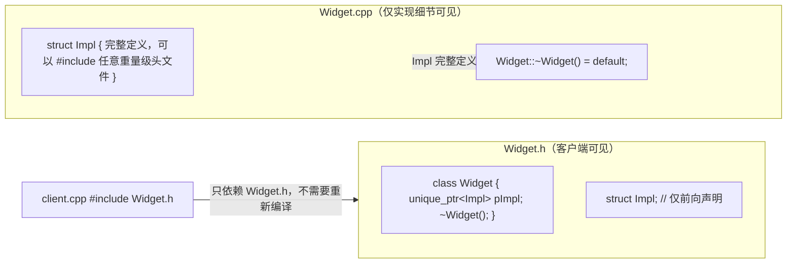

# Effective Modern C++ 3 · 智能指针（条款 18-22）

`QuantDevCPP04` 已经讲过 `unique_ptr`、`shared_ptr`、`weak_ptr` 三者的基本所有权模型、`shared_ptr` 控制块的结构、以及用 `weak_ptr` 打破循环引用这几个最常被问到的基础问题，本文不再重复这些内容。Scott Meyers 在《Effective Modern C++》第 4 章里关心的是更靠近工程实践的一层：智能指针在内存布局上到底多花了多少字节、`make_shared`/`make_unique` 什么时候不该用、以及为什么 Pimpl 惯用法配合 `unique_ptr` 会出现一个看起来莫名其妙的编译错误。这些细节平时写业务代码不一定会撞到，但一旦踩中往往表现为诡异的 `sizeof` 差异、`double free` 崩溃或者"不完整类型"编译报错，排查成本很高，因此是面试里区分"用过智能指针"和"理解智能指针实现"的分水岭。下面按条款 18-22 逐条展开，每条先给核心结论，再给能落地的代码。

```text
条款 18-22 速查
├─ 18 unique_ptr：删除器如何影响体积
│   ├─ 无状态删除器（默认 delete / 空类）→ 空基类优化 → 0 额外开销
│   ├─ 函数指针删除器 → 值本身要存 → +1 个指针的开销
│   └─ 无捕获 lambda 删除器 → 闭包类型不带数据 → 仍是 0 额外开销
├─ 19 shared_ptr：控制块创建时机
│   ├─ 体积 = 2 个指针（对象指针 + 控制块指针）
│   ├─ 同一裸指针分别构造两个 shared_ptr → 两个独立控制块 → double free
│   └─ 对象内部要拿自己的 shared_ptr → enable_shared_from_this，前提是已有 shared_ptr 在管理它
├─ 20 weak_ptr：除了破环还能干嘛
│   └─ 缓存里存 weak_ptr 而不是 shared_ptr，避免缓存本身变成一种资源泄漏
├─ 21 make_shared / make_unique：优先用，但三种情况例外
│   ├─ 需要自定义删除器 → 只能用 new + 构造函数
│   ├─ 需要花括号初始化列表语义 → 单独构造 initializer_list 再传
│   └─ 对象很大 + weak_ptr 存活很久 → 单次分配导致对象内存释放被拖延
└─ 22 Pimpl + unique_ptr：析构函数必须挪到 .cpp
    ├─ 编译器生成的析构函数在头文件里实例化，此时 Impl 只是前向声明
    ├─ unique_ptr 的默认删除器要对 Impl 调 delete，要求完整类型 → 编译错误
    └─ 修法：头文件只声明析构函数，.cpp 里在 Impl 定义之后写 `= default`
```

---

## 条款 18：对于独占资源使用 std::unique_ptr

**核心结论**：`unique_ptr` 的独占所有权模型和禁止拷贝、只能移动这些基础语义 `QuantDevCPP04` 已经讲过，这里只讲一个经常被忽略的细节——**自定义删除器的具体形式会实实在在地改变 `unique_ptr` 对象本身的大小**，而且"函数指针"和"无捕获 lambda"这两种表面上等价的删除器，代价完全不同。

`unique_ptr` 内部本质上是一个"指针 + 删除器"的复合体（标准库通常用一种类似 `compressed_pair` 的技巧实现）。删除器如果是**无状态**的——不管是默认的 `std::default_delete<T>`，还是一个没有数据成员的仿函数类，还是一个**没有捕获任何变量的 lambda**——它的类型本身不携带任何运行时数据，编译器可以利用空基类优化（EBO）把删除器"折叠"进 `unique_ptr` 内部，不占用额外存储，此时 `sizeof(unique_ptr<T>) == sizeof(T*)`。

但如果删除器是一个**函数指针**（即使这个函数本身不访问任何外部状态），情况就不同了：函数指针的具体取值（也就是"删这个对象该调用哪个函数"这条信息）在编译期是不确定的——`unique_ptr<T, void(*)(T*)>` 这个类型本身只说明删除器是"某个签名匹配的函数指针"，并没有把具体是哪个函数固化进类型里，所以这个指针的**值**必须作为数据成员真正存一份，`unique_ptr` 因此多花一个指针的空间。而无捕获 lambda 不一样：每写一个 lambda 表达式，编译器都会生成一个独一无二的闭包类型，这个类型本身就唯一确定了"调用哪段代码"，不需要在运行时存任何东西去区分，所以哪怕换成 lambda 语法只是"看起来"和函数指针类似，底层开销天差地别。

```cpp
#include <memory>
#include <iostream>

struct Widget {};

void widgetDeleter(Widget* w) { delete w; }              // 具名函数
auto lambdaDeleter = [](Widget* w) { delete w; };         // 无捕获 lambda

int main() {
    std::unique_ptr<Widget> p1(new Widget());                                    // 默认删除器
    std::unique_ptr<Widget, void(*)(Widget*)> p2(new Widget(), widgetDeleter);   // 函数指针删除器
    std::unique_ptr<Widget, decltype(lambdaDeleter)> p3(new Widget(), lambdaDeleter); // 无捕获 lambda 删除器

    std::cout << sizeof(p1) << '\n';  // 典型输出：8   （等于 sizeof(Widget*)）
    std::cout << sizeof(p2) << '\n';  // 典型输出：16  （多存了一个函数指针）
    std::cout << sizeof(p3) << '\n';  // 典型输出：8   （lambda 闭包类型不带数据，被折叠进去）
}
```

如果删除器换成 `std::function<void(Widget*)>`，开销还会进一步放大——`std::function` 需要类型擦除，内部往往带一个小对象缓冲区加一个指向具体可调用对象的虚调用机制，在常见实现下能让 `unique_ptr` 的体积膨胀到远超一个指针的量级。这也是书里反复强调"能用无捕获 lambda 就不要用函数指针或 `std::function` 做删除器"的原因：功能相同，体积和调用开销却可能差好几倍。

`unique_ptr` 另一个值得记住的工程用法是作为**工厂函数的默认返回类型**。因为 `unique_ptr` 可以隐式、廉价地转换为 `shared_ptr`（只需要把裸指针和删除器转移进新构造的控制块），而反过来 `shared_ptr` 不能转换回 `unique_ptr`（可能还有别的共享所有者），所以工厂函数返回 `unique_ptr` 是更安全的默认选择——调用方如果后续需要共享所有权，随手转换即可；如果工厂函数一开始就返回 `shared_ptr`，反而剥夺了调用方"只需要独占语义"时应有的轻量选项。

```cpp
std::unique_ptr<Widget> makeWidget() {
    return std::make_unique<Widget>();
}

std::shared_ptr<Widget> sp = makeWidget();   // 隐式转换：一次移动 + 一次控制块分配，代价小
```

**常见追问 / 面试陷阱**

> "自定义删除器一定会让 `unique_ptr`变大吗？"不一定，关键看删除器**类型**是否携带运行时状态，而不是看删除器写没写捕获列表这种表面形式。无捕获 lambda、无成员的仿函数类、`std::default_delete` 都是"零开销"的；只有函数指针、带状态的仿函数、`std::function` 这类需要在对象内部真正存一份数据（或做类型擦除）的删除器才会增加体积。

**要记住**
- 无状态删除器（默认删除器、空仿函数类、无捕获 lambda）借助空基类优化几乎零开销，`sizeof(unique_ptr<T>)` 通常就是 `sizeof(T*)`。
- 函数指针删除器的取值在编译期不确定，必须作为数据成员存储，会让 `unique_ptr` 多占一个指针的空间。
- 无捕获 lambda 的闭包类型天生唯一，编译器不需要额外存储就能确定调用哪段代码，所以体积和默认删除器一样小。
- `std::function` 做删除器功能最灵活，但涉及类型擦除，开销明显更大，能避免就避免。
- `unique_ptr` 到 `shared_ptr` 的转换是单向且廉价的，工厂函数优先返回 `unique_ptr` 更保守、更安全。

---

## 条款 19：对于共享资源使用 std::shared_ptr

**核心结论**：`shared_ptr` 的控制块结构、强/弱引用计数机制 `QuantDevCPP04` 已经详细展开过，这里聚焦书里特别强调的一个体积事实和一个经典陷阱：**`shared_ptr` 的体积是裸指针的两倍**，以及**控制块只应该在同一个所有权链条里被创建一次**——从同一个裸指针分别构造出多个"互不知情"的 `shared_ptr`，会直接导致 `double free`。

`unique_ptr` 通常和裸指针一样大（见条款 18），但 `shared_ptr` 内部要同时持有两个指针：一个指向被管理对象本身，一个指向控制块（存放强引用计数、弱引用计数和删除器）。这是共享所有权模型必须付出的固定代价，和删除器是否自定义无关。

真正容易出问题的是控制块的**创建时机**：控制块是在"某个裸指针第一次被包装进 `shared_ptr`"这个动作发生时创建的。如果对同一个裸指针分别执行两次这样的包装，就会得到两个互相不知道对方存在的控制块，每个控制块都以为自己独占这个对象：

```cpp
Widget* p = new Widget();
std::shared_ptr<Widget> sp1(p);   // 创建控制块 #1，sp1 以为自己是唯一所有者
std::shared_ptr<Widget> sp2(p);   // 错误用法：又创建了一个独立的控制块 #2
                                   // sp1、sp2 各自的强引用计数都是 1，互不知晓对方

// 作用域结束：sp2 先析构，控制块 #2 的强引用计数归零，delete p 被调用一次
//            sp1 再析构，控制块 #1 的强引用计数归零，delete p 又被调用一次
// 结果：同一个对象被 delete 两次，典型表现是 double free 崩溃或堆损坏
```

正确的做法是**永远从已有的 `shared_ptr` 拷贝，而不是拿裸指针重新包装一次**：

```cpp
std::shared_ptr<Widget> sp1(new Widget());
std::shared_ptr<Widget> sp2 = sp1;   // 拷贝：共用同一个控制块，强引用计数变为 2，安全
```

但有一种场景绕不开"从裸指针构造"：一个对象内部（比如某个成员函数）需要把指向 `*this` 的 `shared_ptr` 交出去（例如注册一个异步回调，回调里要持有自身的共享所有权）。这时如果直接写 `std::shared_ptr<Widget>(this)`，就正好落入上面的陷阱——又创建了一个独立控制块。标准库对此提供的解法是 `std::enable_shared_from_this<T>`：类公开继承它之后，基类内部会隐式持有一个指向自身的 `weak_ptr`，这个 `weak_ptr` 在"外部第一次用 `shared_ptr` 接管这个对象"时被自动填充；此后类内部任何位置调用 `shared_from_this()`，本质上就是对这个内部 `weak_ptr` 调 `lock()`，得到的 `shared_ptr` 和外部的 `shared_ptr` 共用同一个控制块，不会重复创建。

```cpp
class Widget : public std::enable_shared_from_this<Widget> {
public:
    std::shared_ptr<Widget> getShared() { return shared_from_this(); }
};

auto w = std::make_shared<Widget>();   // 外部先用 shared_ptr 接管，enable_shared_from_this 内部 weak_ptr 被填充
auto w2 = w->getShared();              // 安全：w2 和 w 共用同一个控制块
```

如果对象根本没有被任何 `shared_ptr` 管理（比如它是栈上对象，或者是刚 `new` 出来还没交给任何 `shared_ptr` 的裸指针），内部的 `weak_ptr` 处于"过期/空"状态，此时调用 `shared_from_this()` 在 C++17 之前是未定义行为，C++17 起标准明确规定会抛出 `std::bad_weak_ptr` 异常——不管哪种标准版本，结论都是"必须先有一个外部 `shared_ptr` 在管理这个对象，才能安全调用 `shared_from_this()`"。

**常见追问 / 面试陷阱**

> "两个 `shared_ptr` 都指向同一块内存，是不是就一定共用控制块？"不一定，关键看第二个 `shared_ptr` 是"拷贝第一个 `shared_ptr`"得到的，还是"重新用裸指针构造"得到的——只有前者才共用控制块，后者永远是独立的控制块，这也是 code review 里最容易被忽略的一类 bug。

**要记住**
- `shared_ptr` 的体积是裸指针的两倍：一个指向对象，一个指向控制块；这是固定代价，与是否自定义删除器无关。
- 控制块在"裸指针第一次被包装进 `shared_ptr`"时创建，同一个裸指针分别包装两次会产生两个互不知情的控制块，最终导致 `double free`。
- 唯一安全的共享方式是拷贝已有的 `shared_ptr`，而不是拿裸指针重新构造一个新的。
- 对象内部需要交出指向自身的 `shared_ptr` 时用 `enable_shared_from_this`，其内部 `weak_ptr` 依赖外部已经存在的 `shared_ptr` 来填充。
- 对象尚未被任何 `shared_ptr` 管理时调用 `shared_from_this()` 是错误用法（C++17 前未定义行为，C++17 起抛 `std::bad_weak_ptr`）。

---

## 条款 20：对于类似 std::shared_ptr 但可能悬空的指针使用 std::weak_ptr

**核心结论**：用 `weak_ptr` 打破 `shared_ptr` 循环引用的用法 `QuantDevCPP04` 已经举例讲过，这里补上书里同样重视的另一个场景——**缓存里存的应该是 `weak_ptr` 而不是 `shared_ptr`**，否则缓存本身会变成一个隐蔽的资源泄漏源。

设想一个对象工厂函数，创建成本较高，于是内部维护一个缓存：如果之前创建过某个 key 对应的对象且还活着，就直接返回那个对象的句柄，不用重新创建。这里缓存该存什么类型的指针，是一个容易被忽视但后果完全不同的设计选择。

```cpp
std::unordered_map<Key, std::weak_ptr<Widget>> cache;

std::shared_ptr<Widget> fetchWidget(const Key& k) {
    auto it = cache.find(k);
    if (it != cache.end()) {
        if (std::shared_ptr<Widget> sp = it->second.lock()) {
            return sp;             // 缓存命中且对象仍然存活
        }
    }
    auto sp = std::make_shared<Widget>(k);
    cache[k] = sp;                 // 缓存里只存 weak_ptr，不增加强引用计数
    return sp;
}
```

如果 `cache` 里存的是 `shared_ptr` 而不是 `weak_ptr`，问题就出现了：只要某个对象曾经被缓存过，它的强引用计数就永远不会归零——即便所有真正的调用方都已经放弃了这个对象，缓存自己持有的那一份 `shared_ptr` 依然把它焊死在内存里。这不是循环引用那种"互相持有"造成的泄漏，而是缓存单方面"越权续命"：调用方以为对象早就该被释放了，实际上它一直躺在缓存里占内存，而且这种泄漏不会随时间自动暴露，只会在长时间运行、缓存条目越积越多之后才表现为内存持续增长。用 `weak_ptr` 存缓存条目则完全不会有这个问题：`weak_ptr` 不参与强引用计数，对象该被真正的所有者释放时该释放就释放，缓存只是"如果它还活着，我可以复用；不在了，我重新造一个"，`expired()` 或 `lock()` 恰好如实反映了这一点。

同样的思路也出现在**观察者模式**里：被观察的主题（subject）持有一组指向观察者的 `weak_ptr` 而不是 `shared_ptr`，一方面观察者的生命周期不该被主题的持有关系左右，另一方面观察者被销毁时也不需要显式向主题注销——下次主题遍历观察者列表时，对应的 `weak_ptr` 自然是 `expired()` 状态，直接跳过即可。

**要记住**
- `weak_ptr` 除了打破循环引用，另一个典型用法是缓存：缓存持有 `weak_ptr`，不阻止对象在真正的所有者释放它之后被回收。
- 如果缓存持有 `shared_ptr`，任何进过缓存的对象都不会真正被释放，这是一种容易被忽视的资源泄漏，且随缓存条目增多而恶化。
- 判断缓存条目是否还有效，用 `.expired()` 或 `.lock()`，`lock()` 返回的临时 `shared_ptr` 能保证在使用期间对象不会被并发释放。
- 观察者模式里主题持有观察者的 `weak_ptr`，观察者销毁时不需要显式向主题注销。

---

## 条款 21：优先使用 std::make_unique 和 std::make_shared 而非直接使用 new

**核心结论**：`make_unique`/`make_shared` 应该是默认选择，但书里同样花了篇幅讲三类**不能用**或**不该用**的场景，这三类例外比"为什么要优先用"本身更容易在面试里被追问细节。

先简单说明优先用的理由。第一，避免类型名重复：`std::unique_ptr<Widget> p(new Widget());` 里 `Widget` 出现了两次，`std::make_unique<Widget>()` 只出现一次，减少了"改了一处忘了改另一处"的风险。第二，异常安全：在 C++17 收紧函数实参求值顺序规则之前，类似

```cpp
process(std::shared_ptr<Widget>(new Widget()), computePriority());
```

这样的调用存在潜在的资源泄漏——如果编译器选择的求值顺序是"先 `new Widget()`，再调用 `computePriority()`，最后才执行 `shared_ptr` 的构造函数"，一旦 `computePriority()` 抛出异常，此时 `new Widget()` 已经成功分配了内存，但还没有一个 `shared_ptr` 接管它，这块内存就永久泄漏了。换成 `process(std::make_shared<Widget>(), computePriority())`，`Widget` 的构造和 `shared_ptr` 的接管在同一次函数调用里原子完成，不存在中间那个"裸指针已分配但无人接管"的窗口期。C++17 起标准要求函数实参的每一个子表达式必须完整求值完（不能交错），这个特定泄漏场景已经不再可能出现，但它依然是理解"为什么 make 函数天然更安全"的经典例子，遇到维护老代码库时也用得上。第三，`make_shared` 通常只需一次内存分配（对象和控制块相邻存储）这一点 `QuantDevCPP04` 已经讲过，这里不再重复。

接下来是三类例外，也是这条款真正的重点：

**例外一：需要自定义删除器。** `make_shared`/`make_unique` 的接口只接受构造函数参数，没有传入删除器的位置，需要自定义删除器时只能退回到 `new` + 智能指针构造函数的写法：

```cpp
std::shared_ptr<Widget> sp(new Widget(), [](Widget* w) {
    logDeletion(w);
    delete w;
});
```

**例外二：需要花括号初始化列表语义。** 把花括号实参传给一个模板函数参数时，标准规定这属于"非推导上下文"（non-deduced context），编译器无法把 `{...}` 自动推导成 `std::initializer_list<T>`，因此 `make_shared<std::vector<int>>(10, 20)` 实际调用的是 `vector` 的"(count, value)"构造函数——构造出一个包含 10 个值为 20 的元素的 vector，而不是包含两个元素 `{10, 20}` 的 vector，这和直接写 `new std::vector<int>{10, 20}` 的语义完全不同。想用 `make_shared` 得到花括号初始化列表的语义，需要先单独构造出一个 `std::initializer_list` 再传进去：

```cpp
auto initList = {10, 20};
auto sp = std::make_shared<std::vector<int>>(initList);   // {10, 20} 两个元素，而不是 20 个 10
```

**例外三：大对象配合长期存活的 weak_ptr。** `make_shared` 把对象和控制块合并成一次分配这个优点，反过来也是它的缺点：因为两者共享同一块内存，只要还有任何一个 `weak_ptr` 存活，这块内存就不能被释放——哪怕所有 `shared_ptr` 都已经析构、对象本身早就该被回收。而用 `new` + `shared_ptr` 构造函数的写法，对象内存和控制块是两次独立分配，最后一个 `shared_ptr` 析构时对象内存立刻释放，只有那个小得多的控制块要等最后一个 `weak_ptr` 也消失才释放。对于体积很大的对象、且系统里有 `weak_ptr` 会长期持有观察句柄（例如条款 20 里的缓存场景）这一组合，`make_shared` 的单次分配反而可能把大对象的内存拖延释放很久，这时候直接用 `new` 分开两次分配是更合理的选择。

**要记住**
- `make_unique`/`make_shared` 避免类型名重复，且能消除"裸指针已分配、智能指针尚未接管"这个窗口期带来的异常安全问题（C++17 起该窗口期已被语言规则本身消除）。
- 需要自定义删除器时，`make_shared`/`make_unique` 无法使用，只能退回 `new` + 构造函数。
- 需要花括号初始化列表语义时，直接传给 `make_shared` 会被当成普通构造函数参数而非 `initializer_list`，需要先单独构造 `initializer_list`。
- `make_shared` 的对象和控制块共享一次分配，代价是必须等最后一个 `weak_ptr` 也消失才能释放对象占用的内存，大对象 + 长寿命 `weak_ptr` 场景要留意。

---

## 条款 22：当使用 Pimpl 惯用法时，在实现文件中定义特殊成员函数

**核心结论**：Pimpl（pointer to implementation）惯用法把类的私有实现细节藏在一个指向前向声明结构体的指针后面，目的是让实现细节需要的头文件只出现在 `.cpp` 里，减少头文件的编译依赖，加快修改实现细节时的重新编译速度。但如果 pimpl 指针用的是 `unique_ptr`，并且依赖编译器隐式生成析构函数，会在客户端代码里触发一个看起来莫名其妙的"不完整类型"编译错误——这正是本条款要解决的问题。



问题的根源在于析构函数**在哪里实例化**。如果头文件里这样写：

```cpp
// Widget.h
#include <memory>
struct Impl;   // 只有前向声明

class Widget {
public:
    Widget();
    // 没有显式声明析构函数，依赖编译器生成
private:
    std::unique_ptr<Impl> pImpl;
};
```

编译器生成的默认析构函数是**隐式内联**的，会在"第一次被用到"的地方实例化——通常就是 `#include "Widget.h"` 的客户端代码里，`Widget` 对象离开作用域触发析构的那一行。而 `unique_ptr` 的默认删除器需要对 `Impl*` 调用 `delete`，这要求 `Impl` 在实例化那一刻必须是**完整类型**（编译器需要知道 `Impl` 的大小、需不需要调析构函数等信息才能生成 `delete` 对应的代码）。但客户端代码那里，`Impl` 只有一个前向声明，完整定义还锁在 `Widget.cpp` 里看不到，于是编译器报错，典型信息是"对不完整类型使用 `delete`"或"`Impl` 是不完整类型"。

修法是把析构函数的**声明**留在头文件里（阻止编译器在客户端隐式生成它），把**定义**挪到 `.cpp` 文件里、`Impl` 完整定义之后再写：

```cpp
// Widget.h
#include <memory>
struct Impl;

class Widget {
public:
    Widget();
    ~Widget();                       // 只声明，不在这里生成定义
    Widget(Widget&&) noexcept;       // 声明移动构造
    Widget& operator=(Widget&&) noexcept;  // 声明移动赋值
    // 拷贝操作如果也需要，同理声明在这里、定义在 .cpp
private:
    std::unique_ptr<Impl> pImpl;
};
```

```cpp
// Widget.cpp
#include "Widget.h"
#include "ImplDetails.h"   // Impl 需要的重量级依赖只在这里出现

struct Impl {
    // 完整定义，可以包含任意复杂的数据成员
};

Widget::Widget() : pImpl(std::make_unique<Impl>()) {}
Widget::~Widget() = default;                     // 此处 Impl 已完整，delete 合法
Widget::Widget(Widget&&) noexcept = default;
Widget& Widget::operator=(Widget&&) noexcept = default;
```

移动赋值运算符需要同样处理，原因是一样的：移动赋值在接管新资源之前要先销毁当前持有的旧对象，这个销毁动作同样要对 `Impl` 调 `delete`，同样需要完整类型。移动构造函数本身虽然不销毁任何东西，但编译器为它生成的异常处理路径（一旦构造过程中抛出异常，需要销毁已经构造好的成员）同样可能用到 `Impl` 的完整定义，所以书里建议移动操作也一并声明在头文件、定义挪到 `.cpp`。拷贝操作如果需要，同理处理，且因为 `unique_ptr` 本身不可拷贝，拷贝构造/拷贝赋值还需要在 `.cpp` 里手写深拷贝逻辑，不能简单 `= default`。

**如果把 pimpl 指针换成 `shared_ptr`，这个问题完全不存在**，这是一个值得单独记住的不对称之处：`shared_ptr` 的删除器不是模板参数、不烙印在 `shared_ptr` 自身的类型里，而是在**第一次构造**时被类型擦除后存进控制块。也就是说，"需要 `Impl` 完整类型"这个要求，在 `shared_ptr` 的场景下是在**构造**那一刻被满足的（此时通常已经在 `.cpp` 里、`Impl` 已经完整定义），而不是在**析构**那一刻才被要求——析构时只需要通过控制块里存好的类型擦除删除器发起调用，不再需要 `Impl` 的完整定义。所以如果 pimpl 指针用 `shared_ptr`，客户端代码里即使编译器隐式生成析构函数也不会报错。但这不代表 `shared_ptr` 就该无脑替代 `unique_ptr` 做 pimpl 指针——`shared_ptr` 引入了引用计数和原子操作的开销，而 pimpl 场景里所有权本来就是独占的（`Impl` 只属于对应的外层对象），用 `shared_ptr` 只是绕开了一个可以通过多写几行声明就解决的编译问题，付出的却是不必要的运行时开销，多数情况下仍然应该坚持用 `unique_ptr` 并按本条款的写法处理特殊成员函数。

**常见追问 / 面试陷阱**

> "为什么 `shared_ptr` 做 pimpl 指针就不用把析构函数挪到 .cpp？"因为 `shared_ptr` 的删除器信息存在类型擦除后的控制块里，完整类型的要求在构造时就已经满足；`unique_ptr` 的删除器是编译期直接烙进类型里的，完整类型的要求被推迟到了每一次真正调用删除器（也就是析构）的地方才检查，而析构往往发生在看不到完整定义的客户端代码里。

**要记住**
- Pimpl 惯用法通过前向声明 + 指针，把实现细节的头文件依赖限制在 `.cpp` 里，减少客户端重新编译的连锁反应。
- `unique_ptr` 的默认删除器在析构时需要 `Impl` 完整类型；如果依赖编译器在头文件里隐式生成析构函数，客户端代码那里 `Impl` 还只是前向声明，编译报错。
- 修法：头文件里只**声明**析构函数（以及需要的移动/拷贝操作），在 `.cpp` 里 `Impl` 完整定义之后再写 `= default` 或手写实现。
- 移动赋值同样需要这样处理，因为它要先销毁旧对象；移动构造的异常处理路径也可能触发同样的要求。
- 换成 `shared_ptr` 能绕开这个问题（删除器在构造时就被类型擦除进控制块），但代价是不必要的引用计数开销，独占语义场景仍应优先用 `unique_ptr`。

---

## 快速选择题

**1. 以下哪种 `unique_ptr` 删除器形式通常不会增加 `unique_ptr` 对象本身的大小？**
A. 函数指针删除器
B. 带一个 `int` 成员的仿函数删除器
C. 无捕获的 lambda 删除器
D. `std::function` 包装的删除器

**答案：C** — 无捕获 lambda 的闭包类型不携带任何数据，编译器可以通过空基类优化把它折叠进 `unique_ptr` 内部，不占用额外空间；函数指针必须存储具体取值，带状态的仿函数和 `std::function` 同样需要额外存储。

**2. `std::unique_ptr<Widget, void(*)(Widget*)>` 相比默认删除器的 `unique_ptr<Widget>`，体积通常会怎样变化？**
A. 不变
B. 增加一个指针大小
C. 增加两个指针大小
D. 变为原来的四倍

**答案：B** — 函数指针的取值本身要作为数据成员存储，通常多花一个指针大小的空间。

**3. 关于 `shared_ptr` 与 `unique_ptr` 的体积对比，下列说法正确的是？**
A. 两者体积总是相同
B. `shared_ptr` 通常是裸指针的两倍大小，`unique_ptr`（无状态删除器时）通常和裸指针一样大
C. `unique_ptr` 通常比 `shared_ptr` 大，因为要存删除器
D. 两者都需要额外的控制块

**答案：B** — `shared_ptr` 要同时存指向对象和指向控制块的两个指针；`unique_ptr` 在无状态删除器时只存一个裸指针大小。

**4. 下面这段代码的主要问题是什么？**
```cpp
Widget* p = new Widget();
std::shared_ptr<Widget> sp1(p);
std::shared_ptr<Widget> sp2(p);
```
A. 编译错误
B. `sp1` 和 `sp2` 共用一个控制块，效率低
C. `sp1` 和 `sp2` 各自创建了独立的控制块，最终会对同一对象 `delete` 两次
D. 没有问题，这是标准用法

**答案：C** — 两次都是"从裸指针构造"，各自触发一次控制块创建，两个控制块互不知情，最终导致 double free。

**5. 修复上一题的正确做法是什么？**
A. 把 `sp2` 换成 `weak_ptr`
B. 让 `sp2` 拷贝 `sp1`：`std::shared_ptr<Widget> sp2 = sp1;`
C. 给两个 `shared_ptr` 都加自定义删除器
D. 用 `sp2.reset(p)`

**答案：B** — 只有拷贝已有的 `shared_ptr` 才会共用同一个控制块；`reset(p)` 本质上还是"从裸指针构造"，同样会创建新的控制块。

**6. 在一个对象内部想安全地交出指向 `*this` 的 `shared_ptr`，应该怎么做？**
A. 直接 `return std::shared_ptr<Widget>(this);`
B. 让类继承 `std::enable_shared_from_this`，调用 `shared_from_this()`
C. 用 `weak_ptr(this).lock()`
D. 用 `std::make_shared<Widget>(*this)`

**答案：B** — `enable_shared_from_this` 内部的 `weak_ptr` 由外部已存在的 `shared_ptr` 填充，`shared_from_this()` 返回的 `shared_ptr` 与外部共用同一个控制块；直接用裸指针构造会重复创建控制块。

**7. 如果对象还没有被任何 `shared_ptr` 管理就调用 `shared_from_this()`，会发生什么？**
A. 总是返回空指针，没有副作用
B. C++17 之前未定义行为，C++17 起抛出 `std::bad_weak_ptr`
C. 编译错误
D. 自动创建一个新的 `shared_ptr` 接管对象

**答案：B** — 内部 `weak_ptr` 此时处于过期/空状态，C++17 标准明确规定这种情况会抛出 `std::bad_weak_ptr` 异常。

**8. 缓存场景下，为什么用 `weak_ptr` 存缓存条目比用 `shared_ptr` 更合适？**
A. `weak_ptr` 读写速度更快
B. `weak_ptr` 不增加强引用计数，不会阻止对象在真正所有者释放后被回收，避免缓存本身造成泄漏
C. `weak_ptr` 占用内存更小
D. `shared_ptr` 不支持存进容器

**答案：B** — 如果缓存持有 `shared_ptr`，任何进过缓存的对象都不会真正被释放；用 `weak_ptr` 则缓存只在对象仍存活时提供复用，不影响其生命周期。

**9. 下列哪种情况下应该避免使用 `make_shared`，改用 `new` + `shared_ptr` 构造函数？**
A. 需要自定义删除器
B. 对象体积很大，且预计会有长期存活的 `weak_ptr` 指向它
C. 需要用花括号初始化列表语义构造容器
D. 以上都是

**答案：D** — 三种情况 `make_shared` 都无法直接使用或不合适：不支持自定义删除器，花括号会被当成普通构造参数而非 `initializer_list`，且大对象+长寿命 `weak_ptr` 场景下单次分配会拖延对象内存的释放。

**10. `make_shared<std::vector<int>>(10, 20)` 实际构造出的是什么？**
A. 包含两个元素 `{10, 20}` 的 vector
B. 包含 10 个值为 20 的元素的 vector
C. 编译错误
D. 一个空 vector

**答案：B** — 花括号语法在传给模板参数时是非推导上下文，`make_shared` 只能把参数当作普通构造函数参数转发，因此匹配到的是 `vector(count, value)` 构造函数。

**11. Pimpl 惯用法中，为什么 `unique_ptr<Impl>` 依赖编译器隐式生成的析构函数会在客户端代码里编译报错？**
A. `unique_ptr` 不支持前向声明的类型作为模板参数
B. 隐式析构函数在客户端代码里实例化，此时需要对 `Impl` 完整类型调用 `delete`，但客户端只看到前向声明
C. `Impl` 必须是抽象类
D. 头文件里禁止使用 `unique_ptr`

**答案：B** — 隐式内联的析构函数在第一次被用到的地方（通常是客户端代码析构 `Widget` 对象时）实例化，`unique_ptr` 默认删除器此时需要 `Impl` 的完整定义来生成 `delete` 代码，而客户端只 `#include` 了只有前向声明的头文件。

**12. 为什么把 pimpl 指针换成 `shared_ptr` 能绕开条款 22 的编译错误？**
A. `shared_ptr` 从不调用 `delete`
B. `shared_ptr` 的删除器在构造时就被类型擦除进控制块，完整类型的要求在构造时（通常在 .cpp 里）就已满足，而不是推迟到析构时才检查
C. `shared_ptr` 自动生成 `Impl` 的完整定义
D. `shared_ptr` 不支持前向声明类型

**答案：B** — `shared_ptr` 的删除器不烙印在自身类型里，而是构造时类型擦除存进控制块；析构时只需通过控制块里的删除器发起调用，不再需要 `Impl` 完整类型，这与 `unique_ptr` 把完整类型要求推迟到析构时正好相反。
