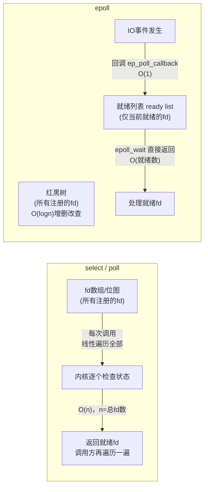

# 计算机网络 1 · IO 模型与多路复用

网络编程绕不开一个问题：一次 `read()`/`recv()` 调用背后，数据到底经历了什么，调用方又在等什么。《操作系统 3·进程间通信与调度》里已经把阻塞/非阻塞、同步/异步这两个维度分开定义过——阻塞/非阻塞问的是"这一次系统调用会不会卡住"，同步/异步问的是"IO 完成后是调用方自己发现的还是内核主动通知的"，这里不再重复这两个基础概念，而是在这个框架上把五大 IO 模型的完整分类讲清楚，并且深入 `select`/`poll`/`epoll` 这三种具体的多路复用机制的内部实现差异，以及边沿触发/水平触发这一容易在面试里问出细节的点。理解这一讲的关键是始终盯住一次 IO 操作可以拆成的两个阶段——数据就绪和数据拷贝，五大模型的区别本质上就是这两个阶段各自"阻塞与否""谁来完成"的排列组合。

```text
1. 遇到"讲讲五种IO模型"，第一句话先拆两阶段：等待数据就绪（数据从网卡到内核缓冲区）+ 数据拷贝（内核缓冲区到用户缓冲区），再逐个模型说这两阶段各自阻塞不阻塞、谁负责。不要上来就背模型名字。
2. 遇到"IO多路复用算不算异步IO"，答案是不算：select/poll/epoll 只是把"等待哪个fd就绪"这件事交给了内核去做，但真正读数据这一步（第二阶段）依然是应用程序发起、依然可能阻塞，只有两阶段全部由内核完成且不需要应用程序发起任何调用才是真正的异步IO（AIO）。
3. 遇到"select/poll/epoll怎么选"，先问fd总数和活跃比例：fd少或者不追求扩展性，三者差别不大；fd数量大但同一时刻活跃的只是少数（C10K场景），epoll的优势才会显著体现，因为它的复杂度只和"当前就绪的fd数"相关，不和"注册的fd总数"相关。
4. 遇到"边沿触发和水平触发怎么选"，先确认对方是不是要考察"ET必须配合非阻塞IO+循环读到EAGAIN"这个具体细节，这是这道题最容易失分的地方，光说"ET效率高"不够。
5. 遇到反问"select为什么有1024这个限制"，答案要落到 FD_SETSIZE 这个编译期常量和 fd_set 位图的实现上，不要只说"历史遗留问题"。
```

---

## 1. 五大 IO 模型的统一框架

**核心结论**：一次典型的网络 IO（例如从一个 TCP socket 读数据）可以拆分成两个先后发生的阶段。第一阶段是**等待数据就绪**：数据要先通过网络到达网卡，再由内核把数据从网卡搬进内核缓冲区，这个过程发生之前，应用程序想读的数据根本还不存在于内存里的任何地方，只能等。第二阶段是**数据拷贝**：数据已经在内核缓冲区里了，要把它从内核空间拷贝到应用程序指定的用户空间缓冲区，这一步是一次内存拷贝，通常很快，是 CPU 密集而不是等待密集的操作。这个两阶段划分来自 Stevens《UNIX Network Programming》对 IO 模型的经典分类，五种模型的全部区别都可以归结为：这两个阶段各自是阻塞还是非阻塞、由谁来完成。

**阻塞 IO（Blocking IO）**：两个阶段调用方都阻塞。应用程序发起 `recvfrom()` 之后，如果数据还没到，线程进入睡眠，数据到达并拷贝完成后才被唤醒返回。这是默认的、最直观的模型，前面《操作系统 3》里详细讲过。

**非阻塞 IO（Non-blocking IO）**：第一阶段不阻塞，但需要应用程序自己反复轮询检查数据是否就绪；一旦发现数据就绪，第二阶段（拷贝）仍然是阻塞的——调用方发起真正的读操作后要等拷贝完成才返回，只是这个拷贝耗时通常很短。轮询本身会持续消耗 CPU 去做大概率落空的系统调用，这是非阻塞 IO 单独使用时效率低的根本原因。

**IO 多路复用（IO Multiplexing）**：用 `select`/`poll`/`epoll` 这类系统调用同时监视多个 fd，哪个 fd 就绪了就去处理哪个。本质上，第一阶段的"等待"被委托给了多路复用系统调用去做——调用方阻塞在 `select`/`poll`/`epoll_wait` 上，而不是阻塞在某一个具体 fd 的 `read()` 上，这样一个线程就能同时等待很多个连接。但对单个 fd 而言，多路复用调用返回"就绪"之后，应用程序还要再发起一次实际的读操作去完成第二阶段的拷贝，这次读操作本身仍然可以是阻塞的（虽然实践中通常配合非阻塞 fd 使用）。

**信号驱动 IO（Signal-driven IO）**：应用程序通过 `sigaction` 注册一个 `SIGIO` 信号处理函数，然后立即返回去做别的事，不阻塞。数据就绪时内核发送 `SIGIO` 信号通知应用程序，应用程序在信号处理函数里再发起真正的读操作完成第二阶段的拷贝。第一阶段因为注册后立即返回，不阻塞；第二阶段的拷贝仍然是同步完成的。这个模型在实际生产环境里很少使用，主要因为信号处理函数里能做的事情有限、信号语义在多线程环境下不好处理，工程上通常用 IO 多路复用替代。

**异步 IO（Asynchronous IO, AIO）**：两个阶段都由内核完成，包括数据拷贝，完成后内核直接通知应用程序"数据已经在你的缓冲区里了"。应用程序发起一次异步读请求（例如 POSIX 的 `aio_read`）后立即返回，全程不参与等待也不参与拷贝，内核完成全部工作后通过信号或者回调告知完成。这是五种模型里唯一一个两阶段都不需要应用程序参与等待的模型，也是唯一真正意义上的异步 IO——前四种模型的第二阶段都是应用程序发起并同步等待完成的，因此从同步/异步这个维度看，前四种都属于同步 IO，只有 AIO 属于异步 IO。

```text
两阶段拆分：等待数据就绪  |  数据拷贝（内核→用户空间）

阻塞IO       [====== 阻塞等待就绪 ======][== 阻塞拷贝 ==]
                                              （调用方全程阻塞）

非阻塞IO     [轮询][轮询][轮询]...[数据就绪][== 阻塞拷贝 ==]
              （应用程序自己反复调用检查，第一阶段不阻塞）

IO多路复用   [====阻塞在select/poll/epoll_wait上====][== 阻塞拷贝 ==]
              （等待委托给内核的多路复用机制，仍需应用程序发起读）

信号驱动IO   [注册SIGIO后立即返回，做别的事...][信号到达→阻塞拷贝]
              （第一阶段不阻塞，收到信号后第二阶段仍是同步的）

异步IO       [====== 内核完成等待 ======][====内核完成拷贝====]→通知
              （应用程序全程不参与，两阶段都由内核完成）
```

| 模型 | 第一阶段（等待就绪） | 第二阶段（数据拷贝） | 谁完成拷贝 | 生产环境常见度 |
|---|---|---|---|---|
| 阻塞 IO | 阻塞 | 阻塞 | 应用程序发起，内核执行，调用方同步等待 | 高（简单场景、多线程模型） |
| 非阻塞 IO | 不阻塞，需应用轮询 | 阻塞 | 同上 | 低（单独使用效率差） |
| IO 多路复用 | 阻塞在多路复用调用上 | 阻塞 | 同上 | 高（主流网络服务器模型） |
| 信号驱动 IO | 不阻塞，注册后立即返回 | 阻塞（信号处理函数中发起） | 同上 | 极低 |
| 异步 IO | 不阻塞 | 不阻塞，内核完成 | 内核直接完成拷贝并通知 | 中（Linux io_uring 等场景逐渐增多） |

**常见追问 / 面试陷阱**

> 追问"IO 多路复用算不算异步 IO"：不算，这是最容易答错的一点。`select`/`poll`/`epoll` 只是把"同时等待多个 fd 就绪"这件事交给了内核，调用方依然要在多路复用调用上阻塞等待，返回后依然需要自己发起一次读操作去完成第二阶段的数据拷贝。真正的异步 IO 要求两个阶段全部由内核完成，应用程序不发起任何后续调用就能拿到已经拷贝好的数据。所以从同步/异步的定义看，IO 多路复用属于同步 IO 的一种，只是把"阻塞点"从每个连接各自的 `read()` 集中到了一次多路复用调用上。

---

## 2. select

**核心结论**：`select` 用一个位图结构 `fd_set` 表示一组文件描述符集合，调用时把整个集合交给内核，内核**线性遍历**集合里的每一个 fd 检查是否就绪，返回后调用方还需要**再遍历一次整个集合**才能知道哪些 fd 真正就绪了。

基本用法上，应用程序先用 `FD_ZERO` 清空一个 `fd_set`，用 `FD_SET` 把关心的 fd 逐个加入集合，然后调用 `select(nfds, &readfds, &writefds, &exceptfds, &timeout)`，传入最大 fd 值加一、读/写/异常三个集合以及一个超时时间。`select` 返回后，原来的集合会被**原地修改**为只包含真正就绪的 fd，因此每次调用前都要重新构造集合；调用方需要用 `FD_ISSET` 挨个检查集合里的每一位才知道具体是哪些 fd 就绪了。

```c
fd_set readfds;
struct timeval timeout = {5, 0}; // 5 秒超时

while (1) {
    FD_ZERO(&readfds);          // 每次调用前必须重新构造集合
    FD_SET(fd1, &readfds);
    FD_SET(fd2, &readfds);
    int maxfd = (fd1 > fd2 ? fd1 : fd2) + 1;

    int n = select(maxfd, &readfds, NULL, NULL, &timeout);
    if (n > 0) {
        // 返回后必须遍历整个集合才知道哪些fd就绪
        if (FD_ISSET(fd1, &readfds)) { /* 处理 fd1 */ }
        if (FD_ISSET(fd2, &readfds)) { /* 处理 fd2 */ }
    }
}
```

`select` 有三个核心限制。第一，单个进程能监视的 fd 数量受编译期常量 `FD_SETSIZE` 限制，常见默认值是 1024，`fd_set` 本质上是一个固定大小的位图，超出这个数量的 fd 无法被正确表示，这不是一个可以在运行时随意调整的参数。第二，每次调用都需要把整个 fd 集合从用户空间拷贝到内核空间，fd 数量越多这次拷贝的开销越大，而且这个拷贝在每次调用（包括超时后重新调用）时都会重复发生。第三，内核检测就绪 fd 的方式是线性遍历集合中的每一个 fd 逐个检查状态，整体时间复杂度是 $O(n)$（$n$ 是监视的 fd 总数），并且这个复杂度和实际就绪的 fd 数量无关——哪怕 1000 个 fd 里只有 1 个就绪，内核也要把 1000 个全部检查一遍。

**常见追问 / 面试陷阱**

> 追问"select 的 1024 限制能不能通过修改内核参数绕过"：`FD_SETSIZE` 是一个在头文件里定义的编译期常量，理论上可以修改后重新编译程序或内核来提高上限，但这只是绕过了数量限制这一个问题，`fd_set` 位图结构在拷贝开销和线性遍历这两点上的问题依然存在，并不能真正解决 select 的性能瓶颈，所以实践中遇到大量并发连接的场景通常直接换用 poll 或 epoll，而不是想办法扩大 select 的上限。

---

## 3. poll

**核心结论**：`poll` 用一个 `struct pollfd` 数组代替 `select` 的位图，数组大小不受 `FD_SETSIZE` 限制，理论上可以监视任意多个 fd，但它仍然保留了 `select` 的另外两个问题——每次调用都要把整个数组拷贝进内核、内核仍然线性遍历所有 fd 检查就绪状态。

```c
struct pollfd fds[2];
fds[0].fd = fd1; fds[0].events = POLLIN;
fds[1].fd = fd2; fds[1].events = POLLIN;

int n = poll(fds, 2, 5000); // 数组大小由调用方自己决定，不受FD_SETSIZE限制
if (n > 0) {
    for (int i = 0; i < 2; i++) {
        if (fds[i].revents & POLLIN) { /* 处理就绪的fd */ }
    }
}
```

`poll` 和 `select` 的核心区别只在于用什么数据结构表示监视的 fd 集合：`pollfd` 数组里每个元素显式携带一个 fd 和它关心的事件类型（`events`）以及返回的实际发生的事件（`revents`），不再受位图大小的限制，也不需要像 `select` 那样把读/写/异常分成三个独立的集合。但 `poll` 没有解决 `select` 的另外两个根本问题：每次调用依然要把整个数组从用户空间拷贝到内核空间，数组越大拷贝开销越大；内核依然是对数组做一次线性遍历逐个检查 fd 状态，返回后调用方也依然需要遍历整个数组才能找出哪些 fd 真正就绪，整体复杂度仍然是 $O(n)$。所以 `poll` 相对 `select` 只是解决了 fd 数量上限的问题，没有解决扫描效率的问题——这是它和 `epoll` 的本质差距所在。

| 对比维度 | select | poll |
|---|---|---|
| fd 集合的数据结构 | 位图 `fd_set` | 数组 `struct pollfd[]` |
| fd 数量上限 | 受 `FD_SETSIZE`（常见默认 1024）限制 | 不受限制，由调用方自行决定数组大小 |
| 每次调用的拷贝开销 | 需要拷贝整个集合到内核 | 需要拷贝整个数组到内核 |
| 内核检测就绪的方式 | 线性遍历，$O(n)$ | 线性遍历，$O(n)$ |
| 返回后如何找到就绪 fd | 需要遍历整个集合调用 `FD_ISSET` | 需要遍历整个数组检查 `revents` |
| 读写事件是否分开表示 | 是（分三个独立集合） | 否（用一个 `events`/`revents` 字段表示） |

**常见追问 / 面试陷阱**

> 追问"既然 poll 已经没有数量限制了，为什么还需要 epoll"：数量限制只是 select 的其中一个问题，poll 解决了这一个，但每次调用都要整体拷贝 fd 集合、内核线性扫描找就绪 fd 这两个问题在 poll 里原封不动地保留了下来。当 fd 总数很大但同一时刻真正活跃（就绪）的只是其中一小部分时（典型的 C10K 场景），poll 依然要为每次调用付出和总 fd 数成正比的拷贝和扫描开销，这正是 epoll 要解决的问题。

---

## 4. epoll

**核心结论**：epoll 通过"只注册一次、内核用回调主动维护就绪列表"的机制，把复杂度从"和总注册 fd 数成正比"降低到"和当前真正就绪的 fd 数成正比"，这是它在 fd 数量很大但活跃连接只占少数的 C10K 场景下远超 select/poll 的根本原因。

epoll 由三个系统调用组成。`epoll_create` 在内核里创建一个 `eventpoll` 实例，这个实例内部维护两个核心数据结构：一棵**红黑树**，保存所有当前注册的 fd（对应的内核结构是 `epitem`），红黑树支持高效的插入、删除、查找，操作复杂度是 $O(\log n)$；一个**就绪列表（ready list，内核里是一个双向链表 rdllist）**，只保存当前已经就绪、等待应用程序处理的 fd。`epoll_ctl` 用来对红黑树做增、删、改操作（`EPOLL_CTL_ADD`/`EPOLL_CTL_DEL`/`EPOLL_CTL_MOD`），每个 fd 只需要注册一次，不需要像 select/poll 那样每次调用都重新把整个集合传给内核。当某个 fd 上发生了关心的 IO 事件时（比如网卡收到数据、内核把数据放进了对应 socket 的接收缓冲区），内核通过一个注册在该 fd 上的回调函数（`ep_poll_callback`）被触发，直接把这个 fd 对应的 `epitem` 加入就绪列表，这个加入操作是 $O(1)$ 的。`epoll_wait` 被调用时，如果就绪列表非空就直接返回列表里的内容，不需要遍历红黑树里的全部注册 fd。

```c
int epfd = epoll_create1(0);

struct epoll_event ev, events[MAX_EVENTS];
ev.events = EPOLLIN;
ev.data.fd = listen_fd;
epoll_ctl(epfd, EPOLL_CTL_ADD, listen_fd, &ev); // 每个fd只注册一次

while (1) {
    int n = epoll_wait(epfd, events, MAX_EVENTS, -1);
    // 只返回真正就绪的fd，数量为n，不需要遍历所有注册过的fd
    for (int i = 0; i < n; i++) {
        handle_io(events[i].data.fd);
    }
}
```

这套机制的关键在于：select/poll 是"调用方每次主动去问内核每一个 fd 好了没有"，epoll 是"内核在事件发生的那一刻主动把 fd 放进一个专门的就绪列表，调用方只需要来看这个列表"。前者的开销必然和"问了多少个 fd"成正比，后者的开销只和"真正有多少个 fd 被放进了就绪列表"成正比，两者在活跃连接占比很低时的差距会随着总 fd 数量增大而急剧拉开。



| 对比维度 | select / poll | epoll |
|---|---|---|
| 存储注册 fd 的结构 | 线性数组 / 位图 | 红黑树，$O(\log n)$ 增删改查 |
| 每次调用是否需要重传整个集合 | 是，每次调用都拷贝全部fd | 否，`epoll_ctl` 增量注册，注册一次即可 |
| 发现就绪 fd 的方式 | 内核线性遍历全部注册fd | 内核回调主动把就绪fd放入ready list |
| 返回就绪 fd 的复杂度 | $O(n)$，n 为总注册fd数 | $O(\text{就绪fd数})$，与总注册数无关 |
| 适用场景 | fd 数量少，或活跃比例高 | fd 数量大且活跃比例低（C10K场景）优势明显 |

**常见追问 / 面试陷阱**

> 追问"epoll_ctl 的红黑树增删改查是 $O(\log n)$，那 epoll 是不是仍然存在一个和总fd数相关的开销"：是的，但这个开销只发生在**注册/注销 fd 的时候**（比如新连接建立、连接关闭），不是每次 `epoll_wait` 都要付出的代价；一旦注册完成，`epoll_wait` 本身的复杂度只和就绪列表的长度相关，和红黑树里一共挂了多少个 fd 无关。这正是 epoll 和 select/poll 的本质区别：select/poll 把"扫描全部fd找就绪的"这个开销摊到了**每一次**等待调用上，epoll 把"维护fd集合"的开销（红黑树操作）和"发现就绪fd"的开销（回调+就绪列表）分离开了，后者才是被高频调用的 `epoll_wait` 真正要付出的成本。

---

## 5. 边沿触发（ET）与水平触发（LT）

**核心结论**：水平触发和边沿触发描述的是"epoll 在什么条件下通知应用程序某个 fd 就绪"，这是一个通知时机的问题，和前面讲的红黑树/就绪列表这套底层机制是正交的两个维度。epoll 默认是水平触发模式，可以通过在 `epoll_ctl` 注册时给 `events` 加上 `EPOLLET` 标志切换成边沿触发模式；select 和 poll 只支持水平触发这一种模式。

**水平触发（Level Triggered, LT）**：只要 fd 对应的内核缓冲区里还有未读完的数据，每次调用 `epoll_wait` 就会重复通知这个 fd 就绪，不管这是不是第一次通知。编程模型简单：读多少算多少，这次没读完不用担心，下次调用 `epoll_wait` 还会再收到一次通知，不会遗漏数据。

**边沿触发（Edge Triggered, ET）**：只有在 fd 的状态发生跳变的那一瞬间通知一次，例如从"缓冲区无数据"变为"缓冲区有数据"这个跳变点触发一次通知，此后即使缓冲区里还有未读完的数据，只要状态没有再次发生新的跳变（比如又有新数据到达触发了新的跳变），就不会再收到这个 fd 的通知。因此如果应用程序在收到一次 ET 通知后没有把缓冲区里的数据一次性读完，剩余的数据会一直留在缓冲区里却再也不会触发通知，造成数据被"遗忘"在内核缓冲区里得不到处理。

正因为这个特性，**使用 ET 模式必须配合非阻塞 IO**，并且要在收到一次通知后用循环持续调用 `read`/`recv` 直到返回 `EAGAIN`/`EWOULDBLOCK`（表示这次确实已经读干净，缓冲区里没有更多数据了）才能退出循环。如果 fd 是阻塞的，循环读到缓冲区数据耗尽时最后一次 `read` 调用会阻塞住整个线程，因为阻塞 fd 遇到没有数据可读时不会立刻返回错误码，而是会挂起等待，这会让程序卡死在这次读操作上，无法继续处理其他 fd 的事件。

```c
// 水平触发（LT）：读多少算多少，读不完下次还会再通知
n = epoll_wait(epfd, events, MAX_EVENTS, -1);
for (int i = 0; i < n; i++) {
    int fd = events[i].data.fd;
    char buf[1024];
    int len = read(fd, buf, sizeof(buf)); // 读一次就够了，即使数据没读完
    handle(buf, len);
    // 缓冲区里剩余的数据不用担心，下次 epoll_wait 还会再通知这个fd
}

// 边沿触发（ET）：必须配合非阻塞fd，循环读到EAGAIN为止
n = epoll_wait(epfd, events, MAX_EVENTS, -1);
for (int i = 0; i < n; i++) {
    int fd = events[i].data.fd; // fd 必须已经被设置为 O_NONBLOCK
    char buf[1024];
    while (1) {
        int len = read(fd, buf, sizeof(buf));
        if (len > 0) {
            handle(buf, len);
        } else if (len < 0 && (errno == EAGAIN || errno == EWOULDBLOCK)) {
            break; // 确实读完了，跳出循环等待下一次跳变通知
        } else {
            // len == 0 表示对端关闭，其他错误另行处理
            break;
        }
    }
}
```

```text
LT 通知时间线（缓冲区里有 3 个单位数据，每次只读 1 个单位）：

t0: 数据到达（3单位） → epoll_wait 通知
t1: 读走1单位（剩2单位）→ 下次 epoll_wait 依然通知（因为还有数据）
t2: 读走1单位（剩1单位）→ 下次 epoll_wait 依然通知
t3: 读走1单位（剩0单位）→ 之后 epoll_wait 不再通知，直到有新数据到达

ET 通知时间线（同样场景，只在跳变点通知一次）：

t0: 数据到达（无→有，跳变）→ epoll_wait 通知一次
t1: 只读走1单位（剩2单位，状态没有新跳变）→ epoll_wait 不会再通知
    （剩下的2单位数据会被遗忘在缓冲区里，除非有新数据到达触发新的跳变）
```

| 对比维度 | 水平触发 LT | 边沿触发 ET |
|---|---|---|
| 通知时机 | 只要缓冲区有数据就持续通知 | 仅在状态跳变的瞬间通知一次 |
| 是否要求非阻塞 fd | 不强制要求 | 必须，否则读到缓冲区耗尽时会阻塞卡死 |
| 编程模型复杂度 | 简单，读多少算多少 | 复杂，必须循环读到 `EAGAIN` 为止 |
| 遗漏数据的风险 | 低，没读完下次还会通知 | 高，一次没读完可能导致数据被遗忘 |
| 通知次数（相同数据量下） | 多，可能重复通知同一批未读数据 | 少，减少了重复唤醒的次数 |
| select/poll 是否支持 | 是（唯一支持的模式） | 否 |
| epoll 默认模式 | 是（不加 `EPOLLET` 即为LT） | 否，需显式指定 `EPOLLET` |

**常见追问 / 面试陷阱**

> 追问"ET 一定比 LT 效率高吗"：不一定，ET 减少的是"重复通知"带来的 `epoll_wait` 调用次数和内核到用户态的唤醒开销，在连接数极多、每个连接数据量不大的场景下这个收益比较明显；但 ET 要求每次通知后循环读到 `EAGAIN`，这本身也是有代价的（多一次会返回 `EAGAIN` 的系统调用），而且一旦应用层没有正确实现"循环读干净"的逻辑，会直接导致数据丢失或者连接卡住，这是一个正确性风险，不是单纯的性能取舍。工程上很多高性能网络库（比如早期 Redis 的事件循环）默认使用 LT 而不是 ET，恰恰是因为 LT 的编程模型更不容易出错，ET 的性能收益在很多场景下不足以覆盖它带来的实现复杂度和出错风险。

---

## 快速选择题

**1. 一次网络 IO 操作的"数据拷贝"阶段具体指什么？**
A. 数据从网卡到内核缓冲区的传输
B. 数据从内核缓冲区拷贝到用户空间缓冲区
C. 数据在用户空间内部的复制
D. 数据从磁盘读入内存

**答案：B** — 数据就绪阶段是数据从网卡到内核缓冲区，数据拷贝阶段是已经在内核缓冲区的数据被复制到用户空间应用程序的缓冲区。

**2. 下列哪种 IO 模型的两个阶段都由内核完成，应用程序全程不参与等待或拷贝？**
A. IO 多路复用
B. 信号驱动 IO
C. 异步 IO
D. 非阻塞 IO

**答案：C** — 异步IO（AIO）是唯一两个阶段（等待就绪+数据拷贝）都由内核完成的模型，完成后内核直接通知应用程序结果已经就绪。

**3. IO 多路复用（select/poll/epoll）从同步/异步的角度看属于什么？**
A. 同步 IO，因为第二阶段的数据拷贝仍需应用程序发起并同步等待
B. 异步 IO，因为等待多个fd的过程由内核负责
C. 既不是同步也不是异步，是独立的第三类
D. 取决于用的是select还是epoll

**答案：A** — 多路复用只是把"等待哪个fd就绪"委托给了内核，但返回就绪后应用程序仍需自己发起读操作完成同步的数据拷贝，因此仍属于同步IO。

**4. select 使用的 `fd_set` 结构决定了它的哪个限制？**
A. 无法设置超时时间
B. 单个进程能监视的fd数量受FD_SETSIZE限制
C. 不能同时监视读和写事件
D. 只能用于TCP连接不能用于UDP

**答案：B** — `fd_set` 本质是一个固定大小的位图，其容量由编译期常量 `FD_SETSIZE`（常见默认1024）决定，超出这个数量无法正确表示。

**5. select 和 poll 在检测就绪 fd 时的时间复杂度是？**
A. O(1)，与fd数量无关
B. O(log n)，n为注册的fd总数
C. O(n)，n为注册的fd总数，且与实际就绪的fd数量无关
D. O(n)，n为实际就绪的fd数量

**答案：C** — 两者都需要内核线性遍历所有注册的fd逐一检查状态，复杂度是O(n)，n是总注册数，即使只有极少数fd真正就绪，也要遍历全部。

**6. poll 相比 select 解决了什么问题，又没有解决什么问题？**
A. 解决了fd数量上限问题；没有解决每次调用需要整体拷贝集合和线性扫描的问题
B. 解决了线性扫描效率问题；没有解决fd数量上限问题
C. 两个问题都解决了
D. 两个问题都没有解决，poll只是select的别名

**答案：A** — poll用数组代替位图，摆脱了FD_SETSIZE的限制，但每次调用仍需整体拷贝fd集合，内核仍需线性遍历，这两点和select一样。

**7. epoll 内部用来管理所有已注册 fd 的数据结构是？**
A. 哈希表
B. 红黑树
C. 双向链表
D. 位图

**答案：B** — epoll 用一棵红黑树保存所有注册的fd（对应内核结构epitem），支持O(log n)的增删改查。

**8. epoll 中，某个 fd 的 IO 事件发生后是如何被放入就绪列表的？**
A. epoll_wait 调用时临时遍历红黑树筛选出来
B. 内核通过注册在该fd上的回调函数主动把它加入就绪列表
C. 应用程序在下次调用epoll_ctl时手动标记
D. 定时器周期性扫描所有fd状态后更新

**答案：B** — 事件发生时内核通过回调（如ep_poll_callback）把对应的fd直接加入ready list，这是一个O(1)操作，不需要遍历红黑树。

**9. epoll_wait 的时间复杂度和什么成正比？**
A. 红黑树中注册的fd总数
B. 当前就绪列表中的fd数量
C. 系统全局的fd总数
D. epoll_create创建的实例数量

**答案：B** — epoll_wait只需要返回就绪列表的内容，复杂度只和当前真正就绪的fd数量相关，与注册的fd总数无关，这是它在C10K场景下优于select/poll的根本原因。

**10. epoll 默认的触发模式是？**
A. 边沿触发（ET）
B. 水平触发（LT）
C. 没有默认模式，必须显式指定
D. 取决于操作系统版本

**答案：B** — epoll 默认是水平触发（LT），不加 `EPOLLET` 标志时行为类似更高效的poll；需要显式在events里加上 `EPOLLET` 才会切换成边沿触发。

**11. 使用边沿触发（ET）模式时，为什么必须配合非阻塞 IO？**
A. ET模式下阻塞fd会导致CPU占用过高
B. 收到一次通知后需要循环读到EAGAIN为止，若fd是阻塞的，最后一次读会在数据耗尽时挂起卡死线程
C. 阻塞fd无法被epoll_ctl注册
D. ET模式的实现要求fd必须是非阻塞的，否则epoll_ctl会返回错误

**答案：B** — ET模式一次通知后要循环读干净缓冲区直到返回EAGAIN，如果fd是阻塞的，缓冲区数据耗尽后的那次read会一直阻塞等待而不是立刻返回错误码，导致整个线程卡在这次调用上。

**12. LT 和 ET 相比，下列说法正确的是？**
A. ET在任何场景下性能都严格优于LT，应该总是优先选择ET
B. LT编程模型更简单，不容易遗漏数据；ET需要更复杂的循环读取逻辑，实现不当会丢数据
C. LT不支持非阻塞fd，ET才支持
D. select/poll也同时支持LT和ET两种模式

**答案：B** — LT模式下没读完的数据下次还会再通知，容错性好；ET必须严格按"收到通知后循环读到EAGAIN"的模式实现，一旦实现有误会导致数据被遗忘在缓冲区里，是正确性风险而非单纯的性能取舍。select/poll只支持LT。

**13. 为什么 select 和 poll 无法做到"只关心真正活跃的那部分fd"？**
A. 它们没有区分读事件和写事件
B. 它们每次调用都要重新传入完整的fd集合，且内核依靠线性遍历检查每个fd的状态，没有类似epoll回调那样的主动通知机制
C. 它们不支持超时参数
D. 它们只能用于监视socket，不能监视普通文件

**答案：B** — select/poll的机制是"调用方主动问遍所有fd"，没有内核事件发生时主动推送到某个专门列表的机制，因此无法避免对全部注册fd的线性扫描。

**14. 关于IO多路复用模型和普通阻塞IO模型的关系，下列说法正确的是？**
A. IO多路复用让单个fd的读操作变成了非阻塞
B. IO多路复用把原本多个线程各自阻塞在各自fd上的模式，改成了一个线程阻塞在多路复用调用上同时等待多个fd，从而用少量线程支撑大量连接
C. IO多路复用彻底消除了应用程序对读操作的调用，读数据完全由内核完成
D. IO多路复用只能用于UDP协议

**答案：B** — 多路复用的核心价值在于让一个线程能同时等待很多个fd的就绪状态，不需要为每个连接单独开一个阻塞的线程，从而大幅提升单机能支撑的并发连接数；但实际读数据这一步依然由应用程序发起。
