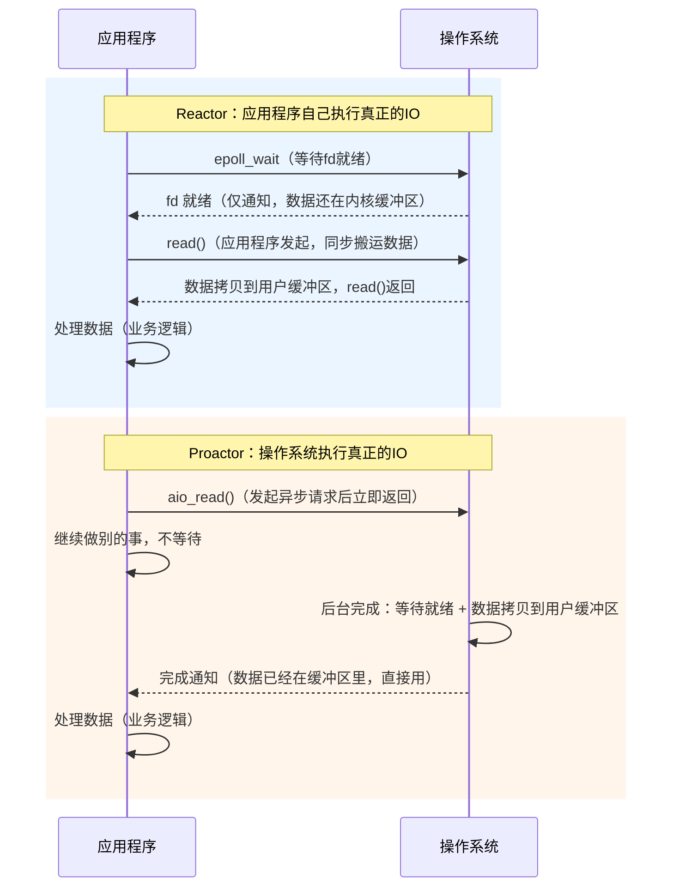
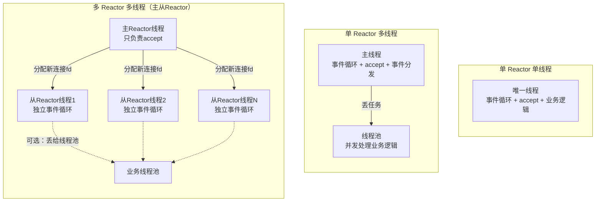

# 计算机网络 2 · Reactor、Proactor 与线程池

《计算机网络 1·IO 模型与多路复用》讲清楚了 select/poll/epoll 这几个多路复用系统调用本身的实现差异，但一个真实的高性能网络服务器不会直接在 `main` 函数里裸调 `epoll_wait`——需要有一套架构把"检测就绪事件"和"处理业务逻辑"组织起来，这就是 Reactor 和 Proactor 这两种事件驱动架构模式要解决的问题。这一讲把 Reactor/Proactor 的定义、二者在"谁执行真正 IO"上的本质区别、Linux 生态下为什么 Reactor 远比 Proactor 主流、Reactor 的三种工程变体，以及支撑所有这些架构的基础设施——线程池——依次讲清楚。线程池部分会给出一个完整的、可以直接编译运行的最小实现，用到的 `std::mutex`/`std::condition_variable`/`std::function` 和移动语义在前面的 C++ 系列和这里都会用到，不重复展开语言细节，只聚焦线程池本身的设计。

```text
1. 遇到"讲讲Reactor模式"，先说清楚它建立在IO多路复用之上：一个事件循环反复调用select/poll/epoll等待fd就绪，就绪后把事件分发给注册的handler，但真正的read/write是handler（也就是应用程序自己）去做的，操作系统只负责"通知"，不负责"搬数据"。
2. 遇到"Reactor和Proactor的区别"，一句话锚定："谁执行真正的IO操作"——Reactor下应用程序在收到就绪通知后自己发起read/write；Proactor下应用程序发起异步IO请求后就返回，操作系统完成包括数据拷贝在内的全部IO工作，完成后才通知应用程序。不要只说"一个同步一个异步"就停住，要能说出这句话具体体现在谁去调read()这个动作上。
3. 遇到"Linux用的是Reactor还是Proactor"，答案要落到"Linux原生异步IO（POSIX AIO / io_submit）长期功能有限、不够成熟，撑不起高性能网络服务器"这个具体原因上，而不是含糊地说"Linux不支持异步IO"；同时要提到nginx/Redis/muduo等主流实现全部是基于epoll的Reactor，Windows下IOCP更成熟所以Proactor在Windows上更主流。io_uring是加分项，提一下但不要喧宾夺主。
4. 遇到"Reactor有哪几种模式"，按"谁做accept、谁做事件分发、谁做业务处理"这三个角色的线程分工来区分单Reactor单线程/单Reactor多线程/多Reactor多线程，不要只背名字，要能画出每种模式里线程和职责的对应关系。
5. 遇到"为什么要用线程池"，先讲清楚线程创建和销毁本身的开销（内核对象分配、栈内存分配、上下文切换）在高并发场景下会被反复触发进而累积成显著开销，线程池用"预先创建、复用"来分摊这个成本，再落到具体实现（任务队列+条件变量）上。
6. 手写线程池代码时，析构函数里"设置停止标志→notify_all→逐个join"这个顺序不能错，漏掉notify_all会导致等待中的线程永远收不到唤醒，join会死等。
```

---

## 1. Reactor 模式

**核心结论**：Reactor 模式建立在 IO 多路复用（select/poll/epoll）之上，本质是一个事件循环（event loop）不断调用多路复用接口等待一组 fd 中有没有变为就绪，一旦有 fd 就绪，Reactor 就把这个事件分发（dispatch）给这个 fd 事先注册好的事件处理器（handler），由 handler 去执行真正的读写操作；操作系统在整个过程里只承担"通知"这一个角色，告诉应用程序"你关心的东西已经就绪了，可以去操作了"，实际的 IO 操作（`read`/`write`/`accept` 这些系统调用）仍然是应用程序自己发起并同步完成的。

具体展开一次连接的生命周期：Reactor 的事件循环线程阻塞在 `epoll_wait` 上，操作系统监视着一组已注册的 fd。当某个监听 socket 上有新连接到达时，对应的 fd 变为可读，`epoll_wait` 返回并带上这个 fd；Reactor 查表找到这个 fd 绑定的 acceptor handler，调用它，handler 内部执行 `accept()` 拿到新连接的 fd，再把这个新 fd 注册进 epoll 继续监听。当某个已连接 socket 上有数据到达时，同样地，`epoll_wait` 返回这个 fd，Reactor 分发给这个 fd 绑定的业务 handler，handler 调用 `read()` 把数据从内核缓冲区读进用户空间，再执行具体的业务逻辑（解析协议、算出响应等），最后可能再调用 `write()` 把结果写回去。这一整套流程里，"感知就绪"这一步交给了内核（通过 epoll），但"真正搬运数据"这一步——`read`/`write` 本身——从始至终是由应用程序线程发起并同步执行的，Reactor 只是把"何时该调用哪个 handler"这件事组织了起来，并没有改变谁在做真正 IO 这一点。


**常见追问 / 面试陷阱**

> 追问"Reactor 里操作系统到底做了什么，应用程序又做了什么"：操作系统只做一件事——通过 epoll（或 select/poll）监视一组 fd 的状态，在某个 fd 满足关心的条件（可读/可写/有新连接）时把这个信息返回给调用方；应用程序做剩下的全部事情，包括决定分发给哪个 handler、调用 `read`/`write` 把数据在内核和用户空间之间搬运、以及所有业务逻辑。这也是为什么说 Reactor 本质上还是同步 IO 的一种组织方式——真正的数据搬运没有被内核接管，只是"知道该什么时候去搬"这件事被内核接管了。

---

## 2. Proactor 模式

**核心结论**：Proactor 模式建立在真正的异步 IO 之上（POSIX AIO 或 Windows 的 IOCP），应用程序发起一个异步读/写请求之后立即返回去做别的事情，不等待也不参与后续任何操作；操作系统在后台完成实际的数据读取/写入，包括把数据在内核缓冲区和用户缓冲区之间搬运这一步，全部完成之后才通知应用程序"数据已经准备好放在你指定的缓冲区里了，可以直接用"。Reactor 与 Proactor 的核心区别就落在"谁执行真正的 IO 操作"这一点上：Reactor 下是应用程序在收到就绪通知之后自己发起 `read`/`write`；Proactor 下是操作系统完成了包括数据拷贝在内的全部 IO 工作之后才通知应用程序，应用程序全程不需要调用 `read`/`write` 去搬运数据。

具体到一次异步读的流程：应用程序调用类似 `aio_read()` 的接口，传入 fd、目标缓冲区地址、要读取的长度以及一个完成回调（或者信号），调用立即返回，应用程序线程继续执行其他代码，不阻塞也不需要之后再发起任何读操作。操作系统在后台等待数据从网卡到达内核缓冲区，就绪后自己把数据从内核缓冲区拷贝进应用程序指定的那块用户空间缓冲区，这两步都不需要应用程序的参与。等数据已经实实在在地躺在用户缓冲区里之后，操作系统才通过回调或者信号通知应用程序"这次异步读已经完成，数据在你给的地址里了"，应用程序此时要做的只是直接使用这块内存，不需要再调用一次 `read`。写操作是对称的：应用程序把要写的数据和目标 fd 交给 `aio_write()` 之类的接口，立即返回，操作系统在后台把数据从用户缓冲区拷贝进内核缓冲区并通过网卡发送出去，完成后再通知应用程序。



| 对比维度 | Reactor | Proactor |
|---|---|---|
| 依赖的底层机制 | IO 多路复用（select/poll/epoll） | 真正的异步 IO（POSIX AIO、Windows IOCP） |
| 谁执行真正的 read/write | 应用程序（收到就绪通知后自己调用） | 操作系统（完成后才通知应用程序） |
| 数据拷贝（内核缓冲区→用户缓冲区）由谁完成 | 应用程序调用 `read`/`write` 时同步完成 | 操作系统在通知应用程序之前就已完成 |
| 通知的语义 | "你关心的 fd 就绪了，可以去操作了" | "你请求的 IO 已经完成，数据已经在你的缓冲区里了" |
| 编程模型 | 事件循环 + handler，handler 内做同步 IO | 发起异步请求 + 完成回调，回调内不需要再做 IO |
| 对应的 IO 模型（回顾 Net01 的两阶段划分） | 属于 IO 多路复用，第二阶段（拷贝）仍由应用程序同步完成 | 属于异步 IO，两个阶段都由内核完成 |
| 典型平台 | Linux（epoll 为主） | Windows（IOCP 为主），Linux 上理论存在但实践少见 |

**常见追问 / 面试陷阱**

> 追问"Proactor 是不是比 Reactor 天然更高效"：理论上是，因为 Proactor 把数据拷贝这一步也下放给了操作系统，应用程序线程可以在发起请求后完全去做别的事，不需要在收到通知后再自己阻塞式地调用一次 `read`。但这个理论优势能不能兑现，取决于操作系统的异步 IO 实现是否足够成熟——这正是下一节要讲的问题：Linux 上长期没有一个能撑起高性能网络服务器的原生异步 IO 实现，所以 Reactor 在 Linux 生态下反而是更主流、更实用的选择。

---

## 3. Linux 下的现实情况：为什么主流服务器基本都用 Reactor

**核心结论**：Proactor 理论上更优，但它依赖操作系统提供成熟的原生异步 IO 支持；Linux 上的原生异步 IO（POSIX AIO，以及更底层的 `io_submit`/libaio 这一套）长期以来功能有限、支持的操作类型少、实现也不够成熟，难以支撑高性能网络服务器的真实需求，而 Windows 的 IOCP 在这方面实现得更完善。因此 Linux 下几乎所有高性能网络库和服务器——nginx、Redis、muduo 等——都是基于 epoll 实现 Reactor 模式，用 Reactor 去逼近部分 Proactor 想要达到的效果（比如线程池处理业务逻辑、非阻塞 IO 减少等待），而不是直接使用真正的 Proactor。

POSIX AIO 的具体局限在于：它主要面向的是文件 IO 而非网络 socket，很多实现（比如 glibc 的 POSIX AIO）底层其实是用一个线程池去模拟"异步"——也就是说内部悄悄地把异步请求转成了"开一个线程去做阻塞 IO，做完再回调"，并没有真正利用内核级别的异步机制，这就失去了 Proactor 本该带来的优势。更底层的 Linux AIO（`io_submit`/`io_getevents` 这套接口，通常搭配 `O_DIRECT` 使用）对可以异步化的操作类型限制很多，接口本身也不好用，网络编程场景下几乎不会直接基于它构建服务器架构。相比之下，Windows 的 IOCP（IO Completion Port）是操作系统级别原生设计、面向网络和文件 IO 都成熟支持的完成端口机制，Windows 平台上的高性能服务器确实较多采用接近 Proactor 语义的架构。这也是"Linux 下 Reactor 更主流，Proactor 理论更优但受限于操作系统支持"这个结论在面试里是准确且稳妥的答案——它把"模式本身孰优孰劣"和"某个平台上现实中该选哪个"这两个问题分开回答了。

Linux 较新内核引入的 `io_uring`（5.1 版本开始）通过一对共享的环形缓冲区（提交队列 SQ、完成队列 CQ）在用户态和内核态之间传递 IO 请求和完成事件，减少了系统调用和数据拷贝的开销，并且支持的操作类型比传统 Linux AIO 广得多（网络 IO、文件 IO、`accept`、`connect` 等都可以异步化），是 Linux 上第一次从根本上具备支撑真正 Proactor 架构能力的机制。但截至目前，`io_uring` 相对年轻，大多数现存的高性能网络服务器和框架仍然是基于 epoll 的 Reactor 架构，`io_uring` 更多是在新项目和特定场景（比如存储密集型服务）里逐渐被采用，还没有取代 Reactor 成为 Linux 网络编程的默认选择。面试里如果被问到这一点，说"Linux 传统上以及目前主流仍然是 Reactor，`io_uring` 是让 Proactor 在 Linux 上变得可行的新方向，但还没有成为主流"是一个稳妥的回答。

**常见追问 / 面试陷阱**

> 追问"Redis 是 Reactor 还是 Proactor"：Redis 是典型的单 Reactor 单线程模型——它基于自己实现的事件库 `ae`（对 epoll/kqueue/select 做了封装），用一个线程跑事件循环监听所有客户端连接的 fd，就绪后由这一个线程自己完成 `read`/解析命令/执行/`write` 全过程，命令执行本身是单线程串行的，这正是 Reactor 而不是 Proactor（数据的读写都是 Redis 自己的线程在做，不是操作系统在后台悄悄完成后再通知）。Redis 从 4.0 起引入了后台线程处理部分耗时的删除操作（如 `UNLINK`），6.0 起又引入了多线程处理网络 IO 的读写以减轻单线程在数据搬运上的开销，但命令执行（真正的业务逻辑）仍然是单线程的，架构底色依然是 Reactor，不能因为出现了"多线程"字样就误判成多 Reactor 模型或者 Proactor 模型。

---

## 4. Reactor 模式的几种变体

**核心结论**：Reactor 的几种工程变体，区别都落在"accept 新连接""监听/分发事件""处理业务逻辑"这三个角色分别由几个线程来承担上，从单 Reactor 单线程到多 Reactor 多线程，本质是一个不断把这三个角色拆分到更多线程上、以便更好利用多核和分散压力的过程。

**单 Reactor 单线程**：只有一个线程，这个线程既跑事件循环（调用 `epoll_wait` 监听所有 fd），又亲自处理accept 新连接和所有业务逻辑。实现最简单，没有任何线程同步问题，因为从头到尾只有一个执行流。缺点也很直接：如果某次业务逻辑处理耗时较长，会独占这个唯一的线程，导致其他所有连接的事件都得不到及时处理，整个事件循环被阻塞住；并且因为只有一个线程，完全无法利用多核 CPU。这种模型适合业务逻辑非常轻量、执行时间可预测且很短的场景——前面提到的 Redis 单线程模型就是典型代表，因为 Redis 的命令大多数是内存操作，执行时间在微秒级，单线程串行处理反而带来了没有锁竞争、延迟高度可预测的好处。

**单 Reactor 多线程**：仍然只有一个线程负责 accept 新连接和监听所有 fd 的事件（也就是说事件循环和分发依然是单线程的），但这个线程不再亲自处理业务逻辑，而是把收到的具体任务丢给一个线程池去并发执行，处理完之后再把结果交回主线程（或者由工作线程直接完成后续的 `write`，具体设计会有差异）。这样做的好处是耗时的业务逻辑不会拖慢事件循环本身，能够利用多核处理并发的业务请求。局限在于 accept 和事件分发这一步始终是单线程完成的，当并发连接数非常大、新连接到达和事件分发本身的开销就已经很可观时，这个唯一负责监听和分发的线程会成为整个系统的瓶颈。

**多 Reactor 多线程（主从 Reactor）**：设置一个主 Reactor，专门负责监听端口、`accept` 新连接，不参与任何具体连接的读写事件处理；每当 accept 到一个新连接，主 Reactor 把这个连接的 fd 分配给某一个从 Reactor（通常按某种负载均衡策略，比如轮询）。每个从 Reactor 运行在自己独立的线程里，各自维护自己的一份 epoll 实例，独立地跑自己的事件循环，只负责监听和处理分配给自己的那部分连接的 IO 事件；从 Reactor 收到事件后同样可以选择自己直接处理，或者进一步丢给线程池处理业务逻辑。这样一来，accept 压力被主 Reactor 单独承担且通常很轻量（accept 本身开销不大），大量连接的事件监听和分发被分散到多个从 Reactor 线程上并行进行，能够充分利用多核。这是 Nginx 多 worker 进程模型（每个 worker 进程各自跑一个事件循环处理分配到的连接）、Netty 的 `BossGroup`/`WorkerGroup` 设计的通用思路，是目前高性能网络服务器最常见的架构。



| 变体 | accept 由谁做 | 事件监听/分发由谁做 | 业务逻辑由谁做 | 主要瓶颈 | 典型场景 |
|---|---|---|---|---|---|
| 单 Reactor 单线程 | 唯一线程 | 唯一线程 | 唯一线程 | 无法利用多核；业务耗时会阻塞整个事件循环 | Redis 单线程模型，业务逻辑极轻量 |
| 单 Reactor 多线程 | 主线程 | 主线程（单线程） | 线程池（多线程并发） | 事件监听/分发仍是单线程，高并发连接下可能成瓶颈 | 中等并发、业务逻辑较重的服务 |
| 多 Reactor 多线程（主从） | 主 Reactor（专职） | 多个从 Reactor 各自独立并行 | 从 Reactor 自己处理或再丢线程池 | 设计和实现复杂度更高，需要负责连接分配的负载均衡 | Nginx 多 worker、Netty，高性能服务器主流架构 |

**常见追问 / 面试陷阱**

> 追问"单 Reactor 多线程和多 Reactor 多线程的本质区别是什么，不要只说线程数量"：本质区别在于"事件监听和分发这一步是否也被并行化了"。单 Reactor 多线程只是把业务逻辑并行化了，负责 accept 和 `epoll_wait`/事件分发的线程始终只有一个；多 Reactor 多线程连"监听哪些 fd 就绪"这一步本身都拆成了多个独立的、各自持有一份 epoll 实例的从 Reactor 并行执行，主 Reactor 只保留 accept 这一个轻量职责。所以多 Reactor 多线程解决的是"连接数极大时，单线程做事件分发本身也可能成为瓶颈"这个问题，单 Reactor 多线程解决不了这一点。

---

## 5. 线程池的设计与实现

**核心结论**：线程池要解决的核心问题是频繁创建和销毁线程的开销。如果每来一个任务就创建一个新线程去处理、处理完再销毁这个线程，那么线程创建（分配内核对象、分配线程栈内存、操作系统调度器登记）和销毁本身的开销，在高并发、任务量大的场景下会被反复触发，累积成一笔相对于实际业务处理时间而言不可忽视的性能损耗，甚至可能出现"创建销毁线程的开销比任务本身执行时间还长"的情况。线程池的做法是预先创建固定数量的工作线程，这些线程在整个程序运行期间基本保持存活，配合一个线程安全的任务队列，工作线程反复地从队列里取任务执行、执行完再去取下一个，从而把"创建/销毁线程"这个开销只付一次（在线程池初始化和销毁的时候），后续提交的每一个任务复用的都是已经存在的线程。

线程池的核心组件有四个：一组固定数量的工作线程（用 `std::vector<std::thread>` 存放）；一个任务队列，队列里的元素是可调用对象，用 `std::queue<std::function<void()>>` 表示可以统一容纳普通函数、lambda、成员函数绑定等各种任务形式；一把互斥锁配合一个条件变量，用来保护任务队列的并发访问并且在队列为空时让工作线程休眠等待，避免忙等（busy-waiting）浪费 CPU；一个停止标志，通常用 `std::atomic<bool>` 或者受同一把锁保护的普通 `bool`，用来在析构时通知所有工作线程"不要再等新任务了，退出循环"。工作线程的核心逻辑是一个循环：加锁、如果队列为空且线程池还没有被要求停止就在条件变量上等待、被唤醒后取出队首任务、解锁、执行这个任务，然后回到循环开头继续取下一个任务。提交任务的接口把新任务推入队列尾部，然后调用条件变量的 `notify_one()` 唤醒一个正在等待的工作线程去处理它。析构函数要按顺序做三件事：先设置停止标志为 `true`，再用 `notify_all()` 唤醒所有正在条件变量上等待的工作线程（如果漏掉这一步，还在等待队列非空的线程会永远收不到唤醒信号，`join` 会永久阻塞），最后对每一个工作线程调用 `join()` 等待它们各自退出循环、真正结束运行。

```cpp
#include <atomic>
#include <condition_variable>
#include <functional>
#include <mutex>
#include <queue>
#include <thread>
#include <vector>

class ThreadPool {
public:
    explicit ThreadPool(size_t thread_count) : stop_(false) {
        workers_.reserve(thread_count);
        for (size_t i = 0; i < thread_count; ++i) {
            // 每个工作线程执行同一份循环逻辑，用 lambda 捕获 this
            workers_.emplace_back([this] {
                while (true) {
                    std::function<void()> task;
                    {
                        std::unique_lock<std::mutex> lock(queue_mutex_);
                        // 队列为空且线程池未停止时，在这里休眠，避免忙等
                        cv_.wait(lock, [this] {
                            return stop_.load() || !tasks_.empty();
                        });
                        // 停止且队列已清空，才真正退出循环
                        if (stop_.load() && tasks_.empty()) {
                            return;
                        }
                        // std::move 避免拷贝 std::function 内部持有的资源
                        task = std::move(tasks_.front());
                        tasks_.pop();
                    } // unique_lock 在这里析构，自动解锁
                    task(); // 在锁外执行任务，避免长时间占用锁
                }
            });
        }
    }

    // 提交任务：把可调用对象塞进队列，唤醒一个等待中的线程
    template <typename F>
    void submit(F&& task) {
        {
            std::lock_guard<std::mutex> lock(queue_mutex_);
            if (stop_.load()) {
                throw std::runtime_error("submit on a stopped ThreadPool");
            }
            tasks_.emplace(std::forward<F>(task));
        }
        cv_.notify_one(); // 只需唤醒一个线程去处理这一个新任务
    }

    ~ThreadPool() {
        stop_.store(true);
        cv_.notify_all(); // 唤醒所有可能还在等待的线程，让它们检查停止标志
        for (std::thread& worker : workers_) {
            if (worker.joinable()) {
                worker.join(); // 等待每个工作线程真正退出
            }
        }
    }

    // 线程池本身管理内核线程和锁资源，禁止拷贝/移动，避免语义不清晰
    ThreadPool(const ThreadPool&) = delete;
    ThreadPool& operator=(const ThreadPool&) = delete;

private:
    std::vector<std::thread> workers_;
    std::queue<std::function<void()>> tasks_;
    std::mutex queue_mutex_;
    std::condition_variable cv_;
    std::atomic<bool> stop_;
};
```

这份实现只覆盖了线程池最核心的"任务队列 + 工作线程循环"，提交任务后调用方无法拿到任务的返回值——这是为了聚焦核心机制而做的简化。更完整的、工程上实际会用的线程池通常会结合 `std::packaged_task` 和 `std::future`：`submit` 内部把传入的任务包装成一个 `std::packaged_task`，这个 packaged_task 被放进任务队列的是它的一个 `std::shared_ptr` 封装（因为 `packaged_task` 本身不可拷贝，只能移动，而 `std::function` 要求可调用对象可拷贝构造，所以通常用 `shared_ptr` 包一层来绕开这个限制），`submit` 立即返回这个 packaged_task 关联的 `std::future<ReturnType>`，调用方后续可以在需要结果的时候调用 `future.get()` 阻塞等待任务真正执行完并拿到返回值，中间调用方线程可以继续做别的事情而不必阻塞在提交那一刻。这个扩展不改变线程池的核心结构，只是把"任务"这个概念从"纯粹的副作用函数"升级成了"带返回值、可以被异步等待结果的任务"。

**常见追问 / 面试陷阱**

> 追问"为什么工作线程的等待条件要写成 `stop_.load() || !tasks_.empty()` 而不是只判断队列非空"：如果只判断队列非空，当析构函数设置了停止标志并 `notify_all` 之后，一个原本在等待的线程被唤醒，但此时如果队列恰好是空的，`wait` 的谓词返回 `false`，线程会立刻重新进入等待状态，永远不会检查到停止标志，导致析构函数里的 `join()` 永久阻塞。必须把停止标志也作为唤醒条件的一部分，被唤醒后线程才能判断出"是该退出了，而不是又有新任务了"。

> 追问"为什么执行任务 `task()` 要放在解锁之后而不是持锁执行"：如果在持有 `queue_mutex_` 的情况下执行任务，任务本身的执行时间会被算进临界区的持有时间里，此时如果任务耗时较长，其他工作线程即便有空也无法进队列取下一个任务（因为都被这一把锁卡住了），线程池并发处理任务的能力被这把本该只保护队列结构的锁严重削弱了。正确做法是取出任务、解锁之后再执行，让锁只保护"从队列取任务"这一个短暂操作。

---

## 快速选择题

**1. Reactor 模式下，真正的 `read()`/`write()` 系统调用由谁发起？**
A. 操作系统在后台自动完成
B. 应用程序在收到就绪通知后自己发起
C. 由多路复用系统调用本身完成
D. 由内核线程池代为完成

**答案：B** — Reactor 只负责通过多路复用机制感知fd是否就绪并分发事件，真正的读写操作是应用程序（handler）自己调用完成的。

**2. Proactor 模式下，数据从内核缓冲区拷贝到用户缓冲区这一步由谁完成？**
A. 应用程序在收到通知后调用read完成
B. 操作系统在通知应用程序之前就已经完成
C. 由用户手动调用一次内存拷贝函数完成
D. Proactor模式不涉及这一步拷贝

**答案：B** — Proactor建立在真正的异步IO之上，操作系统完成包括数据拷贝在内的全部IO工作后才通知应用程序，应用程序不需要再调用read。

**3. Reactor与Proactor的核心区别，最准确的描述是？**
A. Reactor用于Linux，Proactor用于Windows，仅此而已
B. Reactor是同步模型，Proactor是异步模型，区别在于谁执行真正的IO操作
C. Reactor只能处理TCP连接，Proactor只能处理UDP
D. Proactor不需要事件循环，Reactor需要

**答案：B** — 二者的本质区别落在"谁执行真正的读写"：Reactor下应用程序自己发起并同步完成IO，Proactor下操作系统完成全部IO后才通知应用程序。

**4. 下列关于Linux原生异步IO（POSIX AIO / Linux AIO）的说法，正确的是？**
A. 功能完善成熟，是Linux下高性能服务器的主流选择
B. 长期以来功能有限、支持的操作类型少、实现不够成熟，难以支撑高性能网络服务器
C. 和epoll完全等价，只是接口形式不同
D. 只存在于理论中，Linux内核从未真正实现过

**答案：B** — Linux原生异步IO这套机制长期存在局限（例如很多实现依赖线程池模拟、支持的操作类型有限），因此高性能网络服务器普遍转向基于epoll的Reactor架构。

**5. Nginx、Redis、muduo这类Linux下的高性能网络软件，主要采用的架构是？**
A. 基于Windows IOCP的Proactor
B. 基于POSIX AIO的真正异步IO
C. 基于epoll实现的Reactor
D. 完全不使用事件驱动架构，采用纯多进程阻塞IO

**答案：C** — 由于Linux原生异步IO支持有限，这些软件普遍基于epoll构建Reactor架构，用Reactor去逼近部分Proactor效果。

**6. io_uring在这个话题里最准确的定位是？**
A. 它是select的替代品，和异步IO无关
B. Linux较新内核引入的机制，尝试从根本上改善原生异步IO能力，但尚未取代Reactor成为主流
C. 它是Windows IOCP在Linux上的直接移植
D. 它已经完全取代了epoll，成为Linux网络编程的默认标准

**答案：B** — io_uring通过共享环形缓冲区等设计显著改善了Linux异步IO的能力和覆盖范围，是Proactor在Linux上变得可行的新方向，但目前大多数系统仍以Reactor为主。

**7. Redis的事件驱动模型最准确的描述是？**
A. 多Reactor多线程模型
B. 单Reactor单线程模型：一个线程跑事件循环并亲自完成读写和命令执行
C. 基于IOCP的Proactor模型
D. 没有事件循环，纯轮询实现

**答案：B** — Redis基于自己的ae事件库封装epoll等多路复用机制，用一个线程跑事件循环并同步完成读写与命令执行，属于单Reactor单线程模型；虽然后续版本引入了部分多线程处理网络IO和惰性删除，但命令执行的核心仍是单线程。

**8. 单Reactor单线程模型最大的局限是什么？**
A. 无法处理TCP连接，只能处理UDP
B. 业务逻辑耗时会阻塞整个事件循环，且无法利用多核
C. 无法使用epoll，只能用select
D. 只能支持一个客户端连接

**答案：B** — 唯一线程既跑事件循环又处理业务逻辑，一旦某次业务处理耗时较长会阻塞后续所有事件的处理，且完全无法利用多核CPU并行处理。

**9. 单Reactor多线程和多Reactor多线程的本质区别是？**
A. 前者只能处理少量连接，后者能处理任意连接数量
B. 前者的事件监听/分发始终是单线程，后者把事件监听/分发本身也拆分到多个并行的从Reactor线程上
C. 两者没有本质区别，只是叫法不同
D. 前者不使用线程池，后者必须使用线程池

**答案：B** — 单Reactor多线程只是把业务逻辑并行化了，accept和事件分发仍是单线程；多Reactor多线程连事件监听分发这一步本身也拆到多个独立的从Reactor并行执行，能应对更大规模的并发连接。

**10. 线程池要解决的核心问题是？**
A. 减少内存占用
B. 避免每个任务到来都创建新线程、处理完再销毁所带来的频繁创建销毁开销
C. 让程序变成单线程运行
D. 替代所有的锁机制

**答案：B** — 线程创建和销毁本身有不小的开销（内核对象、栈内存分配、调度器登记等），高并发场景下频繁触发会累积成显著性能损耗，线程池通过预先创建、复用线程来分摊这个成本。

**11. 在文中给出的线程池实现里，工作线程在条件变量上等待的谓词为什么要写成 `stop_.load() || !tasks_.empty()`？**
A. 只是代码风格问题，写成 `!tasks_.empty()` 也完全等价
B. 如果只判断队列非空，析构时notify_all唤醒的线程若发现队列恰好为空会重新进入等待，永远检测不到停止标志，导致join永久阻塞
C. 因为std::atomic<bool>不能单独作为条件使用
D. 这样写是为了让所有线程同时被唤醒并抢占同一个任务

**答案：B** — 停止标志必须作为唤醒条件的一部分，否则线程被唤醒后如果队列为空会立刻重新等待，永远不会退出循环，析构函数里的join会一直阻塞。

**12. 线程池析构函数中，正确的执行顺序应该是？**
A. 直接对所有线程调用join，不需要设置停止标志
B. 先notify_all，再设置停止标志，最后join
C. 先设置停止标志，再notify_all唤醒所有等待线程，最后逐个join等待退出
D. 先join，再设置停止标志和notify_all

**答案：C** — 必须先置位停止标志，再notify_all唤醒所有可能还在等待的线程让它们检查到标志并退出循环，最后join等待每个线程真正结束；顺序颠倒或遗漏notify_all都会导致某些线程永远无法被唤醒，join死等。
