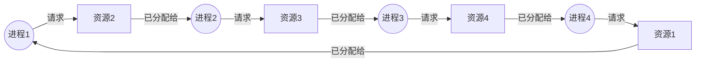

# 操作系统 2 · 线程同步与死锁

多线程程序正确性问题里，绝大多数最终都能归结到"多个线程并发访问共享资源时如何保证结果符合预期"这一件事上。解决这个问题的工具并不多：互斥锁、自旋锁、读写锁、条件变量，四种原语反复排列组合就覆盖了工程里绝大多数同步场景，但它们各自的等待方式、开销特征、适用条件完全不同，选错了往往不是正确性问题而是性能问题（比如该用互斥锁的地方用了自旋锁，白白烧掉 CPU）。这一讲从自旋锁和互斥锁的底层实现机制讲起，把两者的开销来源讲透，再展开读写锁、条件变量，最后落到死锁的四个必要条件和工程上最常用的避免手段。这些内容在面试里经常以"手写一个自旋锁"“为什么条件变量要搭配互斥锁使用”“说说死锁的四个条件”这类具体问题出现，回答时既要能写出代码，也要能讲清楚代码背后每一步在做什么。

```text
1. 遇到"如何保证多线程安全访问共享资源"类问题，先确定这是纯粹的互斥问题（同一时刻只能有一个线程碰这块数据）还是带条件等待的问题（线程要等某个状态成立才能继续），前者用锁，后者锁+条件变量一起用。
2. 遇到"手写自旋锁"类问题，核心是 std::atomic + CAS 或 test_and_set 的循环，一定要点出忙等待（busy-waiting）不涉及线程切换、也不涉及内核态。
3. 遇到"自旋锁 vs 互斥锁怎么选"，答案永远落在"临界区多短、预期等待时间是不是短于一次上下文切换的开销"这一个判断标准上，不要泛泛而谈"看场景"。
4. 遇到条件变量相关的题，第一反应是检查两件事：wait 是不是搭配着锁在用、条件判断是不是用 while 而不是 if；这两点分别对应 lost wakeup 和 spurious wakeup 两个经典陷阱。
5. 遇到死锁题，先默写四个必要条件（互斥、请求与保持、不可剥夺、循环等待），再指出工程上最容易落地的手段是破坏循环等待——给所有锁定义一个全局获取顺序。
```

---

## 1. 线程同步方式总览

多线程环境下，多个线程可能在任意时刻同时读写同一块内存，如果不加约束，读写交织的顺序是不确定的，程序的行为也就变得不可预测（这正是 data race 未定义行为的来源）。同步原语的作用就是给这种"任意交织"施加约束，让程序员能够精确控制"哪些操作必须互斥执行"“哪些线程要等待某个条件成立才能继续”。四种最常见的原语按用途大致分成两类：

- **纯互斥类**：自旋锁(spinlock)、互斥锁(mutex)、读写锁(reader-writer lock)——解决"同一时刻只能有一个（或按角色限定数量的）线程访问共享资源"的问题，三者的区别主要在等待方式和并发粒度上。
- **条件等待类**：条件变量(condition variable)——解决"线程需要等某个条件成立才能继续，而不是单纯地互斥"的问题，通常要和互斥锁配合使用。

后面几节按自旋锁、互斥锁、两者对比、读写锁、条件变量的顺序逐个展开，最后一节讨论由不当加锁引发的死锁问题。

---

## 2. 自旋锁(spinlock)：原理与简化实现

**核心结论**：自旋锁的核心思想是"获取锁失败时不放弃 CPU"。线程尝试加锁失败后，不会被操作系统调度出去挂起睡眠，而是留在一个循环里持续轮询锁的状态，一旦发现锁被释放就立刻尝试抢锁。这种等待方式叫**忙等待(busy-waiting)**，好处是一旦锁被释放，等待的线程几乎能瞬间抢到并继续执行，完全不需要经过"唤醒—重新调度—恢复上下文"这一整套操作系统调度流程的开销。

**基于 `std::atomic` 和 CAS 的简化实现**：

```cpp
#include <atomic>

class SpinLock {
public:
    void lock() {
        // compare_exchange_weak: 期望值是 false（未上锁），
        // 如果当前确实是 false，就原子地设为 true 并返回 true；
        // 如果当前是 true（已被占用），返回 false，并把 expected 重置为当前值。
        bool expected = false;
        while (!flag_.compare_exchange_weak(
                   expected, true,
                   std::memory_order_acquire,
                   std::memory_order_relaxed)) {
            expected = false; // CAS 失败后 expected 会被写成 true，需要手动复位再重试
            // 可选：在这里插入 CPU 的 pause 指令（x86 上是 _mm_pause()），
            // 降低忙等待期间的功耗和总线争用，不改变正确性
        }
    }

    void unlock() {
        flag_.store(false, std::memory_order_release);
    }

private:
    std::atomic<bool> flag_{false};
};
```

也可以用更原始的 `test_and_set` 语义实现（`std::atomic_flag` 是 C++ 标准里唯一保证无锁的原子类型，专门为这种场景设计）：

```cpp
#include <atomic>

class SpinLockFlag {
public:
    void lock() {
        // test_and_set 返回旧值并把标志位设为 true；
        // 旧值是 true 说明锁已被占用，继续循环重试
        while (flag_.test_and_set(std::memory_order_acquire)) {
            // busy-wait
        }
    }
    void unlock() {
        flag_.clear(std::memory_order_release);
    }
private:
    std::atomic_flag flag_ = ATOMIC_FLAG_INIT;
};
```

两个版本的关键点一致：`lock()` 里是一个不停尝试 CAS（或 `test_and_set`）的循环，失败就重试，没有任何主动让出 CPU 的动作；`unlock()` 只是把标志位原子地写回"未上锁"状态，让下一个正在循环里轮询的线程能够抢到。`memory_order_acquire`/`memory_order_release` 的配对保证了临界区内的读写不会被重排到锁的获取/释放之外，这是锁能保护共享数据的内存序基础。

**忙等待的代价**：线程在等待期间持续占用 CPU 却不做任何有用的工作，这个代价只有在"预期等待时间很短"的前提下才划算。如果持锁时间较长（临界区里有耗时操作），或者参与竞争的线程数超过了 CPU 的物理并行能力（比如 4 核机器上 20 个线程抢同一把自旋锁），等待中的线程会白白消耗大量 CPU 周期，甚至可能出现"持锁线程本身因为调度被换下 CPU，而其他线程还在傻等它释放锁"这种更糟糕的情况——这正是自旋锁不适合用户态长临界区的根本原因。

```text
自旋锁的忙等待：线程 B 在锁被占用期间持续轮询，不让出 CPU
线程A: [持锁执行临界区............] [unlock]
线程B: [CAS失败][CAS失败][CAS失败][CAS失败][CAS成功,进入临界区]
        ─────────── 持续占用 CPU，空转 ───────────▶
```

**常见追问 / 面试陷阱**

> 追问"为什么用 `compare_exchange_weak` 而不是 `compare_exchange_strong`"：`weak` 版本允许出现**伪失败(spurious failure)**——即使当前值确实等于 `expected`，交换也可能因为底层实现原因（比如某些平台上 load-linked/store-conditional 指令对中断和 cache line 状态变化敏感）失败并返回 `false`。在循环里反复重试的场景下，`weak` 版本通常比 `strong` 版本效率更高（省去了 `strong` 版本内部为消除伪失败而做的额外循环），因为外层本来就是一个循环，多失败一次只是多循环一轮，代价很小；`strong` 版本更适合那种只尝试一次、不在循环里重试的场景。

---

## 3. 互斥锁(mutex)：原理与简化实现思路

**核心结论**：互斥锁的核心思想和自旋锁相反——线程获取锁失败时不再空转，而是主动让出 CPU：操作系统把这个线程标记为阻塞状态并挂起，调度器转而运行其他可运行的线程，直到锁被释放时，操作系统再把等待中的线程唤醒，重新放回可调度队列参与竞争。这样等待期间不会浪费 CPU 周期，但代价是被挂起和被唤醒都涉及一次**上下文切换**，需要保存/恢复寄存器状态、可能触发 TLB 和部分 cache 的失效，开销比自旋锁的一次 CAS 重试大得多。

**现代 Linux 上 mutex 的实现基础：`futex`（fast userspace mutex）**。glibc 的 pthread mutex（进而 C++ 标准库的 `std::mutex`）在 Linux 上基于 `futex` 系统调用实现，其设计思路是"乐观地假设大多数时候没有竞争"：

- **无竞争路径（fast path）**：加锁和解锁都只是对一个用户态内存字（通常是一个整数）做一次原子的 CAS 操作，比如把这个字从 0（未上锁）原子地改成线程 ID 或者简单的 1（已上锁）。这一步完全发生在用户态，不涉及任何系统调用，开销和自旋锁的一次成功 CAS 几乎相同。
- **有竞争路径（slow path）**：只有当加锁时发现这个字已经不是"未上锁"状态（说明有其他线程持锁），才会真正发起 `futex` 系统调用（`FUTEX_WAIT`），陷入内核态，让当前线程真正睡眠，并把自己挂到这个 futex 对应的内核等待队列上；持锁线程 `unlock` 时如果检测到等待队列非空，才会发起另一次 `futex` 系统调用（`FUTEX_WAKE`）去唤醒等待队列里的线程。

```text
互斥锁的 futex 快慢路径：
                     ┌─────────────────────────┐
   lock()/unlock() ─▶│ 用户态原子 CAS 修改锁字   │
                     └──────────┬──────────────┘
                                │
                     锁字显示"无竞争"？
                    ┌───────────┴───────────┐
                   是（fast path）          否（slow path，有竞争）
                    │                        │
              直接返回，                futex(FUTEX_WAIT) 陷入内核，
              全程用户态，                线程挂起睡眠，让出 CPU；
              无系统调用                 unlock 时 futex(FUTEX_WAKE)
                                          唤醒等待队列里的线程
```

这种"无竞争走用户态原子操作、有竞争才陷入内核"的设计，使得 mutex 在低竞争场景下（大多数实际程序里，同一把锁被真正同时争抢的概率并不高）几乎和自旋锁一样快，几乎不产生额外开销；只有在真正发生阻塞时才付出上下文切换的代价，而这时候付出这个代价也是值得的，因为线程本来就要等待，不如把 CPU 让给别的可运行任务。

**常见追问 / 面试陷阱**

> 追问"既然 mutex 无竞争时和自旋锁一样快，是不是任何场景都该用 mutex 而不是自旋锁"：不对。上面的"一样快"只针对无竞争的场景；一旦发生真实竞争，mutex 要走一次完整的系统调用陷入内核，这个开销（通常是几百到上千纳秒量级，具体取决于内核版本和硬件）远高于自旋锁一次 CAS 重试（几纳秒到几十纳秒）。如果临界区极短、且预期几乎不会等待超过一次上下文切换的时间，自旋锁反而更快；两者的选择要看的是"发生竞争后的等待时长"，而不是"无竞争时哪个更快"，两者在无竞争时本来就差不多。

---

## 4. 互斥锁与自旋锁的底层区别

把两节内容并排对比：

| 维度 | 自旋锁(spinlock) | 互斥锁(mutex) |
|---|---|---|
| 等待方式 | 忙等待，循环轮询锁状态 | 阻塞睡眠，让出 CPU |
| 上下文切换开销 | 无（线程始终在运行态） | 有（挂起和唤醒各一次） |
| 无竞争时的开销 | 一次原子 CAS，纯用户态 | 一次原子 CAS，纯用户态（futex fast path），量级相当 |
| 有竞争时的开销 | 持续消耗 CPU 周期空转 | 一次 `futex` 系统调用陷入内核，随后线程睡眠不占 CPU |
| 适用场景 | 临界区极短，预期等待时间短于一次上下文切换 | 临界区较长，或可能长时间阻塞 |
| 等待期间 CPU 占用 | 持续占用（空转） | 释放（线程被挂起，CPU 可调度给别的任务） |
| 典型使用位置 | 内核态、极短临界区（如递增计数器、更新一个指针） | 应用层绝大多数场景 |

**经验法则**：如果获取锁的预期等待时间通常比一次线程上下文切换的开销还短，用自旋锁更划算——反正线程闲着也是空转，不如直接留在 CPU 上，等锁一释放就能立刻抢到，比"挂起→等待被唤醒→重新参与调度→恢复上下文"这一整套流程更快；反之，如果临界区较长、或者等待时间不可控（比如临界区里可能涉及 IO），应该用互斥锁把 CPU 让给别的线程，否则自旋等待期间浪费的 CPU 周期远比一次上下文切换的开销大。这也是为什么自旋锁常见于内核态代码（内核里很多临界区就是几条指令，比如更新一个链表指针）或者用户态里极短的原子性操作场景，而应用层绝大多数需要保护"一段逻辑"（哪怕只是几行业务代码）的场景，用互斥锁通常是更稳妥的默认选择。

**常见追问 / 面试陷阱**

> 追问"多核机器上自旋锁一定比互斥锁快吗"：不一定，取决于核心数是否够用。如果参与竞争的线程数超过了物理核心数，某些持锁线程本身可能已经被调度器换下 CPU，这时候在其他核心上空转等待它的线程，等的其实是一个"根本没在运行"的线程释放锁，忙等待完全是白费功夫，这种情况下自旋锁反而比互斥锁更糟糕。自旋锁只在"锁很快会被释放、且释放它的线程大概率正在某个核心上运行"这个前提下才划算。

---

## 5. 读写锁(reader-writer lock)

**核心结论**：读写锁针对的是"读多写少"的共享数据访问模式。它把普通互斥锁的"只有一种锁状态"拆成两种：**读锁（共享锁）**允许多个读者同时持有，读者之间互不阻塞，可以真正并发地读取数据；**写锁（独占锁）**任何时候只能有一个线程持有，且写锁和任何读锁、任何其他写锁都互斥——只要有写者在写，其他读者和写者都必须等待，只要有读者在读，写者也必须等待所有读者退出才能获取写锁。

**典型场景**：一个配置缓存，绝大多数操作是从缓存里读取某个配置项（可能每秒被查询成千上万次），偶尔才有一次更新配置的写操作（比如运维推送了一次新配置，一天可能只发生几次）：

```cpp
#include <shared_mutex>
#include <unordered_map>
#include <string>

class ConfigCache {
public:
    std::string get(const std::string& key) const {
        std::shared_lock<std::shared_mutex> lock(mtx_); // 共享锁，多个读者可并发持有
        auto it = data_.find(key);
        return it != data_.end() ? it->second : std::string{};
    }

    void update(const std::string& key, std::string value) {
        std::unique_lock<std::shared_mutex> lock(mtx_); // 独占锁，和任何读者/写者互斥
        data_[key] = std::move(value);
    }

private:
    mutable std::shared_mutex mtx_;
    std::unordered_map<std::string, std::string> data_;
};
```

如果这个场景用普通互斥锁，所有读操作也要互相排队，即使读操作之间根本不存在冲突——查询配置的线程之间没有任何数据依赖，让它们互相等待纯属浪费。换成读写锁后，同一时刻可以有任意多个线程并发调用 `get`，只有极少发生的 `update` 才需要真正独占，读多写少场景下的整体并发度和吞吐能得到显著提升。

**代价**：读写锁的实现比普通互斥锁复杂得多——需要维护"当前有多少个读者持有锁""是否有写者在等待或持有锁"这些额外状态，加锁/解锁路径本身的开销也比普通互斥锁略高，所以只有在读写比例确实悬殊、且临界区不是极短（否则维护读写锁状态的开销可能超过它带来的并发收益）的场景下才值得引入。

另一个需要注意的问题是**写饥饿(writer starvation)**：如果读者持续不断地到来（新的读请求在旧的读请求还没退出时就已经排队申请读锁），写者可能因为"永远有活跃的读者"而一直抢不到写锁，导致写操作被无限期推迟。是否会发生写饥饿取决于具体实现的公平性策略——有些实现会在检测到有写者等待时，暂停接受新的读锁申请，让已持有的读者退出后优先满足写者，从而避免写饥饿；使用读写锁时需要确认所在平台/库的具体公平性保证，不能想当然地认为"读写锁天然公平"。

**常见追问 / 面试陷阱**

> 追问"读写锁一定比普通互斥锁快吗"：不一定。读写锁的加锁/解锁本身需要维护更复杂的内部状态（读者计数、等待队列等），单次加锁/解锁的开销通常比普通互斥锁略高。只有在读多写少、且临界区不算极短（能覆盖住读写锁本身的额外开销）的场景下，读写锁带来的并发收益才能超过它的实现开销；如果读写操作数量接近，或者临界区极短、竞争本来就不激烈，普通互斥锁反而可能更简单也更快。

---

## 6. 条件变量(condition variable)

**核心结论**：条件变量解决的是"线程需要等待某个条件成立才能继续执行"的问题，比如消费者线程要等队列非空才能取数据。如果单纯用一个循环反复检查条件（`while (!condition) { /* 什么都不做，继续检查 */ }`），本质上是一种忙等待，会持续占用 CPU 却做不了任何有用的工作；条件变量允许线程在条件不满足时真正进入睡眠状态，让出 CPU，等到条件可能发生变化时被其他线程显式唤醒，再重新检查条件是否真的成立。

**为什么条件变量必须搭配一把互斥锁使用**：如果"检查条件"和"进入等待状态"这两个动作之间不是原子的，会出现经典的 **lost wakeup（丢失唤醒）** 竞态：

```text
lost wakeup 竞态时间线（没有用锁保护检查和等待之间的间隙）：

线程 A（消费者）              线程 B（生产者）
─────────────────            ─────────────────
检查队列，发现为空
                              往队列里放入数据
                              发出唤醒信号 —— 此时没有线程
                              正在等待队列上，这次信号
                              直接丢失，没有任何效果
真正进入等待状态
（永远等不到刚才那次唤醒，
 从此永久阻塞）
```

线程 A 检查完条件（为空）之后、真正调用 `wait` 进入等待队列之前，存在一个时间窗口；如果线程 B 恰好在这个窗口里让条件成立并发出唤醒信号，由于 A 此时还没有真正挂到等待队列上，这次唤醒会直接丢失（条件变量本身不记忆历史信号），A 随后再进入等待就再也等不到任何唤醒了。

条件变量的 `wait` 接口正是为了消除这个竞态窗口而设计成"原子地释放锁并进入等待队列"：调用 `cv.wait(lock)` 时，"释放传入的锁"和"把当前线程挂到条件变量的等待队列上"这两步被实现为一个不可分割的原子操作，中间不会被其他线程插入执行。只要线程在调用 `wait` 之前一直持有这把锁去检查条件，其他线程要修改条件、发出唤醒信号，也必须先获取同一把锁——这样"检查条件"和"进入等待队列"之间就不会再插入一次"条件被修改+唤醒信号发出"，因为对方要么在你检查之前完成修改（这样你检查时条件已经成立，不会进入 wait），要么必须等你调用 wait 真正释放锁之后才能获取锁去修改条件（这样唤醒信号发出时你已经确实在等待队列里，不会错过）。

**另一个必须注意的点：用 `while` 而不是 `if` 检查条件**，这是为了应对**虚假唤醒(spurious wakeup)**——`wait` 返回不一定意味着条件真的成立。可能的原因包括：条件变量在某些实现上允许没有任何显式 `notify` 调用也会偶尔唤醒等待线程（标准明确允许这种行为，作为换取实现效率的权衡）；也可能是多个等待线程被 `notify_all` 同时唤醒，但只有一个线程能真正满足条件、抢到资源，其余线程被唤醒后重新检查会发现条件其实并不成立。用 `while` 循环包裹 `wait` 调用，保证每次被唤醒后都重新完整检查一遍条件，不满足就继续等待，能同时处理虚假唤醒和"被唤醒但条件已经被别人抢先消费掉"这两种情况；用 `if` 只检查一次就直接往下执行，遇到虚假唤醒或者竞争丢失会直接导致逻辑错误。

**完整的生产者-消费者示例**（互斥锁 + 条件变量实现一个有界队列）：

```cpp
#include <condition_variable>
#include <mutex>
#include <queue>

template <typename T>
class BoundedQueue {
public:
    explicit BoundedQueue(size_t capacity) : capacity_(capacity) {}

    void push(T item) {
        std::unique_lock<std::mutex> lock(mtx_);
        // 用 while 而不是 if：队列可能被多个生产者同时唤醒后发现已经满了
        not_full_.wait(lock, [this] { return queue_.size() < capacity_; });
        queue_.push(std::move(item));
        lock.unlock();       // 提前解锁，缩短临界区，唤醒动作不需要持锁
        not_empty_.notify_one();
    }

    T pop() {
        std::unique_lock<std::mutex> lock(mtx_);
        // wait 的谓词版本内部就是 while(!pred()) wait(lock) 的封装，
        // 等价于显式写一个 while 循环检查条件
        not_empty_.wait(lock, [this] { return !queue_.empty(); });
        T item = std::move(queue_.front());
        queue_.pop();
        lock.unlock();
        not_full_.notify_one();
        return item;
    }

private:
    std::mutex mtx_;
    std::condition_variable not_empty_;
    std::condition_variable not_full_;
    std::queue<T> queue_;
    size_t capacity_;
};
```

这里用了两个条件变量：`not_empty_` 供消费者等待"队列非空"，`not_full_` 供生产者等待"队列未满"，分别在 `push`/`pop` 成功后唤醒对方等待的线程。C++ 标准库 `condition_variable::wait` 的谓词重载版本（`wait(lock, predicate)`）内部实现就是一个 `while (!predicate()) wait(lock)` 循环，直接用这个版本可以避免自己手写 `while` 时漏掉细节。

**常见追问 / 面试陷阱**

> 追问"`notify_one` 和 `notify_all` 怎么选"：`notify_one` 只唤醒一个正在等待的线程，适合"只有一个线程能处理这次状态变化"的场景（比如上面的有界队列，一次 `push` 只让队列多了一个空位，理论上只需要唤醒一个消费者）；`notify_all` 唤醒所有等待线程，适合"多个线程都可能需要重新检查条件"或者不确定哪个线程该被唤醒的场景（比如广播一个全局状态的变化）。误用 `notify_one` 可能导致该被唤醒的线程没被选中而错失机会（例如队列里其实有多个空位，但只唤醒了一个生产者），不过只要用 `while` 循环正确检查条件，被唤醒的线程发现条件已经不满足会重新等待，不会破坏正确性，只是可能损失一些及时性。

> 追问"信号量(semaphore)和条件变量有什么区别"：信号量自带一个计数器，`post`/`signal` 一次计数器加一，即使当时没有线程在等待，这次"信号"也会被记住，之后来等待的线程可以直接消费这个计数而不需要阻塞——这天然避免了 lost wakeup 问题。条件变量本身不带状态，`notify` 如果发出时没有线程在等待队列里，这次通知就直接丢失，因此条件变量必须配合一个额外的、由用户自己维护的条件（以及保护这个条件的锁）来判断"这次该不该真的等待"，这也是为什么条件变量的正确用法必须是"锁+条件表达式+wait"三者结合，而不能只调用 `wait`/`notify` 就完事。

---

## 7. 死锁及避免

**核心结论**：死锁(deadlock)指多个线程互相等待对方持有的资源，导致所有相关线程都无法继续向前推进。产生死锁需要同时满足四个必要条件，缺一不可：

- **互斥(mutual exclusion)**：资源同一时刻只能被一个线程占用，不能共享。
- **请求与保持(hold and wait)**：线程在持有至少一个资源的同时，又在请求其他资源。
- **不可剥夺(no preemption)**：资源只能由持有它的线程主动释放，不能被其他线程或操作系统强行抢占。
- **循环等待(circular wait)**：存在一个线程等待链，链上每个线程都在等待下一个线程所持有的资源，且这个链最终形成闭环。

**两线程互相等待的经典例子**：线程 1 先锁住 `mutex_A` 再尝试锁 `mutex_B`，线程 2 恰好反过来，先锁住 `mutex_B` 再尝试锁 `mutex_A`：

```cpp
std::mutex mutex_A, mutex_B;

void thread1() {
    std::lock_guard<std::mutex> lockA(mutex_A);
    // ... 假设这里线程被切换出去，线程2 恰好开始执行 ...
    std::lock_guard<std::mutex> lockB(mutex_B); // 等待线程2释放 mutex_B
}

void thread2() {
    std::lock_guard<std::mutex> lockB(mutex_B);
    std::lock_guard<std::mutex> lockA(mutex_A); // 等待线程1释放 mutex_A
}
```

如果两个线程恰好交错执行到"各自持有一把锁，同时在等对方手里的另一把锁"的状态，谁都无法继续向前推进，程序永久卡死。

```text
两线程死锁的循环等待图：

  线程1 ──持有──▶ mutex_A
    ▲                │
    │                │ 线程1等待
  线程2 ◀──等待── mutex_B ◀────┘
    │
    └──持有──▶ mutex_B（线程2持有 B，同时在等 A，回到起点，形成闭环）
```

推广到更一般的情形，循环等待可以涉及任意数量的进程/线程和资源。下面是 4 个进程各持有一个资源、同时在等待下一个进程所持有资源的循环等待图：



这张图里每个进程都持有一个资源，同时又在请求下一个进程持有的资源，箭头首尾相接形成一个闭环——这正是循环等待条件的定义。图中只要打断任意一条边（比如让 P1 不再等待 R2，或者提前把 R1 分配给别的进程），闭环就不成立，死锁也就不会发生。

**破坏任意一个必要条件都能避免死锁**，但四个条件在工程上的可操作性差别很大：

- 破坏互斥：大多数需要保护的资源本质上就是不可共享的（比如同时写同一片内存），把互斥去掉往往意味着放弃正确性，通常不现实。
- 破坏请求与保持：要求线程一次性申请完所有需要的资源，全部拿到才开始执行，拿不全就全部释放重新申请。可行，但会显著降低并发度，也不易设计（有些资源需求要运行到中途才能确定）。
- 破坏不可剥夺：允许资源被强制抢占，实现复杂，很多资源（比如已经进行到一半的临界区状态）根本没法安全地"半路抢回来"。
- 破坏循环等待：给所有需要跨多把锁的场景定义一个**全局统一的加锁顺序**，所有线程严格按这个顺序获取多把锁。

第四种手段是工程上最常用、最容易落地的做法：约定所有线程在需要同时持有多把锁时，必须按照统一的全局顺序依次获取（一个常见实现是按锁对象的内存地址大小排序，先锁地址小的，再锁地址大的），这样任何两个线程都不可能出现"你等我持有的锁、我等你持有的锁"这种反向等待关系，循环等待条件从设计上就不可能成立。把前面的例子改成按固定顺序加锁即可消除死锁：

```cpp
// 假设约定：地址较小的 mutex 先加锁
void safe_thread(std::mutex& first, std::mutex& second) {
    std::mutex& lower = (&first < &second) ? first : second;
    std::mutex& upper = (&first < &second) ? second : first;
    std::lock_guard<std::mutex> lockLower(lower);
    std::lock_guard<std::mutex> lockUpper(upper);
    // 无论调用者传入 (A, B) 还是 (B, A)，加锁顺序都统一按地址排序，不会形成反向等待
}
```

C++ 标准库也提供了 `std::lock`（可以一次性对多把锁做免死锁的批量加锁，内部用类似退避重试的算法而不是要求调用者手动排序）以及 C++17 的 `std::scoped_lock` 用同样的思路简化写法，两者本质上都是在帮开发者规避手动维护全局加锁顺序的复杂度，但理解"避免死锁的根本手段是打破循环等待"这一点，才能在遇到更复杂的多锁场景（比如锁的集合是运行时动态确定的）时知道该往哪个方向设计。

**死锁检测**作为事后诊断手段的补充：如果由于历史代码复杂、锁的获取顺序难以统一梳理，无法完全预防死锁，可以退而求其次做检测——运行时维护一张**资源分配图**（记录每个线程持有哪些资源、正在请求哪些资源），定期或者怀疑卡死时对这张图做环检测（本质是图论里的判环算法），一旦发现环就能确定发生了死锁，进而采取措施（比如强制回滚、终止环上某个线程释放资源）打破僵局。检测手段不能预防死锁发生，只能在死锁已经发生后帮助定位和恢复，工程上更推荐把精力放在预防（统一加锁顺序）上，而不是依赖事后检测兜底。

**常见追问 / 面试陷阱**

> 追问"只要小心一点，是不是就能避免死锁，不需要严格约定加锁顺序"：不行，死锁往往不是因为某一次加锁"写错了"，而是因为不同代码路径（可能分布在不同文件、由不同人在不同时间写）各自看起来都合理，却在极少数的线程交错时机下才会触发循环等待，靠"细心"无法系统性排除这种问题，必须靠一条对所有代码路径都强制生效的规则（比如全局加锁顺序）才能从设计上杜绝。

> 追问"死锁和活锁(livelock)有什么区别"：死锁中的线程处于阻塞状态，完全停止执行，什么也不做；活锁中的线程仍在持续执行、持续改变状态（比如两个线程都在"礼貌地"反复检测到冲突后主动让出资源再重试），但这些状态变化并没有让系统整体向前推进，结果和死锁一样是永远无法完成任务，区别只在于线程是"卡住不动"还是"一直在动但原地打转"。

---

## 快速选择题

```quiz
title: 快速选择题 1
question: 自旋锁(spinlock)在获取锁失败时的行为是：
answer: B
A. 立即让操作系统把线程挂起睡眠
B. 在循环中持续轮询锁状态，不让出 CPU
C. 直接返回错误，调用者需要自己重试
D. 抛出异常终止当前线程
explanation: 自旋锁的核心特征就是忙等待：线程留在一个循环里不断检查锁状态，一旦锁被释放立刻尝试抢占，全程不涉及线程被操作系统挂起或调度切换。
```

```quiz
title: 快速选择题 2
question: 下列关于 `std::atomic<bool>::compare_exchange_weak` 的说法，正确的是：
answer: B
A. 它保证一次调用内只要当前值等于 expected 就一定会成功交换
B. 它可能出现伪失败（即使当前值等于 expected 也可能返回 false），因此常用于循环重试场景
C. 它和 `compare_exchange_strong` 在语义上完全没有区别
D. 它只能用于整型，不能用于 `bool`
explanation: `weak` 版本允许伪失败，通常在循环里反复重试时使用效率更高；`strong` 版本内部会消除伪失败但可能带来额外开销，适合只尝试一次的场景。A、C、D 均不成立。
```

```quiz
title: 快速选择题 3
question: 关于自旋锁忙等待的代价，下列说法错误的是：
answer: C
A. 等待期间线程持续占用 CPU，但不做有效工作
B. 如果临界区很长，忙等待会浪费大量 CPU 周期
C. 线程数超过物理核心数时，自旋锁的效率通常不会受影响
D. 忙等待完全不涉及线程被挂起或唤醒的调度开销
explanation: 当竞争线程数超过物理核心数时，持锁线程本身可能已被调度器换下 CPU，其他线程在别的核心上空转等待一个"根本没在运行"的线程释放锁，效率会明显下降，甚至比互斥锁更差；A、B、D 均为正确描述。
```

```quiz
title: 快速选择题 4
question: Linux 上 `std::mutex`（基于 futex）在无竞争情况下加锁/解锁的实现方式是：
answer: B
A. 每次加锁/解锁都必须发起一次 `futex` 系统调用陷入内核
B. 只需要在用户态完成一次原子操作，不需要陷入内核
C. 必须先让线程睡眠，再由内核唤醒后才能获得锁
D. 依赖轮询内核状态位来判断锁是否可用
explanation: futex 的设计是"乐观假设大多数时候没有竞争"：无竞争时加锁/解锁只是对用户态锁字做一次原子 CAS，全程不涉及系统调用；只有真正检测到竞争时才会发起 `futex` 系统调用陷入内核态处理睡眠和唤醒。
```

```quiz
title: 快速选择题 5
question: 关于互斥锁和自旋锁的选择，下列说法最准确的是：
answer: B
A. 自旋锁在任何场景下都比互斥锁快，应该优先使用
B. 如果预期等待时间通常短于一次线程上下文切换的开销，用自旋锁更划算；否则用互斥锁
C. 互斥锁只能用于内核态代码，自旋锁只能用于用户态代码
D. 两者在无竞争和有竞争场景下的开销完全相同，选择没有区别
explanation: 这是两者选择的核心经验法则：自旋锁避免了上下文切换但会持续占用 CPU 空转，只有等待时间足够短（短于一次上下文切换开销）才划算；等待时间较长或不可控时，应该用互斥锁把 CPU 让给其他线程。A、C、D 均不成立。
```

```quiz
title: 快速选择题 6
question: 关于读写锁(reader-writer lock)，下列说法错误的是：
answer: C
A. 多个读者可以同时持有读锁并发读取，读者之间不互斥
B. 写锁和任何读锁、任何其他写锁都互斥
C. 读写锁在任何读写比例下都比普通互斥锁快
D. 如果读者持续不断到来，某些实现下写者可能面临写饥饿
explanation: 读写锁的加锁/解锁需要维护比普通互斥锁更复杂的内部状态，单次开销通常更高；只有在读多写少、临界区不算极短的场景下，读写锁的并发收益才能超过其额外开销，并不是任何读写比例下都更快。A、B、D 均为正确描述。
```

```quiz
title: 快速选择题 7
question: 条件变量的 `wait` 接口被设计成"原子地释放锁并进入等待队列"，主要是为了避免：
answer: C
A. 死锁
B. false sharing
C. lost wakeup（丢失唤醒）竞态
D. ABA 问题
explanation: 如果"检查条件"和"进入等待状态"之间存在非原子的间隙，可能出现线程刚检查完条件、还没真正进入等待队列时，另一个线程就已经修改条件并发出唤醒信号，导致这次唤醒被错过、等待线程从此永久阻塞的 lost wakeup 竞态；`wait` 把释放锁和进入等待队列合并成一个原子操作正是为了消除这个竞态窗口。
```

```quiz
title: 快速选择题 8
question: 关于条件变量的正确用法，下列说法正确的是：
answer: B
A. 检查条件应该用 `if` 而不是 `while`，因为 `wait` 返回就说明条件一定成立
B. 检查条件应该用 `while` 而不是 `if`，因为存在虚假唤醒(spurious wakeup)以及被唤醒后条件可能已被其他线程抢先改变的情况
C. 条件变量不需要配合互斥锁使用，直接调用 `wait`/`notify` 即可保证正确性
D. `notify_one` 和 `notify_all` 在任何场景下效果完全等价
explanation: `wait` 返回不保证条件一定成立：可能是标准允许的虚假唤醒，也可能是多个线程被同时唤醒后只有一个能真正满足条件。用 `while` 循环包裹 `wait`，保证每次被唤醒都重新完整检查条件，不满足就继续等待；A、C、D 均不成立，条件变量必须配合互斥锁保护"检查条件"和"进入等待"之间的原子性。
```

```quiz
title: 快速选择题 9
question: 关于信号量(semaphore)与条件变量的区别，下列说法正确的是：
answer: A
A. 信号量自带计数状态，`post` 时即使没有线程在等待，这次信号也会被记住，之后到来的等待者可以直接消费；条件变量的 `notify` 如果当时没有等待者，信号直接丢失
B. 两者在语义上完全等价，可以互相替代且不需要修改任何代码
C. 条件变量自带计数器，不需要额外的用户态条件变量来配合
D. 信号量不能用于生产者-消费者模型
explanation: 信号量的计数器机制天然避免了 lost wakeup（信号会被记住），而条件变量本身不带状态，`notify` 发出时如果没有等待者，这次通知就直接丢失，因此条件变量必须配合用户自己维护的条件和一把锁使用；B、C、D 均不成立。
```

```quiz
title: 快速选择题 10
question: 死锁的四个必要条件中，工程上最常用、最容易落地的破坏对象是：
answer: D
A. 互斥
B. 请求与保持
C. 不可剥夺
D. 循环等待
explanation: 破坏互斥通常意味着放弃正确性，破坏请求与保持会显著降低并发度且难以设计，破坏不可剥夺在很多场景下无法安全实现；破坏循环等待只需要约定一个全局统一的加锁顺序（比如按锁地址大小排序），实现简单且不牺牲正确性，是工程上最常用的手段。
```

```quiz
title: 快速选择题 11
question: 两个线程分别以相反顺序获取同一对互斥锁（线程1先锁A再锁B，线程2先锁B再锁A）最可能导致：
answer: C
A. 数据竞争(data race)
B. false sharing
C. 死锁，因为两个线程可能各自持有一把锁并等待对方持有的另一把
D. 内存泄漏
explanation: 这是经典的两线程死锁场景：如果两个线程恰好交错执行到"各自持有一把锁、同时在等待对方手里的另一把锁"的状态，会满足循环等待条件，导致永久阻塞；这属于加锁顺序不一致引发的死锁，不是数据竞争、false sharing 或内存泄漏问题。
```

```quiz
title: 快速选择题 12
question: 关于死锁检测和死锁预防的关系，下列说法最准确的是：
answer: B
A. 死锁检测（构建资源分配图并检测环）可以在死锁发生前主动阻止它发生，效果和预防完全一样
B. 死锁检测只能在死锁已经发生后帮助定位和恢复，无法阻止死锁的发生，工程上更推荐把精力放在预防（如统一加锁顺序）上
C. 死锁检测和死锁预防是同一种机制的两种叫法，没有本质区别
D. 只要引入了死锁检测机制，就不再需要关心加锁顺序
explanation: 死锁检测是一种事后诊断手段：定期或按需构建资源分配图并检测其中是否存在环，一旦发现环说明死锁已经发生，随后可以采取回滚或终止线程等手段恢复，但它本身无法阻止死锁的发生；相比之下，统一加锁顺序等预防手段能从设计上直接杜绝循环等待条件成立，工程上应该优先依赖预防而不是依赖检测兜底。
```
