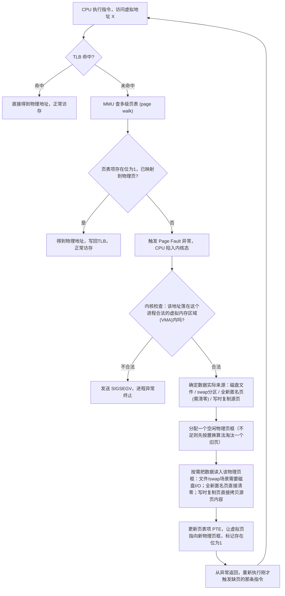

# 操作系统 4 · 虚拟内存与链接

这一讲把"一份源代码怎么变成能跑起来、能安全共存的进程"这条链路的后半段讲透：链接阶段决定了库代码是被完整拷贝进可执行文件、还是在运行时才被加载和绑定；虚拟内存则决定了每个进程看到的地址空间为什么是独立的、连续的、可以比物理内存还大的一整块。C++ 系列已经从"编译流水线"和"符号解析"的角度提过链接，性能优化系列也从"TLB miss 拖慢访存、大页怎么缓解"的角度讲过页表；这一讲不重复那两个角度，而是深入 MMU 到底怎么一步步把虚拟地址翻译成物理地址、缺页异常具体怎么被内核接管处理、物理内存满了之后该淘汰谁这几个更底层的机制问题。这些内容在量化岗位的操作系统面试里几乎是必考项，因为交易系统对延迟、内存布局、进程隔离都有直接的工程诉求。

```text
1. 遇到"静态链接 vs 动态链接"类问题，先明确对比维度：可执行文件体积、启动速度、多进程共享同一份库时的物理内存占用、部署时对目标机器环境的依赖、能否不重新编译主程序就单独升级库。
2. 遇到"为什么需要虚拟内存"类问题，从三个独立的收益分别回答：进程隔离、简化编程模型（每个进程都从地址0开始看自己的地址空间）、支持比物理内存更大的地址空间（配合 swap）。
3. 遇到地址翻译类问题，先画出虚拟地址被拆成"虚拟页号 + 页内偏移"的结构，再讲清楚多级页表是为了避免单级页表在64位地址空间下占用天文数字的内存，TLB 是为了避免每次访存都真的走一遍多级页表查询。
4. 遇到缺页异常类问题，按"陷入内核态 → 检查访问合法性 → 找到数据实际位置 → 分配物理页框 → 按需读入数据 → 更新页表项 → 恢复执行"这个顺序讲，不要跳过"合法性检查"这一步（这是区分正常缺页和 SIGSEGV 段错误的分水岭）。
5. 遇到页面置换算法类问题，先讲清楚问题的触发条件（物理内存已满，需要腾出空间），再依次讲 FIFO（简单但有 Belady 异常）、LRU（符合局部性直觉但精确实现开销大，实践中用 Clock 算法近似）、OPT（理论下界，不可实现），并能现场手推一个 Belady 异常的具体访问序列。
```

---

## 1. 静态链接与动态链接

**核心结论**：链接（linking）发生在编译、汇编之后，把一个或多个目标文件（`.o`）以及程序用到的库文件拼接、整合起来，把所有还没确定地址的符号引用解析成具体地址，生成最终可以运行的可执行文件（或共享库）。链接分静态和动态两种方式，两者的本质区别在于"库代码到底在什么时候、以什么形式进入进程的地址空间"。

### 1.1 静态链接（static linking）

静态链接把程序用到的库代码，从库文件（`.a` 静态库，本质上是一堆 `.o` 文件的归档）里原样拷贝出来，直接合并进最终的可执行文件。链接完成之后，可执行文件本身就是一个自包含的整体：里面既有你自己写的代码，也有你调用到的每一个库函数的完整机器码，磁盘上不再存在"可执行文件"和"库文件"这两个分开的实体。

这带来两个直接后果：

- **文件体积变大**：库代码被物理复制了一份，可执行文件的体积等于自身代码加上所有被链接进来的库代码之和。
- **多进程无法共享库代码**：如果机器上同时运行 10 个都静态链接了同一个数学库的程序，磁盘上有 10 份该库代码的独立拷贝，运行时物理内存里也会有 10 份独立拷贝——因为对操作系统而言，这 10 个进程的代码段来自 10 个完全不同的可执行文件，彼此没有任何关联，没有办法知道它们内部有一段字节完全相同的机器码可以共享。

### 1.2 动态链接（dynamic linking）

动态链接的可执行文件里，不包含库代码本身，只包含一份"需求清单"：用到了哪些共享库（`.so` / `.dll` / `.dylib`）、需要从这些库里解析哪些符号。真正的库代码留在磁盘上独立的共享库文件里，在程序启动时由**动态链接器**（Linux 上是 `ld.so` / `ld-linux.so`）负责找到对应的 `.so` 文件，把它映射进当前进程的虚拟地址空间，并把可执行文件里那些"占位"的符号引用绑定到共享库里符号的真实地址上；有些符号还可以延迟到第一次真正被调用时才解析（lazy binding，通过 PLT/GOT 间接跳转实现）。

动态链接最重要的收益来自代码段是**只读、地址无关（Position Independent Code, PIC）**的这个性质：多个同时运行、都用到同一个共享库的进程，可以各自把自己的虚拟地址空间里的一段区域映射到磁盘上**同一份**共享库文件，操作系统在物理内存里也只需要保留这份代码的**一份**拷贝，多个进程的页表分别指向同一组物理页框即可。这既节省磁盘空间（一份 `.so` 文件被所有用到它的程序共用），也节省物理内存（不管有多少个进程在跑，共享库的代码段在物理内存里通常只占一份）。此外，升级一个共享库时，只需要替换磁盘上的 `.so` 文件，所有依赖它的程序下次启动时会自动加载新版本，不需要重新编译、重新链接主程序。

```text
静态链接后的可执行文件                    动态链接后的可执行文件
┌─────────────────────────┐            ┌─────────────────────────┐
│ 主程序自身代码 + 数据       │            │ 主程序自身代码 + 数据       │
├─────────────────────────┤            ├─────────────────────────┤
│ libfoo.a 中被用到的         │            │ .dynamic 段：              │
│ 目标文件代码 —— 完整拷贝     │            │  DT_NEEDED: libfoo.so      │
├─────────────────────────┤            │  DT_NEEDED: libbar.so      │
│ libbar.a 中被用到的         │            │  未解析符号表               │
│ 目标文件代码 —— 完整拷贝     │            ├─────────────────────────┤
└─────────────────────────┘            │ PLT/GOT 跳转表（占位）      │
        │                              │  运行时由动态链接器填入      │
   自包含、体积大                        │  libfoo.so / libbar.so     │
   磁盘上不再需要 libfoo/libbar         │  里对应符号的真实地址        │
                                       └─────────────────────────┘
                                               │
                                        体积小，但程序启动时
                                        依赖 ld.so 找到并映射
                                        对应版本的共享库文件
```

### 1.3 对比

| 维度 | 静态链接 | 动态链接 |
|---|---|---|
| 可执行文件体积 | 大：库代码被完整复制进最终文件 | 小：只记录用到的库名和符号，代码不在文件里 |
| 启动速度 | 快：不需要在启动时额外定位、加载、绑定共享库 | 稍慢：启动时动态链接器要查找并加载共享库、完成符号绑定；调用共享库函数还有 PLT/GOT 间接跳转的轻微开销 |
| 多进程同时运行时的物理内存占用 | 高：每个进程各自持有一份库代码的独立拷贝，无法共享 | 低：代码段只读且地址无关，物理内存里通常只需保留一份，多个进程的页表映射到同一组物理页 |
| 部署依赖 | 简单：单个文件即可运行，不依赖目标机器预装库 | 复杂：目标机器必须有兼容版本的共享库，否则运行时报"找不到共享库"或符号版本不匹配 |
| 库的热更新 | 不行：库代码已固化进可执行文件，升级库需要重新编译整个程序 | 可以：替换磁盘上的 `.so` 文件即可，依赖它的程序下次启动自动生效，无需重新编译主程序 |

**常见追问 / 面试陷阱**

> 追问"动态链接一定比静态链接省内存吗"：只有当**多个进程同时运行且用到同一个库**时，动态链接的内存共享收益才会体现；如果一台机器上只运行一个用到某个库的进程，动态链接相比静态链接在物理内存占用上没有本质优势，反而因为动态链接器解析符号、维护 PLT/GOT 有额外开销。追问"为什么共享库代码可以被多进程共享，但数据不行"：因为代码段在正常情况下只读，多个进程读到的是完全相同的字节，可以安全地共享同一份物理页；共享库里的可写全局数据（`.data`/`.bss`）在不同进程里的值可能不同（比如各自维护自己的状态），操作系统会为每个进程单独映射一份可写的私有拷贝（通常配合写时复制机制）。

---

## 2. 虚拟内存概念

**核心结论**：如果让程序直接操作物理地址，会同时带来隔离性、编程复杂度、地址空间大小三方面的问题；虚拟内存通过在 CPU 和物理内存之间插入一层地址翻译，让每个进程都以为自己独占了一整块从 0 开始、连续的地址空间，同时把隔离、地址分配、内存扩展这些问题都下放给操作系统和硬件去解决。

**内存隔离**：每个进程拥有独立的虚拟地址空间，进程 A 里的虚拟地址 `0x1000` 和进程 B 里的虚拟地址 `0x1000` 经过各自独立的页表翻译之后，通常指向完全不同的物理页。这意味着进程 A 里出现一个越界写、野指针，最多只能写坏它自己虚拟地址空间对应的那些物理页，没有办法直接触碰到进程 B 或者内核的内存——除非通过系统调用等受控的合法途径。这是多进程系统里最基本的安全边界：没有虚拟内存的话，一个进程的 bug 理论上可以覆写任何其他进程甚至操作系统本身的内存。

**简化编程模型**：每个进程看到的虚拟地址空间都从 0（或者接近 0 的某个固定值）开始，代码段、堆、栈的相对布局在编译链接时就可以确定下来，不需要关心自己实际会被操作系统安排到物理内存的哪个具体位置，也不需要在运行时和其他并发的进程协商"你用哪段地址、我用哪段地址"以避免冲突。这个协调工作被操作系统在内核态统一完成：物理内存的实际分配情况对用户态程序完全透明。

**支持比物理内存更大的地址空间**：虚拟地址空间的大小和物理内存的实际容量是两回事。一个进程可以拥有远大于物理内存容量的虚拟地址空间，配合磁盘上划出的 **swap 空间**，操作系统可以把当前用不到的虚拟页对应的数据换出到磁盘，腾出物理页框给正在使用的其他页，需要用到被换出的数据时再换入。这让"程序能使用的内存总量"在一定程度上突破了"机器实际插了多少条内存条"这个物理限制（虽然一旦频繁换入换出，性能会因为磁盘 I/O 大幅下降，见第 5 节末尾的"抖动"讨论）。

**常见追问 / 面试陷阱**

> 追问"虚拟内存是不是等价于 swap"：不是。虚拟内存是"地址翻译 + 隔离"这个更基础的机制，swap 只是虚拟内存众多能力里的一项——即使一台机器完全没有配置 swap 分区，虚拟内存机制（隔离、独立地址空间、多级页表翻译）依然存在，只是这种情况下物理内存耗尽时没有磁盘可以换出，通常会触发 OOM Killer 直接杀掉某个进程，而不是优雅地换页。

---

## 3. MMU 地址翻译的具体流程

**核心结论**：MMU（Memory Management Unit，内存管理单元）是 CPU 内部专门负责虚拟地址到物理地址翻译的硬件模块。一个虚拟地址被拆成"虚拟页号（VPN）"和"页内偏移量"两部分，页内偏移量原样搬到物理地址里，虚拟页号部分需要查页表才能换算出对应的物理页号；出于内存开销的考虑，实际系统普遍用多级页表而不是单级页表，同时用 TLB 缓存最近的翻译结果来避免每次访存都要走一遍完整的页表查询。

### 3.1 虚拟地址的两段式结构

以 4KB 页大小为例，页内偏移量需要 $\log_2(4096) = 12$ 位来表示页内任意一个字节，因为页内地址是物理连续的，翻译时这 12 位原样照抄到物理地址的低 12 位；虚拟地址剩下的高位部分就是虚拟页号，需要通过页表查出它对应哪个物理页框号（Page Frame Number, PFN），拼上原样搬运的页内偏移量，就得到最终的物理地址。

$$
\text{物理地址} = (\text{PFN} \ll 12) \mathbin{|} \text{页内偏移量}
$$

### 3.2 为什么不用单级页表

如果用最朴素的单级页表——用一个数组，数组下标是虚拟页号，数组内容是对应的物理页框号——那么这个数组本身需要多大？以 x86-64 常见的 48 位有效虚拟地址、4KB 页为例，虚拟页号占 $48-12=36$ 位，理论上需要 $2^{36}$ 个页表项；每个页表项按 8 字节算，一个进程的单级页表就要占用

$$
2^{36} \times 8 \text{ 字节} = 2^{39} \text{ 字节} = 512\text{GiB}
$$

这还只是**一个进程**的页表大小，而且这个数组必须按虚拟地址范围连续排布、预留好每一个可能用到的槽位（哪怕对应的虚拟页从未被实际使用过），显然不现实。

### 3.3 多级页表：按需分配页表本身占用的内存

多级页表把虚拟页号进一步切分成若干段，每一段分别作为不同层级页表的索引，逐级向下查找，只有真正被用到的虚拟地址范围才需要给对应层级的页表实际分配物理页。x86-64 在 48 位虚拟地址、4KB 页的标准配置下采用**四级页表**，把 36 位虚拟页号切成四段各 9 位：

```text
虚拟地址（48位有效位）
 47              39 38              30 29              21 20              12 11        0
┌────────────────┬────────────────┬────────────────┬────────────────┬───────────┐
│  PML4 索引 (9位) │  PDPT 索引 (9位) │   PD 索引 (9位)  │   PT 索引 (9位)  │ 页内偏移(12位)│
└────────────────┴────────────────┴────────────────┴────────────────┴───────────┘
```

四级页表从上到下依次叫 PML4（Page Map Level 4）、PDPT（Page Directory Pointer Table）、PD（Page Directory）、PT（Page Table），每一级都是 $2^9=512$ 个表项、每个表项 8 字节，恰好是 $512\times8=4096$ 字节，也就是**一整页**——这不是巧合，是特意设计成这样，好让每一级的页表本身也能像普通数据页一样被按需分配、按需换入换出。翻译时逐级往下走：

```text
CR3 寄存器（每个进程切换时会重新加载，指向该进程 PML4 表的物理基址）
        │
        ▼
   PML4[ 虚拟地址 bit 47:39 ]  ──指向──▶  某个 PDPT 表的物理基址
        │
        ▼
   PDPT[ 虚拟地址 bit 38:30 ]  ──指向──▶  某个 PD 表的物理基址
        │
        ▼
    PD [ 虚拟地址 bit 29:21 ]  ──指向──▶  某个 PT 表的物理基址
        │
        ▼
    PT [ 虚拟地址 bit 20:12 ]  ──给出──▶  页表项 PTE：物理页框号 PFN + 权限位/存在位等
        │
        ▼
   物理地址 = (PFN << 12) | 页内偏移量（虚拟地址 bit 11:0）
```

只有实际分配、使用过的虚拟地址区间，才会沿路径把对应的 PML4/PDPT/PD/PT 表项填上、把对应的 PT 表页真正分配出来；一大段从未被触碰过的虚拟地址（比如一个巨大但稀疏使用的 `mmap` 区域），中间任何一级只要发现表项是空的，就不需要继续往下分配，大幅节省页表本身占用的物理内存。代价是完整走完四级查找需要 4 次真实的内存访问（每级一次），比单级页表的一次数组下标访问慢得多。

**关于 5 级页表的补充**：随着物理内存容量的增长，48 位虚拟地址能覆盖的 256TB（$2^{48}$ 字节）地址空间在超大内存服务器场景下逐渐紧张，x86-64 后来引入了可选的**五级页表**（Intel 称为 LA57），在 PML4 之上再加一级 PML5，虚拟地址有效位扩展到 57 位（$9\times5+12=57$），地址空间上限扩展到 128PB，需要 CPU 和操作系统都支持并显式开启才会生效，多数常规场景（包括绝大多数量化交易系统）仍然运行在 48 位、四级页表模式下。

### 3.4 TLB：跳过完整页表查询的缓存

四级页表查询要付出 4 次内存访问的代价，如果每次访存都真的走一遍，性能损失极其可观，所以 CPU 在 MMU 里内置了 **TLB（Translation Lookaside Buffer）**，缓存最近翻译过的"虚拟页号 → 物理页框号"映射：命中 TLB 时直接拿到物理地址，跳过整个多级页表查询；未命中时才需要执行完整的多级查询（称为 **page walk**），查到结果后写回 TLB 供后续复用。TLB 命中率、TLB miss 对性能的具体影响、以及用大页缓解 TLB miss 的工程手段，性能优化系列"内存优化"一篇已经从性能视角详细展开过，这里不重复，只强调这两篇讲的是同一个硬件机制的两个侧面：那一篇关心"TLB miss 有多贵、怎么用大页减少 miss 次数"，这一篇关心"没有命中 TLB 时，MMU 具体怎么一步步查出物理地址"。

**常见追问 / 面试陷阱**

> 追问"页表项本身存在哪里，会不会也发生缺页"：页表页本身也是普通的物理内存页，正常情况下常驻内存不会被换出（否则翻译地址时还要先翻译页表本身的地址，会死循环），但某些操作系统在内存极度紧张时也支持把不常用的页表页换出，此时需要更精细的机制处理，属于进阶话题，面试作为了解即可。追问"多级页表逐级查找 vs 单级页表直接下标访问，哪个查询更快"：单级页表如果真能放得下，查询确实更快（一次数组访问），但正如上面算的，单级页表本身占用的内存在 64 位地址空间下不现实，多级页表是**用查询时间换页表自身占用空间**的权衡，实践中又用 TLB 把这个查询时间的损失大幅抵消掉。

---

## 4. 缺页处理过程（Page Fault Handling）

**核心结论**：当 CPU 访问的虚拟地址所对应的页表项显示该页当前不在物理内存里时（存在位 present bit 为 0），会触发一次缺页异常（page fault），CPU 陷入内核态，由操作系统的缺页异常处理程序接管，判断这次访问合法与否，并在合法的情况下把数据实际调入内存、更新页表项，最终让被打断的那条指令重新执行一遍——用户态程序全程感知不到发生过缺页，只是这一次访存明显变慢了。

导致"页不在物理内存里"的原因主要有三类：这个虚拟页从来没有被实际分配过物理页（比如刚 `mmap` 出来但还没写过的匿名内存、或者刚 `fork` 出来配合写时复制标记为不可写的页）；这个虚拟页对应的数据之前被换出到了磁盘的 swap 空间；这个虚拟页映射的是一个文件（比如可执行文件的代码段、`mmap` 映射的文件），但对应的文件内容还没有真正被读入内存（demand paging，只有真正访问到才去读文件，而不是加载时一次性读完整个文件）。



其中"内核检查访问是否合法"这一步是缺页处理和段错误的分水岭：如果访问的虚拟地址根本没有落在该进程任何一段已知的虚拟内存区域（VMA，virtual memory area，内核用来记录一个进程的地址空间里哪些区间是有效映射、映射到什么类型的后备存储）里——典型情况是野指针解引用、数组越界访问到远超数组边界的地址——内核判定这是一次非法访问，直接向进程发送 `SIGSEGV` 信号，默认动作是终止进程（配合前面讲过的 core dump 机制留下现场）。只有访问落在合法 VMA 范围内、只是暂时还没有对应的物理页时，才会走"正常缺页处理"这条分支，最终对用户程序透明地完成数据调入。

**常见追问 / 面试陷阱**

> 追问"缺页一定是坏事吗"：不是，写时复制（Copy-on-Write）机制就是主动利用缺页异常：`fork()` 之后子进程和父进程的页表暂时都指向同一批物理页，并标记为只读；一旦任何一方尝试写入，就会触发一次缺页异常，内核在处理程序里发现这是一次写时复制场景，于是分配一个新的物理页、拷贝原内容、更新触发写入那一方的页表项指向新页，两边从此各自独立。这样 `fork()` 可以避免在创建子进程那一刻就整个拷贝一份父进程的地址空间，把拷贝开销推迟到真正发生写入的时候，很多从不写内存的短生命周期子进程（比如 `fork` 之后立刻 `exec`）甚至完全不会触发这次拷贝。

> 追问"minor fault 和 major fault 有什么区别"：这是缺页异常的两个子类。**Minor fault**（软缺页）指处理过程中不需要真正的磁盘 I/O，比如上面说的写时复制、或者所需的物理页其实已经在内存里（比如被另一个共享同一文件映射的进程读入过），只是当前进程的页表还没有指向它，只需要更新页表项即可；**major fault**（硬缺页）指必须真正发起一次磁盘 I/O 才能拿到数据，比如从 swap 分区换入、或者从磁盘文件里读取还未缓存的内容，代价比 minor fault 高几个数量级。`ps`/`time` 等工具报告的进程缺页统计里通常会分开列出这两类数字，major fault 数量异常高往往是内存不足、频繁换页的信号。

---

## 5. 缺页置换算法

**核心结论**：当物理内存已经用满、又需要为新调入的页腾出空间时，操作系统必须选择淘汰一个已经在内存里的旧页，换出到磁盘——这就是页面置换算法要解决的问题。不同算法的核心分歧在于"淘汰哪一页"的判断依据：FIFO 按加载先后顺序，LRU 按最近访问时间，OPT 按未来是否还会被用到。

### 5.1 FIFO（先进先出）

FIFO 淘汰最早被加载进内存的那个页，用一个队列记录页的加载顺序即可实现，逻辑和实现都很简单，但完全不考虑这个页最近是否还在被频繁访问——一个很早就调入、但此后一直被反复使用的页，仅仅因为"资历最老"就可能被淘汰，淘汰之后很快又要因为访问它而重新缺页调入。

FIFO 还有一个反直觉的性质，称为 **Belady 异常（Belady's Anomaly）**：直觉上物理页框数量越多，可用于缓存的页越多，缺页次数应该越少或至少不变，但 FIFO 算法在某些访问序列下，增加页框数量反而会导致缺页次数**增多**。用经典访问序列 `1 2 3 4 1 2 5 1 2 3 4 5` 在 3 个页框和 4 个页框下分别跑一遍 FIFO：

| 步骤 | 访问页 | 3 帧内容（按加载顺序，最左最先被淘汰） | 3帧缺页? | 4 帧内容 | 4帧缺页? |
|---|---|---|---|---|---|
| 1 | 1 | 1 | 缺页 | 1 | 缺页 |
| 2 | 2 | 1,2 | 缺页 | 1,2 | 缺页 |
| 3 | 3 | 1,2,3 | 缺页 | 1,2,3 | 缺页 |
| 4 | 4 | 2,3,4（淘汰1） | 缺页 | 1,2,3,4 | 缺页 |
| 5 | 1 | 3,4,1（淘汰2） | 缺页 | 1,2,3,4 | 命中 |
| 6 | 2 | 4,1,2（淘汰3） | 缺页 | 1,2,3,4 | 命中 |
| 7 | 5 | 1,2,5（淘汰4） | 缺页 | 2,3,4,5（淘汰1） | 缺页 |
| 8 | 1 | 1,2,5 | 命中 | 3,4,5,1（淘汰2） | 缺页 |
| 9 | 2 | 1,2,5 | 命中 | 4,5,1,2（淘汰3） | 缺页 |
| 10 | 3 | 2,5,3（淘汰1） | 缺页 | 5,1,2,3（淘汰4） | 缺页 |
| 11 | 4 | 5,3,4（淘汰2） | 缺页 | 1,2,3,4（淘汰5） | 缺页 |
| 12 | 5 | 5,3,4 | 命中 | 2,3,4,5（淘汰1） | 缺页 |

统计缺页次数：**3 个页框缺页 9 次，4 个页框缺页 10 次**——页框数量增加了，缺页次数反而变多了，这就是 Belady 异常。它本质上是因为 FIFO 不是"栈算法"（stack algorithm）：$k$ 个页框时内存中驻留的页集合，不能保证一定是 $k+1$ 个页框时驻留页集合的子集，导致增加页框数量之后，原本命中的一些页可能被更晚淘汰的顺序打乱，反而错过命中。

### 5.2 LRU（最近最久未使用）

LRU（Least Recently Used）淘汰最长时间没有被访问过的页，依据的是局部性原理的直觉：最近被访问过的数据，接下来大概率还会被再次访问；反过来，很久没被碰过的数据，短期内被再次访问的概率也较低。LRU 属于栈算法，不会出现 Belady 异常，且实际效果通常明显好于 FIFO。

代价是**精确实现 LRU 需要额外开销去追踪每一个页的访问时间顺序**：每次访存都要更新对应页的"最近访问时间"或者把它挪到某个有序结构的头部，如果用软件维护一个精确排序的链表，每次访问都要做链表调整，开销会随内存访问频率线性增长，在真实硬件上不现实。因此实践中普遍使用近似 LRU：**时钟算法（Clock Algorithm）**是最常用的一种，把所有物理页框在逻辑上排成一个环，每个页表项配一个硬件维护的"访问位"（accessed bit，被访问时由 MMU 自动置 1），有一个指针沿环扫描：遇到访问位为 1 的页，把访问位清零并跳过（给它一次"免死"的机会）；遇到访问位为 0 的页，直接淘汰。这样经常被访问的页的访问位会被反复置 1，很难被指针在一轮扫描内淘汰掉，效果上近似于"淘汰最近确实没被用过的页"，但只需要一个额外的访问位和一个环形指针，开销远小于精确维护访问时间顺序。

### 5.3 OPT（最佳置换，理论下界）

OPT（Optimal Page Replacement，也被称为 Bélády's Algorithm，与上面的 Belady 异常出自同一位学者 László Bélády，两者不要混淆）淘汰**接下来最长时间不会被访问到**的页。可以证明这是在给定访问序列下缺页次数最少的置换策略，也是一个栈算法（不会出现 Belady 异常），但它要求提前知道未来完整的访问序列才能做出淘汰决策，现实系统里未来的访存请求是不可预知的，OPT 无法真正实现，只能作为一个**理论下界基准**：用来衡量 FIFO、LRU 或其他近似算法在同一个访问序列下的缺页次数，距离这个理论最优还差多少。

### 5.4 三种算法对比

| 算法 | 淘汰依据 | 实现开销 | 是否可实现 | 是否会出现 Belady 异常 |
|---|---|---|---|---|
| FIFO | 加载时间最早 | 极低（一个队列） | 可实现 | 会 |
| LRU（精确） | 最近访问时间最早 | 高（需精确维护访问顺序），实践中常用 Clock 算法近似 | 可实现（近似版本） | 不会（栈算法） |
| OPT | 未来最长时间不被访问 | 需要预知未来访问序列 | 不可实现 | 不会（栈算法） |

**常见追问 / 面试陷阱**

> 追问"为什么栈算法不会出现 Belady 异常"：栈算法的定义是——对任意访问序列，$k$ 个页框时内存里驻留的页集合，始终是 $k+1$ 个页框时驻留页集合的子集。这意味着增加页框数量时，原来能命中的访问在页框更多的情况下必然还能命中，缺页次数只会不增不减地变少或持平，不可能变多。FIFO 不满足这个子集性质（如上面的例子），因此才会出现异常；LRU 和 OPT 都满足，因此不会。

> 追问"物理内存不断缺页、置换算法怎么选都没用怎么办"：如果一个系统里同时运行的进程总的工作集（working set，最近一段时间内被频繁访问的页的集合）大小已经超过物理内存总容量，无论用什么置换算法，都会陷入"刚换入的页很快又被换出、换出的页很快又要换入"的恶性循环，磁盘 I/O 占满大量时间、CPU 利用率反而很低，这种现象叫**抖动（thrashing）**。这时候问题的根源不是置换算法选得不好，而是物理内存总量相对于当前负载的工作集已经不够，解决办法是增加物理内存、减少并发进程数、或者让单个进程的工作集变小，而不是继续在置换算法层面挖潜力。

---

## 快速选择题

```quiz
title: 快速选择题 1
question: 关于静态链接和动态链接，下列说法错误的是：
answer: D
A. 静态链接把用到的库代码完整拷贝进最终可执行文件
B. 动态链接的可执行文件里只记录用到了哪些共享库和符号，不包含库的实际代码
C. 多个进程同时运行且用到同一个共享库时，动态链接下物理内存里通常只需保留一份库代码
D. 静态链接的可执行文件运行时仍然需要依赖目标机器上预装对应版本的库文件
explanation: 静态链接的核心优势正是运行时不依赖外部库文件，库代码已经完整嵌入可执行文件本身；需要目标机器预装兼容库版本的是动态链接。A、B、C 都是正确描述。
```

```quiz
title: 快速选择题 2
question: 关于虚拟内存存在的意义，下列说法错误的是：
answer: C
A. 虚拟内存让每个进程拥有独立地址空间，一个进程的越界访问不会直接破坏其他进程的内存
B. 虚拟内存简化了编程模型，程序不需要关心自己被实际放在物理内存的哪个位置
C. 虚拟内存机制的唯一作用是配合 swap 让程序能使用超过物理内存容量的地址空间
D. 即使一台机器没有配置任何 swap 空间，虚拟内存的隔离和地址翻译机制依然存在并生效
explanation: 虚拟内存有三方面独立的收益：隔离、简化编程模型、支持比物理内存更大的地址空间，"支持更大地址空间"只是其中一项，并非唯一作用；A、B、D 都是正确描述。
```

```quiz
title: 快速选择题 3
question: 一个虚拟地址被 MMU 拆分成"虚拟页号"和"页内偏移量"两部分，下列说法正确的是：
answer: B
A. 页内偏移量部分也需要查页表才能确定
B. 页内偏移量原样搬到物理地址的对应低位，不需要查页表
C. 虚拟页号部分不需要查页表，直接等于物理页框号
D. 页大小越大，页内偏移量占用的位数越少
explanation: 页内地址是物理连续的，页内偏移量原样搬运；虚拟页号才是需要通过页表转换为物理页框号的部分，页越大，页内偏移需要的位数越多（不是越少）。
```

```quiz
title: 快速选择题 4
question: 关于 x86-64 常见的 48 位有效虚拟地址、4KB 页大小的四级页表结构，下列说法正确的是：
answer: A
A. 四级页表依次是 PML4、PDPT、PD、PT，各占 9 位索引，加上 12 位页内偏移共 48 位
B. 四级页表是为了让地址翻译比单级页表更快
C. 每一级页表的大小可以任意，不需要恰好等于一页
D. 使用四级页表之后，一次地址翻译只需要 1 次内存访问
explanation: $9\times4+12=48$，与 x86-64 的 48 位有效虚拟地址吻合；多级页表是为了节省页表本身占用的内存（用查询时间换空间），并不比单级页表查得快；每级页表被设计成恰好 4KB（512 个 8 字节表项）以便按页管理；完整走完四级查找最坏需要 4 次内存访问，不是 1 次，B、C、D 都不成立。
```

```quiz
title: 快速选择题 5
question: 关于单级页表在 64 位地址空间下不现实的原因，下列说法正确的是：
answer: B
A. 单级页表在硬件上根本无法实现地址翻译
B. 以 48 位有效地址、4KB 页、8 字节表项计算，单级页表大小约为 512GiB，且必须为整个地址范围预留空间
C. 单级页表的问题只是查询速度慢，和内存占用无关
D. 只要地址空间小于 4GB，单级页表在任何情况下都不会有内存占用问题
explanation: $2^{36}$ 个页表项 $\times 8$ 字节 $=2^{39}$ 字节 $=512$GiB，而且这是一个必须整体预留、连续排布的数组，不管实际用到多少虚拟页，正是这个巨大且难以按需分配的内存占用，让单级页表在大地址空间下不可行；A、C、D 均不准确。
```

```quiz
title: 快速选择题 6
question: 关于 TLB（Translation Lookaside Buffer），下列说法错误的是：
answer: D
A. TLB 缓存的是最近翻译过的虚拟页号到物理页框号的映射
B. TLB 命中时可以跳过完整的多级页表查询，直接得到物理地址
C. TLB 未命中时需要执行一次 page walk，重新走一遍多级页表查询
D. TLB 的存在使得多级页表结构在任何情况下都不再需要，可以完全省略
explanation: TLB 只是缓存了近期常用的翻译结果，未命中时仍然要靠完整的多级页表结构走一遍 page walk 求出正确映射，页表本身不能被 TLB 替代或省略；A、B、C 都是正确描述。
```

```quiz
title: 快速选择题 7
question: 关于缺页异常（page fault）的处理流程，下列说法正确的是：
answer: B
A. 只要页表项显示对应页不在内存里，就一定会向进程发送 SIGSEGV
B. 内核会先检查该访问是否落在进程合法的虚拟内存区域（VMA）内，不合法才会发送 SIGSEGV
C. 缺页处理全部由硬件 MMU 自动完成，不需要陷入内核态
D. 缺页异常处理完成之后，程序会从触发异常的下一条指令继续执行，跳过原来那条指令
explanation: 页表项显示不在内存里，只是"可能"是缺页也"可能"是非法访问，内核必须先检查访问地址是否落在合法 VMA 范围内，合法则走正常缺页调入流程，不合法才发送 SIGSEGV；缺页处理需要 CPU 陷入内核态由软件（内核）处理而非纯硬件完成；处理完成后会重新执行触发异常的那条指令（此时页表项已更新，可以正常访存），而不是跳过它，A、C、D 均不准确。
```

```quiz
title: 快速选择题 8
question: 关于 minor fault（软缺页）和 major fault（硬缺页），下列说法正确的是：
answer: B
A. 两者没有区别，都需要发起磁盘 I/O
B. minor fault 通常不需要真正的磁盘 I/O，比如写时复制或页已在内存中只是当前进程页表未指向它；major fault 需要真正从磁盘读取数据
C. major fault 的开销通常比 minor fault 小
D. 只有匿名页才会触发 minor fault，文件映射页只会触发 major fault
explanation: 这正是二者的核心区别，minor fault 只需更新页表等元数据，major fault 涉及磁盘 I/O，开销高出数量级；A、C、D 均不准确。
```

```quiz
title: 快速选择题 9
question: 关于写时复制（Copy-on-Write）机制，下列说法正确的是：
answer: B
A. fork() 之后父子进程立即各自拥有一份完全独立的物理内存拷贝
B. 父子进程的页表最初都指向同一批物理页并标记为只读，任何一方尝试写入时触发缺页异常，内核才真正分配新物理页并拷贝内容
C. 写时复制机制和缺页异常机制没有关系
D. 写时复制只能用于 fork()，不能用于其他任何场景
explanation: 写时复制正是利用缺页异常，把物理内存拷贝的开销推迟到真正发生写入的那一刻，是缺页机制的一个典型应用；A、C、D 均不准确。
```

```quiz
title: 快速选择题 10
question: 用访问序列 `1 2 3 4 1 2 5 1 2 3 4 5` 分别在 3 个和 4 个物理页框下运行 FIFO 置换算法，下列说法正确的是：
answer: B
A. 3 个页框时缺页次数一定不少于 4 个页框时的缺页次数
B. 3 个页框缺页 9 次，4 个页框缺页 10 次，页框增加反而缺页更多，这正是 Belady 异常
C. FIFO 是栈算法，不可能出现页框增加缺页反而增多的情况
D. 这个现象在 LRU 算法下同样会出现
explanation: 逐步模拟可得 3 帧缺页 9 次、4 帧缺页 10 次，是 Belady 异常的经典例子；FIFO 恰恰不是栈算法，才会出现这种反直觉现象（A、C 错），LRU 是栈算法，不会出现该异常（D 错）。
```

```quiz
title: 快速选择题 11
question: 关于 LRU 和它的近似实现 Clock 算法，下列说法正确的是：
answer: A
A. 精确 LRU 需要额外维护每个页的访问时间顺序，开销较大，因此实践中常用 Clock 算法等近似方案
B. Clock 算法完全不需要任何硬件支持
C. Clock 算法的访问位一旦被置 1 就永远不会被清零
D. LRU 会出现 Belady 异常，因此实践中很少使用
explanation: 这正是 LRU 精确实现开销大、近似实现（如 Clock 算法）被广泛采用的原因；Clock 算法依赖硬件自动维护的访问位（accessed bit），并非无需硬件支持；扫描指针经过访问位为 1 的页时会将其清零并跳过，不是永久不清零；LRU 是栈算法，不会出现 Belady 异常，B、C、D 均不准确。
```

```quiz
title: 快速选择题 12
question: 关于 OPT（最佳置换算法）的说法，下列错误的是：
answer: C
A. OPT 淘汰接下来最长时间不会被访问到的页
B. OPT 在给定访问序列下能达到理论最少的缺页次数
C. OPT 可以在真实操作系统里直接实现并投入生产使用，因为它总能算出未来的访问序列
D. OPT 也被称为 Bélády's Algorithm，用于衡量其他置换算法与理论最优的差距
explanation: OPT 需要预先知道未来完整的访问序列才能做出决策，现实系统里未来的访存请求不可预知，因此 OPT 无法真正实现，只能作为理论下界用于评估其他算法；A、B、D 都是正确描述。
```
