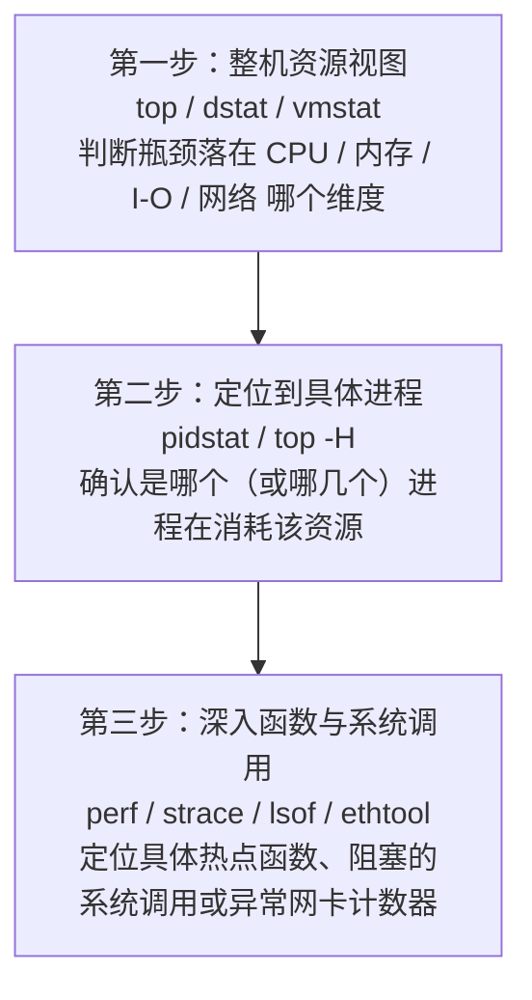
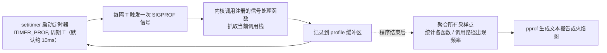

# 性能优化 1 · 性能分析方法论与工具链

这一讲是量化开发岗性能优化系列的第一篇，讲的不是某个具体的优化技巧，而是"怎么找到该优化什么"这件事本身。内容分两条线：一条是硬件根源，讲清楚几乎所有性能优化技巧最终都在缓解同一个矛盾——CPU 算得快、内存喂得慢；另一条是方法论和工具链，从"整体看资源维度"到"用采样/插桩/动态追踪定位具体函数"，把 gperftools、perf、LLVM XRay、eBPF 这几类工具放进同一个坐标系里比较，讲清楚它们分别回答什么问题、代价是什么。面试里问"你怎么做性能优化"，考察的往往正是这套排查顺序和工具选择的判断力，而不是背出某个工具的全部参数。

```text
1. 拿到一个"慢"的问题，先别急着挑工具，先分清是延迟问题还是吞吐问题，是稳定慢还是偶发慢（长尾）。
2. 自顶向下走：先用 top/dstat/vmstat 看整机资源维度（CPU/内存/IO/网络哪个先打满），再用 pidstat 定位到具体进程，最后再用 perf/strace 深入到函数或系统调用级别。跳过前两步直接上 perf 容易在错误的资源维度里找热点。
3. 判断瓶颈类型时区分 USE（资源本身：利用率/饱和度/错误数，适合查硬件和 OS 资源）和 RED（服务请求：速率/错误率/时延分布，适合查接口和微服务质量），两者互补。
4. 选工具看场景：只关心用户态 CPU 热点、想要低门槛 → gperftools；要看内核态调用栈或硬件计数器（cache miss、分支预测失败）→ perf；要精确统计每次调用耗时、能接受插桩开销 → LLVM XRay 之类的插桩工具；要在生产环境不停机、不重新编译地临时追踪任意内核/用户态事件 → eBPF。
5. 拿到调用栈数据后优先看火焰图：找"宽而平"的方块，那是自身占用采样比例高的函数，比找"深而窄"的调用链更容易定位真正的热点。
```

---

## 1. 冯·诺依曼体系结构视角下的性能瓶颈根源：内存墙

**核心结论**：现代计算机绝大多数底层性能优化技巧——缓存友好的数据布局、预取、批处理、减少随机访问、避免 false sharing——本质上都是在缓解同一个矛盾：CPU 的运算能力增长速度远超内存访问延迟的下降速度，这个差距被称为"内存墙"（memory wall），是 Wulf 和 McKee 在 1995 年的论文里正式提出的术语。

冯·诺依曼体系结构把计算单元和存储单元分离，数据必须先从存储搬运到寄存器才能参与运算。这个结构在 CPU 和内存速度接近的年代问题不大，但过去几十年里两者的发展速度严重不对称：CPU 主频和微架构层面的运算能力（流水线、乱序执行、多发射、多核）历史上一度以接近每年 50%-60% 的速度提升，而 DRAM 的访问延迟每年只下降个位数百分比，容量和带宽的提升速度也远快于延迟的下降速度。几十年累积下来，CPU 一次运算的耗时和一次内存访问的耗时之间已经拉开了两到三个数量级的差距——CPU 在等一次内存访问返回结果的时间里，可能已经能完成几百次算术运算。

这个差距用具体数字看会更直观。下表是常见存储层级的典型访问延迟（不同硬件世代和具体型号会有差异，重点是数量级关系，不是精确数值）：

| 层级 | 典型延迟 | 相对上一层的量级跳跃 |
|---|---|---|
| L1 Cache | ~1 ns | 基准 |
| L2 Cache | ~4 ns | 约 4 倍 |
| L3 Cache | ~15-30 ns | 约 4-8 倍 |
| 主存 (DRAM) | ~100 ns | 约 3-7 倍 |
| SSD 随机读 | ~100 μs（100,000 ns） | 约 1000 倍 |
| 机械磁盘寻道 | ~10 ms（10,000,000 ns） | 约 100 倍 |
| 同机房网络往返 | ~0.5 ms 量级 | - |
| 跨地域网络往返 | ~几十到上百 ms | - |

从 L1 到主存，延迟已经跨了两个数量级；从主存到 SSD，再跨三个数量级；到磁盘寻道和跨地域网络，又各自再跳一到两个数量级。每往下走一层存储介质，延迟基本都是跨数量级地增长，而不是线性增长。这就是为什么"减少一次内存访问"或者"把随机访问变成顺序访问"能带来的收益，往往比"把某段算术运算优化得更快"大得多——算术运算发生在 CPU 内部，耗时已经被内存墙压缩到很小的比例，真正的瓶颈常常在等数据。

理解了这一点，几乎所有底层优化手法都能归到同一个动机下：

- **缓存友好的数据布局**（如 struct of arrays 代替 array of structs、按访问顺序排列字段）：让数据尽量命中 L1/L2，避免每次都要穿透到主存。
- **预取**（prefetch，硬件自动预取或软件显式 `__builtin_prefetch`）：在真正需要数据之前提前发起内存请求，把内存访问延迟隐藏在其他计算或之前的内存请求延迟之后。
- **批处理**（batching）：把多次分散的小访问合并成一次连续访问，摊薄每次访问的固定开销，同时提高顺序访问命中缓存行的概率。
- **减少随机访问**：随机访问几乎必然导致缓存未命中，退化到几十到上百纳秒的主存延迟；顺序访问可以利用缓存行预取和硬件预取器，实际有效延迟远低于标称的主存延迟。
- **避免 false sharing**：多个 CPU 核心的私有缓存靠缓存一致性协议同步，如果两个逻辑上无关的变量恰好落在同一条缓存行里，被不同核心频繁写入，会导致缓存行在核心间来回失效搬运，人为制造出大量不必要的"内存级"延迟。

**常见追问 / 面试陷阱**

> 追问"为什么不能靠提高内存频率解决内存墙"：内存带宽（单位时间能传输的数据量）和内存延迟（发起一次访问到数据返回的时间）是两个不同的指标，提高频率、增加通道数主要提升的是带宽，对延迟的改善有限，因为延迟很大一部分来自 DRAM 颗粒本身的物理限制（行预充电、行激活、列选通等时序）和总线仲裁开销，不会随频率线性下降。这也是为什么缓存层级会越做越多级——用容量换延迟，而不是指望把主存本身做得和缓存一样快。

---

## 2. 系统化排查方法论：自顶向下 + USE/RED

**核心结论**：遇到"系统慢"这类问题，排查顺序应该是先看整体、再定位进程、再深入细节，而不是一上来就用 `perf` 或 `strace` 扎进某个可疑函数。先用整机资源视图（`top`、`dstat`、`vmstat`）判断瓶颈落在 CPU、内存、I/O、网络这四个维度里的哪一个（或哪几个），再用 `pidstat` 把范围收窄到具体进程，最后才用 `perf`、`strace`、`lsof` 这类工具深入到函数调用或系统调用层级。跳过前两步容易在错误的资源维度里反复排查。



排查漏斗每往下一层，视野变窄、信息变细。跳过第一层直接对某个进程跑 `perf record`，可能会发现"函数 A 占了 90% 的采样"，但如果整机层面其实是内存带宽或 swap 在拖后腿，函数 A 本身的代码逻辑再怎么优化也解决不了根因；跳过第二层直接在整机层面调优（比如盲目加内存、调内核参数），又容易忽略某个失控进程才是真正的元凶。

### USE 方法：从资源视角出发

USE 方法评估每个资源（CPU、内存、磁盘、网络）在三个维度上的状态：

- **Utilization（利用率）**：该资源正忙于工作的时间占比，或者被占用的容量比例。
- **Saturation（饱和度）**：该资源排队等待处理的工作量，利用率打满之后还有多少额外需求排不上队。
- **Errors（错误数）**：该资源发生错误事件的次数（硬件报错、丢包、校验失败等）。

```text
┌───────────┬─────────────┬──────────────┬───────────────┐
│  资源      │ Utilization │  Saturation  │    Errors     │
├───────────┼─────────────┼──────────────┼───────────────┤
│  CPU      │  使用率 %    │ 运行队列长度  │  硬件故障计数  │
│  内存     │  已用/总量   │ 换页/swap 活动│  OOM、ECC 错误 │
│  磁盘 I/O │  忙碌时间 %  │ I/O 队列深度  │  读写错误      │
│  网络     │  带宽占用 %  │ 发送/接收队列 │  丢包、CRC 错误│
└───────────┴─────────────┴──────────────┴───────────────┘
```

USE 方法的价值在于系统性：按这张表逐格检查，不容易漏掉某个资源维度。比如只看 CPU 利用率不高就排除 CPU 瓶颈，是常见的误判——利用率不高但运行队列很长（高饱和度）同样说明 CPU 是瓶颈，只是任务被拆分成大量短时间片段，平均利用率被稀释了。

### RED 方法：从请求视角出发

RED 方法关注的粒度不是硬件资源，而是一次服务调用或一个接口：

- **Rate（速率）**：单位时间处理的请求数。
- **Errors（错误数）**：失败请求的数量或比例。
- **Duration（时长）**：请求的响应时间分布，通常看 p50/p95/p99 而不只是均值。

### 两者的关系

| 维度 | USE 方法 | RED 方法 |
|---|---|---|
| 观测对象 | 硬件/OS 资源（CPU、内存、磁盘、网络） | 服务/接口的请求 |
| 回答的问题 | "哪个资源被打满了、打满到什么程度" | "服务质量好不好，哪类请求慢、哪类请求错" |
| 典型工具 | top、dstat、vmstat、pidstat、iostat | 应用埋点、APM、请求日志聚合 |
| 局限 | 资源层面看不到"是哪个业务请求"造成的 | 看不到底层是 CPU 打满还是磁盘 I/O 饱和 |

两者不是互斥关系而是互补关系：RED 告诉你"用户感知到的响应变慢了、错误率上升了"，USE 告诉你"是哪个资源在拖后腿"。一次典型的排查路径是先在 RED 层面确认问题存在且量化影响范围（哪个接口、多严重），再切到 USE 层面定位是 CPU、内存、磁盘还是网络饱和，最后再用第 3-6 节的工具深入到具体函数或调用。

**常见追问 / 面试陷阱**

> 追问"USE 和 RED 选一个够不够":两者服务于不同层级的问题，微服务架构下经常同时使用——RED 挂在监控告警链路上做面向用户的 SLA 监控，USE 挂在容量规划和底层故障诊断链路上。只强调其中一个会造成盲区：只看 RED 发现不了"资源已经饱和但还没影响到当前流量"的隐患；只看 USE 发现不了"某个接口本身逻辑有 bug 导致大量错误但资源利用率完全正常"的问题。

---

## 3. 采样式 CPU Profiler 的原理：以 gperftools 为例

**核心结论**：采样式 profiler 不是精确测量每次函数调用的耗时，而是靠"定时打断程序、记录当时的调用栈、事后统计频率"这套机制做统计推断。gperftools（Google Performance Tools）的 CPU profiler 是这类工具的典型代表，机制建立在 POSIX 的间隔定时器和信号上。

### 采样机制

gperftools 通过 `setitimer()` 启动一个间隔定时器（默认使用 `ITIMER_PROF`，对应的信号是 `SIGPROF`；如果设置了 `CPUPROFILE_REALTIME` 环境变量则改用 `ITIMER_REAL` 对应 `SIGALRM`）。定时器每隔固定周期（默认对应 100 Hz 的采样频率，即约每 10 ms 一次，可以用 `CPUPROFILE_FREQUENCY` 环境变量调整）向进程发送一次信号。信号处理函数被内核调用时，会抓取此刻的调用栈（栈展开，stack unwinding），把整条调用链记录到 profile 缓冲区里。程序运行结束（或调用 `ProfilerStop()`）后，工具统计每个函数（以及每条调用路径）出现在采样点里的次数，出现频率高的函数就被认为是热点。



### 统计推断而非精确测量

采样频率和运行时长共同决定统计置信度。设某函数占用真实 CPU 时间的比例为 $p$，总采样次数为 $N=f\cdot T$（$f$ 为采样频率，$T$ 为运行时长），落在该函数上的采样次数近似服从二项分布，估计量 $\hat p = n_i/N$ 的标准误差近似为：

$$
\text{SE}(\hat p)\approx\sqrt{\frac{p(1-p)}{N}}
$$

$N$ 越大（采样频率越高或运行时间越长），标准误差按 $1/\sqrt N$ 的速度下降。这意味着两个后果：一是运行时间太短或采样频率太低时，热点排名可能因为采样噪声而不稳定；二是执行次数很少但单次耗时很长的代码路径（比如极少触发的慢路径）可能因为总占用的 CPU 时间比例本来就小，命中采样点的概率也低，容易被漏采或低估。

采样本身也有开销，但可以通过频率控制在可接受范围。设每次采样（信号处理 + 栈展开）耗时 $c$，采样频率为 $f$，则采样引入的额外 CPU 占用比例近似为：

$$
\text{overhead}\approx f\cdot c
$$

例如 $f=100\,\text{Hz}$，$c=10\,\mu s$，则 $\text{overhead}\approx 100\times10\times10^{-6}=0.1\%$，这也是采样式 profiler 相比插桩式 profiler 能做到低开销、可以长期挂在生产环境的原因——开销只和采样频率有关，与函数被调用的实际次数无关。

多线程程序下，`ITIMER_PROF` 是进程级定时器，`SIGPROF` 具体投递给哪个线程没有规范保证，容易导致某些线程被系统性漏采；gperftools 提供 `CPUPROFILE_PER_THREAD_TIMERS` 环境变量，为每个线程单独建一个定时器来缓解这个问题。

### 使用方式

```bash
# 编译时链接 libprofiler
g++ -O2 my_app.cpp -o my_app -lprofiler

# 运行时通过环境变量指定输出文件，触发采样
CPUPROFILE=/tmp/my_app.prof ./my_app

# 用 pprof 生成文本报告（按自身耗时排序热点函数）
pprof --text ./my_app /tmp/my_app.prof

# 生成火焰图（依赖 graphviz 或转换为 folded stack 格式后用 FlameGraph 工具渲染）
pprof --svg ./my_app /tmp/my_app.prof > profile.svg
```

也可以在代码中显式调用 `ProfilerStart("/tmp/my_app.prof")` / `ProfilerStop()`，只对关心的代码区间采样，避免程序启动、初始化阶段的噪声混进结果。

gperftools 除了 CPU profiler，还提供 heap profiler（`libtcmalloc` 配合 `HEAPPROFILE` 环境变量），原理不是定时采样而是在分配器的分配/释放路径上做统计埋点，用来追踪内存分配的调用来源、检测内存泄漏和内存增长趋势，和 CPU profiler 解决的是不同问题（内存分配位置 vs CPU 时间去向），但报告和可视化方式（`pprof`）是共用的。

**常见追问 / 面试陷阱**

> 追问"采样式 profiler 会不会漏掉热点":会。如果热点函数的单次执行时间远小于采样周期，且总调用次数不够多，命中采样点的概率会偏低，导致该函数在报告里被低估甚至完全看不到。提高采样频率能缓解但不能根除这个问题（频率过高又会推高开销、甚至受限于内核定时器精度），这正是采样式方法和插桩式方法的核心权衡，第 5 节会展开对比。

---

## 4. perf 工具

**核心结论**：`perf` 基于 Linux 内核的 `perf_events` 子系统（由 Ingo Molnár 和 Peter Zijlstra 开发，Linux 2.6.31 引入），相比 gperftools 这类纯用户态工具，它的关键优势有两个：一是既能采样硬件性能计数器（PMU / Performance Monitoring Unit 提供的 cache miss、分支预测失败等指标），也能采样软件事件（页缺失、上下文切换等内核维护的计数器），二是能同时看到用户态和内核态的调用栈，而 gperftools 这类基于用户态信号的工具天然看不到内核态发生了什么。

`perf_events` 支持的事件大致分三类：硬件事件（CPU 周期数、指令数、cache miss、分支预测失败等，由 CPU 的 PMU 硬件计数器提供，计数器溢出时触发中断，内核借此实现基于硬件事件的采样）、软件事件（页缺失、上下文切换、CPU 迁移等，由内核内部计数器维护，不依赖 CPU 硬件）、以及静态追踪点事件（tracepoint，内核源码里预先埋好的稳定探测点）。用户态程序通过 `perf_event_open()` 系统调用向内核请求配置某个事件用于计数或采样。

### 基本用法

```bash
# perf stat：跑一遍程序，输出整体统计指标
perf stat ./my_app
# 典型输出包含：
#   task-clock, context-switches, cpu-migrations, page-faults
#   cycles, instructions（以及由此算出的 IPC，每周期指令数）
#   branches, branch-misses
#   cache-references, cache-misses

# perf record：对运行中的程序做采样，生成调用栈报告
perf record -F 99 -p <pid> -- sleep 30
perf report

# perf record -g：额外记录调用图（call graph），用于生成火焰图
perf record -g -F 99 -- ./my_app
perf script | ./stackcollapse-perf.pl | ./flamegraph.pl > out.svg
```

`perf stat` 里的 IPC（instructions per cycle，指令数除以周期数）是一个常用的整体健康度指标：IPC 偏低通常说明 CPU 大量时间花在等待（内存访问延迟、分支预测失败恢复），而不是真正在做有效计算，这和第 1 节的内存墙问题直接相关；`cache-misses` 占 `cache-references` 的比例高，同样指向数据局部性差的问题。

`perf record -g` 采样调用图和 gperftools 的原理相似（也是定时中断记录调用栈），区别在于事件源可以是硬件 PMU 事件而不仅是固定周期的定时器——例如可以配置成"每发生 N 次 cache miss 就采样一次调用栈"，直接把热点和特定硬件事件绑定，而不只是和挂钟时间绑定，这在定位 cache 不友好的代码路径时比纯 CPU 时间采样更精确。

**常见追问 / 面试陷阱**

> 追问"perf 和 gperftools 该怎么选":如果只关心用户态代码的 CPU 时间热点，且想要最低的接入成本（不需要 root 权限、不需要操心内核版本），gperftools 足够；如果需要看内核态调用栈（比如怀疑系统调用、内核中断处理占了大头）、需要硬件计数器（cache miss、分支预测失败）辅助定位，或者程序本身没有链接 `libprofiler` 也想临时分析，perf 是更通用的选择，代价是通常需要更高权限（`perf_event_paranoid` 内核参数会限制非特权用户能采集的事件类型）。

---

## 5. 插桩 vs 采样：以 LLVM XRay 为例

**核心结论**：插桩（instrumentation）在编译期或运行时往函数入口/出口插入探针代码，能精确记录每次调用的耗时和次数，但探针本身有开销，如果开销大到足以改变程序原本的执行特征（比如让原本能被内联、能保持在寄存器里的热路径变慢），测出来的结果就不再代表程序真实的性能画像，这种现象叫 profiling overhead 或 probe effect。采样式方法（第 3、4 节）开销低，但存在统计噪声，且可能漏掉执行次数很少但单次很慢的路径。

LLVM XRay 是插桩式工具的一个代表：编译时用 `-fxray-instrument` 在每个函数入口/出口插入极短的 no-op 占位指令（几个字节），这些占位指令在程序默认运行时几乎不产生开销；需要分析时才通过运行时补丁（patching）把占位指令替换成真正跳转到记录逻辑的指令，记录每次进入/退出的时间戳、生成精确的调用耗时数据，分析结束后再把指令还原成占位状态。这种"始终编译进生产二进制、默认关闭、按需动态开启"的设计，是插桩式工具应对"开销影响生产环境"这个顾虑的典型思路。

| 维度 | 插桩（如 LLVM XRay） | 采样（如 gperftools、perf） |
|---|---|---|
| 精度 | 精确记录每次调用的耗时与次数，不受统计噪声影响 | 统计推断，存在采样噪声，低频但单次耗时长的路径可能被漏采或低估 |
| 开销 | 较高（未做延迟插桩优化的方案上，每次调用都有探针开销），探针本身可能改变热点分布 | 较低，开销只和采样频率有关，与函数实际调用次数无关 |
| 是否需要重新编译 | 通常需要（编译期插入探针），也有部分工具支持运行时动态插桩但依赖额外基础设施 | 不需要重新编译，可直接对已运行或已发布的二进制采样（前提是保留符号信息用于栈展开）|
| 能否用于生产环境 | 可以，但需要设计成默认关闭、按需开启（如 XRay 的补丁机制），否则常驻开销不可接受 | 可以，且因为开销天然较低，更适合长期在生产环境常驻采集 |

**常见追问 / 面试陷阱**

> 追问"为什么不干脆都用插桩，反正更精确":精确的代价是开销和侵入性。插桩式方法即使做到"默认关闭"，一旦开启对高频调用的小函数（比如每秒调用几百万次的 getter）仍然会引入可观的额外开销，而且必须要么重新编译要么依赖运行时补丁能力，对第三方库或者已经上线、无法轻易重新部署的二进制不友好。采样式方法的低开销和"对已运行进程即插即用"的特性，是它在生产环境常态化监控里更常见的原因；插桩式方法更适合"已经用采样定位到可疑函数，需要精确验证该函数每次调用耗时分布"这种收尾阶段的深挖。

---

## 6. eBPF 与现代动态追踪

**核心结论**：eBPF（extended Berkeley Packet Filter）允许在不重启系统、不修改内核源码、不重新编译目标程序的情况下，把自定义的分析逻辑动态注入内核运行，几乎不产生除必要事件捕获之外的额外开销。这是它相比传统 perf/gperftools 的核心优势——传统工具的分析逻辑是固定的（采样调用栈、计数某类事件），而 eBPF 允许用户编写任意的（受内核验证器约束的）程序，附加到几乎任意的内核或用户态事件上。eBPF 要求 Linux 内核 4.4 及以上版本。

### 事件来源

eBPF 程序可以附加到四类事件源上：

- **kprobes**：内核函数的动态探测点，可以在几乎任意内核函数的入口/出口动态挂载探测逻辑，不需要内核源码里预先声明。
- **uprobes**：用户态函数的动态探测点，原理和 kprobes 类似，但作用于用户态程序或库的函数。
- **tracepoints**：内核预定义的静态追踪点，由内核开发者显式写在源码里的稳定探测位置，相比 kprobes 更稳定（不会因为内核版本变化导致探测点消失或语义变化），但覆盖的位置有限，只能用预先埋好的点。
- **perf_events**：复用第 4 节的 `perf_events` 子系统作为事件源，包括硬件性能计数器采样，让 eBPF 程序可以基于周期性采样或硬件事件触发。

### 前端接口谱系

从最底层到最易用，前端接口大致是：裸 BPF 字节码（最难，直接手写内核验证器能接受的字节码）> C（用受限的 C 子集编写，编译成 BPF 字节码）> perf（部分场景可以用 perf 的 BPF 集成）> bcc（BPF Compiler Collection，提供 Python/C 混合的开发框架，功能强大但样板代码较多）> bpftrace / ply（最易用，类似 awk 的单行脚本语法，几行代码就能完成一次临时追踪）。这个谱系体现的是"表达能力"和"上手成本"的权衡：越底层越灵活，越上层越适合快速写一次性的诊断脚本。

bcc 提供的一批单一用途工具，体现了类似 UNIX 哲学的设计（每个工具只做一件事，做好它）：

- `execsnoop`：追踪进程创建（`exec` 系统调用）
- `opensnoop`：追踪文件打开事件
- `biolatency` / `biosnoop`：统计磁盘 I/O 延迟分布 / 追踪逐次 I/O 明细
- `tcpconnect` / `tcpretrans`：追踪 TCP 连接建立 / 追踪 TCP 重传事件
- `runqlat`：统计调度器运行队列延迟直方图（进程等待被调度上 CPU 的时间）
- `profile`：基于定时中断的栈采样，和 perf/gperftools 的采样思路一致，但运行在 eBPF 框架内，可以同时拿到内核态和用户态栈

输出形式包括逐事件明细、通过 BPF map 聚合出的汇总统计、直方图，以及和 perf、gperftools 共通的火焰图（第 7 节展开）。

### 定位对比

| 维度 | perf / gperftools 采样 | eBPF 动态追踪 |
|---|---|---|
| 关注点 | "热点在哪"：CPU 时间在各函数间的分布 | "事件何时发生、为什么发生"：任意内核/用户态事件的因果链和延迟分布 |
| 典型问题 | 哪个函数占用了最多 CPU 周期 | 一次系统调用为什么卡了 5ms？磁盘 I/O 延迟分布长什么样？哪个进程在疯狂 `open` 文件？ |
| 分析逻辑 | 固定（采样调用栈或计数预定义事件） | 任意（用户编写的 BPF 程序，可以做条件过滤、聚合、直方图等自定义逻辑） |
| 部署成本 | 低，通常内置或简单安装 | 略高，需要内核 4.4+，需要具备写/复用 BPF 程序的能力（或直接用 bcc/bpftrace 现成工具）|
| 是否需要重启/重新编译目标 | 否 | 否——这是相对传统"改内核源码重新编译、加载内核模块"式调试方式的关键优势 |

**常见追问 / 面试陷阱**

> 追问"eBPF 是不是能完全替代 perf"：不能，两者更多是互补关系。`perf_events` 本身就是 eBPF 的事件来源之一，很多 eBPF 工具（比如 `profile`）内部复用的正是 perf 的采样机制；eBPF 的核心增量在于"分析逻辑可编程"和"能追踪任意 kprobe/uprobe/tracepoint 事件"，适合做因果链追踪和自定义聚合，而不是取代 perf 在硬件计数器采集、简单场景下的开箱即用。

---

## 7. 火焰图（Flame Graph）作为通用可视化方式

**核心结论**：火焰图是 Brendan Gregg 提出的一种调用栈采样数据的可视化方式，横轴代表采样次数占比（不代表时间先后顺序，同层方块通常按字母序排列，纯粹是为了方便合并相同的调用栈，不是时间轴），纵轴代表调用栈深度，每个方块对应一个函数，方块宽度正比于该函数（含其所有子调用）在全部采样中出现的比例。它是 gperftools、perf、eBPF 这几类采集工具共同的输出形式之一，和具体的采集机制解耦——只要能把调用栈数据折叠成"调用链 + 出现次数"的通用格式（folded stack format），就能用同一套渲染脚本（如 Brendan Gregg 的 FlameGraph 工具集）生成火焰图。

读图的关键是找"宽而平"的方块：一个函数的方块很宽，说明它在采样中出现的比例高，是热点候选；如果这个宽方块上方几乎没有更深的子调用（顶部是平的、宽的），说明耗时主要花在这个函数自身的代码里，而不是它调用的下游函数，这类函数是最直接的优化目标。相反，如果宽方块上方还有一层层更窄的子调用一直往上叠，说明耗时被分散到了更深的调用链里，需要继续往上找真正的瓶颈点。

火焰图不区分调用顺序、不能看出"函数 A 是在函数 B 之前还是之后被调用的"，它只回答"总体上时间/采样点分布在哪些调用路径上"这一个问题——这正是它能跨采集工具通用的原因：不管底层是 SIGPROF 定时采样（gperftools）、PMU 事件采样（perf）还是内核态动态追踪（eBPF 的 `profile` 工具），产出的都是同一种"调用栈 + 命中次数"的数据，渲染逻辑完全一致。

**常见追问 / 面试陷阱**

> 追问"火焰图的横轴是时间轴吗"：不是，这是最常见的误解。横轴单纯是采样比例，同一深度上的方块经过合并和排序（通常按字母序）以便把相同的调用栈拼在一起，方块的左右位置和函数被调用的时间先后没有关系。真正表达时间顺序的是另一种图（比如按时间戳排列的火焰图变体，或者专门的时间线视图），标准火焰图设计的目标是"看清楚哪里占用比例最高"，牺牲的正是时间顺序信息。

---

## 快速选择题

1. 关于"内存墙"（memory wall），下列说法最准确的是：
   A. 指内存容量增长跟不上程序对内存的需求
   B. 指 CPU 运算能力的增长速度长期远超内存访问延迟下降的速度，导致两者性能差距持续拉大
   C. 指网络带宽成为分布式系统的瓶颈
   D. 指编译器优化能力遇到的理论上限

**答案：B** — 内存墙描述的是 CPU 计算能力和内存访问延迟这两条发展曲线的速度差，几十年累积后，CPU 完成一次运算和 CPU 等一次内存访问返回之间已经有数量级差距，这是缓存、预取等技术存在的根本原因；A、C、D 都不是这个术语的标准含义。

2. 存储层级的典型延迟从 L1 cache 到主存（DRAM）再到 SSD 随机读，大致是怎样的量级关系？
   A. 每往下一层延迟基本不变，只是容量变大
   B. 每往下一层延迟通常跨越 1-3 个数量级
   C. 延迟随层级线性增长，不存在数量级跳跃
   D. SSD 随机读延迟通常比主存访问更快

**答案：B** — L1 约 1ns，主存约 100ns（跨 2 个数量级），SSD 随机读约 100μs（相对主存再跨约 3 个数量级），每往下一层存储介质延迟基本是数量级式增长，这正是内存墙问题在存储层级上的具体体现。

3. 排查一台机器"突然变慢"的问题，按自顶向下的方法论，合理的顺序是：
   A. 直接对可疑进程跑 `perf record`，再看整机资源
   B. 先用 `top`/`dstat`/`vmstat` 判断瓶颈在哪个资源维度，再用 `pidstat` 定位到具体进程，最后用 `perf`/`strace` 深入函数或系统调用
   C. 先看应用日志，日志没有异常就认为问题不存在
   D. 直接重启进程，观察问题是否消失

**答案：B** — 自顶向下方法论强调先整体后局部：先确定资源维度（CPU/内存/IO/网络），再收窄到进程，最后深入到函数/系统调用级别，跳过前两步容易在错误的维度里反复排查。

4. 关于 USE 方法和 RED 方法，下列说法错误的是：
   A. USE 方法评估的三个维度是 Utilization、Saturation、Errors
   B. RED 方法评估的三个维度是 Rate、Errors、Duration
   C. USE 更适合评估硬件/OS 资源本身，RED 更适合评估服务请求的质量
   D. 两者是互斥选择，一个系统只应该采用其中一种方法

**答案：D** — USE 和 RED 观测的对象和层级不同，是互补关系，不是互斥选择；微服务系统里经常同时使用，RED 挂在面向用户的 SLA 监控上，USE 挂在容量规划和资源级故障诊断上。A、B、C 都是准确描述。

5. gperftools 的 CPU profiler 默认依赖下列哪种机制完成采样？
   A. 在每个函数入口插入探针代码，精确记录耗时
   B. 通过 `setitimer` 配置 `ITIMER_PROF` 定时器，定期触发 `SIGPROF` 信号，由信号处理函数记录当前调用栈
   C. 修改内核源码，在调度器里插入统计逻辑
   D. 读取硬件 PMU 寄存器，基于 cache miss 次数触发采样

**答案：B** — gperftools CPU profiler 是纯用户态的定时信号采样机制：`setitimer` 启动间隔定时器，周期性发送 `SIGPROF`（或配置为 `ITIMER_REAL`/`SIGALRM`），信号处理函数抓取当时的调用栈并记录，运行结束后统计各函数出现频率。A 描述的是插桩式方法，C、D 不是 gperftools 的实现方式。

6. 采样式 CPU profiler（如 gperftools、perf）相比插桩式方法（如 LLVM XRay），下列说法最准确的是：
   A. 采样式方法能精确记录每次函数调用的耗时，插桩式方法反而做不到
   B. 采样式方法开销通常更低且与调用次数无关，但存在统计噪声，可能漏采执行次数很少但单次很慢的路径
   C. 插桩式方法完全不需要修改或重新编译目标程序
   D. 两种方法在精度和开销上完全等价，选择只是习惯问题

**答案：B** — 采样式方法的开销只取决于采样频率，与函数实际调用次数无关，天然适合长期挂在生产环境，但由于是统计推断，存在采样噪声，低频高耗时路径容易被漏采或低估；插桩式方法（A 描述反了）能精确记录但通常需要在编译期插入探针（C 错误），且探针本身有开销，可能改变程序真实的性能特征（probe effect）。

7. `perf` 工具相比 gperftools 这类纯用户态 profiler 的核心优势是：
   A. `perf` 完全不产生任何采样开销
   B. `perf` 只能分析用户态代码，分析范围比 gperftools 更窄
   C. `perf` 基于内核的 `perf_events` 子系统，既能采样硬件性能计数器（cache miss、分支预测失败等），也能同时看到用户态和内核态的调用栈
   D. `perf` 不需要任何系统权限即可运行

**答案：C** — `perf_events` 子系统连接了硬件 PMU 计数器和软件事件，并且能记录内核态调用栈，这是 gperftools 这类基于用户态信号的工具做不到的；A 错误（采样必然有开销，只是可控），B 与事实相反，D 通常需要一定权限（受 `perf_event_paranoid` 等内核参数限制）。

8. 在 `perf stat` 的输出中，IPC（instructions per cycle）指标偏低通常提示什么？
   A. 程序完全没有执行任何指令
   B. CPU 在大量时间里处于等待状态（如内存访问延迟、分支预测失败恢复），而不是在做有效计算
   C. 程序的网络带宽占用过高
   D. 磁盘剩余空间不足

**答案：B** — IPC 衡量每个时钟周期平均完成的指令数，偏低说明流水线经常处于停顿状态，常见原因是内存访问延迟（内存墙问题的直接体现）或分支预测失败导致的流水线冲刷，而不是指令本身计算量大。

9. 关于 LLVM XRay 这类插桩式工具的设计权衡，下列说法最准确的是：
   A. 插桩探针的开销和目标函数的实际调用次数无关
   B. 插桩式方法可以做到默认在生产二进制里编译进极短的占位指令，按需动态补丁开启完整记录逻辑，以此把常态开销控制在可接受范围
   C. 插桩式方法不存在 probe effect（探针影响程序真实性能特征）问题
   D. 插桩式方法和采样式方法在能否分析已上线二进制这一点上完全相同

**答案：B** — 这是 XRay 这类工具应对生产环境开销顾虑的典型设计：默认状态只有极小的占位指令，几乎不产生开销，需要分析时才动态替换成真正的记录逻辑；A 错误（插桩开销通常和调用次数成正比，这正是它和采样式方法的关键区别），C 错误（插桩本身就是 probe effect 的来源），D 错误（插桩式方法通常需要提前在编译期插入探针，对已经发布、没有插桩过的二进制无法事后添加，而采样式方法可以直接对已运行的进程采样）。

10. eBPF 相比传统的"改内核源码、重新编译内核或加载内核模块"式调试方式，核心优势是：
    A. eBPF 程序运行在用户态，和内核完全隔离，不会影响系统稳定性
    B. 可以在不重启系统、不修改内核源码、不重新编译目标程序的情况下，把自定义分析逻辑动态注入内核运行
    C. eBPF 只能用于网络包过滤，不能用于性能分析
    D. eBPF 要求内核版本低于 2.6

**答案：B** — 这正是 eBPF 相比传统内核调试手段的核心价值：动态注入、无需重启或重新编译，几乎没有除必要事件捕获之外的额外开销；A 不准确（eBPF 程序运行在内核态，由内核验证器保证安全性，不是运行在用户态），C 错误（eBPF 早已扩展到追踪、性能分析等广泛场景，性能分析是其主要应用之一），D 错误（eBPF 要求内核 4.4 及以上版本）。

11. kprobes、uprobes、tracepoints 这三种 eBPF 事件来源的区别，下列描述正确的是：
    A. kprobes 是用户态函数的动态探测，uprobes 是内核函数的动态探测
    B. kprobes 是内核函数的动态探测点，uprobes 是用户态函数的动态探测点，tracepoints 是内核预定义的静态追踪点
    C. 三者完全等价，可以互相替代，没有区别
    D. tracepoints 只能用于网络相关的追踪

**答案：B** — kprobes 面向内核函数、uprobes 面向用户态函数，两者都是动态挂载（不需要预先在源码里声明探测点）；tracepoints 是内核开发者预先埋在源码里的稳定探测位置，覆盖范围有限但不会因内核版本变化而失效，三者用途和稳定性各不相同，不能互相替代。

12. 关于火焰图（Flame Graph）的读图方式，下列说法正确的是：
    A. 横轴代表时间先后顺序，从左到右表示函数被调用的时间顺序
    B. 纵轴代表调用栈深度，方块宽度正比于该函数（含其所有子调用）在采样中出现的比例，横轴不代表时间顺序
    C. 火焰图只能由 perf 生成，gperftools 和 eBPF 的采样结果无法用同一种火焰图展示
    D. 方块越窄说明该函数是热点，越应该优先优化

**答案：B** — 火焰图横轴是采样比例（同层方块通常按字母序排列以便合并相同调用栈），不表示时间先后；纵轴是调用栈深度，方块宽度对应采样占比。A 是最常见的误解，C 错误（火焰图是通用的调用栈可视化格式，只要能生成"调用链+出现次数"的折叠栈数据，gperftools、perf、eBPF 的输出都能用同一套工具渲染），D 相反，方块越宽（尤其顶部宽而平）才是优化的优先目标。
